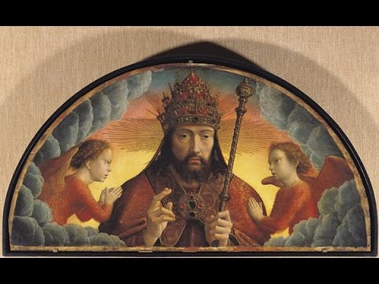

# **Biblical Series I: Introduction to the Idea of God**  

by Dr. Jordan Peterson

YouTube Video (https://www.youtube.com/watch?v=f-wWBGo6a2w)

*Keywords: Genesis, Evolution, Jung, Moral, Testament, Nietzsche, Dostoevsky, Divine, Freud, Ideology, Abstract, Law, Pattern, Marduk, Chaos, Motivation, Consciousness*

## Section I

Thank you all very much for coming. It’s really shocking to me that you don’t have anything better to do on a Tuesday night. Seriously though, it’s very strange, in some sense, that so many of you are here to listen to a sequence of lectures on the psychological significance of the Bible stories. It’s something I’ve wanted to do for a long time, but it still does surprise me that there’s a ready audience for it. That’s good. We’ll see how it goes.

I’ll start with this, because it’s the right question: why bother doing this? And I don’t mean why should I bother—I have my own reasons for doing it—but you might think, ‘why bother with this strange old book at all?’ That’s a good question. It’s a contradictory document that’s been cobbled together over thousands of years. It’s outlasted many, many kingdoms. It’s really interesting that it turns out a book is more durable than stone. It’s more durable than a castle. It’s more durable than an empire. It’s really interesting that something so evanescent can be so long-living. So there’s that; that’s kind of a mystery.

I’m approaching this whole scenario, the Biblical stories, as if they’re a mystery, fundamentally because they are. There’s a lot we don’t understand about them. We don’t understand how they came about. We don't really understand how they were put together. We don’t understand why they had such an unbelievable impact on civilization. We don’t understand how people could have believed them. We don't understand what it means that we don’t believe them now, or even what it would mean if we did believe them. On top of all that, there’s the additional problem—which isn’t specific to me, but is certainly relevant to me—that, no matter how educated you are, you’re not educated enough to discuss the psychological significance of the Biblical stories. But I’m going to do my best, partly because I want to learn more about them. One of the things I've learned is that one of the best ways to learn about something is to talk about it. When I'm lecturing, I’m thinking. I’m not trying to tell you what I know for sure to be the case, because there’s lots of things that I don’t know for sure to be the case. I’m trying to make sense out of this, and I have been doing this for a long time.

You may know, you may not, that I’m an admirer of [Nietzsche](https://en.wikipedia.org/wiki/Friedrich_Nietzsche). Nietzsche was a devastating critic of dogmatic Christianity—Christianity as it was instantiated in institutions. Although, he is a very paradoxical thinker. One of the things Nietzsche said was that he didn’t believe the scientific revolution would have ever got off the ground if it hadn’t been for Christianity—and, more specifically, for Catholicism. He believed that, over the course of a thousand years, the European mind had to train itself to interpret everything that was known within a single coherent framework—coherent if you accept the initial [axioms.](https://en.wikipedia.org/wiki/Axiom) Nietzsche believed that the Catholicization of the phenomena of life and history produced the kind of mind that was then capable of transcending its dogmatic foundations, and concentrating on something else. In this particular case, it happened to be the natural world.

Nietzsche believed that Christianity died of its own hand, and that it spent a very long time trying to attune people to the necessity of the truth, absent the corruption, and all that—that’s always part of any human endeavour. The truth—the spirit of truth—that was developed by Christianity turned on the roots of Christianity. Everyone woke up and said, or thought, something like, ‘how is it that we came to believe any of this?’ It’s like waking up one day and noting that you really don’t know why you put a Christmas tree up, but you’ve been doing it for a long time, and that’s what people do. There are reasons Christmas trees came about. The ritual lasts long after the reasons have been forgotten.

Nietzsche was a critic of Christianity, and also a champion of its disciplinary capacity. The other thing that Nietzsche believed was that it was not possible to be free unless you had been a slave. By that, he meant that you don’t go from childhood to full-fledged adult individuality: you go from child to a state of discipline, which you might think is akin to self-imposed slavery. That would be the best scenario, where you have to discipline yourself to become something specific, before you might be able to reattain the generality you had as a child. He believed that Christianity had played that role for Western civilization. But, in the late 1800s, he announced that God was dead.

You often hear of that as something triumphant, but, for Nietzsche, it wasn’t. He was too nuanced a thinker to be that simpleminded. Nietzsche understood—and this is something I’m going to try to make clear—that there’s a very large amount that we don’t know about the structure of experience—that we don’t know about reality—and we have our articulated representations of the world. Outside of that, there are things we know absolutely nothing about. There’s a buffer between them, and those are things we sort of know something about. But we don’t know them in an articulated way.

Here's an example: You’re arguing with someone close to you, and they’re in a bad mood. They’re being touchy and unreasonable. You keep the conversation up, and maybe, all of a sudden, they get angry, or maybe they cry. When they cry, they figure out what they’re angry about. It has nothing to do with you, even though you might have been what precipitated the argument. That’s an interesting phenomena, as far as I’m concerned, because it means that people can know things at one level, without being able to speak what they know at another. In some sense, the thoughts rise up from the body. They do that in moods, images, and actions. We have all sorts of ways that we understand, before we understand in a fully articulated manner.

We have this articulated space that we can all discuss. Outside of that, we have something that’s more akin to a dream, that we’re embedded in. It’s an emotional dream, that we’re embedded in, and that’s based, at least in part, on our actions. I’ll describe that later. What’s outside of that is what we don’t know anything about, at all. The dream is where the mystics and artists live. They’re the mediators between the absolutely unknown and the things we know for sure. What that means is that what we know is established on a form of knowledge that we don’t really understand. If those two things are out of sync—if our articulated knowledge is out of sync with our dream—then we become dissociated internally. We think things we don’t act out, and we act out things we don’t dream. That produces a kind of sickness of the spirit. Its cure is something like an integrated system of belief and representation.

People turn to things like ideologies—which I regard as parasites on an underlying religious substructure—to try to organize their thinking. That’s a catastrophe, and what Nietzsche foresaw. He knew that, when we knocked the slats out of the base of Western civilization by destroying this representation—this God ideal—we would destabilize, and move back and forth violently between nihilism and the extremes of ideology. He was particularly concerned about radical left ideology, and believed—and predicted this in the late 1800s, which is really an absolute intellectual tour de force of staggering magnitude—that in the 20th century hundreds of millions of people would die because of the replacement of these underlying dream-like structures with this rational but deeply incorrect representation of the world. We’ve been oscillating back and forth between left and right ever since, with some good sprinkling of nihilism and despair. In some sense, that’s the situation of the modern Western person, and increasingly of people in general.

I think part of the reason that Islam has its back up with regards to the West, to such a degree—there’s many reasons, and not all of them are valid—is that, being still grounded in a dream, they can see that the rootless, questioning mind of the West poses a tremendous danger to the integrity of their culture, and it does. Westerners, us—we undermine ourselves all the time with our searching intellect. I’m not complaining about that. There isn’t anything easy that can be done about it. But it’s still a sort of fruitful catastrophe, and it has real effects on people’s lives. It’s not some abstract thing. Lots of times when I’ve been treating people with depression, for example, or anxiety, they have existential issues. It’s not just some psychiatric condition. It’s not just that they’re tapped off of normal because their brain chemistry is faulty—although, sometimes that happens to be the case. It’s that they are overwhelmed by the suffering and complexity of their life, and they’re not sure why it’s reasonable to continue with it. They can feel the terrible, negative meanings of life, but they are sceptical beyond belief about any of the positive meanings of it.

I had one client who’s a very brilliant artist. As long as he didn’t think, he was fine. He’d go and create, and he was really good at being an artist. He had that personality that was continually creating, and quite brilliant, although he was self-denigrating. But he sawed the branch off that he was sitting on, as soon as he started to think about what he was doing. He’d start to criticize what he was doing—the utility of it—even though it was self-evidently useful. Then it would be very, very hard for him to even motivate himself to create. He always struck me as a good example of the consequences of having your rational intellect divorced, in some way, from your Being—divorced enough so that it actually questions the utility of your Being. It’s not a good thing.

It’s really not a good thing, because it manifests itself not only in individual psychopathologies, but also in social psychopathologies. That’s this proclivity of people to get tangled up in ideologies, and I really do think of them as crippled religions. That’s the right way to think about them. They’re like religion that’s missing an arm and a leg, but can still hobble along. It provides a certain amount of security and group identity, but it’s warped and twisted and demented and bent, and it’s a parasite on something underlying that’s rich and true. That’s how it looks to me, anyways. I think it’s very important that we sort out this problem. I think that there isn’t anything more important that needs to be done than that. I’ve thought that for a long, long time—probably since the early ‘80s, when I started looking at the role that belief systems played in regulating psychological and social health. You can tell that they do that because of how upset people get if you challenge their belief systems. Why the hell do they care, exactly? What difference does it make if all of your ideological axioms are 100 percent correct?

People get unbelievable upset when you poke them in the axioms, so to speak, and it is not by any stretch of the imagination obvious why. There’s a fundamental truth that they’re standing on. It’s like they’re on a raft in the middle of the ocean. You’re starting to pull out the logs, and they’re afraid they’re going to fall in and drown. Drown in what? What are the logs protecting them from? Why are they so afraid to move beyond the confines of the ideological system? These are not obvious things. I’ve been trying to puzzle that out for a very long time. I’ve done some lectures about that that are on YouTube. Most of you know that. Some of what I’m going to talk about in this series you’ll have heard, if you’ve listened to the YouTube videos, but I’m trying to hit it from different angles.

Nietzsche's idea was that human beings were going to have to create their own values. He understood that we had bodies, motivations, and emotions. He was a romantic thinker, in some sense, but way ahead of his time. He knew that our capacity to think wasn’t some free-floating soul, but was embedded in our physiology, constrained by our emotions, shaped by our motivations, and shaped by our body. He understood that. But he still believed that the only possible way out of the problem would be for human beings themselves to become something akin to God, and to create their own values. He talked about the person who created their own values as the [Overman](https://en.wikipedia.org/wiki/%C3%9Cbermensch), or the Superman. That was one part of the Nietzschean philosophy that the Nazis took out of context and used to fuel their superior man ideology. We know what happened with that. That didn’t seem to turn out very well. That’s for sure.

## Section II

[TIMESTAMP](https://youtu.be/f-wWBGo6a2w?list=PL22J3VaeABQD_IZs7y60I3lUrrFTzkpat&t=942)

I also spent a lot of time reading [Carl Jung](https://en.wikipedia.org/wiki/Carl_Jung). It was through Jung—and also [Jean Piaget](https://en.wikipedia.org/wiki/Jean_Piaget), a developmental psychologist—that I started to understand that our articulated systems of thought are embedded in something like a dream. That dream is informed, in a complex way, by the way we act. We act out things we don’t understand, all the time. If that wasn’t the case, we wouldn’t need psychology, or sociology, or anthropology, or any of that, because we’d be completely transparent to ourselves, and we’re clearly not. We’re much more complicated than we understand, which means that the way that we behave contains way more information than we know.

Part of the dream that surrounds our articulated knowledge is extracted as a consequence of us watching each other behave, and telling stories about it, for thousands and thousands and thousands of years—extracting out patterns of behaviour that characterize humanity, and trying to represent—partly through imitation, but also drama, mythology, literature, art, and all of that—what we’re like, so that we can understand what we’re like. That process of understanding is what I see unfolding, at least in part, in the Biblical stories. It’s halting, partial, awkward, and contradictory, which is one of things that makes the book so complex. But I see, in that, the struggle of humanity to rise above its animal forebears and become conscious of what it means to be human.

That’s a very difficult thing, because we don’t know who we are, or what we are, or where we came from. Life is an unbroken chain going back 3.5 billion years. It’s an absolutely unbelievable thing. Every single one of your ancestors reproduced successfully for 3.5 billion years. It’s absolutely unbelievable. We rose out of the dirt and the muck, and here we are, conscious but not knowing, and we’re trying to figure out who we are. A set of stories that we’ve been telling for 3,000 years seems, to me, to have something to offer.

When I look at the stories in the Bible, I do it, in some sense, with a beginner’s mind. It’s a mystery, this book: how the hell it was made, why it was made, why we preserved it, why it happened to motivate an entire culture for 2,000 years and transform the world. What’s going on? How did that happen? It’s by no means obvious. One of the things that bothers me about casual critics of religion is that they don’t take the phenomena seriously. It’s a serious phenomena, not least because people have the capacity for religious experience, and no one knows why that is. You can induce it reliably, in all sorts of different ways. You could do it with brain stimulation. You can certainly do it with drugs, especially the psychedelic variety. They produce intimations of the divine extraordinarily regularly. People have been using drugs like that for God only knows how long—50,000 years, maybe more than that—to produce some sort of intimate union with the divine. We don’t understand any of that. When we discovered the psychedelics in the late ‘60s, it shocked everybody so badly that they were instantly made illegal. They were abandoned, in terms of research, for like 50 years, and it’s no wonder, because who the hell expected that? Nobody.

Jung was a student of Nietzsche’s, and he was also a very astute critic of Nietzsche. He was educated by [Freud](https://en.wikipedia.org/wiki/Sigmund_Freud). Freud started to collate the information that we had pertaining to the notion that people lived inside a dream. It was Freud that really popularized the idea of the unconscious mind. We take this for granted to such a degree, today, that we don’t understand how revolutionary the idea was. What’s happened with Freud is that we’ve taken all the marrow out of his bones and left the husk behind. Now, when we think about Freud, we just think about the husk, because that’s everything that’s been discarded. But so much of what he discovered is part of our popular conception, now—including the idea that your perceptions, your actions, and your thoughts are all informed and shaped by unconscious motivations that are not part of your voluntary control.

That’s a very, very strange thing. It’s one of the most unsettling things about the psychoanalytic theories. The psychoanalytic theories are something like, ‘you’re a loose collection of living subpersonalities, each with its own set of motivations, perceptions, emotions, and rationales, and you have limited control over that.’ You’re like a plurality of internal personalities that’s loosely linked into a unity. You know that, because you can’t control yourself very well—which is one of Jung’s objections to Nietzsche's idea that we can create our own values.

Jung didn’t believe that—especially not after interacting with Freud—because he saw that human beings were deeply, deeply affected by things that were beyond their conscious control. No one really knows how to conceptualize those things. The cognitive psychologists think of them as computational machines. The ancient people thought of them as gods, although it’s more complicated than that. [Mars](https://en.wikipedia.org/wiki/Mars_(mythology)) would be the God of rage; that’s the thing that possesses you when you’re angry. It has a viewpoint, and it says what it wants to say, and that might have very little to do with what you want to say, when you’re being sensible. It doesn’t just inhabit you: it inhabits everyone, and it lives forever, and it even inhabits animals. It’s this transcendent psychological entity that inhabits the body politic, like a thought inhabiting the brain. That’s one way of thinking about it. It’s a very strange way of thinking, but it certainly has its merits. Those things, in some sense, are deities. But it’s not that simple.

Jung got very interested in dreams, and he started to understand the relationship between dreams and myths. He was deeply read in mythology, and he would see, in his client’s dreams, echoes of stories that he knew. He started to believe that the dream was the birthplace of the myth and that there was a continual interaction between the two processes: the dream and the story, and storytelling. You can tell your dreams as stories, when you remember them, and some people remember dreams all the time—two or three, at night. I’ve had clients like that. They often have archetypal dreams that have very clear mythological structures. I think that’s more the case with people who are creative—especially if they’re a bit unstable at the time—because the dream tends to occupy the space of uncertainty, and to concentrate on fleshing out the unknown reality, before you get a real grip on it. So the dream is the birthplace of thinking. That’s a good way of thinking about it, because it’s not that clear. It’s doing its best to formulate something. That was Jung’s notion, as of post-Freud, who believed that there were internal censors that were hiding the dream’s true message. That’s not what Jung believed. He believed the dream was doing its best to express a reality that was still outside of fully articulated, conscious comprehension.

A thought appears in your head, right? That’s obvious. Bang—it’s nothing you ever asked about. What the hell does that mean? A thought appears in your head. What kind of ridiculous explanation is that? It just doesn't help with anything. ‘Where does it come from?’ ‘Well, nowhere. It just appears in my head.’ That’s not a very sophisticated explanation, as it turns out. You might think that those thoughts that you think...Well, where do they come from? They’re often someone else’s thoughts—someone long dead. That might be part of it—just like the words you use to think are utterances of people who have been long dead. You’re informed by the spirit of your ancestors. That’s one way of looking at it.

Your motivations speak to; your emotions speak to you; your body speaks to you, and it does all that, at least in part, through the dream. The dream is the birthplace of the fully articulated idea. They don’t just come from nowhere fully-fledged. They have a developmental origin, and God only knows how lengthy that origin is. Even to say, ‘I am conscious…’ Chimpanzees don’t say that. It’s been something like 3 million years since we broke from chimpanzees—from the common ancestor. They have no articulated knowledge, very little self-representation, and very little self-consciousness. That’s not the case with us, at all. We had to painstakingly figure all of this out during that 7 million year voyage. I think some of that’s represented and captured in these ancient stories—especially the oldest stories, in [Genesis](https://en.wikipedia.org/wiki/Book_of_Genesis), which are the stories we’re going to start with. Some of the archaic nature of the human being is encapsulated in those stories. It’s very, very instructive, as far as I can tell.

I’ll give you just a quick example. There’s an idea of sacrifice in the Old Testament, and it’s pretty barbaric. The story of Abraham and Isaac is a good example. Abraham was called on to actually sacrifice his own son, which doesn’t really seem like something that a reasonable God would ask you to do. God, in the Old Testament, is frequently cruel, arbitrary, demanding, and paradoxical, which is one of the things that really gives the book life. It wasn’t edited by a committee that was concerned with not offending anyone. That’s for sure.

So Jung believed that the dream was the birthplace of thought. I’ve been extending that idea, because one of the things I wondered about deeply—you have a dream, and then someone interprets it. You can argue about whether or not an interpretation is valid, just like you can argue about whether your interpretation of a novel or a movie is valid. It’s a very difficult thing to determine with any degree of accuracy—which accounts, in part, for the [postmodern](https://en.wikipedia.org/wiki/Postmodernism) critique. But my observation has been that people will present a dream and, sometimes, we can extract out real, useful information from it that the person didn’t appear to know, and they get a flash of insight. That’s a marker that we stumbled on something that unites part of that person that wasn’t united before. It pulls things together, which is often what a good story will do, or, sometimes, a good theory. Things snap together for you, and a little light goes on. That’s one of the markers that I’ve used for accuracy and dreams, in my own family.

When I was first married, I’d have fights with my wife—arguments about this and that. I’m fairly hot-headed, and I’d get all puffed up and agitated about whatever we were arguing about. She’d go to sleep, which was really annoying. It was so annoying, because I couldn’t sleep. I’d be chewing off my fingernails, and she’d be sleeping peacefully beside me. Maddening. But, often, she’d have a dream, and she’d discuss it with me the next morning. We’d unravel what was at the bottom of our argument. That was unbelievably useful, even though it was extraordinary aggravating. I was convinced by Jung. His ideas about the relationship between dreams, mythology, drama, and literature made sense to me, and his ideas about the relationship between man and art.

I know this Native carver. He’s a [Kwakwaka’wakw](https://en.wikipedia.org/wiki/Kwakwaka%27wakw) guy. He’s carved a bunch of wooden sculptures, totem poles, and masks that I have in my house. He’s a very interesting person—not particularly literate, and really still steep in this ancient, 13,000-year-old tradition. He’s an original language speaker, and the fact that he isn’t literate has sort of left him with the mind of someone who is pre-literature. Pre-literature people aren’t stupid; they just aren’t literate. Their brains are organized differently, in many ways.

I’ve asked him about his intuition for his carvings, and he’s told me that he dreams. You’ve seen the [Haida](https://en.wikipedia.org/wiki/Haida_people) masks; you know what they look like. His people are closely related to the Haida. It’s the same kind of style. He dreams in those animals, and he can remember his dreams. He also talks to his grandparents, who taught him how to carve, in his dreams. Quite often, if he runs into a problem with carving, his grandparents will come, and he’ll talk to them. He sees the creatures that he’s going to carve, living, in an animated sense, in his imagination. I have no reason to disbelieve him. He’s a very, very straightforward person, and he doesn’t have the motivation—or the guile, I would say—to invent a story like that. There’s just no reason he would possibly do it. I don’t think he’s told that many people about it. He thinks it’s kind of crazy. When he was a kid, he thought he was insane, because he’d had those dreams, all the time, about these creatures, and so forth. It wasn’t something he was trumpeting.

I’ve found it fascinating, because I can see in him part of the manifestation of this unbroken tradition. We have no idea how traditions like that are really passed on for thousands and thousands of years. Part of it is oral and memory, part of it’s acted out and dramatized, and part of it’s going to be imaginative. People who aren’t literate store information quite differently than we do. We don’t remember anything; it’s all written down in books. But if you’re from an oral culture—especially if you’re trained in that way—you have all of that information at hand. It’s so that you can speak it. You can tell the stories, and you really know them. Modern people really don’t know what that’s like, anymore. I doubt there’s more than maybe two of you, in the audience, that could spout from memory a 30-line poem. Poetry was written so that people could do that. That’s why we have that form—so that people could remember it and have it with them. But we don’t do any of that, anymore.

Anyways, back to Jung. Jung was a great believer in the dream. I know that dreams will tell you things that you don’t know. Well, how the hell can that be? How in the world can something you think up tell you something you don’t know? How does that make any sense? First of all, why don’t you understand it? Why does it have to come forth in the form of the dream? It’s like something’s going on inside you that you don’t control. The dream happens to you, just like life happens to you. There is the odd lucid dreamer who can apply a certain amount of conscious control, but most of the time you’re laying there, asleep, and this crazy, complicated world manifests itself inside you, and you don’t know how. You can’t do it when you’re awake, and you don’t know what it means. It’s like, what the hell’s going on?

That’s one of the things that’s so damn frightening about the psychoanalysts—you get this both from Freud and Jung. You really start to understand that there are things inside you that control you, instead of the other way around. You can use a bit of reciprocal control, but there’s manifestations of spirits, so to speak, inside you, that determine the manner in which you walk through life, and you don’t control it. And what does? Is it random? There are people who have claimed that dreams are merely the consequence of random neural firing. I think that theory is absolutely absurd, because there’s nothing random about dreams. They are very, very structured, and very, very complex. They’re not like snow on a television screen or static on a radio. I’ve also seen, so often, that people have very coherent dreams, that have a perfect narrative structure. They’re fully developed, in some sense. So that theory doesn’t go anywhere, with me. I just can’t see that as useful, at all. I’m more likely to take the phenomena seriously.

There’s something to dreams. You dream of the future, then you try to make it into reality. That seems to be an important thing. Or maybe you dream up a nightmare, and try to make that into a reality. People do that, too, if they’re hellbent on revenge, for example, and full of hatred and resentment. That manifests itself in terrible fantasies. Those are dreams, then people go act them out. These things are powerful, and whole nations can get caught up in collective dreams. That’s what happened to Nazi Germany in the 1930s. It was an absolutely remarkable, amazing, horrific, destructive spectacle. The same thing happened in the Soviet Union, and the same thing happened in China. You have to take these things seriously—you try to understand what’s going on.

Jung believed that the dream could contain more information than was yet articulated. I think artists do the same thing. People go to museums and look at paintings—renaissance paintings or modern paintings—and they don’t exactly know why they are there. I was in this room in New York that was full of renaissance art—great painters, the greatest painters. I thought that, maybe, that room was worth a billion dollars, or something outrageous, because there was like 20 paintings in there, priceless. The first thing is, why are those painting worth so much? Why is there a museum, in the biggest city in the world, devoted to them? Why do people from all over the world come and look at them? What the hell are those people doing? One of them was of the [Assumption of Mary](https://en.wikipedia.org/wiki/Assumption_of_Mary)—a beautifully painted, absolutely glowing work of art. There were like 20 people standing in front of it, and looking at it. What are those people up to? They don’t know. Why did they make a pilgrimage to New York to come and look at that painting? It’s not like they know. Why is it worth so much? I know there’s a status element to it, but that begs the question: why do those items become such high-status items? What is it about them that’s so absolutely remarkable? We’re strange creatures.

Where does the information that’s in the dream come from? It has to come from somewhere. You could think of it as a revelation, because it’s like it springs out of the void, and it’s new knowledge. You didn’t produce it; it just appears. I’m scientifically minded, and I’m quite a rational person. I like to have an explanation of things that’s rational and empirical, before I look for any other kind of explanation. I don’t want to say that everything that's associated with divinity can be reduced, in some manner, to biology, an evolutionary history, or anything like that. But, insofar as it’s possible to do that reduction, I’m going to do that. I’m going to leave the other phenomena floating in the air, because they can’t be pinned down. In that category, I would put the category of mystical or religious experience, which we don’t understand, at all.

Artists observe one another, and they observe people. Then they represent what they see, and transmit the message of what they see, to us. That teaches us to see. We don’t necessarily know what it is that we’re learning from them, but we’re learning something—or, at least, we’re acting like we’re learning something. We go to movies; we watch stories; we immerse ourselves in fiction, constantly. That’s an artistic production, and, for many people, the world of the arts is a living world. That’s particularly true if you’re a creative person.

It’s the creative, artistic people that move the knowledge of humanity forward. They do that with their artistic productions, first. They’re on the edge. The dancers, poets, visual artists, and musicians do that, and we’re not sure what they're doing. We’re not sure what musicians are doing. What the hell are they doing? Why do you like music? It gives you deep intimations of the significance of things, and no one questions it. You go to a concert; you’re thrilled. It’s a quasi-religious experience, particularly if the people really get themselves together, and get the crowd moving. There’s something incredibly intense about it, but it makes no sense whatsoever.

It’s not an easy thing to understand. Music is deeply patterned, and patterned in layers. I think that has something to do with it, because reality is deeply patterned in layers. I think music is representing reality in some fundamental way. We get into the sway of that, and participate in Being. That’s part of what makes it such an uplifting experience, but we don’t really know that’s what we’re doing. We just go do it, and it’s nourishing for people—young people, in particular. Lots of them live for music. It’s where they derive all of their meaning—their cultural identity. Everything that’s nourishing comes from their affiliation with their music. That’s an amazing thing.

The question still remains: where does the information in dreams come from? I think where it comes from is that we watch the patterns that everyone acts out. We watch that forever, and we’ve got some representations of those patterns that’s part of our cultural history. That’s what’s embedded in fictional accounts of stories between good and evil, the bad guy and the good guy, and the romance. These are canonical patterns of Being, for people, and they deeply affect us, because they represent what it is that we will act out in the world. We flesh that out with the individual information we have about ourselves and other people. There’s waves of behavioural patterns that manifest themselves in the crowd, across time. Great dramas are played on the crowd, across time. The artists watch that, and they get intimations of what that is. They write it down, tell us, and we’re a little clearer about what we’re up to.

A great dramatist, like Shakespeare—we know that what he wrote is fiction. Then we say, ‘fiction isn’t true.’ But then you think, ‘well, wait a minute. Maybe it’s true like numbers are true.’ Numbers are an abstraction from the underlying reality, but no one in their right mind would really think that numbers aren’t true. You could even make a case that the numbers are more real than the things that they represent, because the abstraction is so insanely powerful.

Once you have mathematics, you’re just deadly. You can move the world with mathematics. It’s not obvious that the abstraction is less real than the more concrete reality. You take a work of fiction, like Hamlet, and you think, ‘well, it’s not true, because it’s fiction.’ But then you think, ‘wait a minute—what kind of explanation is that?’ Maybe it’s more true than nonfiction. It takes the story that needs to be told about you, and the story that needs to be told about you, and you, and you, and you, and you, and it abstracts that out, and says, ‘here’s something that’s a key part of the human experience as such.’ It’s an abstraction from this underlying, noisy substrate. People are affected by it because they see that the thing that’s represented is part of the pattern of their being. That’s the right way to think about it.

With these old stories—these ancient stories—it seems, to me, like that process has been occurring for thousands of years. It’s like we watched ourselves, and we extracted out some stories. We imitated each other, and we represented that in drama, and then we distilled the drama, and we got a representation of the distillation. And then we did it again, and at the end of that process—it took God only knows how long. They’ve traced some fairy tales back 10,000 years, in relatively unchanged form.

It certainly seems, to me, that the archaeological evidence, for example, suggests that the really old stories that the Bible begins with are at least that old, and are likely embedded in prehistory, which is far older than that. You might say, ‘well, how can you be so sure?’ The answer to that, in part, is that the ancient cultures didn't change fast. They stayed the same; that’s the answer. They keep their information moving from generation to generation. That’s how they stay the same, and that’s how we know. There are archaeological records of rituals that have remained relatively unbroken for up to 20,000 years: it was discovered in caves, in Japan, that were set up for a particular kind of bear worship that was also characteristic of Western Europe. So these things can last for very long periods of time.

We’re watching each other act in the world, and then the question is, how long have we been watching each other? The answer to that, in some sense, is as long as there have been creatures with nervous systems, and that’s a long time. That’s some hundreds of millions of years, perhaps longer than that. We’ve been watching each other, trying to figure out what we’re up to, across that entire span of time. Some of that knowledge is built right into your bodies—which is why we can dance with each other, for example. Understanding isn’t just something that you have as an abstraction. It’s something that you act out. That’s what children are doing, when they’re learning to rough-and-tumble play. They’re learning to integrate their body with the body of someone else in a harmonious way—learning to cooperate and compete. That’s all instantiated right into their body. It’s not abstract knowledge, and they don’t know that they’re doing that. They’re just doing it. We can even use our body as a representational platform.

## Section III

[TIMESTAMP](https://youtu.be/f-wWBGo6a2w?list=PL22J3VaeABQD_IZs7y60I3lUrrFTzkpat&t=2531)

We’ve been studying each other for a long time, abstracting out what is it that we’re up to, and what should we be up to. That’s an even more fundamental question: if you’re going to live in the world, and you’re going to do it properly, what does properly mean? How is it that you might go about that? It’s the right question; it’s what everyone wants to know. How do you live in the world? It’s not what the world is made of; it’s not the same question. How do you live in the world? It’s the eternal question of human beings.

I guess we’re the only species that has ever really asked that question. All the other animals just go and do whatever it is they do. Not us. It’s a question, for us. We have to become aware of it. We have to speak it—God only knows why. But that seems to be the situation. So we act, that acting is shaped by the world and society into something that we don’t understand, but that we can model. We model it in our stories and with our bodies, and that’s where the dream gets its information. The dream is part of the process that’s watching everything, and then trying to formulate it. It’s trying to get the signal out from the noise and portray it in dramatic form, because the dream is a little drama. And then you get the chance to talk about what that dream is. You have something like articulated knowledge, at that point.

I would say the Bible exists in that space that is half into the dream and half into articulated knowledge. Going into it, to find out what the stories are about, can aid our self-understanding. The other issue is that, if Nietzsche was correct, and if Jung was correct, and [Dostoevsky](https://en.wikipedia.org/wiki/Fyodor_Dostoyevsky), as well…Without the cornerstone provided by that understanding, we’re lost. That’s not good, because then we’re susceptible to psychological pathology. People that are adamant anti-religious thinkers seem to believe that, if we abandoned our immersement in the underlying dream, we’d all, instantly, become rationalists, like [Descartes](https://en.wikipedia.org/wiki/Ren%C3%A9_Descartes) or [Bacon](https://en.wikipedia.org/wiki/Francis_Bacon)—intelligent, clear thinking, rational, scientific people. I don’t believe that for a moment. I don’t think there’s any evidence for it. I think we would become so irrational, so rapidly, that the weirdest mysteries of Catholicism would seem positively rational by contrast—and I think that’s already happening.You have the unknown world. That’s just what you don’t know, at all. That’s outside the ocean that surrounds the island that you inhabit. Something like that. It’s chaos itself. You act in that world, and you act in ways that you don’t understand. There’s more to your actions than you can understand. One of the things that Jung said—I loved this, when I first understood it. He says that everybody acts out a myth, but very few people know what their myth is. You should know what your myth is, because it might be a tragedy, and maybe you don’t want it to be. That’s really worth thinking about, because you have a pattern of behaviour that characterizes you. God only knows where you got it. It’s partly biological, and it’s partly from your parents; it’s your unconscious assumptions; it’s the way the philosophy of your society has shaped you; and it’s aiming you somewhere. Is it aiming you somewhere you want to go? That’s a good question. That’s part of self-realization.

We know we don’t understand our actions. Almost every argument you have with someone is about that. It’s like, ‘why did you do that?’ You come up with some half-baked reasons why you did it; you’re flailing around in the darkness; you try to give an account for yourself, but you can only do it partially. It’s very, very difficult, because you’re a complicated animal, with the beginnings of an articulated mind, and you’re just way more than you can handle. So you act things out, and that’s a kind of competence. Then you imagine what you act out, and you imagine what everyone else acts out. There’s a tremendous amount of information in your action, and that information is translated up into the dream, and then into art, mythology and literature. There’s a tremendous amount of information in that, and some of that is translated into articulated thought.

I’ll give you a quick example of something like that. I think this is partly what happens in Exodus, when Moses comes up with the law. He’s wandering around with the Israelites in the desert. They’re going left and going right, worshipping idols, having a hell of a time, and getting rebellious. Moses goes up in the mountain, and he has this tremendous revelation in the sight of God. It illuminates him, and he comes down with the law. Moses acted as a judge—I know this is a mythological story—in the desert. He was continually mediating between people who were having problems, and he was constantly trying to keep peace. What are you doing when you’re trying to keep peace? You’re trying to understand what peace is. You have to apply the principles. What are the principles? Well, you don’t know. The principles are whatever satisfied the people enough to make peace.

Maybe you act as judge 10,000 times, and then you get some sense of the principles that bring peace. One day it blasts into your consciousness, like a revelation: ‘here’s the rules that we’re already acting out.’ That’s the Ten Commandments. They were there to begin with. Moses comes forward, and says, ‘look, this is basically what we’re already doing, but now it’s codified.’ That’s all historical process condensed into a single story, but, obviously, that happened, because we have written law. In good legal systems, that emerges from the bottom up. English common law is exactly like that: it’s single decisions, that are predicated on principles, that are then articulated and made into the body of law.

The body of law is something that you act out. That’s why it’s a body of law. That’s why, if you’re a good citizen, you act out the body of law. The body of law has principles. Ok, so the question is, what are the principles that guide our behaviour? Well, that’s something like what the archaic Israelites meant by ‘God.’ It’s not a good enough explanation, but imagine that you are a chimpanzee, and you have a powerful dominant figure at the pinnacle of your society.
That represents ‘power’—more than that, because it’s not sheer physical prowess that keeps a chimp at the top of the hierarchy. It’s much more complicated than that.

You could say there’s a principle that the dominant person manifests, and then you might say that principle shines forth even more brightly, if you know 10 people who are dominant and powerful. Then you could extract out what ‘dominance’ means from that. You can extract what ‘power’ means from that, and then you can divorce the concept from the people. We had to do that, at some point, because we can say ‘power,’ in the human context, and we can imagine what that means. But it’s divorced from any specific manifestation of power. How the hell did we do that? That’s so complicated. If you’re a chimp, the power is in another chimp. It’s not some damn abstraction.

Think about it. We’re in these hierarchies, many of them across centuries. We’re trying to figure out what the guiding principle is. We’re trying to extract out the core of the guiding principles, and we turn that into a representation of a pattern of being. That’s God. It’s an abstracted ideal, and it manifests itself in personified form. That’s ok, because what we’re trying to get at is, in some sense, the essence of what it means to be a properly functioning, properly social, and properly competent individual. We’re trying to figure out what that means. You need an embodiment. You need an ideal that’s abstracted, that you could act out, that would enable you to understand what that means. That’s what we’ve been driving at. That’s the first hypothesis. I’m going to go over some of the attributes of this abstracted ideal that we’ve formalized as God, but that’s the first hypothesis: a philosophical or moral ideal manifests itself, first, as a concrete pattern of behavior that’s characteristic of a single individual—and then it’s a set of individuals, and then it’s an abstraction from that set, and then you have the abstraction, and it’s so important.

Here’s a political implication: One of the debates, we might say, between early Christianity and the late Roman Empire was whether or not an emperor could be God—literally to be deified and put into a temple. You can see why that might happen, because that’s someone at the pinnacle of a very steep hierarchy, who has a tremendous amount of power and influence. The Christian response to that was, ‘never confuse the specific sovereign with the principle of sovereignty itself.’ It’s brilliant. You can see how difficult it is to come up with an idea like that, so that even the person who has the power is actually subordinate to a divine principle, for lack of a better word. Even the king himself is subordinate to the principle. We still believe that, because we believe our Prime Minister is subordinate to the damn law.

Whatever the body of law, there's a principle inside that even the leader is subordinate to. Without that, you could argue that you can’t even have a civilized society, because your leader immediately turns into something that’s transcendent and all-powerful. That's certainly what happened in the Soviet Union, and what happened in Maoist China, and what happened in Nazi Germany. There was nothing for the powerful to subordinate themselves to. You’re supposed to be subordinate to God. What does that mean? We’re going to tear that idea apart, but partly what that means is that you’re subordinate—even if you’re sovereign—to the principles of sovereignty itself. And then the question is, ‘what the hell is the principles of sovereignty?’ I would say we have been working that out for a very long period of time. That’s one of the things that we’ll talk about.

The ancient [Mesopotamians](https://en.wikipedia.org/wiki/History_of_Mesopotamia) and the ancient [Egyptians](https://en.wikipedia.org/wiki/Ancient_Egypt) had some very interesting, dramatic ideas about that. For example—very briefly—there was a deity known as [Marduk](https://en.wikipedia.org/wiki/Marduk). Marduk was a Mesopotamian deity, and imagine this is sort of what happened. As an empire grew out of the post-ice age—15,000 years ago, 10,000 years ago—all these tribes came together. These tribes each had their own deity—their own image of the ideal. But then they started to occupy the same territory. One tribe had God A, and one tribe had God B, and one could wipe the other one out, and then it would just be God A, who wins. That’s not so good, because maybe you want to trade with those people, or maybe you don’t want to lose half your population in a war. So then you have to have an argument about whose God is going to take priority—which ideal is going to take priority.

What seems to happen is represented in mythology as a battle of the gods in celestial space. From a practical perspective, it’s more like an ongoing dialog. You believe this; I believe this. You believe that; I believe this. How are we going to meld that together? You take God A, and you take God B, and maybe what you do is extract God C from them, and you say, ‘God C now has the attributes of A and B.’ And then some other tribes come in, and C takes them over, too. Take Marduk, for example. He has 50 different names, at least in part, of the subordinate gods—that represented the tribes that came together to make the civilization. That’s part of the process by which that abstracted ideal is abstracted. You think, ‘this is important, and it works, because your tribe is alive, and so we’ll take the best of both, if we can manage it, and extract out something, that’s even more abstract, that covers both of us.’

I’ll give you a couple of Marduk’s interesting features. He has eyes all the way around his head. He’s elected by all the other gods to be king God. That’s the first thing. That’s quite cool. They elect him because they’re facing a terrible threat—sort of like a flood and a monster combined. Marduk basically says that, if they elect him top God, he’ll go out and stop the flood monster, and they won’t all get wiped out. It’s a serious threat. It’s chaos itself making its comeback. All the gods agree, and Marduk is the new manifestation. He’s got eyes all the way around his head, and he speaks magic words. When he fights, he fights this deity called [Tiamat](https://en.wikipedia.org/wiki/Tiamat). We need to know that, because the word ‘Tiamat’ is associated with the word ['tehom.'](https://en.wikipedia.org/wiki/Tehom) Tehom is the chaos that God makes order out of at the beginning of time in Genesis, so it’s linked very tightly to this story. Marduk, with his eyes and his capacity to speak magic words, goes out and confronts Tiamat, who’s like this watery sea dragon. It’s a classic [Saint George](https://en.wikipedia.org/wiki/Saint_George) story: go out and wreak havoc on the dragon. He cuts her into pieces, and he makes the world out of her pieces. That’s the world that human beings live in.

The Mesopotamian emperor acted out Marduk. He was allowed to be emperor insofar as he was a good Marduk. That meant that he had eyes all the way around his head, and he could speak magic; he could speak properly. We are starting to understand, at that point, the essence of leadership. Because what’s leadership? It’s the capacity to see what the hell’s in front of your face, and maybe in every direction, and maybe the capacity to use your language properly to transform chaos into order. God only knows how long it took the Mesopotamians to figure that out. The best they could do was dramatize it, but it’s staggeringly brilliant. It’s by no means obvious, and this chaos is a very strange thing. This is a chaos that God wrestled with at the beginning of time.

Chaos is half psychological and half real. There’s no other way to really describe it. Chaos is what you encounter when you’re blown into pieces and thrown into deep confusion—when your world falls apart, when your dreams die, when you’re betrayed. It’s the chaos that emerges, and the chaos is everything it wants, and it’s too much for you. That’s for sure. It pulls you down into the underworld, and that’s where the dragons are. All you’ve got at that point is your capacity to bloody well keep your eyes open, and to speak as carefully and as clearly as you can. Maybe, if you’re lucky, you’ll get through it that way and come out the other side. It’s taken people a very long time to figure that out, and it looks, to me, that the idea is erected on the platform of our ancient ancestors, maybe tens of millions of years ago, because we seem to represent that which disturbs us deeply using the same system that we used to represent serpentile, or other, carnivorous predators.

We’re biological creatures. When we formulated our strange capacity to abstract and use language, we still had all those underlying systems that were there when we were only animals. We have to use those systems that are there. Part of the emotional and motivational architecture of our thinking, part of the reason why we can demonize our enemies who upset our axioms, is because we perceive them as if they’re carnivorous predators. We do it with the same system. That’s chaos itself, the thing that always threatens us—the snakes that came to the trees when we lived in them, like 60 million years ago. It’s the same damned systems.

The Marduk story is partly the story of using attention and language to confront those things that most threaten us. Some of those things are real world threats, but some of them are psychological threats, which are just as profound but far more abstract. But we use the same system to represent them. That’s why you freeze, if you're frightened. You’re a prey animal. You’re like a rabbit, and you’ve seen something that's going to eat you. You freeze, and you’re paralyzed. You’re turned to stone, which is what you do when you see a [Medusa](https://en.wikipedia.org/wiki/Medusa) with a head full of snakes. You turn to stone. You’re paralyzed, and the reason you do that is because you’re using the predator detector system to protect yourself. Your heart rate goes way up, and you get ready to move.

Things that upset us rely on that system. The Marduk story, for example, is the idea that, if there are things that upset you—chaotic, terrible, serpentine, monstrous, underworld things that threaten you—the best thing to do is open your eyes, keep your speech organized, and go out, confront the thing, and make the world out of it. It’s staggering. When I read that story and started to understand it, it just blew me away. It’s such a profound idea, and we know it’s true, too, because we know, in psychotherapy, that you’re much better off to confront your fears head-on than you are to wait and let them find you.

Partly what you do, if you’re a psychotherapist, is you help people break their fears into little pieces—the things that upset them—and then to encounter them one by one and master them. You’re teaching this process of internal mastery over the strange and chaotic world. All of that makes up some of the background. We haven’t even gotten to the first sentence of the Biblical stories yet, but all of that makes up the background. We extracted this strange collection of stories, with all its errors and its repetitions and its peculiarities, out of the entire history that we’ve been able to collect ideas, and it’s the best we’ve been able to do. I know there are other religious traditions. I’m not concerned about that at the moment because we can use this as an example. What I’m hoping is that we can return to the stories with an open mind and see if there is something there that we actually need. I hope that will be the case. As I’ve said, I’ll approach it as rationally as I possibly can.This is the idea to begin with. We have the unknown as such, and then we act in it like animals act. They act first; they don’t think. They don’t imagine; they act, and that’s where we started. We started by acting, and then we started to be able to represent how we acted, and then we started to talk about how we represented how we acted. That enabled us to tell stories, because that is what a story is: it’s to tell about how you represent how you act. You know that, because if you read a book, what happens? You read the book, and images come to mind of the people in the book behaving. It’s one step from acting it out. You don’t act it out, because you can abstract. You can represent action without having to act it out. It’s an amazing thing, and that’s part of the development of the [prefrontal cortex](https://en.wikipedia.org/wiki/Prefrontal_cortex). It’s part of the capacity for human abstract thought. You can pull the representation of the behaviour away from the behaviour and manipulate the representation before you enact it. That’s why you think, so that you can generate a pattern of action and test it out in a fictional world before you embody it and die because you’re foolish. You let the representation die, not you. That’s why you think, and that’s partly what we’re trying to do with these stories.

## Section IV

[TIMESTAMP](https://youtu.be/f-wWBGo6a2w?list=PL22J3VaeABQD_IZs7y60I3lUrrFTzkpat&t=3805)

What do I hope to accomplish? I hope to end this 12-lecture series knowing more than I did when I started. That’s my goal, because I’ve said that I’m not telling you what I know; I’m trying to figure things out. This is part of the process by which I’m doing that, and so I’m doing my best to think on my feet. I come prepared, but I’m trying to stay on the edge of my capacity to generate knowledge, to make this continually clear, and to get to the bottom of things. That’s what I hope to accomplish. It seems like people are interested in that, so we’re going to try to accomplish that together. That’s the plan.

The idea is to see if there’s something at the bottom of this amazing civilization that we’ve managed to structure, that I think is in peril, for a variety of reasons. Maybe, if we understand it a little bit better, we won’t be so prone just to throw the damned thing away, which I think would be a big mistake. And to throw it away because of resentment, hatred, bitterness, historical ignorance, jealousy, the desire for destruction, and all of that…I don’t want to go there. It’s a bad idea, to go there. We need to be better-grounded.All right, so how do I approach this? Well, first of all, I think in evolutionary terms. As far as I’m concerned, the cosmos is 15 billion years old; the world is 4.5 billion years old; there’s been life for 3.5 billion years, and there are creatures that had pretty developed nervous systems 300 to 600 million years ago. We were living in trees as small mammals 60 million years ago, and we were down on the plains between 60 million and 7 million years ago, and that’s about when we split from chimpanzees. Modern human beings seemed to emerge about 150,000 years ago, and civilization emerged pretty much after the ice age—something after 15,000 years ago. Not very long ago, at all. That’s the span across which I want to understand.

I want to understand why we are the way we are, looking at life in its continual complexity right from the beginning of life itself. There’s some real utility in that, because we share attributes with other animals—even animals as simple as crustaceans, for example. Crustaceans have nervous system properties that are very much like ours, and it’s very much worth knowing that. I think in an evolutionary way. I think it’s a grand and remarkable way to think, because it has this incredible time span. It’s this amazing—I mean, people at the end of the 19th century, middle of the 19th century, really thought the world was about 6,000 years old. 15 billion years old is a lot more. It’s a lot grander and bigger, but it’s also a lot more frightening and alienating, in some sense, because the cosmos has become so vast. It’s easy for human beings to think of themselves as trivial specs on a trivial spec out some misbegotten hellhole-end-of-the-galaxy among hundreds of millions of galaxies.

It’s very easy to see yourself as nothing in that span of time. That’s a real challenge for people. I think it’s a mistake to think that way, because I think consciousness is far more than we think it is. It’s still something that we have to grapple with. I’m a psychoanalytic thinker. What that means is that I believe that people are collections of subpersonalities, and that those subpersonalities are alive, not machines. They have their viewpoint; they have their wants; they have their perceptions; they have their arguments; they have their emotions. They’re like low resolution representations of you.

When you get angry, it’s like a very low resolution representation of you. It only wants rage, or it only wants something to eat, or it only wants water; it only wants sex. It’s you, but shrunk and focused in a specific direction. All those motivational systems are very, very ancient, very archaic and very, very powerful. They play a determining role in the manner in which we manifest ourselves. As Freud pointed out with the [id](https://en.wikipedia.org/wiki/Id,_ego_and_super-ego#Id), we have to figure out how we take all those underlying animalistic motivations and emotions and civilize them in some way, so that we can all live in the same general territory without tearing each other to shreds, which is maybe the default position of both chimpanzee and humanity. So I take seriously the idea that we’re a loose collection of spirits.

It says in the Old Testament, somewhere, that the fear of God is the beginning of wisdom. I think this is akin to that. If you know that you’re not in control of yourself thoroughly, and that there are other factors behind the scenes—like the ancient Greeks, who thought that human beings were the playthings of the gods; that’s the way they conceptualized the world. They sort of meant the same thing. They meant there are these great forces that move us, that we don’t create, and that we’re subordinate to, in some sense. Not entirely, but you can be subordinate to them, and they move our destinies. That was the Greek view.

Understanding that teaches you humility, and that there’s a hell of a lot more going on behind the scenes. You’re the driver of a very complex vehicle, but you don’t understand the vehicle very well, and it’s got its own motivations and methods. Sometimes you think it’s doing something, and it’s doing something completely different. You see that in psychotherapy all the time, because you help someone unwind a pattern of behaviour that they’ve manifested forever. First of all, they describe it and they become aware of it, then, maybe, they start to see what the cause is. They have no idea why they were acting like that. They have to have the memory that produced the behavioural pattern to begin with. It has to be brought back to mind, then it has to be analyzed and assessed, and then they have to think of a different way of acting. It’s extraordinarily complex.Literary…Well, there’s this postmodern idea about literature—and about the world, for that matter—that, if you take a complex piece of literature like a Shakespeare play, there’s no end to the number of interpretations that you can make of it. You can interpret each word, each phrase, each sentence, each paragraph. You can interpret the entire play. The way you interpret it depends on how many other books you've read, and it depends on your orientation in the world. It depends on a very, very large number of things—how cultured you are, or how much culture you lack. All of those things. It opens up a huge vista for potential interpretation. The postmodernists sort of stubbed their toe on that, and thought, ‘well, if there’s this vast number of interpretations of any particular literary work, how can you be sure that any interpretation is any more valid than any other interpretation? And if you can't be sure, then how do you even know those are great works? How do you know they're not just works that people in power have used to facilitate their continual accession of power?’ Which is really a postmodern idea, and a very, very cynical one. It has its point, but the thing is grounded in something real.Yes, you can interpret things forever. I want to briefly show you something. We’ll get back to it later. Look at this. This is one of the coolest things that I’ve ever seen. At the bottom here, every single one of those lines is a Biblical verse. The length of the line is proportional to how many times that verse is referred to in some way by some other verse. So this is the first hyperlinked book. I’m dead serious about that. You can’t click and get the hyperlinks, obviously, but it’s a thoroughly hyperlinked book. It’s because the people who worked on these stories that are hypothetically at the end—which is the end; the end can’t affect the beginning. That’s the rule of time: what happens now can’t affect what happened to you 10 years ago…even though it actually can…you reinterpret things, then they’re not the same. But whatever. We won’t get into that. Technically speaking, the present cannot effect the past. But that’s not right, if you’re looking at a piece of literature; because when you write the end you know what was at the beginning, and when you write the beginning—or edit it—you know what’s at the end, and so you can weave the whole thing together. There’s 65,000 cross-references, and that’s what this map shows. That’s a great visual representation of the book. Why is the book deep? Well, just imagine how many pathways you could take through that. You’d just journey through that forever. You’d never, ever get to the end of it. There’s permutations and combinations, and every phrase is dependent on every other phrase, and every verse is dependent on every other verse…well, not entirely, but 65,000 is not a bad start.

That’s another issue that seems to make the postmodernist critique even more correct: how in the world are you going to extract out a canonical interpretation of something like that? It’s like, it’s not possible. But here is the issue, as far as I can tell: the postmodernists extended that critique to the world. They said look, text is complicated enough—you can't extract out a canonical interpretation. What about the world? The world’s way more complicated than a text, and there’s an infinite number of ways that you can look at the world. How do we know that any one way is better than any other way?

That’s a good question. The postmodern answer was, ‘we can’t.’ That’s not a good answer, because you drown in chaos under those circumstances. You can't make sense of anything, and that’s not good, because it’s not neutral to not make sense of things. It’s very anxiety-provoking and depressing. If things are so chaotic that you can’t get a handle on them, your body defaults into emergency preparation mode. Your heart rate goes up, and your immune system stops working. You burn yourself out; you age rapidly because you’re surrounded by nothing you can control. That’s an existential crisis. It’s anxiety-provoking and depressing—very hard on people. Even more than that, it turns out that the way we’re constructed neurophysiologically is that we don’t experience any positive emotion unless we have an aim and we can see ourselves progressing towards that aim.

It isn’t precisely attaining the aim that makes us happy—as you all know if you’ve ever attained anything. As soon as you attain it, the whole little game ends, and you have to come up with another game. So it’s [Sisyphus](https://en.wikipedia.org/wiki/Sisyphus), and that’s ok. But it does show that the attainment can’t be the thing that drives you, because it collapses the game. That’s what happens when you graduate from university. It’s like, you’re king of the mountain for one day, then you’re like serf at Starbucks for the next five years.

Human beings are weird creatures: we’re much more activated by having an aim and moving towards it than we are by attaining it. What that means is that you have to have an aim, and that means you have to have an interpretation. It also means that the nobler the aim, the better your life. That’s a really interesting thing to know, because you’ve heard, ever since you were tiny, that you should act like a good person—you shouldn't lie, for example. You might think, ‘well, why should I act like a good person? Why not lie?’ Even a three-year-old can ask that question—because smart kids learn to lie earlier, by the way—and they think, ‘why not twist the fabric of reality, so that it serves my specific, short-term needs?’ That’s a great question. Why not do that? Why act morally if you can get away with something, and it brings you closer to something you want? Well, why not do it? These are good questions. It’s not self-evident.

It seems, to me, tied into what I just mentioned. You destabilize yourself and things become chaotic, and that's not good. If you do not have a noble aim, you have nothing but shallow trivial pleasures, and they don’t sustain you. That’s not good, because life is difficult. There’s so much suffering and complexity. It ends, everyone dies, and it’s painful. Without a noble aim, how can you withstand any of that? You can’t; you become desperate. Things go from bad to worse very rapidly, when you become desperate. And so there’s the idea of the noble aim, and it’s something that’s necessary. It’s the bread that people cannot live without. It’s not mystical bread: it’s the noble aim. And what is that? It was encapsulated, in part, in the story of Marduk: it’s to pay attention, speak properly, confront chaos, and to make a better world. It’s something like that. That’s enough of a noble aim so that you can stand up without cringing at the very thought of your own existence—so that you can do something that’s worthwhile, to justify your wretched position on the planet.

The literary issue is that you can interpret a text in a variety of ways, but that's not right. This is where the postmodernists went wrong. What you’re looking for in a text—and in the world, for that matter—is sufficient order and direction. We have to think, ‘what does sufficient order and direction mean?’ You don’t want to suffer so much that your life is unbearable. That just seems self-evident. Pain argues for itself. I think of pain as the fundamental reality, because no one disputes it. Even if you say that you don't believe in pain, it doesn’t help when you’re in pain. You still believe in it. You can’t pry it up with logic and rationality. It just stands forth as the fundament of existence, and that’s actually quite useful to know—to say you don’t want any more of that than is absolutely necessary. I think that’s self-evident.

But then you say, ‘wait a minute. It’s more complicated than that.’ You don't want any more than necessary today, but also not tomorrow, and not next week, and not next month, and not next year. So however you act now better not compromise how you’re going to be in a year, because that’d just be counterproductive. That’s part of the problem with short-term pleasures. “Act in haste, repent at leisure.” Everyone knows exactly what that means. You have to act in a way that works now, and tomorrow, and next week, and next month, and so forth. So you have to take your future self into account. Human beings can do that. Taking your future self into account isn’t much different than taking other people into account.

There’s this Simpsons episode, and Homer downs a quart of mayonnaise and vodka. Marge says, 'you know, you shouldn't really do that.’ And Homer says, ‘that’s a problem for future-Homer. I’m sure glad I’m not that guy.’ It’s so ridiculous and comical. But, ok, you see we have to grapple with that. The you that’s out there in the future is sort of like another person, and so figuring out how to conduct yourself properly in relationship to your future self isn’t much different than figuring out how to conduct yourself in relationship to other people. Then we can expand the constraints. Not only does the interpretation that you extract have to protect you from suffering and give you an aim, but it has to do it in a way that’s iterable, so it works across time, and then it has to work in the presence of other people, so that you can cooperate with them and compete with them in a way that doesn't make you suffer more.

People are not that tolerant. They have choices. They don’t have to hang around with you; they can hang around with any one of these other primates. So if you don’t act properly, at least within certain boundaries, you’re just cast aside. People are broadcasting information at you, all the time, about how you need to interpret the world, so they can tolerate being around you. And you need that because, socially isolated, you’re insane, and then you're dead. No one can tolerate being alone for any length of time. We can’t retain our own sanity without continual feedback from other people. It’s too damned complicated. You’re constrained by your own existence, and then you're constrained by the existence of other people, and then you're also constrained by the world. If I read Hamlet and what I extracted out of that is the idea that I should jump off a bridge, it puts my interpretation to an end rather quickly. It doesn’t seem to be optimally functional.

An interpretation is constrained by the reality of the world. It’s constrained by the reality of other people, and it’s constrained by your reality across time. There’s only a small number of interpretations that are going to work in that tightly defined space. That’s part of the reason that postmodernists are wrong. It’s also part of the reason, by the way, that AI people who are trying to make intelligent machines have had to put them in a body. It turns out that you just can’t make something intelligent without it being embodied, and it’s partly for the reasons that I've just described. You need constraints on the system, so that the system doesn’t drown in an infinite sea of interpretation. It’s something like that. So that’s the literary end of it.Moral. Morality for me is about action. I’m an existentialist, in some sense, and what that means is that I believe that what people believe to be true is what they act out, not what they say. There’s lots of definitions of truth. Truth is a very expansive word. You can think of objective truth, but behavioural truth is the same as objective truth. What you should do isn’t the same as what is, as far as I can tell. People debate that, but I think the reason that has to be the case is because—think about it this way: You’re standing in front of a field. You can see the field, but the field doesn’t tell you how to walk through. There’s an infinite number of ways you could walk through, and so you can’t extract out an inviolable guide to how you should act from the array of facts that are in front of you. There’s just too many facts, and you don't have directionality. But you need to know how not to suffer, and you need to know what your aim is, and so you need to overlay that objective reality with some interpretative structure. It’s the nature of that interpretive structure that we’re going to be aiming at hard.

I’ve already given you some hints about it. We’ve extracted it in part from observations of our own behaviour and other people’s behaviour, and we’ve extracted it in part by the nature of our embodiment, that’s been shaped over hundreds of millions of years. We see the infinite plane of facts, and we impose a moral interpretation on it. The moral interpretation is what to do about what is. That’s associated both with security—because you just don’t need too much complexity—and also with aim. We’re mobile creatures, and we need to know where we’re going. All we’re ever concerned about, roughly speaking, is where we’re going. That’s what we need to know: where we are we going, what we are doing, and why. That’s not the same question as, ‘what is the world made of, objectively?’ It’s a different question. It requires different answers. That’s the domain of the moral, as far as I’m concerned, which is, ‘what are you aiming at?’ That’s the question of the ultimate ideal, in some sense. Even if you have trivial little fragmentary ideals, there’s something trying to emerge out of that that’s more coherent and more integrated and more applicable and more practical. And that’s the other thing: you think about literature, and you think about art, and you think those aren’t very tightly tied to the earth. They’re [empyrean](https://en.wikipedia.org/wiki/Empyrean), airy, spiritual, and they don’t seem practical. But I’m a practical person.

Part of the reason that I want to assess these books from a literary, aesthetic, and evolutionary perspective is to extract out something of value that’s practical. One of the rules that I have when I’m lecturing is that I don’t want to tell anybody anything that they can’t use. I think of knowledge as a tool. It’s something to implement in the world. We’re tool-using creatures, and our knowledge is tools. We need tools to work in the world. We need tools to regulate our emotions, to make things better, to put an end to suffering to the degree that we can, to live with ourselves properly, and to stand up properly. You need the tools to do that. So I don’t want to do anything in this lecture series that isn’t practical. I want you to come away having things put together in a way that you can immediately apply. I’m not interested in abstraction for the sake of abstraction. It’s gotta make sense, because the more restrictions on your theory, the better. I want it all laid out causally, so that B follows A and B precedes C. That way it’s understandable and doesn't require any unnecessary leap of faith.

Another thing that I think interferes with our relationship with a collection of books like the Bible is that you’re called upon to believe things that no one can believe. That’s no good, because that’s a form of lie, as far as I can tell. Then you have to scrap the whole thing, because, in principle, the whole thing is about truth. If you have to start your pursuit of truth by swallowing a bunch of lies—how in the world are you going to get anywhere with that? I don’t want any uncertainty at the bottom of this—or I don’t want any more than I have to leave in it, because I can’t get any farther than that. It’s going to make sense rationally. Even though science is in flux, I don’t want it to be pushing up against what we know to be scientifically untrue. That’s something of a dangerous parameter. If it isn’t working with evolutionary theory, for example, then I think that it’s not a good enough solution.And then, finally, it’s [phenomenological](https://en.wikipedia.org/wiki/Phenomenology_(philosophy)). Modern people think of reality as objective, and that’s very powerful, but that isn’t how we experience reality. We have our domain of experience—and this is a hard thing to get a grip on, even though it should be the most obvious thing. For the phenomenologists, everything that you experience is real. They’re interested in the structure of your subjective experience. You have subjective experience, and you have subjective experience, and so do you, and there’s commonalities across all of those. For example, you’re likely to experience the same set of emotions. We've been able to identify canonical emotions, and, without canonical motivations, we couldn’t even communicate, because you wouldn’t know what the other person was like; you’d have to explain infinitely. There’s nothing you could take for granted, but you can.

Phenomenology is the fact that at the center of my vision my hands are clear, and out in the periphery they disappear. Phenomenology is the way things smell and the way things taste, and the fact that they matter. You could say, in some sense, that phenomenology is the study of what matters, rather than ‘matter.’ It’s a given, from the phenomenological perspective, that things have meaning. Even if you’re a rationalist, a cynic, and a nihilist, and say nothing has any meaning, you still run into the problem of pain. Pain undercuts your arguments and has a meaning. There’s no escaping from the meaning. You can pretty much demolish all the positive parts of it, but trying to think your way out of the negative parts...Good luck with that, because that just doesn’t work. The Bible stories—and I think this is true of fiction in general—is phenomenological. It concentrates on trying to elucidate the nature of human experience. That is not the same as the objective world. It’s also a form of truth, because it is true that you have a field of experience and that it is has qualities. The question is, what are the qualities?

Ancient representations of reality were sort of a weird meld of observable phenomena—things we would consider objective facts—and the projection of subjective truth. I’ll show you how the Mesopotamians viewed the world. They had a model of the world as a disc. If you go out in a field at night, what does the world look like? Well, it’s a disc. It’s got a dome on top of it. That was basically the Mesopotamian view of the world, and the view of the world of people who wrote the first stories in the Bible. There was water on top of the dome. Well, obviously. It rains, right? Where does the water come from? There’s water around the dome. The disc is made of land, and then underneath that there’s water. How do you know that? Well, drill. You’ll hit water; it’s under the earth. Otherwise, how would you hit the water? And then what’s under that? Fresh water. And then what’s under that? If you go to the edge of the disc, you hit the ocean. It’s salt water. So it’s a dome with water outside of it, and then it’s a disc that the dome sits on, and then underneath that there’s fresh water, and then underneath that there’s salt water. That was roughly the Mesopotamian world.

That’s a mix of observation and imagination, because that isn’t the world, but it is the way the world appears. It’s a perfectly believable cosmology. The sun rises and the sun sets on that dome. It’s not like the thing is bloody well spinning. Who would ever think that up? It’s obvious that the sun comes up and goes down, and then travels underneath the world and comes back up again. There's nothing more self-evident than that. That’s that strange intermingling of subjectively fantasy, right at the level of perception and actually observable phenomena. All of the cosmology that’s associated with the Biblical stories is exactly like that: it’s half psychology and half reality, although the psychological is real, as well.

To know that the Biblical stories have a phenomenological truth is really worth knowing. The poor fundamentalists are trying to cling to their moral structure. I understand why, because it does organize their societies and their psyche. So they've got something to cling to, but they don't have a very sophisticated idea of the complexity of what constitutes truth. They try to gerrymander the Biblical stories into the domain of scientific theory—promoting creationism, for example, as an alternative scientific theory. It’s like, that just isn’t going to go anywhere. The people who wrote these damned stories weren't scientists to begin with. There weren’t any scientists back then—there’s hardly any scientists, now.

Really, it’s hard to think scientifically. Man, it takes a lot of training, and even scientists don’t think scientifically once you get them out of the lab, and hardly even when they’re in the lab. You have to get peer-reviewed and criticized. It’s hard to think scientifically. However, the people who wrote these stories thought more like how dramatists think—more like how Shakespeare thought—but that doesn’t mean there isn’t truth in it. It just means you have to be a little bit more sophisticated about your ideas of truth, and that’s ok. There are truths to live by. Ok, fine. We want to figure out what those are, because we need to live and maybe not to suffer so much. And so if you know that what the Bible stories, and stories in general, are trying to represent is the structure of the lived experience of conscious individuals, you open up the possibility of a whole different realm of understanding. It eliminates the contradiction that’s been painful for people, between the objective world and the claims of religious stories.

## Section V

[TIMESTAMP](https://youtu.be/f-wWBGo6a2w?list=PL22J3VaeABQD_IZs7y60I3lUrrFTzkpat&t=5594)

Let’s take a look at the structure of the book itself. The first thing about the Bible is that it’s a comedy, and a comedy has a happy ending. That’s a strange thing, because the Greek God stories were almost always tragic. The Bible is a comedy. It has a happy ending. Everyone lives, and there’s a heaven. What you think about that is a completely different issue. I’m just telling you the structure of the story. It’s something like, there was paradise at the beginning of time, and then some cataclysms occurred, and people fell into history. History is limitation, mortality, suffering, and self-consciousness. But there’s a mode of being—or potentially the establishment of a state—that will transcend that, and that’s what time is aiming at. That’s the idea of the story.

It’s a funny thing that the Bible has a story, because it wasn’t written as a book: it was assembled from a whole bunch of different books. The fact that it got assembled into something resembling a story is quite remarkable. The question is, what is that story about? And how did it come up as a story? Is there anything to it? It constituted a dramatic record of self-realization or abstraction. I already mentioned that. The idea of the formulation of the image of God is an abstraction. That’s how we’re going to handle it, to begin with. I want to say—because I said I wasn’t going to be any more reductionist than necessary—that I know the evidence for genuine religious experience is incontrovertible, but it’s not explicable, and so I don’t want to explain it away. I want to just leave it as a fact, and then I want to pull back from that and say, ok, we’ll leave that as a fact and mystery. We’re going to look at this from a rational perspective and say that the initial formulation of the idea of God was an attempt to abstract out an ideal, and to consider it as an abstraction outside of its instantiation. That’s good enough. That’s an amazing thing, if it’s true. But I don’t want to throw out the baby with the bathwater.It’s a collection of books with multiple redactors and editors. What does that mean? Many people wrote it, there’s many different books, and they’re interwoven together—especially in the first five books by people who, I suspect, took the traditions of tribes that had been brought together under a single political organization and tried to make their accounts coherent. They took a little of this, and they took a little of that, and they took a little of this, and they tried not to lose anything, because it seemed valuable. It certainly seemed valuable to the people who collected the stories, because they weren’t gonna tolerate too much editing. But they also wanted it to make sense, to some degree, so it wasn’t completely logically contradictory and completely absurd. Many people wrote it, and many people edited it, and many people assembled it over a vast stretch of time. We have very few documents like that, and so just because we have a document like that is sufficient reason to look at it as a remarkable phenomena, and to try to understand what it is that it’s trying to communicate. I said it’s also the world’s first hyperlinked text, which is very much worth thinking about, for quite a long time.There’s four sources in the Old Testament, or the Hebrew Bible—four stories that we know came together. The first one was called the [Priestly](https://en.wikipedia.org/wiki/Priestly_source). It used the name [Elohim](https://en.wikipedia.org/wiki/Elohim), or [El Shaddai](https://en.wikipedia.org/wiki/El_Shaddai), for God. I believe ‘el’ is the root for ‘allah,’ as well. This is usually translated as ‘God,’ or ‘the gods,’ because ‘Elohim’ is utilized as plural in the beginning books of the Bible. It’s newer than the [Jahwist](https://en.wikipedia.org/wiki/Jahwist) version. The reason I’m telling you that is because Genesis 1, which is the first story, isn’t as old as Genesis 2. Genesis 2 contains the Jahwist version. It contains the story of Adam and Eve. That’s older than the very first book in the Bible, but they decided to put the newer version first. I think it’s because it deals with more fundamental abstractions. It’s something like that. It deals with the most basic of abstractions—how the universe was created—and then segues into what the human environment is like. That seems to be the logic behind it.The Jahwist version uses the name [YHWH](https://en.wikipedia.org/wiki/Yahweh) , which, apparently, people didn’t say, but we believe was pronounced something like ‘Yahwa.’ It has a strongly anthropomorphic God, that takes human form. It begins with Genesis 2:4. This is the account of the heavens and the earth, and it contains the story of Adam and Eve, and Cain and Abel, and Noah, and the Tower of Babel, and Exodus, and Numbers, along with the Priestly version. It also contains the law in the form—just the form—of the Ten Commandments, which is like a truncated form of the law.

There’s the Elohist source. It contains the stories of Abraham and Isaac. It’s concerned with a heavenly hierarchy that includes angels. It talks about the departure from Egypt, and it presents the covenant code, which is this idea that society is predicated—this was Israeli society—on a covenant with God that’s laid out in a sequence of rules, some of which are the Ten Commandment, but many of which are much more extensive than that.

The final one is the Deuteronomist Code. It contains the bulk of the law and what’s called the Deuteronomic History. It’s independent of Genesis, Exodus, Leviticus, and Numbers. And so we know that, at least.

Now, there’s debate about this, like there is about everything. I’m brushing over a large area of scholarship, but people generally assume that there were multiple authors over multiple periods of time. The way they've concluded that is by looking at textual analysis, trying to see where there are chunks of the stories that have the same kind of style or the same references. People argue about that because, you know, obviously it’s difficult to recreate something ancient. But that’s the basic idea. It is an amalgam of viewpoints about these initial issues, and that’s important to know. It’s like a collective story.Ok, to understand the first part of Genesis I’m going to turn, strangely enough, to something that’s actually part of the New Testament. This is a central element of Christianity. It’s a very strange idea that’s gonna take a very long time to unpack. This is what John said about Christ. He said, "in the beginning was the word." That relates back to Genesis 1. "In the beginning was the word, and word was with God, and the word was God." Three sentences like that take a lot of unpacking because, well, none of that seems to make any sense whatsoever. "In the beginning was the word, and the word was both with God and the word was God." So the first question might be, what in the world does that mean? "In the beginning was the word." That’s the [logos](https://en.wikipedia.org/wiki/Logos), and the logos is embodied in the figure of Christ. There’s this idea in John that whatever Christ is—a son of God—is not only instantiated—a particular time and place, as a carpenter in some backwoods part of the world—but is also something eternal that exists up outside of time and space, that was there right at the beginning.

As far as I can tell, what that logos represents is something like what modern people refer to when they talk about consciousness. It’s something like that—it’s more than that. It’s like consciousness and its capacity to be aware and to communicate. There’s an idea underneath that which is that Being—especially from a phenomenological perspective, so the Being that is experience—cannot exist without consciousness. It’s like consciousness shines a light on things to bring it into Being. Without consciousness, what is there? No one experiences anything. Is there anything, when no one experiences anything? That’s the question, and the answer this book is presenting is that ‘no, you have to think about consciousness as a constituent element of reality. It’s something that’s necessary for reality itself to exist.’

Of course, it opens up what you mean by ‘reality,’ but the reality that's being referred to here—I’ve told you already—is this strange amalgam of the subjective experience and the world. But the question is deeper than that, too, because it is by no means obvious what there is, if there’s no one to experience it. The whole notion of time itself seems to collapse, at least in terms of something like felt duration. The notion of size disappears; there’s nothing to scale it. Causality seems to vanish. We don’t understand consciousness, not in the least. We don’t understand what it is that is in us that gives illumination to Being.

What happens in the Old Testament, at least in part, is that consciousness is associated with the divine. Now you think, ‘well, is that a reasonable proposition?’ That’s a very complicated question, but at least we might note that there’s something to the claim, because there is a miracle of experience and existence that’s dependent on consciousness. People try to explain it away constantly, but it doesn't seem to work very well. And here’s something else to think about—I think it’s really worth thinking about. People do not like it when you treat them like they’re not conscious. They react very badly to that. You don’t like it if someone assumes that you’re not conscious, and you don’t like it if someone assumes you don’t have free will—that you’re just absolutely determined in your actions, there’s nothing that’s going to repair you, and that you don’t need to have any responsibility for your actions.

Our culture, the laws of our culture, are predicated on the idea that people are conscious. People have experience; people make decisions, and can be held responsible for them. There’s a free will element to it. You can debate all that philosophically, and fine, but the point is that that is how we act, and that is the idea that our legal system is predicated on. There’s something deep about it, because you’re subject to the law, but the law is also limited by you, which is to say that in a well-functioning, properly-grounded democratic system, you have intrinsic value. That’s the source of your rights. Even if you’re a murderer, we have to say the law can only go so far because there’s something about you that’s divine.

Well, what does that mean? Partly it means that there’s something about you that’s conscious and capable of communicating, like you’re a whole world unto yourself. You have that to contribute to everyone else, and that’s valuable. You can learn new things, transform the structure of society, and invent a new way of dealing with the world. You’re capable of all that. It’s an intrinsic part of you, and that’s associated with the idea that there’s something about the logos that is necessary for the absolute chaos of the reality beyond experience to manifest itself as reality. That’s an amazing idea because it gives consciousness a constitutive role in the cosmos. You can debate that, but you can’t just bloody well brush it off. First of all, we are the most complicated things there are, that we know of, by a massive amount. We’re so complicated that it’s unbelievable. So there’s a lot of cosmos out there, but there’s a lot of cosmos in here, too, and which one is greater is by no means obvious, unless you use something trivial, like relative size, which really isn’t a very sophisticated approach.

Whatever it is that is you has this capacity to experience reality and to transform it, which is a very strange thing. You can conceptualize the future in your imagination, and then you can work and make that manifest—participate in the process of creation. That’s one way of thinking about it. That’s why I think Genesis 1 relates the idea that human beings are made in the image of the divine—men and women, which is interesting, because feminists are always criticizing Christianity as being inexorably patriarchal. Of course, they criticize everything like that, so it’s hardly a stroke of bloody brilliance. But I think it’s an absolute miracle that right at the beginning of the document it says straightforwardly, with no hesitation whatsoever, that the divine spark which we’re associating with the word, that brings forth Being, is manifest in men and women equally. That’s a very cool thing. You got to think, like I said, do you actually take that seriously? Well, what you got to ask is what happens if you don’t take it seriously, right? Read Dostoevsky’s [Crime and Punishment](https://en.wikipedia.org/wiki/Crime_and_Punishment). That’s the best investigation into that tactic that’s ever been produced.

What happens in Dostoevsky's Crime and Punishment is that the main character, whose name is Raskolnikov, decides that there’s no intrinsic value to other people and that, as a consequence, he can do whatever he wants. It’s only cowardice that stops him from acting. Why would it be anything else if value of other people is just an arbitrary superstition? Well, then why can’t I do exactly what I want, when I want? Which is the psychopath’s viewpoint. Well, so Raskolnikov does: he kills someone who’s a very horrible person, and he has very good reasons for killing her. He’s half-starved, and a little bit insane, and possessed by this ideology—it’s a brilliant, brilliant layout—and he finds out something after he kills her, which is that the post-killing Raskolnikov and the pre-killing Raskolnikov are not the same person, even a little bit, because he’s broken a rule. He’s broken a serious rule and there’s no going back.

Crime and Punishment is the best investigation, I know, of what happens if you take the notion that there’s nothing divine about the individual seriously. Most of the people I know who are deeply atheistic—and I understand why they’re deeply atheistic—haven’t contended with people like Dostoevsky. Not as far as I can tell, because I don’t see logical flaws in Crime and Punishment. I think he got the psychology exactly right. Dostoevsky’s amazing for this. In one of his books, [The Devils](https://en.wikipedia.org/wiki/Demons_(Dostoyevsky_novel)), he describes a political scenario that's not much different than the one we find ourselves in, now. There’s these people who are possessed by rationalistic, utopian, atheistic ideas, and they’re very powerful. They give rise to the communist revolution. They’re powerful ideas.

His character, Stavrogin, also acts out the presupposition that human beings have no intrinsic nature and no intrinsic value. It’s another brilliant investigation. Dostoevsky prophesized what will happen to a society if it goes down that road, and he was dead, exactly accurate. It’s uncanny to read Dostoevsky's The Possessed—or The Devils, depending on the translation—and to read Aleksandr Solzhenitsyn’s Gulag Archipelago. One is fiction and prophecy, and the second is, ‘hey, look—it turned out exactly the way Dostoevsky said it would, for exactly the same reasons.’ It’s quite remarkable. So the question is, do you contend seriously with the idea that, A, there’s something cosmically constitutive about consciousness? and B, that that might well be considered divine? and C, that that is instantiated in every person? And then ask yourself—if you’re not a criminal—if you don’t act it out? And then ask yourself what that means. Is that reflective of a reality? Is it a metaphor? Maybe it’s a complex metaphor that we have to use to organize our societies. It could well be. But even as a metaphor, it’s true enough so that we mess with it at our peril. It also took people a very long time to figure out.This is Genesis 1, and I’m probably going to stop there because I believe it’s 9:30. We didn’t even get to the first line. I want to read you a couple of things that we’ll use as a [prodromos](https://en.wiktionary.org/wiki/prodromos) for the next lecture. I’ll just bounce through a collection of ideas that’s associated with the notion of divinity. We’ll turn back to the first lines when we start the next lecture. I have no idea how far I’m going to get through the Biblical stories, by the way, because I’m trying to figure this out as I go along.There’s an idea in Christianity of the image of God as a Trinity. There’s the element of the Father, there’s the element of the Son, and there’s the element of the Holy Spirit. It’s something like the spirit of tradition, human beings as the living incarnation of that tradition, and the spirit in people that makes relationship with the spirit and individuals possible. I’m going to bounce my way quickly through some of the classical, metaphorical attributes of God, so that we kind of have a cloud of notions about what we’re talking about, when we return to Genesis 1 and talk about the God who spoke chaos into Being.There’s a fatherly aspect, so here’s what God as a father is like. You can enter into a covenant with it, so you can make a bargain with it. Now, you think about that. Money is like that, because money is a bargain you make with the future. We structured our world so that you can negotiate with the future. I don’t think that we would have got to the point where we could do that without having this idea to begin with. You can act as if the future’s a reality; there’s a spirit of tradition that enables you to act as if the future is something that can be bargained with. That’s why you make sacrifices. The sacrifices were acted out for a very long period of time, and now they’re psychological. We know that you can sacrifice something valuable in the present and expect that you’re negotiating with something that’s representing the transcendent future. That’s an amazing human discovery. No other creature can do that; to act as if the future is real; to know that you can bargain with reality itself, and that you can do it successfully. It’s unbelievable.

It responds to sacrifice. It answers prayers. I’m not saying that any of this is true, by the way. I’m just saying what the cloud of ideas represents. It punishes and rewards. It judges and forgives. It’s not nature. One of the things weird about the Judeo-Christian tradition is that God and nature are not the same thing, at all. Whatever God is, partially manifest in this logos, is something that stands outside of nature. I think that’s something like consciousness as abstracted from the natural world. It built Eden for mankind and then banished us for disobedience. It’s too powerful to be touched. It granted free will. Distance from it is hell. Distance from it is death. It reveals itself in dogma and in mystical experience, and it’s the law. That’s sort of like the fatherly aspect.The son-like aspect. It speaks chaos into order. It slays dragons and feeds people with the remains. It finds gold. It rescues virgins. It is the body and blood of Christ. It is a tragic victim, scapegoat, and eternally triumphant redeemer simultaneously. It cares for the outcast. It dies and is reborn. It is the king of kings and hero of heroes. It’s not the state, but is both the fulfillment and critic of the state. It dwells in the perfect house. It is aiming at paradise or heaven. It can rescue from hell. It cares for the outcast. It is the foundation and the cornerstone that was rejected. It is the spirit of the law.The spirit-like aspect. It’s akin to the human soul. It’s the prophetic voice. It’s the still, small voice of conscience. It’s the spoken truth. It’s called forth by music. It is the enemy of deceit, arrogance, and resentment. It is the water of life. It burns without consuming. It’s a blinding light.

That’s a very well-developed set of poetic metaphors. These are all...what would you say...glimpses of the transcendent ideal. That’s the right way of thinking about it. They’re glimpses of the transcendent ideal, and all of them have a specific meaning. In part, what we’re going to do is go over that meaning, as we continue with this series. What we’ve got now is a brief description, at least, of what this is.

"In the beginning, God created the heavens and earth." We know it’s associated with the logos in this sequence of stories. We know it’s associated with the word, and with consciousness; and we know that it’s associated with whatever God is. And then I laid out the metaphorical landscape that, at least in part, describes God. Now we have some sense of the being that creates the heavens and the earth."The earth was without form and void"—that’s that chaotic state of intermingled confusion—"and darkness was over the face of the deep. And the spirit of God was hovering over the face of the waters. And God said, let there be light, and there was light.”

We’ll stop with that, because now we’re ready to take a tentative step into the very first part of this book. It’s important to have your conceptual framework properly organized, so that you can appreciate where it’s going and what it might possibly mean. And so, well, I’ve done what I can today to….what would you say…elaborate on this single word, I suppose. Hah. But it’s a big word, so it’s not so unreasonable that it takes a long time to get to the point where you have any sense of what it means, at all. That is nowhere near…that is not…I thought I would get a lot farther than that. Hah. Thank you very much.