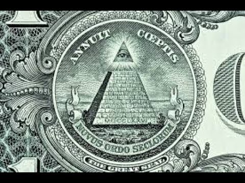

# **Biblical Series III: God and the Hierarchy of Authority**  

by Dr. Jordan Peterson

YouTube Video (https://www.youtube.com/watch?v=R_GPAl_q2QQ)

*Keywords: Hierarchy, Authority, God, Order, Society*

## Section I

I'm really looking forward to this lecture. One of the things that just absolutely staggers me about these stories—especially the story of Cain and Abel, which I hope to get to— is that it’s so short. It’s like 10, 11 lines. There’s nothing to it at all, and I’ve found that it’s essentially inexhaustible in its capacity to reveal meaning. I don’t exactly know what to make of that. I think it has something to do with this intense process of condensation across a very long period of time. That’s the simplest explanation. The information in there is so densely packed, and it’s not that easy to come up with a fully compelling explanation for that. One of the things that you can be virtually certain about is that everything about the archaic Biblical stories that was memorable was remembered.

This is kinda like Richard Dawkins’ idea of memes. I often thought that Richard Dawkins, if he was a little bit more mystically inclined, would have become Carl Jung. Their theories are unbelievable similar. The idea of meme and the idea of archetype of the collective unconscious are very, very similar ideas. The Jungian idea’s far more profound, in my estimation—well, and it just is. He thought it through so much better. Dawkins tended to think of meme as a sort of like a mind-worm that would infest the mind, and maybe multiple minds. But I don't think he ever really took the idea with the seriousness it deserved. I did hear him, actually, make a joke with Sam Harris, the last time they talked, about the fact that there was some possibility that the production of memes—say, religious memes—could alter evolutionary history. They both avoided that topic instantly. They had a big laugh about it, and then decided they weren't going down that road. That was quite interesting, to me.

I do really think that the density of these stories is a mystery. It certainly has something to do with their absolute impossibility to be forgotten. That’s actually something that could be tested empirically. I don’t know if anybody has ever done that. You could tell naive people two stories of equal length: one that had an archetypical theme, and the other that didn’t, and then wait three months and see which ones people remembered better. It would be a relatively straightforward thing to test. I haven’t tested it, but maybe I will at some point. But, anyways, that’s all to say that I’m very excited about this lecture. I get an opportunity to go over the story of Adam and Eve, and the story of Cain and Abel. I hope we manage both of those stories today. Maybe we’ll get to the story of Noah, and the Tower of Babel, as well, but I wouldn’t count on it, not at the rate we’ve been progressing. But that’s ok. That’s no problem. There’s no sense rushing this.

All right, I want to finish my discussion of the idea of the psychological significance of the idea of God. I’ve been thinking about this a lot more. This lecture series gives me the opportunity, and the necessity, to continue to think about the hypothesis that I’ve been developing. The Trinitarian idea is the earliest emergence, in image, of the idea that there has to be an underlying cognitive structure that gives rise to consciousness, as well as consciousness itself. What I was suggesting was that the idea of God the Father is something akin to the idea of the a priori structure that gives rise to consciousness. That’s an in-built part of us, so that’s our structure. You can think about that as something that’s been produced over a vast evolutionary time span. I don't think that’s completely out of keeping with the ideas that are laid forth in Genesis 1—at least if you think about them from a metaphorical perspective. It’s hard to read them literally. There’s an emphasis on day and night, but the idea of day and night as twenty-four-hour diurnal daytime and nighttime interchanges, that are based on the earthly clock, seems to be a bit absurd when you first start to think about the construction of the cosmos. It just doesn’t seem to me that a literal interpretation is appropriate.

You might not know it, but many of the early [Church Fathers](https://en.wikipedia.org/wiki/Church_Fathers)—[Origen](https://en.wikipedia.org/wiki/Origen), in particular—stated very clearly that these ancient stories were to be taken as wise metaphors, and not to be taken literally. The idea that the people who established Christianity were all the sort of the people who were Biblical literalists is just absolutely, historically wrong. Some of them were, and some of them still are. That’s not the point. The point is that many of them weren’t. It’s not like people who lived two thousand years ago were stupid, by any stretch of the imagination. They were perfectly capable of understanding what constituted something approximately a metaphor, and also knew that fiction, considered as an abstraction, would tell you truths that nonfiction wasn’t able to get at—unless you think that fiction is only for entertainment, and I think it’s a very big mistake to think that.

All right, so here we go. The idea of God the Father is that, in order to make sense out of the world, you have to have an [a priori](https://en.wikipedia.org/wiki/A_priori_and_a_posteriori) cognitive structure. That was something that Immanuel Kant—as I said last time—put forward as an argument against the idea that all of the information that we acquire during our lifetime is a consequence of incoming sense data. The reason Kant objected to that—and he was absolutely right about this—is that you can’t make sense of sense data without an a priori structure. You can't extract from sense data the structure that enables you to make sense of sense data. It’s not possible. That’s really been demonstrated, beyond a shadow of a doubt, since the 1960s. The best demonstration of that was actually the initial failure of artificial intelligence. When the AI people started promising that we would have fully functional and autonomous robots and artificial intelligence back in the 1960s, what they didn't understand—and what stalled them terribly until about the early 1990s—was that it was almost that the problem of perception was a much deeper problem than anyone recognized.

When you look out at the world, you just see that there’s objects out there—and, by the way, you don't see objects: you see tools, just so you know. The neurobiology of that is quite clear. You don't see objects and infer utility: you see useful things and infer object. It’s actually the reverse of what people think. But, the point is, regardless of whether you see objects or useful things, when you look at the world, you just see it. You think seeing is easy, because there the things are. All you have to do is turn your head and they appear. That’s just so wrong that it’s almost impossible to overstate. The problem of perception is staggeringly difficult. One of the primary reasons that we still don't really have autonomous robots—although, we’re a lot closer to it than we were in the 1960s—is because it turned out that you actually have to have a body before you can think. Even more importantly, you have to have a body before you can see, because the act of seeing is actually the act of mapping the patterns of the world onto the patterns of the body. It’s not things are out there, you see them, then you think about them, then you reevaluate them, then you decide to act on them, and then you act. You could call that a folk idea of psychological processing and perception. That is not how it works.

Your eyes, for example, map right onto your spinal cord. They mark right onto your emotional system, so it’s actually possible for people to be blind and still be able to detect facial expressions, which is to say, someone who's cortically blind—so they’ve had their visual cortex destroyed, often by a stroke—will tell you they can’t see anything, but they can guess which hand you’ve put up if you ask them to. If you flash them pictures of angry or fearful faces, they show skin conductance responses to the more emotional laden faces.

Imagine that the world is made out of patterns, which it is, and then imagine that those patterns are transmitted to you electromagnetically, through light, and then imagine that the pattern is duplicated on the retina, and then that pattern is propagated along the optic nerve, and then the pattern is distributed throughout your brain. Some of that pattern makes up what you call conscious vision, but other parts of it just activate your body. For example, when I look at this…whatever it is…Bottle! That’s the word. I look at it, especially with intent in mind, and as soon as I look at it, the pattern of the bottle activates the gripping mechanism of my hand. Part of the act of perception is to adjust my bodily posture, including my hand grip, to be of the optimal size to pick that up. It’s not that I see the bottle then think about how to move my hand. That’s too slow. It’s that I use my [motor cortex](https://en.wikipedia.org/wiki/Motor_cortex)to perceive the bottle, and that’s actually somewhat independent of actually seeing the bottle as a conscious experience.

There's much more that can be told about that. [Rodney Brooks](https://en.wikipedia.org/wiki/Rodney_Brooks) is someone to know. He’s a robotics engineer who worked in the 1990s. He invented the Roomba, among many other things. He’s a real genius, that guy. Brooks was one of the first people to really point out that, to be able to have a machine that perceives well enough to work in the world, you had to give it a body, and that the perception would actually be built from the body up, rather than from the abstract, cognitive perceptions down. That turned out to be the case, and Brooks built all sorts of weird little machines in the 1990s that didn't even really have any central brain, but they could do things like run away from light. They could perceive light, but their perception was the act of running away from light. Perception is very, very, very tightly tied to action in ways that people don’t normally perceive. Anyways, that’s all to say that you cannot perceive the world without being embodied, and you’re embodied in a manner that's taken you roughly 3.5 billion years to pull off.

There's been a lot of death as a prerequisite to the embodied form that you take. It’s taken all that trial and error to produce something, like you, that can interact with the complexity of the world well enough to last the relatively paltry 80 or so years that you can last. This may be wrong, but I think, at least, it’s a useful hypothesis: I think the idea of God the Father is something like the birth of the idea that there has to be an internal structure, out of which consciousness itself rises, that gives form to things. If that's the case—and perhaps it’s not—it’s certainly a reflection of the kind of factual truth that I’ve been describing. I also mentioned that I see the idea of both the Holy Spirit, and most specifically of Christ, in the form of the word, as the active consciousness that that structure produces and uses, not only to formulate the world—because we formulate the world, at least the world that we experience—but also to change and modify that world. There’s absolutely no doubt that we do that. We do that partly with our bodies, which are optimally evolved to do that, and that is why we have hands, unlike dolphins, that have very large brains, like us, but can't really change the world.

We’re adapted and evolved to change the world. Our speech is really an extension of our ability to use our hands. The speech systems that we use are a very well-developed motor skill and, generally speaking, your dominant linguistic hemisphere is the same as your dominant hand. People talk with their hands—like me, as you may have noticed—and we use sign language. There’s a tight relationship between the use of the hand and the use of language. That’s partly because language is a productive force, and the hand is part of what changes the world. All those things are tied together in a very, very complex way with this a priori structure, and also with the embodied structure. I also think that's part of the reason why classical Christianity put such an emphasis not only on the divinity of the spirit, but also on the divinity of the body, which is a harder thing to grapple with. It’s easier for people to think—if you think in religious terms, at all—that you have some sort of transcendent spirit that is somehow detached from the body, and that it might have some life after death. But Christianity, in particular, really insists on the divinity of the body.

The idea is that there’s an underlying structure that’s got this quasi-patriarchal nature. It’s for complex reasons, but partly because it’s a reflection of the social structure, as well as other things, and then that uses consciousness in the form—particularly of language, but most particularly in the form of truthful language—in order to produce the world in a manner that’s good. I think that’s a walloping, powerful, powerful idea, especially the relationship between the idea that it’s truthful speech that gives rise to the good. That’s a really fundamental, moral claim. I think that’s a tough one to beat. One of the things that I’ve really noticed—and this isn’t just me, that's for sure—is that there’s a lot of tragedy in life. There’s no doubt about that, and lots of people that I see in my clinical practice, for example, are laid low by the tragedy of life. But I also see very, very frequently that people get tangled up in webs of deceit that are often multiple generations long, and that just takes them out.

Deceit can produce extraordinary levels of suffering that last for very, very long periods of time. That’s really a clinical truism. Freud, of course, identified one of the problems that contributed to the suffering we might associate with mental illness, with repression, which is kind of like a lie of omission. That’s a perfectly reasonable way of thinking about it. Jung stated, straight out, that there was no difference between the psychotherapeutic effort and supreme moral effort, including truth. Those were the same thing, as far as he was concerned. [Carl Rogers](https://en.wikipedia.org/wiki/Carl_Rogers), another great clinician, who was at one point a Christian missionary before he became more strictly scientific, believed that it was in truthful dialog that clinical transformation took place. Of course, one of the prerequisites for genuine transformation in the clinical setting is that the therapist tells the truth and the client tells the truth. Otherwise, how in the world do you know what’s going on? How can you solve the problem when you don't even know what the problem is? And you don't know what the problem is unless the person tells you the truth. That's something to really think about in light of your own relationships. If you don't tell the people around you the truth, then they don't know who you are. Maybe that's a good thing. Well, seriously. People have reasons to lie, right? I mean, they aren’t trivial. But it’s really worth knowing that you can't even get your hands on the problem unless you formulate it truthfully, and if you can't get your hands on the problem, the probability that you're going to solve it is just so low.

This idea has become more credible to me the longer I’ve developed it: The idea that there’s…It’s partly the idea that…Let me figure out how to start this properly. A friend of mine, business partner, and a guy that I’ve written scientific papers with—very smart guy—took me to task about using the word "dominance hierarchy," which might be fine for chimpanzees, lobsters, and for creatures like that, but not even for chimpanzees, so much. He thought that the idea of dominance hierarchy was actually a projection of an early 20th century quasi-Marxist hypothesis onto the animal kingdom that was being observed. The notion that the hierarchical structure that you see—that characterizes mating hierarchies in chimps, for example, that was predicated on power—was actually a projection of a kind of political ideology. That really bugged me for a long time when he said that, because I’ve really been used to using the word dominance hierarchy. He told me all that and I thought, argh, that’s so annoying! It’s so annoying because it might be right.It took me months to think about it. I was reading [Frans de Waal](https://en.wikipedia.org/wiki/Frans_de_Waal) at the same time—he’s a primatologist—and also [Jaak Panksepp](https://en.wikipedia.org/wiki/Jaak_Panksepp), a brilliant, brilliant affective neuroscientist who, unfortunately, just died. He wrote a great book called [Affective Neuroscience](https://www.amazon.com/Affective-Neuroscience-Foundations-Animal-Emotions/dp/019517805X/). For rats to play, they have to play fair, or they won’t play with each other. That's a staggering discovery, because anything that helps instantiate the emergence of ethical behaviour in animals—and that associates it with an evolutionary process, which is essentially what Panksepp was doing—gives credence to the notion that the ethics that guide us are not mere sociological, [epiphenomenological](https://en.wikipedia.org/wiki/Epiphenomenalism) constructs. They’re deeply rooted. And rats…They’re rats, for God’s sake! You can't trust them, and they still play fair. De Waal noticed that, in the chimp troops that he studied, it wasn’t the barbaric chimp that ruled with an iron fist that was the successful ruler. He kept getting torn to shreds by the compatriots that he ignored and stomped on. As soon as he showed some weakness, they’d just tear him into pieces. The chimp leaders that were stable—that had a stable kingdom, let’s say—were very reciprocal in terms of their interactions with their friends. Chimps have friends, and chimp friendships actually last for a very long time. They’re also very reciprocal in their interactions with females and infants.

Frans de Waal is a very smart guy. I thought that was also foundational science, because it’s really something to know that the attributes that give rise to dominance in a male dominance hierarchy…Let’s call it authority, that might be better. Or even, shudder, competence, which I think is a better way of thinking about it. The attributes that give rise to dominance in a male competence hierarchy are not predicated on purely anything that’s as simple as brute power. I think, too, that the idea—and this is a deeply devious and dangerous political idea, in my estimation—that male hierarchies are fundamentally predicated on power in a law-abiding society is absurd. I think all you have to do is think about that for like a month, say, which isn’t that long, to understand how absurd that is.

Most people who are in positions of authority are just as hemmed in by ethical responsibly, or even more so, as people at the other levels of the hierarchy. We know this, even in the managerial literature, because we know, generally speaking, that managers are more stressed by their subordinates than the subordinates are stressed by their managers. That's not surprising. You want to be responsible for 200 people? You really want that? That's hard work, man. I mean, I know it’s a pain to have a boss, because you have to care about what the boss thinks. Maybe the person is arbitrary, in which case they’re not going to be particularly successful, but it’s no joke to be responsible for 200 people. You have to be very careful when you’re in a position of responsibility and authority like that, because you’ll get called out if you make mistakes, constantly. It’s not like, because you have a position that's higher up in the hierarchy, you're less constrained by ethical necessity. Well, if you’re a psychopath, that's a different story, but psychopaths have to move pretty rapidly from hierarchy to hierarchy, because they get found out quite quickly. As soon as their reputation is shattered, they can't get away with their shenanigans anymore. All of this is to say that there is something very interesting about the pattern of behaviour.

We know that sexual selection is a very, very, very, very powerful biological force—even though biologists ignored it for almost 100 years after Charles Darwin originally wrote about it, thinking mostly about natural selection. They didn't like the idea of sexual selection, because it tended to introduce the notion of mind into the process of evolution. It deals with choice. Imagine that you have a male hierarchy. We know that the men at the top of the hierarchy are much more likely to be reproductively successful than the men at the bottom. It’s particularly true of men. You have twice as many female ancestors as you have male ancestors. I’m not going to do the math, and I know it doesn’t sound plausible, but you can look it up and figure it out. It’s a perfectly reasonable fact that actually happens to be true.

So there’s twice as many female ancestors, because females, on average, leave twice as many offspring as men do. Any man who does reproduce tends to reproduce more than once, but a bunch of men reproduce zero. The average man who reproduces has two children, and the average man who doesn’t reproduce has zero. The average woman who reproduces has one child. That means that there’s twice as many females in your line as there is males. That’s a big deal. Imagine that it works something like this: the men elect the competent men, who are admired, and who are given positions of authority and respect. It’s like an election. It could be an actual, democratic election, but it’s, at least, an election of consensus—or it’s an election of, well, we’re not going to kill him, for now, which is also a form of election. It’s a form of tolerance.

Women, for their part, peel from the top of the male hierarchy. So you’ve got two factors that are driving human sexual selection across vast stretches of evolutionary time. One is the election of men, by men, to positions where they’re much more likely to reproduce. The second is the tendency of women to peel off the top of the male dominance hierarchies, which is extraordinarily well-established—cross-culturally, even, if you flattened out the socioeconomic disparity, say, between men and women, like they’ve done in Scandinavia. You don't reduce the tendency of women to peel off the top of the male hierarchy, by much. Why would you? Women are smart. Why in the world wouldn’t they strive to make relationships with men who are relatively successful? And why wouldn't they let the men themselves define how that constitutes success? It makes sense. If you want to figure out who the best man is, why not let the men compete? The man who wins—whatever the competition is—is the best man, by definition. How else would you define it?

Why am I telling you all of that? The reason is because it seems, to me, that there’s been this complex interplay across human evolution between the election of the male dominance hierarchy and sexual success. That’s a big deal, if it’s true. What would happen is that men would evolve to be better and better at climbing up the male hierarchy. The ones who weren’t good at that wouldn’t reproduce. But then it wouldn’t just be a hierarchy, because there's a whole bunch of different hierarchies. You might say, well, are there commonalities across hierarchies? That's a reasonable thing to propose. They're not completely opposed to one another, at least. If you’re relatively more successful in one hierarchy, it’s more probable that you’ll be successful in another. That's actually a really good definition of general intelligence, or IQ, and that's actually one of the things that women select men for. Men also select women for that, but the selection pressure is even higher from women to men.

General IQ is one of the things that propels you up and across dominance hierarchies. It’s a general problem-solving mechanism. The other thing that it seems to do that, to some degree, is conscientiousness. There’s also some evidence that women prefer conscientious men, and of course. Why wouldn't they? You can trust them, and they work, and so those are both good things. Then you think, so men have adapted to start to climb the male dominance hierarchy, but it’s the set of all possible hierarchies that they're adapted to climb. Then you think, there’s a set of attributes that can be acted out, and that can be embodied, that will increase the probability that you're going to rise to the top of any given hierarchy. And then you could say, well, as you adapt to that fact, then you start to develop an understanding of what that pattern constitutes. That starts to become the abstract representation of something like multidimensional competence, and that's like the abstraction of virtue, itself. None of that’s arbitrary. That’s as bloody well grounded in biology as anything could be. I think that’s a really hard argument to refute.

## Section II

[TIMESTAMP](https://youtu.be/R_GPAl_q2QQ?list=PL22J3VaeABQD_IZs7y60I3lUrrFTzkpat&t=1558)

One of the things I should tell you about how I think is that, when I think something, I spend a long time trying to figure out if it’s wrong. I like to hack at it from every possible direction to see if it's a weak idea. If it’s a weak idea, then I’d rather just dispense with it and find something better. I’ve had a real hard time trying to figure out what’s wrong with that idea. It seems to me that it’s pretty damn solid. The idea is that, if you watch what people do in movies, and so on, and when they're reading fiction, it’s obvious that they're very good at identifying both the hero and the antihero. You could say the antihero—the bad guy—is someone who strives for authority and position—generally speaking, not always—but fails. So he’s a good, bad example.

If you take a kid to a good guy, bad guy movie, the kid figures out pretty fast that he’s not supposed to be the bad guy. He figures out very quickly to zero in on the good guy. That means that there’s an affinity between the pattern of good guy that's been played out in the fiction, and the perceptual capacity of the child. When my son was a kid, I used to take him to movies that were sometimes more frightening than they should have been. I never said, don't be afraid. I think that's bad advice for kids. What I said was, keep your eye on the hero. Keep your eye on the hero. And he was gripped by the movie, and often quite afraid of them—because movies can be very frightening—so he’d just zero in on that guy, hoping. You know what it’s like in a movie. You hope that the good guy wins, generally speaking. Why do you do that? Where’s that come from? Do you see how deeply rooted that is inside you? You bloody well go line up and pay to watch that happen. That’s not an easy thing to understand, and it’s so self-evident to people that we don't even notice that it’s a tremendous mystery.

Is it so unreasonable to think that we would have actually, over the millennia, come to some sort of collective conclusion about what the best of the good guys are, and what the worst of the bad guys are? To me, archetypically speaking, that's the hostile brothers: Christ and Satan, or Cain and Abel. The hostile brothers is a very common mythological motif. Those are archetypes. Satan, for example, is, by definition, the worst that a person can be. Christ, by definition—this is independent of anything but conceptualization—is, by definition, the best that a man can be. As I’ve said, I’m speaking psychologically and conceptually. Given our capacity for imagination, and our ability to engage in fiction—and our love for fiction, and our capacity to dramatize, and our love for stories of heroism, catastrophe, and good and evil—I can't see how it could be any other way. That’s part of the idea that’s driving the notion of the evolution of the idea of God. Even more specifically, driving the evolution of the idea, at least in part, of the Trinity.God is an abstracted ideal, formulated, in large part, to dissociate the ideal from any particular incarnation, or man, or any ruler. There’s another rule in the Biblical stories, which is that, when the actual ruler—I mentioned this before—becomes confused with the abstracted ideal, then the state immediately turns into a tyranny, and the whole bloody thing collapses. It’s so sophisticated. One of the things that we’ve figured out—and this was a hard thing to figure out—was that you had to take the abstraction, divorce it from any particular power structure, and then think about it as something that existed as an abstraction, but also as a real thing. It was real in that it governed your behaviour, everyone’s behaviour, including the damn king. The king was responsible to the abstracted ideal. Man, that’s such an impossible idea. Why would they have agreed to that five thousand years ago? One of the things that you see continually happening in the Old Testament is, as soon as the Israelites—for example, the Israelite kings—become almighty, the real God comes along and just cuts them into pieces. Then the whole bloody state falls apart for like hundreds of years. I think that's a lesson that we have not thoroughly, consciously yet learned. It’s still implicit in the narratives, and we still haven’t figured out why that’s the case. Again, I think that’s a hard argument to dispense with.We looked at this a little bit. The Trinitarian idea is that there’s a Father—that’s, maybe, the dramatic representation of the structures that underlie consciousness, or the embodied structure that underlies consciousness—and then there’s the Son, and that's conscious in its particular, historical form. That’s the thing that’s so interesting about the figure of the Son. And then there’s consciousness as such, and that seems to be something like the indwelling spirit. These psychological ideas came from somewhere. They have a history. They didn't just spring out of nowhere. They emerged from dreams and hypothesis and artistic vision, and all of that, over a long time, and maybe they got clarified into something like consciousness. But it takes a damn long time to get from two chimpanzees watching each other to a human being saying, well, we all exhibit this faculty called consciousness. I mean, that’s a long journey. That’s a really long journey, and there's gonna be plenty of stages in between.

One of the things I really like about [Jean Piaget](https://en.wikipedia.org/wiki/Jean_Piaget), the development psychologist, was that he was so insistent that children act out and dramatize ideas before they understand them. [Merlin Donald](https://en.wikipedia.org/wiki/Merlin_Donald), who is a psychologist at Queen’s University, wrote a couple of interesting books along those lines, as well, looking at the importance of imitation for the development of higher cognition in human beings. The notion that we embody ideas before we abstract them out, and then represent them in an articulated way, is an extraordinarily solid idea. I really can't see how it could be any other way. If you watch children, you see that.

Think about what a child is doing when he plays house, or she plays house. The child acts out the father or the mother. You think, isn’t that cute. She’s imitating her mother. It’s like, no. She’s not. That's not what happens. It’s very annoying when your child imitates you. You move your arm, and then they move their arm, and you move your head—they copy you. No one likes direct imitation. That's not what a child’s doing when the child is playing. What the child is doing is watching the mother over multiple instantiations and then extracting out the spirit called mother, and that’s what whatever’s mother-like across all those multiple manifestations. Then the child lays out that pattern internally and manifests it in an abstract world. It’s so sophisticated. That’s what you’re doing when you’re playing house, or having a tea party, or taking care of a doll. It’s not like you’ve seen your mother take care of a doll. You haven’t seen that. It’s that you’re smart enough to pull out the abstraction and then embody it. Certainly, the child is attempting to strive towards an ideal, at that point. She’s not lighting her doll on fire—well, with certain exceptions; generally ones that we try to not encourage.

We also know that if children don’t engage in that sort of dramatic and pretend play to a tremendous degree, they don’t get properly socialized. It’s really a critic element of developing self-understanding, and then also developing the capability of being with others. What you do when you’re a child, especially around the age of four, is you jointly construct a shared fictional world. We’ll play house together, let’s say, and then you act out your joint roles within that shared, fictional world. That’s a form of very advanced cognition. It’s very sophisticated. I see in that—and Piaget did as well, and so did Jung, and so did Freud, and also Merlin Donald, these brilliant observers—the manner in which cognition came to be. They know very clearly that embodied imitation and dramatic abstraction constituted the ground out of which higher abstract cognition emerged. How could it not be? We were mostly bodies before we were minds, clearly, and so we were acting out things way before we understood them—just like the chimpanzees act out the idea that you have to act sensibly if you’re head chimpanzee, or you’re going to get yourself ripped apart.

You see that in wolves, too. When wolves have a dominance dispute, they puff up their hair at each other. They’ll look big, and they growl and bark, and they are very menacing. One wolf chickens out and rolls over, puts up its neck, and basically what he’s saying is, yea, I’m pretty useless. You can kill me, if you want to. And the other wolf says, yea, you know you’re pretty useless, and I could tear out your throat, but tomorrow we might need you to help bring down a moose, so I’ll keep you around. It’s not like they think that; they act it out as a behavioural pattern. If you’re an anthropologist, or an ethologist, and you went and watched the wolves, you’d say it’s as if they were acting according to a rule. That often confused me, because I thought, do wolves act out rules? And I thought, no, no, no. A rule is what we construct when we articulate a behavioural pattern. We observe a stable behavioural pattern and, when we articulate it, we can call it a rule. But for the wolves it’s not a rule; it’s just a stable behavioural pattern. We acted like wolf troops, or chimpanzee troops, for untold tens, and perhaps hundreds, of millions of years before we were able to formulate that pattern of behaviour in anything approximating a story or an image. It was even longer before we could articulate it as a set of ethical rules.

I’m dwelling on this. I know I’ve repeated some of this before, but it’s so important. There’s this tremendous push, especially from the social constructionists, to make the case that ethics is arbitrary, morality is relative, and there's no fundamental biological grounding in relationship to human behaviour, especially in the category of ethics. I think, first of all, that it’s dangerous, because that means that people are anything you want to turn them into, and you bloody well be careful of people who think that. And second, I just think that the evidence that that's wrong is so overwhelming that we should just stop thinking that way. That’s partly why I’m also attacking this from an evolutionary perspective. There’s lots of converging lines of evidence that ethical standards, at least of the most crucial sort, not only evolved, but also spontaneously reemerged, for example, in the dramatic play of children. We need to take that seriously. Part of what we’re doing here is trying to take that seriously.

Ok, so the idea there, at least in part, was that the Father employed the Son to generate habitable order out of chaos. I also think there might be something more proximally true about that, as well. Here's something that's cool about men: men are much more criminal than women—and that, by the way, does not look like it’s sociocultural—partly because it peaks when testosterone kicks in around 14. It just spikes the hell up, and then it stays pretty high until about 27. For those of you who don’t know this, standard penological theory holds that, if you have a repeat offender, guy just won’t stop getting into trouble, just throw him in prison until he’s 28. It’s not like you’re rehabilitating him, or anything. By 28, he’s done with his criminal career, because the crime curve peaks at 15 and then falls down. Around 27, or so, it burns out. That's often when men get married, settle down, and stabilize.One of the things that’s cool about that is that the creativity curve for men is almost exactly the same. It ramps up when testosterone kicks in and then it starts to flatten out around 27. The curves match very, very closely, so that’s quite cool. It’s the creativity element of it that I'm particularly interested in, because creativity is, in many ways, an attribute of youth. I mean, if you look at that sentence, and you stripped it of its religious context, what you would say is that the older people use the younger people to generate creative ideas and renew the world. It’s like, yea, that’s what happens. We also have no idea how many of the things that we discovered or invented as human beings were stumbled across by children and adolescents. They’re much more exploratory, less constrained by their extant knowledge structures, and they’re less conservative. That seems just right to me—right in an extraordinarily important way. It also means that, if you’re an actual father, part of what you should be doing is encouraging your son. That is clearly the role. To encourage is to say, well, go out there, confront the chaos of the unknown and the chaos that underlies everything. Grapple with it, because you can do it. You’re as big as the chaos itself, and do something useful as a consequence. Make your life better and make everyone else’s life better. You can do it. Man, that’s the right thing to tell young men. Talking to young women is more complicated, because they have more, let’s say, issues to deal with. Their lives are more complicated in some ways, but that’s definitely the right thing to be telling your son.

One of the things that I’ve really noticed recently, especially in the last 7 or 8 months, is that most of my audience has been young men. I’ve talked a lot to them about both truth and responsibility, and I think those are the two things that underlie this capacity. There seems, to me, to be a tremendous hunger for that idea. It’s not the same idea as rights. It’s a very different idea. It’s the counterpart to rights. Life is hard, chaotic, and difficult. It’s definitely a challenge. You can either shrink from that—and no bloody wonder, because it’s gonna kill you, and it’s no joke—or you can forthrightly confront it and try to do something about it. Well, what's better? And then you say to the person, look, you can do it. That's what a human being is like. If you just stood up and got yourself together, you’d find out by trying that you can, in fact, do that. I do think that’s a great, core religious message. I think that’s deeply embedded in this sort of idea.

All right, so this is what I’ve been telling you. This is something like how knowledge itself is generated: There's the unknown as such, and that's really what you don’t know anything about. Generally, when encounter that, you don't encounter it with thought. You encounter it with a startled expression. That’s the first representation of the absolutely unknown. It’s something that's beyond your comprehension. It’s terrifying, and because it’s beyond your comprehension, you cannot perceive or understand it, but you still have to deal with it. The way you deal with it is that you freeze. That’s what a [basilisk](https://en.wikipedia.org/wiki/Basilisk) does to, say, the kids in Harry Potter. They take a look at it, and they freeze. That’s the terrible snake of chaos that lives underneath everything. You see it, and that thing freezes you, because you’re a prey animal. But, at the same time, it makes you curious. That’s the first level of contact with the absolutely unknown: the emotional combination of freezing and curiosity.

That’s reflective, I think, in the dragon stories. The dragon is the terrible thing that lives underground that hordes gold or virgins—very strange behavior for a reptile, as we pointed out before. But the idea is that it’s a symbolic representation of the predatory quality of the unknown, combined with the capacity of the unknown to generate nothing but novel information. You can see that as very characteristic of human beings, because we are prey animals, but we are also unbelievable exploratory, and we’re pretty damn good predators. We occupy this weird cognitive niche. One of the things we’ve learned is that, if we forthrightly confront the unknown—terrifying as it is—there’s a massive prize to be gained, continually. That seems to be as true as anything is.

We know that one of the metaphors that underlies God’s extraction of habitable order out of chaos at the beginning of time is an archaic idea. God confronted something like the leviathan, and that’s one of the words for this serpent-like chaos creature that's often used in the Old Testament. There’s this idea—that I think probably came from the Mesopotamians—that God, either in the Son-like aspect or in the Father-like aspect, is the thing that confronts this terrible beast—the chaotic unknown—and cuts it into pieces, and then, sometimes, gives the body parts to the populace to feed them. You can see a hunting metaphor there as well, but it’s deeper than that.So there’s the absolute unknown, and the unknown is what you do not understand. It’s what’s beyond the campfire—even more anciently, maybe it’s what’s beyond the tree. It’s out there, where you don’t know, and what’s out there? Crocodiles, snakes, birds of prey, cats, and all sorts of things that will eat you. But there’s utility in going out there to find out what’s there. Maybe you go, and you don't kill the snake—you kill the damn nest of snakes, and that makes you pretty popular, just as you should be. That accelerates your reproductive potential, let’s say, and we’re descended from people who did that.

We have this notion about how the world is structured that’s deeply embedded in our psyche—really, really, deeply. Way, way down, way below the surface cognition. Way down in the [limbic system](https://en.wikipedia.org/wiki/Limbic_system), in these ancient parts of the brain that are like 60 million years old, or a hundred million years old, or older than that. Ancient, ancient brain structures. The first thing we do is we act out our encounter with the unknown world, and we act that out in a manner that’s analogous to the manner that’s presented as a description of what it is that God does at the beginning of time to extract habitable order out of chaos. I won’t tell you about the other part of that, for now.

So you act it out first, and then you watch people who act it out, and you start to make representations of that. That’s stories, right, and maybe you admire them. After a long time, you collect a bunch of those stories, and then you can say what that is—you can articulate it as a pattern. This is something Nietzsche also figured out. He did so many things first. It was quite remarkable. There was an idea that you first think, and then you act. It’s completely, bloody rubbish, because you’re as impulsive as you can possibly imagine. You’re always doing things before you think, and sometimes that's a really good idea. So the idea that you see things, and then think, and then act…It’s like, really? I don’t do that. No one I know does that, and they certainly don’t do that when they’re emotional. You act first.

One of the things that Nietzsche said, very clearly, was that our ideas emerged out of the ground of our action over thousands and thousands of years. Philosophers weren’t generating creative ideas when they were putting forward those ideas; they were just telling the story of humanity. It’s already in us. It’s already in our patterns of behaviour. Nietzsche was a genius, and that’s one of his many, many observations of pure genius. There’s the unknown, and then you act in the face of the unknown, and then you dream about the action—that’s what you’re doing in a movie theatre—and then you speak about it. Of course, once you speak about it, that affects how you dream, and how you dream affects how you act. It’s not like all of the causal direction is one way, because it’s not. These things loop. But it’s still from the unknown, through the body, through the imagination, into our articulation. That’s the primary mode of the generation of wisdom, let’s say. You can easily map that onto an evolutionary explanation: the body comes first, right, and then the imagination—which is the body in abstraction—and only then the word. That's exactly how things did evolve, because we could imagine things long before we could speak. At least, that's the theory.This is an image from my book, [Maps of Meaning](https://jordanbpeterson.com/maps-of-meaning/). The idea is that this is the fundamental representation of the unknown as such. It’s half-spirit, because it partakes of the air like a bird, and it’s half-matter, because it’s on the ground like a snake. That’s what you think is there when you don't know what is there. That’s how your body reacts to what's there when you don't know what is there. You know that when you’re alone at night, and maybe you're a little rattled up for one reason or another. Maybe you watched a horror movie, and there's some weird noise in the other room. It’s dark; you’re on edge, and you think you want to turn the light on and go in the room and see. Don’t do that. Just open the door a little bit and sneak your hand in. Just watch what your imagination fills that room with, right? Then you remember what it’s like to be three years old, in bed, and afraid of the dark.

I read a good book on dragons, recently, that had a very interesting hypothesis about them. One of the things the guy did was track—I can't remember his name, unfortunately—how common the image of the dragon was worldwide. It’s unbelievably widespread. He thought that this was actually the category of primate predator. Predator is a weird category, because there’s crocodiles and lions in it, and they don't have much in common except they eat you. It’s a functional category, and this is the imagistic representation of the functional category of predator. His predator theory was, well, if you’re a monkey, then a bird would pick you off, like an eagle. And if it wasn’t an eagle, it as a cat, because they climb trees and give you a good chomping. And if it wasn’t a cat, then you go down to the ground and a snake would get you. Or, maybe, a snake would climb up the tree—because snakes like to do that—and get you. So that’s a tree-cat-snake, basically. Tree-cat-snake-bird, and that’s the thing you really want to avoid. You don’t want to come across one of those. The other thing it does is breathe fire, because fire was both greatest friend and greatest enemy of humanity.

We’ve mastered fire for a long time. It might be as long as two, three million years. [Richard Wrangham](https://en.wikipedia.org/wiki/Richard_Wrangham) wrote a book on that recently. I think it was Wrangham who wrote a book on when human beings learned to cook. That was about two million years ago. Cooking increased the availability of calories. You know how chimpanzees are kind of ugly? Shaped like a big bowling ball? They look really fat, and they’re short and wide. That’s because they have intestinal tracks that are like 300 miles long. The reason for that is because they have to digest leaves. You go out in the forest and sit there and eat leaves for a whole day, and see how that works out for you. They have no calories in them. So chimps spend about eight hours a day chewing. It’s because what they eat has no nutritional value. They have to have this tremendous gut to extract anything at all out of it. Human beings, at some point, just thought, to hell with that. We’ll cook something. We traded our gut for brain, which more or less has worked. I think it’s made us a lot more attractive, as well.

The idea here was, well, that's the basic archetype of the unknown as such. I like the Saint George version of this. It’s so cool, because Saint George lives in a castle, and the castle is partly falling down. It’s partly because there's a dragon that’s come up. It’s an eternal dragon, and it’s come back to give everyone a rough time. This always happens, because the eternal dragon is always giving our fallen down castles a rough time. Saint George is the hero who goes out to confront the dragon, and he frees the virgin from its grasp. I would say that's a pretty straightforward story about the sexual attractiveness of the masculine spirit that’s willing to forthrightly encounter the unknown. It looks like a straight biological representation to me. It’s a really, really old story. It’s the oldest written story we have. The Mesopotamian creation myth, the [Enuma Elis](https://en.wikipedia.org/wiki/En%C3%BBma_Eli%C5%A1), basically lays out that story. I bet you the moviegoers among you, especially the ones that are more attracted to the really flashy sort of superhero movies, have probably seen the Saint George story like 150 times in the last 10 years. You never get tired of it, because it’s the central story of mankind.So you’ve got the unknown as such, and that is what you react to with your body. Existential terror and extraordinary curiosity are gripping you. And then you have the unknown-unknowns. Who’s the political guy under Bush? Rumsfeld, yea. I think the reason [that phrase](https://en.wikipedia.org/wiki/There_are_known_knowns) caught on so well is because he nailed an archetype. There’s unknown-unknowns, and there's known-unknowns. That dragon is the unknown-unknown. You have to be able to react to an unknown-unknown, because they can get you. You can't just plead ignorance, because then you’re dead. That doesn’t work. Human beings are the sort of creature who has to know what to do when they don't know what to do. That's very paradoxical, and what we do is prepare to do everything. We’re on guard. We’ve prepared to do everything. It’s very, very stressful, but also very engaging, and very much something that heightens consciousness. Maybe those circuits are permanently turned on in human beings, because we also know that we’re going to die, and no other animal knows that. Sometimes I think that our stress circuits are just on all the time. I think that’s part of what accounts for our heightened consciousness.

So you have your unknown-unknowns, and then you have the unknowns that you actually encounter in the world, like the mystery of your romantic partner. When you have a fight with them, it’s like, who the hell are you? You’re not the absolutely unknown, because I know something about you, but you're the unknown as it’s manifesting itself to me, right now. Then there’s the known that we inhabit, and then there’s the knower. The known is given symbolic representation, as far as I've been able to tell, in the patriarchal form of a male deity. The unknown as you encounter it is given feminine form. We won’t get into that too much, but if you’re interested in that you can look at my [Maps of Meaning lectures](https://www.youtube.com/playlist?list=PL22J3VaeABQAT-0aSPq-OKOpQlHyR4k5h), and maybe take a look at the book. I think it’s a good schema for religious archetypes. I’ve worked on it a long time. It seems to fit the Jungian criteria quite nicely. It maps nicely onto Joseph Campbell’s ideas. He got almost all of his ideas from Jung, however. It also makes sense from a biological and evolutionary perspective, as far as I can tell. That's a lot of cross-validation, at least in my estimation.

## Section III

[TIMESTAMP](https://youtu.be/R_GPAl_q2QQ?list=PL22J3VaeABQD_IZs7y60I3lUrrFTzkpat&t=3339)

Ok, so back to the hierarchy of dominance. I've done a lot of work in functional neurochemistry because I used to study alcoholism and drug abuse. To study alcohol, you have to know a lot about the brain. Alcohol goes everywhere in the brain. It affects several neurochemical systems. If you’re going to study alcohol, you kind of have to study neurochemistry in general. I did that for quite a long time. I really got enamoured of a book called [The Neuropsychology of Anxiety](https://www.amazon.com/Neuropsychology-Anxiety-Functions-Septo-Hippocampal-Psychology/dp/0198522711), by [Jeffrey Gray](https://en.wikipedia.org/wiki/Jeffrey_Alan_Gray), which is an absolute work of genius, although extraordinarily difficult. I don't know how many references that book has. It must be a thousand. Gray actually read them—and, worse, he understood them, and then he integrated them into this book. To read it, you have to really master functional neurochemistry, animal behaviourism, motivation and emotion, and neuroanatomy. It’s a killer book, but, man, it’s really rich. It’s taken psychologists about 40 years to really unpack that book.

One of the things I learned was just exactly how much continuity there was in the neurochemistry of human beings and the neurochemistry of animals. It’s absolutely staggering. It’s the sort of thing that makes the fact of evolution something like self-evident—I do think it’s self-evident, for other reasons that I’ll tell you about later. I think random mutation and natural selection is the only way you can solve the problem of how to deal with an environment that's complex beyond your ability to comprehend. I think what you do is generate endless variants, because God only knows what the hell’s going to happen next. Almost all of them die because they’re failures, and a couple propagate, and the environment keeps moving around like a giant snake. You never know what it’s going to do next. The best you can do is say, well, here's 30 things that might work, and 28 of them are going to perish. If you're an insect, the ratio is way, way higher than that.

Anyways, lobsters are creatures that engage in dominance disputes. I think "dominance" is the right way to think about it. Lobsters aren’t very empathic, and they aren’t very social, and so it really is the toughest lobster that wins. What's so cool about the lobster is that, when a lobster wins, he flexes and gets bigger. He looks bigger because he’s a winner. It’s like he’s advertising that. The neurochemical system that makes him flex is [serotonergic](https://en.wikipedia.org/wiki/Serotonergic). You think, well, who cares? What the hell does that mean? I’ll tell you what that means: it’s the same chemical that’s affected by antidepressants in human beings. If you’re depressed, you’re a defeated lobster. You’re like, I'm small, things are dangerous. I don’t want to fight. You give someone an antidepressant, up they stretch, and then they’re ready to take on the world again. Well, if you give lobsters who just got defeated in a fight serotonin, then they stretch out and they’ll fight again. We separated from those creatures on the evolutionary time scale somewhere between 350-600 million years ago, and the damn neurochemistry is the same!

That’s another indication of just how important hierarchies of authority are: they’ve been conserved since the time of lobsters. There weren’t trees around when lobsters first manifested themselves on the planet. What that means is these hierarchies that I've been talking about are older than trees. One of the truisms for what constitutes real, from a Darwinian perspective, is that which has been around the longest period of time, because it’s had the longest period of time to exert selection pressure. Well, we know we evolved and lived in trees something along the order of 60 million years ago. We’re talking 10 times as far back as that for the hierarchy. The idea that the hierarchy is something that's exerted selection pressure on human beings is not a disputable issue. How it’s done it, and exactly what that means, we can argue about. But that sort of biological continuity is just absolutely unbelievable.

I didn't discover this. I read about it, and I talked to my graduate students about it. I used to take them out for breakfast. They were a very contentious, snappy bunch. They were always trying to one-up each other, and they were quite witty. For like six months—until it got very annoying—every time one of them one-upped the other, they’d stretch themselves out and snap their hands. That was very funny. It was really, very funny. So you see this in lobsters, and that's pretty amazing.

One of the other things that's really cool about lobsters is that—let’s say you’ve been top lobster for a long time, but you're getting kind of old, and some young lobster just wails the hell out of you, and so you're all depressed. Your brain is dominant, but you’re a lobster; you don’t have much of a brain. So now what are you going to do? The answer is, well, your brain will dissolve, and then you’ll grow a subordinate brain. Yea. That’s worth thinking about, too, for a couple of reasons. First of all, if any of you have ever been seriously defeated in life, you know what that’s like. It’s like a death, a descent, a dissolution, and if you’re lucky, a regrowth—and maybe not as the same person.

That’s what happens to people with post-traumatic stress disorder: their brains undergo permanent neurological transformation. They then inhabit a world that’s much more dangerous than the world they inhabited to begin with. We also know that if you have post-traumatic stress disorder or depression, your [hippocampus](https://en.wikipedia.org/wiki/Hippocampus) shrinks. It dies and shrinks. You can sometimes get it to grow back. Your hippocampus shrinks, and your [amygdala](https://en.wikipedia.org/wiki/Amygdala) grows. The amygdala increases emotional sensitivity, and the hippocampus inhibits emotional sensitivity. So, if you’ve been badly defeated, the hippocampus shrinks, and the amygdala grows. If you recover, the hippocampus will regrow, and antidepressants actually seem to help that. The damn amygdala never shrinks again. That's another lesson from the lobster. It’s quite a terrifying one, but it’s so interesting that you can relate to that. It’s like, I get what that old crustacean’s going through.

Here’s the rats, and this is from Jaak Panksepp's work. He was the first guy who figured out that rats giggle. You might think, what kind of stupid thing is that to study? It’s like a 50 thousand dollar research grant for giggling rants. He discovered the play circuitry in mammals. That's a big deal. It’s like discovering a whole new continent. There's a play circuit in mammals. It’s built right in; there’s a biological platform for that, so it’s not socially constructed. Panksepp found out that, if you take a rat pup away from its mother, it dies. Even if you feed it, even if you keep it warm, it dies. You can stop it from dying by taking a pencil with an eraser on the end and massaging it, because rats won’t live without love.

The same thing happens to human babies. We saw that in Romania when there was that catastrophe after [Ceaușescu](https://en.wikipedia.org/wiki/Nicolae_Ceau%C8%99escu) in the orphanages. The orphanages were full of unwanted babies, because Ceaușescu insisted that every Romanian woman was constantly—so the orphanages stacked up with unwanted babies. Lots of them didn't even have names, and they were warehoused. Warmth, shelter, food. Devastating. Lots of them died, most of them before the first year. The ones that didn't die were permanently dysfunctional, because you have to be touched if you’re a human being; it’s not an option. You have to be played with; it’s not an option. It’s part of neurodevelopmental necessity. You have to also play fair, because otherwise you produce a very disjointed child who isn’t able to engage in the niceties of social interaction, which is continual play, in some sense, and reciprocity.

Panksepp noticed that male rats, juveniles, really liked to wrestle. They wrestle just like human beings wrestle: they pin each other, for crying out loud! That rat has just lost; he’s down for a 10 count. What you do is, you take juvenile rats and find out if they want to play. You can attach a spring to them, and then they’ll try to run, and you can measure how hard they're running by how hard they're pulling on the spring, and then you can estimate how motivated they are. So you can find out that a nice, well-fed rat who doesn’t have anything on its mind will still work hard to enter an arena where he’s been allowed to play before. He’ll work for that, so the rat’s motivated. The two rats go out there and they play. They’re playing like dogs play, and everyone knows what that looks like if they have any sense about dogs. They kind of take a wrestling stance. Kids do that, and maybe you do that with your wife if you’re going to play with her a little bit.

My poor wife, man. She had older siblings, and so she wasn’t played with as much when she was little as she might have been. I used to like, you know, if you take a pillow and you motion to throw it three times, look out, a pillow is coming your way. So I’d go one, two, three, whap. She was completely dismayed at me. It’s like, what’d you do that for? And, well, I eventually taught her that rule. The other thing I used to do is, you know, sometimes she’d come at me when we were playing around. I’d grab her wrists and knock her knuckles together. She’d get completely annoyed about that, and I thought, you just open your hands, right? Well, she didn't know that either—she hadn’t been playing enough when she was a little rat.

You let the little rats go out there, and let’s imagine that one is 10 percent bigger than the other. The 10 percent bigger rat wins, because 10 percent is enough in rat weight to ensure that you're gonna be the pinner rather than the pinnee. So that’s fine. The big rat pins the little rat, and now the big rat is the authority rat. Then, the next time that the rats play, the little rat has to invite the big rat to play. The big rat’s out there being cool, and the little rat pops up and does the whole will you play with me thing, and the big rat will deign to play with it. But, if you pair them repeatedly, unless the big rat lets the little rat win 30 percent of the time, the little rat will not invite him to play. Panksepp discovered that. I read that, and it just blew me away.

That is so amazing because, well, first there's an analog to Piaget’s ideas about the emergence of morality out of play in human beings. That was very cool. But the notion that it was built into rats at the level of wrestling…They're deeply social animals. They have to know how to get along with one another. Rats don’t want their dominance disputes to end in bloodshed and combat, because if you're rat one and I’m rat two, and we tear each other to shreds in a dominance dispute, rat three is just going to move in. It’s just not a great strategy. It would be better if we could settle our differences somewhat peacefully.Anyways, Panksepp figured out that rats play. And not only do they play. They play fair, and they seem to enjoy it. He also figured out—this was really cool, too—that if you give juvenile rats attention deficit disorder drugs—Ritalin—it suppresses play. So that's worth thinking about. Why do you have to give juvenile human beings amphetamines in school? Well, because they need to play. Well, they don't get to play. They don't get to wrestle around. That's oppression, as far as I can tell. They don't get to wrestle around. That's fine. Feed ‘em some amphetamines. That’ll shut down the old play circuits. Here's the other problem: Panksepp found out that, if you don't let juvenile male rats play, their prefrontal cortexes don't develop properly. Surprise, surprise. You're not letting them mature. What else would you expect? That's something to think about really hard, I would say.There’s some wolves having an authority dispute. A lot of it’s posturing. Socialized wolves tend not to hurt each other during authority disputes. It’s too dangerous. They have other ways of demonstrating who should be listened to. And there's chimps doing that. This is a really cool picture because this chimp—chimps don't like snakes, by the way. So, for example, if you take a chimp that's never seen a snake, and you show it a snake, it is not happy. It will get the hell away from that snake. If you bring a snake anesthetized into a room full of chimps, the chimps will all get away from that and then look at the body. They don't like that, either. If you bring a big snake into a chimp cage, even if the chimps have never seen it, they’ll get away from it and then stare at it. Chimps out in the wild, if they see a big snake, they’ll stand there and make a noise that means something like, holy crap, that’s a big snake! And it actually means that, technically, and I’ll tell you why in a minute. But they stand away from it and then they make this noise which means, oh my God, look at the snake! And then they’ll stand there for like 34 hours looking at the snake. Snakes are superstimuli for chimpanzees. This chimp seemed to learn how to take this dead snake and go scare other chimps with it, and that was partly how he established his authority. There’s a threat, and, if I was around that chimp, I would take that threat seriously, because those things are no joke, man.

You see the same thing, here. I don't remember what kind of monkey that is, but they’re engaged in agonistic behaviour. There has been recent research showing that, in higher order primates, there is snake detection circuitry that's built into them. It’s not learned. It’s deeper than that. Psychologists knew for a long time that I could make you afraid in a conditioning experiment much faster using a snake or a picture of a snake than with a gun or a picture of a gun. We can learn fear of snakes and spiders very rapidly. Then people thought, well, maybe we were prepared to develop fear of snakes or spiders. The more recent research has indicated that it’s more than just prepared: it’s that we have the detection circuitry built right into us. Well, why wouldn’t we? That’s really the issue. It’s like, it’s not really that much of a surprise—unless you think of human beings as a blank slate, and if you think that…I don't know, you should crawl out of the 16th century. That’s how I would look at it. That’s just gone, that idea. It’s so wrong.Maybe you can think about this as a dominance hierarchy, but wolves look for credibility and competence, as well. Chimpanzees don't like brutal tyrants, and so we’ll talk about it as the hierarchy of authority. This is kind of how it starts to develop: these girls are negotiating the domestic environment, how to behave properly, how to share, take turns, and all that. They’re negotiating the hierarchy of authority. If you’re good at reciprocity, sometimes you’re the authority and sometimes the other person is the authority. That’s fair play, right? These boys are doing the same thing, and you see they’re all smiling away. It looks like aggressive behavior. People who are not very attentive, and who are paranoid, and who don’t like human beings, confuse this with aggression, and they forbid it at schools. When my kids were going to school, for example—this was quite a while ago—they were forbidden to pick up snow on the off chance they might throw a snowball, and we know how terrible that is. I told my son he was perfectly welcome to pelt any teacher he wanted to in the back of the head with a snowball as long as he was willing to suffer the consequences of doing it. I don't know if he ever did, but he was certainly happy with the idea, which made me very happy about him.

Kids need to do this. They really, really, seriously need to do this. It’s what civilizes them. That needs to happen between the ages of two and four, because if they’re not civilized by the time they're four, you might as well forget it. That's a horrible statistic, but it’s unbelievably well-borne out in the relevant developmental literature. There's lots of aggressive two-year-olds. Most of them are male. If they stay aggressive past the age of four, they tend to be lifetime aggressive. They make no friends. They’re outcasts, and they’re much more likely to end up antisocial, criminal, delinquent, and in jail. Your kids need to be socialized between the ages of two and four, and that's particularly true for the more aggressive males. Most of aggressive two-year-olds are male—and that isn’t socialization, by the way. There’s a more abstract representation of the same sort of thing.

## Section IV

[TIMESTAMP](https://youtu.be/R_GPAl_q2QQ?list=PL22J3VaeABQD_IZs7y60I3lUrrFTzkpat&t=4424)

I'm trying to make the case that the hierarchy of authority emerges out of an underlying game-like matrix. That’s one of the things that's so brilliant about Jean Piaget. He figured that out. It’s so smart. He was interested in the biological origin of morality. He identified, traced the emergence of morality out of play. I just can't believe how smart an idea that was. Piaget was a constructionist, and to some degree a social constructionist. He underestimated the role of biology, but that doesn’t invalidate his theory. It’s really easy to put a biological underpinning underneath Piaget’s theory. We know the biology well enough to do that quite nicely.Jaak Panksepp identifying the play circuit, for example, is a really good start with that. Play has been around so long that we have a circuit that’s dedicated to it. That’s a very, very ancient issue. This is very much an abstraction of a game, here. Then, of course, you get the ultimate abstraction, and representation, like that, where even the landscape of the game is fictional. Of course, we’ve migrated, to a large degree, into those sorts of fictional landscapes: fictional books, movies, video games. It’s an extension of the same thing: practice for real life that shades, in some cases, into real life itself.More representations of God the Father. I like these representations. I like the triangle idea. I mean, I don't know why God is wearing a triangular hat. It’s kind of a strange fashion choice, but I think it’s associated with the idea of the pyramid, and I think that's associated with the idea of the hierarchy of authority. I think that's why the Egyptians put their pharaohs inside pyramids. I know there’s more to it than that, but I think some of that has to do with the notion of this hierarchal structure. That’s speculative, obviously, and I don't want to make too much out of it, but I can't help but think that there's something to that.

That's on the back of the American dollar bill. I like that a lot. That’s like the eye of Horus, from the Egyptians. The idea is something like, at the top of the hierarchy is something that is no longer part of the hierarchy, right? If you move up the hierarchy enough, what happens is that you develop the ability—as a consequence of moving up that hierarchy—to be detached enough from the hierarchy so you're no longer really part of it. You can move in all sorts of hierarchies. The thing you're really developing is the capacity to pay attention. From a mythological perspective, the one thing that seems to compete with the idea of the spoken word as the source of the extraction of habitable order from chaos is the eye and the capacity to pay attention.

Marduk, for example, the Mesopotamian creator God who emerged in the hierarchy of Mesopotamian Gods and came out at the top, had eyes all the way around his head. He could speak magic words. I really like that idea. The Egyptians developed that idea, too, because their God, Horus, was the eye. Everyone knows the eye of Horus. That image is so compelling that we still know about it. Everybody has seen the eye of Horus with the really open pupil. What the Egyptians learned was that the opened eye was what revivified the dead society. It’s so smart. What do you do if your life isn’t in order? Bloody well pay attention. That isn’t the same as thinking. It’s a different process. Thinking is like the imposition of structure, in some sense. I know I’m oversimplifying, but paying attention is something like watching for what you don't know.

One of the things I often recommend to my clinical clients, if they're having trouble with a family member, is to, number one, stop telling them anything about yourself. I don't mean in a rude way, it’s just no more personal information. Number two, watch them like a hawk and listen. If you do that long enough, they will tell you exactly what they’re up to. They will also tell you who they think you are, and then you’ll be shocked, because they think you’re something, generally speaking, that's not like what you are at all. When they tell you, it’s like a revelation to both of you. Attention is an unbelievably powerful force. You see this in psychotherapy, too, because a lot of what you do—and in any reparative relationship—is really pay attention to the other person. Pay attention and listen. You would not believe what people will tell you or reveal to you if you watch them as if you want to know, instead of watching them so that you’ll have your prejudices reinforced. That’s usually how people interact: I want to keep thinking about you the way I’m thinking about you, so I’m going to filter out anything that disproves my theory. That's not what I’m talking about at all. It’s like, I’m going to watch you and figure out what you're up to. Not in a rude way, none of that. I just want to see what’s there. That will be good for you, probably, and also be good for me.The idea is that climbing up a hierarchy of authority can give you vision, and that vision can transcend the actual hierarchy. I think that's the metaphysical space that an artist occupies. Artists really aren’t in a hierarchy. They’re outside hierarchies. You’ve watched The Lion King, most of you? That’s the little bird, Zazu. That’s the eye of the king. That’s echoed in this idea, as well. That’s some more ideas of hierarchies. Same idea. Gold, silver, bronze. Why gold? Gold is the sun, and gold is pure. The idea is that the thing that's at the top of the hierarchy is incorruptible, because gold doesn’t mix with anything else. It’s this metal that doesn’t ever become corrupted. It’s a noble metal. It doesn’t become corrupted. It shines like the sun, and it’s associated with whatever’s at the top of the hierarchy. The gold medal is a disc, like the sun, and it’s awarded to those people who’ve occupied the top position, and who are manifestations of the ideal.

I’ll tell you a quick story. Imagine you're watching an Olympic contest. The gymnasts are so absolutely unbelievable. You watch a gymnastics performance, and the person’s out there bouncing around…You can't even imagine doing it. They're so perfect at it. So, you see this person, they’re going through this routine, they're just absolutely spectacular and flawless at it, and at the end they stop and everybody claps. They’re all excited to see what a human being can do. That’s why we’re in the audience watching, because we want to see what a human being can do. The judges go, like, 9.8, 9.8, 9.8, and everybody’s thrilled. Then the next contested comes out and it’s like, well, they’re just basically screwed. The person that came out before was perfect. How are you going to top that? That’s an interesting question, because this is a representation of what you do to top perfection itself. You can do it, and here’s how you do it—and you know this, even though you don't know you know it.

The next contestant is kind of shaky, because the bar has been raised high. What they do is they put themselves right on the edge of chaos. You can tell by watching them that they are one, bloody fraction of a second from catastrophe. They’re pushing themselves farther than they’ve ever gone in the direction of their perfection. Everyone in the room is so tense they can hardly stand it. You can hear a pin drop. That person is flipping around, and they're right on the edge of catastrophe, and they finish with their chest puffed out and their arms raised in a gesture of triumph. Everybody rises in one instant and just claps like mad. It’s like, why? What are you doing? What are you doing when you're doing that? You can’t even help it; it grabs you right in the core of your being, and you stand up. It’s an act of worship. You saw someone go beyond their perfection, into the domain of chaos, and establish order right in front of your eyes. You're so thrilled about that. You’re happy to be alive, and everyone’s celebrating all at the same time. It’s an absolutely amazing thing. Well, sometimes, that’s what this represents. That’s what we’re trying to get at, because that's at the pinnacle of the hierarchy—not only are you doing what you should be doing, but you're doing it in a way that increases the probability that you’ll do it better the next time you do it.

Here’s another thing to think about, along the same lines—and I know we haven’t got to Adam and Eve yet. You tell your kids to play fair. You say, it’s not whether or not you win, it’s how you play the game. You say that, and you don't really know what you mean. You feel kind of stupid saying it—even though you know it’s true—and your kids look at you like there's something wrong with you. They don’t know what you’re talking about, either, but you know it’s true. Here’s why it’s true: Life isn’t a game. It’s a set of games. The rule is to never sacrifice victory across the set of games for victory in one game, right? That’s what it means to play properly. You want to play so that people keep inviting you to play. That’s how you win. You win by being invited to play the largest possible array of games. The way you do that is by manifesting the fact that you can play in a reciprocal manner every time you play, even if there’s victory at stake. That's what makes you successful across time.We all know that, and we even tell our kids that, but we don't know that we know it. We’re not adapting ourselves to the game, and to victory in the game. We’re adapting ourselves to the meta-game, and to victory across the set of all possible games. That's exactly what—as far as I can tell—this is aiming at. It’s the idea that there’s a mode of being that transcends the particularities of the localized contest. That's the other way to think about it: to act morally is not to win today’s contest at the expense of the rest of possible contests. Again, I don't see that as something that's arbitrary. It’s not relativistic. There's an absolute, moral stance there, and everyone recognizes it. I also think it’s the key to success. I would also say that the person who is the master at being invited to play the largest possible number of games—I haven’t quite figured out the precise relationship between these two—is also the same person that goes out forthrightly to conquer the unknown before it presents itself as the enemy at the door. They’re the same thing. I haven’t figured out why that is, exactly, but I’ll figure it out eventually. When I do, I’ll tell you, if you're interested.Here’s some other ideas of God as hierarchical authority figure. Strip the religious preconceptions off what you observe. Just look at what you see. There’s primate looking upward at dominant figure. That's what you see, there. It’s very interestingly, symbolically represented. You have God the Father with the cross, and I think what that means is there’s a recognition, in the image, that the person who has the most authority is the one who voluntarily accepts the suffering that's part of being. That's what that picture represents. The authority holds that, and says, this is what you have to accept. That transfixes the viewer, because of the fact that it’s true.

Well, is that true? Think about it this way: do you like brave people, or do you like cowards? That's pretty straightforward. What is the ultimate act of bravery? It’s to come to terms with the fact that you’re mortal and limited, and to live forthrightly regardless. That’s at the core of what’s admirable. Why would we presume that’s not the case? We act as if that's the case. It’s what everyone dreams and wishes they could do—assuming that you’ve dispensed with the idea that you're going to be immortal. I suppose that might be wishing for, too, or perhaps not. Immortal is a very long time. But you certainly want this, and that image says, well, this is what you should be.

We’ve got that same opening into the sky going on in that image that I showed you before. This is a transcendent truth. It constantly remanifests itself across time and space. Jung would say that image is built into your psyche. There are elements of it that are culturally constructed. It wouldn’t necessarily have to be the cross, although the cross is a very old symbol. It’s far older than its use in Christianity, and it’s been used in many, many religious representations. The soul echoes with that. There’s Moses, up there on the mount, receiving the law. We’ll talk a lot more about that when we get to Exodus—if. Hah. Yea, yea. If we get to Exodus. Where does it happen? Well, on a mountain. That’s a pyramid, right? It’s up in the stratosphere, in the sky where you look upward. What’s happening to Moses? I figured this out, partly, by reading Jean Piaget.

One of the things that Piaget says about kids is that they first learn to play a game, but they don't know what the rules are. Meaning that, if you have a bunch of kids together, they can play a game. But if you take one of the kids out of the game when they're young, say six, and say, what are the rules? They can only sort of give you a representation. So you take six-year-old one, and he’ll tell you some of the rules, and six-year-old two will tell you different rules, and six-year-old three will tell you different rules. But, if you put them all together, they can play. They have the knowledge embodied, either individually or in the group. The knowledge is there to be extracted. Then they get a little older, and they can extract the rule. Then they start to play by the rules. Piaget’s last step was that it’s not just that the kids play by the rules: they learn that they can make the rules. He thought about that as moral progression. First, you can play. Then you can play by the rules. Then you learn, maybe—because he didn’t think everyone learned this—that you’re actually the master of the rules. That doesn’t mean the rules are arbitrary, but it means that you can be the generator of the rules, assuming that you know how to play the game. He thought about that as a moral progression.

I thought, well, that's exactly what happened to Moses in the story of Exodus. Moses is out there leading all those Israelites around. They don't have a law, and they don't have a law-giver. They have a tradition. They’re all crabby because they’re in a desert. They were in a tyranny, but now they're in a desert. That's no improvement. So they're really getting pretty bitchy about it. They're worshipping false idols, having one catastrophe after another, and they get Moses to judge their conflicts. He does that for God only knows how long—forever. Crabby Israelites come to Moses and bitch at him. He did this, and she did that. He has to figure out how to make peace. He does that for so long that one of his relatives—I think it’s his father-in-law—tells him he has to stop doing it, because he’s going to exhaust himself. You think, what's happening?

I’m not assuming that this is a literal, historical story. I think, again, it’s a condensation. Any group has a set of customs, just like a wolf pack does. The customs are being manifest, and someone who’s a genius is watching, and thinking, ok, what's the rule in this situation? What's the rule in this situation? What’s the rule in this situation? And then, in his imagination the rules turn into a hierarchy. He goes up on the mountain and it goes, bang! And he thinks, oh my God! Here’s the rules that we’ve been living by all this time! That's the revelation of the commandments. How else could it be? The rules came first and obeying them came second? No. The actions come first, and then you figure out what everybody’s up to. You say, hey, look, this is what you’ve been up to all along, and everybody goes, oh, yeah, that seems to make sense. If it didn't, who would follow them? No one is going to follow them if they don't match what’s already there. You just think about that as unjust.

That’s portrayed, here, as a cataclysmic human event. It’s like, oh my God, we’ve been chimpanzees, and we’ve been in this hierarchy of authority for so long that we have no idea what we’re doing. All of a sudden, poof! It burst into revelatory consciousness. We could say, here is the law. You say, well, is it given by God? Hey, it depends on what you mean by "God." You could start with that presupposition, but it’s not like it just came out of nowhere. And this is something else Nietzsche observed. He said that a moral revelation was the consequence of a tremendously long process of initial construction and then formulation. Thousands and thousands and thousands and thousands of years of building custom before you get the revelation of the articulated law, which is a description of the pattern that works. Well, what’s the pattern that works? It’s the game that you can play with everybody else, day after day, with no degeneration.

Another thing Piaget figured out that’s so brilliant is his idea of the equilibrated state. It’s an extension of Immanuel Kant’s idea about a universal maxim. Act in a way so that each action could become a universal rule: that was Kant’s fundamental, moral maxim. Piaget put a twist on that. He said, no, no. That’s not exactly it. Act in such a way that works for you now, and next week, and next month, and next year, and ten years from now, so that, while it’s working for you, it’s also working for the people around you, and for the broader society. That’s the equilibrated state. You could think about that as an intimation of the kingdom of the city of God on earth. It’s based on this idea that a morality has to be iterable.

There’s been lots of artificial intelligence simulations of trading games. The people who’ve been studying the emergence of moral behavior in artificial intelligence systems have already caught on to the idea that one of the crucial elements to the analysis of morality is iterability. You can't play a degenerating game, because it degenerates. You want to a play a game that, at least, remains stable across time, and, God, if you could really get your act together, maybe it would slowly get better. Of course, that's what you hope for your family. That’s what you're always trying to do, unless you're completely hell-bent on revenge and destruction. It’s like, is there a way that we can continue to play together that will make playing together even better the next day? That’s what you’re up to. I don’t see anything arbitrary about that.

This is also why I think the bloody postmodernists are so incorrect. They say there’s an infinite number of interpretations of the world. That’s actually true, but this is where they make a mistake: they say that no interpretation is to be privileged over any other interpretation. It’s like, wrong. Wrong. That’s where things go seriously off the rails. The interpretation has to be—and this is the Piagetian objective—if you and I are going to play a game, rule one is we both have to want to play. Rule two is other people are going to let us play. Rule three is we should be able to play across a pretty long period of time without it degenerating. Maybe rule four is, while we’re playing, the world shouldn’t kill us. There are not many games—you don't send your kids out to play on the superhighway, right? They're not playing hockey on the superhighway, because the world kills them. There’s an infinite number of interpretations, but there is not an infinite number of solutions. The solutions are constrained by the fact of the world and our suffering in the world, and also constrained by the fact that we constrain each other. That’s where I think that’s gone dreadfully, dreadfully wrong.

## Section V

[TIMESTAMP](https://youtu.be/R_GPAl_q2QQ?list=PL22J3VaeABQD_IZs7y60I3lUrrFTzkpat&t=5696)

It’s really fun to look at these old pictures once you know what they mean. What I've discovered is that, once that I understand the underlying rational—I mean, that’s an engraving. Someone worked hard on that. They took a long time making that picture. They were serious about it. When you understand what it means…All those people are prostrated at the revelation of the law. It’s like, well, no wonder. Break the law and see what happens. Break the universal moral law, and see what happens. I see people in that situation—well, as you all do, all the time. Perhaps me more than you because I’m a clinical psychologist. If the people I’m seeing haven’t broken the universal law, then you can bloody well be sure that people around them have. It’s no joke. Things will go seriously wrong for you if you make a mistake.

It’s no wonder that you’d be terrified at the revelation of the structure that governs our being. One of the things that's so remarkable about the Old Testament—this is another thing that Nietzsche commented on. He was a real admirer of the Old Testament, but not so much of the New Testament. He thought it was a sin for Europe to have glued the New Testament onto the Old Testament. He thought the Old Testament was a really accurate representation of the phenomenology of being. Stay awake, speak properly, and be honest, or watch the hell out, because things will come your way that you just do not want to see, at all. It might not just be you: it might be everyone you know and everything about your culture that is demolished for generation after generation.

Stay awake and be careful. I think that people only don't believe that when they're being hubristic. I think that most people know that deep in their hearts. When you get high on your horse—that happens fairly often—if you have any sense, you think, geez, I better be careful and tap myself down a fair bit. If I get too puffed up, something’s going to come along and take me out at the knees. Everyone knows that pride comes before a fall. That's why it says in the Old Testament that fear of God is the beginning of wisdom. I've never, in all my years as a clinical psychologist—and this is something that really does terrify me—seen anyone, ever, get away with anything at all, even once.

There’s that old idea that God has a book and keeps track of everything in heaven. Maybe it’s not a book, but that is a really useful thing to think about. Maybe you disagree, and you think people get away with things all the time. I tell you, I've never seen it. What I see instead is that someone twists the fabric of reality. They do it successfully, because it doesn’t snap back at them at that moment. And then, like two years later, something unravels and they get walloped. They think, oh my God! That's so unfair! And then we track it. It’s like, what happened before that? This. Then what? This. And then what? This. And then what? Oh! That’s where it went wrong.You can't twist the fabric of reality without having it snap back. It doesn’t work that way, and why would it? What are you going to do, twist the fabric of reality? I don't think so. I think it’s bigger than you, and I think that one of the things that really tempts people is the idea that you can get away with it. It’s like, yea, you try. You see how well that works. You get away with nothing, and that is the beginning of wisdom. It’s something that deeply terrifies me. Ever since last September, when I came to more broader public attention, one of the things I've been terrified of is making a mistake. I certainly know I’m more than capable of making a mistake. Thank God that, so far, I haven’t made one, or no one’s found out about it. But we walk on a very thin and narrow edge, and we’re very lucky when things aren’t degenerating into chaos around us, or rapidly moving to far too much order. It’s not an easy thing to stay on that line. You can tell when you’re on that line because things are deeply meaningful and engaging. But if you’re not existentially terrified of the consequences of wavering off that, then you are truly not awake. That’s what I see in this picture. It’s like, look out, because there are rules. If you break them, God help you.

It seems to be the case that one of the advantages of gluing the New Testament to the Old Testament is the idea of a transformation in morality. It’s analogous to the Piagetian idea that, after you learn to play by the rules, you can learn to make the rules. I think that’s actually what happens, to some degree, to the transition between the Old Testament and the New Testament. In the Old Testament, most morality is prohibition: here are things you shouldn’t do. Fair enough. That's a lot of what you do with your kids. Don't do this, don't do this, don't do this, especially when they’re happy. You're always going around to tell them to stop being so happy, because all they're doing is causing trouble. It’s quite painful if you’re a parent and you notice that, but the first morality is prohibition.Control yourself so that you don't cause too much trouble. And then, maybe, if you get that down and you're good at it, then you can start working towards something that's a positive good. That's the transformation that seems, to me, to be fundamentally characteristic of the juxtaposition of the New Testament onto the Old Testament. But, in these images, it’s still something like, serve tradition, and serve the Father. Psychologically speaking, support the tradition, because you live on it.

In an old Mesopotamian story, the Enuma Elis, the original Gods are really badly behaved. In fact, they’re a lot like two-year-olds. They kill the primordial God, Apsu, who’s the patriarchal God. They kill him and try to live on his corpse. Well, that’s what we all do, because we live on the corpse of our ancestors—you could say we live on the corpse of our culture. It’s dead, and that’s not a great place to live. You have to keep revivifying it so the damn thing stays active and awake. You stay on the corpse for too long and then the devil, a demon of chaos, comes back. That’s what happens in the Mesopotamian story. It’s like, don't be thinking that you can stay on the corpse of your ancestors for too long without contributing to the revivification of the system. The chaos that all of that holds at bay will definitely come and visit you.

You see that in stories like The Hobbit. Hobbits are nice. They like to eat. They’re kind of fat and short. They’re not very bright, and they’re hubristic. They have no idea what's out there in the broader world. They’re protected, if you remember, by the Striders, who are the sons of great kings, and who look like tramps. The hobbits have nothing but contempt for them. The Striders patrol the borders and keep the bloody hobbits safe, but out there, in the periphery, all hell is brewing. Chaos is generating and forming. That’s an archetypal story, and that's why people like that story so much. It’s exactly right. We’re the hobbits, and we are protected from chaos by the spirits of our dead ancestors—and we’re too damned stupid to know it. We think, oh, we don't need them anymore. To me, that's postmodernism. That's what the bloody universities are doing to the humanities. It’s absolutely appalling, and we will pay for it unless we wake up. That would be better than paying for it, even though being awake is rather painful.I had this vision, one time. I've kind of portrayed it in this image of what the world was like. I thought, well, it’s not a pyramid. It’s not a single hierarchy of authority: it’s an array of hierarchies of authority. You imagine an infinite plane, and in the infinite plane there's nothing but pyramids. Inside the pyramids there are strata of people, everywhere, as far as you can look. Some of the pyramids are tall, and some of them are short; they overlap. The plane is endless, and those are all the positions to which you could rise. Everybody’s inside the pyramids, sort of camped up, trying to move toward the top. And then there’s the possibility of sailing across, overtop all of them, and seeing how the structure itself works. That’s the eye that floats above the pyramid, and it sees the structure itself. The highest order of being is not to be at the top of the pyramid: it’s to use the discipline you attain by striving towards the top of the pyramid to release yourself from the pyramid and move one step up. I think that’s one of the things instantiated in the idea, for example, of the Holy Ghost.I think that’s akin to Sisyphus. Nietzsche says of Sisyphus, if I remember correctly, that "one must imagine him happy." If there's a rock at the bottom of a hill, then you might as well push it up a hill. If it rolls back down, well, you’ve got something else to do, don’t you? To push the damn rock back up the hill. There’s no shortage of rocks to push up the hill, and that's what were built for, anyways. So let’s go out and push some damn boulders up the hill, and maybe we can have enough self-confidence and respect for ourselves that we wouldn’t have to turn to hatred and revenge, and try to take everything down. I think that's the alternative. He’s not weak. That’s one thing you could say about him. Same idea represented, there. That’s Atlas, who voluntarily takes the world on his shoulders. It’s like the idea of Christ taking the sins of the world on his shoulders. It’s exactly the same notion, which is the notion that you should be able to recognize in yourself all the horror of humanity and take responsibility for it. That’s what that means. The thing that's so interesting about that is that, if you can recognize in yourself all the horror of humanity, you will instantly have a hell of a lot more respect for yourself than you did before you did that. There's some real utility in knowing that you're a monster. Now, just because you're a monster doesn’t mean you have to be a monster. But it’s really useful to know that you are one.

One of the things that Jung knew—and this is something that I find so amazing about his writing, and, I think, something that really distinguishes him from Joseph Campbell, who talked about following your bliss—was that the first step to enlightenment is the encounter with the shadow. What he meant by that was that everything horrible that human beings have done was done by human beings, and you’re one of them. To understand what that really means, to know how it was that you could have done it…That’s a shattering thing to try to imagine—trying to imagine yourself as someone who’s engaged in medieval torture, to see how you could, in fact, do that…You’re never the same after you learn that.

Being never the same after learning that is unbelievably useful. When you understand that's what you’re like, then you’re a whole different creature. I don't think—and this is something I did learn from Jung—you can be a good person until you know how much evil you contain within you. It’s not possible. It’s partly because you just don't have any potency. If you’re just naive, if you’re just nice, if you never hurt anyone, not even a fly, and you don't have the capability for any of that, why would anyone, ever, take you seriously? You're just a domestic animal, at best, and a rather contemptible one, at that. It’s a very strange thing, because you wouldn’t think that the revelation of the capacity for evil is a precondition for the realization of good. First of all, why would you be serious enough to even attempt to pursue the good unless you had some sense of what the consequence was of not doing it? You have to be serous about these sorts of things. It’s not the game of a child, right? It’s the game of a fully developed adult. I learned this, in part, when I had little kids. I wrote a chapter for my new book called "Never Let Your Children Do Anything That Makes You Dislike Them." And why was that? I wrote that after I knew I was a monster. I thought, I’m going to make sure I like my kids. I’m going to make sure they behave around me, so that I like them. I’m way bigger than them, and I’m way more cruel than they are, and I've got tricks up my sleeve that they cannot even possibly imagine. If they irritate me, I will absolutely take it out on them. If you don't think that you're the sort of person that would do that, then you are the sort of person who is doing it.

## Section VI

[TIMESTAMP](https://youtu.be/R_GPAl_q2QQ?list=PL22J3VaeABQD_IZs7y60I3lUrrFTzkpat&t=6481)

We’re not going to get to Adam and Eve. Hah. I watched this great documentary called [Hitman Hart](https://en.wikipedia.org/wiki/Hitman_Hart:_Wrestling_with_Shadows). It was about [Bret Hart](https://en.wikipedia.org/wiki/Bret_Hart), who was the most famous Canadian in the world for a while. He was a World Wide Wrestling Federation wrestler. He was a good guy. He came from this famous family of wrestlers who all came from Alberta. I think there were 7 brothers, who were wrestlers, and 7 sisters. All the sisters married wrestlers. They were all children of Stu Hart, who was a wrestling [impresario](https://en.wiktionary.org/wiki/impresario) like 40 years ago. It was such a cool documentary, because I was always wondering, why in the world do people watch wrestling and believe it?

Believe it…Do you believe movies when you go watch them? That's a hard question to answer. While you’re there, you do. If you’re watching wrestling, and you’re a wrestling fan, do you believe it? Well, it isn’t a matter of belief. It’s a matter of being engaged in a drama. There are different levels of drama. Let’s say that World Wide Wrestling Federation drama is not the most sophisticated form of drama. But I’m not being a smart aleck when I’m saying that. There’s drama of different sophistication for different people. That's also why religious truths exists at multiple levels simultaneously. There's got to be something in it for everyone, and that's a hard belief system. That's a hard system to put together: something for the unbelievably sophisticated, and something for the common person.

Ok, so we have wrestling, and Bret Hart was a good guy. He fell into the archetype of being the good guy, and that's partly what the documentary is about. It was a bit too much for him. One of the things that he laid out so carefully was—he figured that 120 million knew him, something like that—that everywhere he went, he was treated like a hero. He found that quite a burden, as you can imagine if you think about it. But he portrayed what was happening in the wrestling ring as classic, good against evil. Not conceptualized and discussed, but embodied, fought out, acted out, like Thor and the Hulk, except right in front of you.We could consider hockey more sophisticated than wrestling, perhaps, and, as I've said, I’m not being critically-minded about these things. I understand their purpose. Here’s the same thing. It’s a silver cup. There’s the hero of the team—the hero of the teams. Here’s something cool: If you're a fan of the Toronto Blue Jays, or the Toronto Maple Leafs…Of course, this hardly ever happens to you if you're a fan of the Toronto Maple Leafs, because they always lose…If you're watching a game and your team wins, and we take your testosterone levels, then they went up. If you watch the Toronto Maple Leafs and they lost, and you’re a fan, then your testosterone levels go down. That’s pretty damn funny. Don’t you see how deeply instantiated this is in people? It bloody well alters your biochemistry. Your testosterone levels are all, oh, my team lost. It’s like, there will be nothing in it for the wife tonight.This is the cosmos from the phenomenological perspective. One of the things that has come to my realization is that this is real. This is real. It’s not a metaphor. It’s way deeper than a metaphor. The most real things about life are the place you don't know and the place you know. You could say that's explored territory and unexplored territory, and it’s been around forever, back to the lobsters. If you put lobsters in a new place, the first thing they do is go around their territory finding places to hide, and also making a burrow. The first thing they do is establish what they know against what they don’t know. That’s real. It’s real from the Darwinian perspective, and we’re going to say that what’s real from the Darwinian perspective is plenty real enough.

That’s what this Daoist symbol is. It says, what is experience made of, eternally? That’s easy: chaos and order. In every bit of chaos there's the possibility of order, and in every bit of order there's the possibility of chaos. That’s the way. That’s the path of life. That’s life itself, and where you’re supposed to be is on the border between the two of those. Why is that? Stable enough, engaged enough, right? Not only are you doing what you should be doing, you’re doing it in a way that increased the probability that you’ll do it better tomorrow. You can tell when you’re doing that because you’re engaged. You’re in the right time and place. Your neurology tells you that. That's what transcendent meaning is.

I also think that is the antidote to existential suffering. The antidote to existential suffering is to be at the right place at the right time. If you want to get technical about it, the reality of existential suffering is reality and pain. Let’s say you’re in the right place at the right time. What happens to you biochemically? [Dopaminergic](https://en.wikipedia.org/wiki/Dopaminergic) activation. What does that do? Suppresses anxiety, and it’s [analgesic](https://en.wikipedia.org/wiki/Analgesic). It’s more than that, because it also produces positive emotion and the desire to move forward. It underlies creativity. So not only do you get the positive engagement from a neurochemical perspective, you get the analgesia, and you get the reduction of anxiety. It’s not hypothetical. It is the case that the dopaminergic systems—those are the exploratory systems, unbelievably ancient and archaic—are activated when you're optimally positioned to be incorporating new information, which is what human beings do. We’re information foragers.

We want to be secure but building on our security at the same time. We want to do it for ourselves, for our families, for other people, and for broader society. We want to bring the whole world together in alignment to do that, and that’s meaningful. God only knows what we could do about the suffering of the world if we did that. We have no idea what we could do if we started doing things properly. Maybe we could stop so many of the things that dismay us about life. We stopped a lot of them in the last 100 years. Things are a lot better than they were a hundred years ago. Obviously they’re not perfect, but 100 years ago, 120 years ago…Man, the average person in the Western world lived on less than a dollar a day, in today’s dollars. It’s like, you just try that for a week and see how much fun that is.This is the pre-cosmogonic chaos out of which the word of God extracted habitable order at the beginning of time. It’s the same thing. We’ll talk more about that later, I guess, because it’s a very complicated thing to describe. The chaos is what you encounter when the twin towers fall. You remember what that was like, right? It was September 10th. That was the world. Everyone knew what the world was like. And then it was September 11th, and everyone walked around dazed for three days because the buildings fell. But so what? You can see a building fall, and you can understand what happens when a building falls. So what's going on with being dazed? The chaos that underlies our habitable order manifested itself when those buildings collapsed. It was a brilliant act of terrorism. Everyone was frozen and curious, because that's how we react to that sort of thing. Remember that famous movie poster for Jaws, with the woman swimming on top of the water and that terrible leviathan shark coming up to take her out? That's life. That’s the world, and now and then you see that. When something falls like the twin towers fall, you remember the ocean below you, the primordial abyss. That bloody thing is deep, and you’re fragile. That happens when someone betrays you, and it happens to you when your dreams fall apart. You encounter that chaos, again, from which the world is extracted. Then you’re called upon to act out attention and the word in order to bring the world back into order.

None of that is superstitious. None of that is even metaphorical. It’s real. It’s more real than anything else, and I think the reason for that, in part, is that it’s been this way forever. This has been the rule of life for as long as there’s been life. That's the cosmos and reality. That’s what we inhabit. The so-called new atheists—and I don't want to go on a tangent about new atheists, because I think atheists are often remarkably honest and very consistent in their analysis, but I just don’t think they're taking the problem seriously. I don't think they take their evolutionary theorizing nearly with the seriousness that it necessitates. I don't think that you can dispute the proposition that, the longer something has had a selection effect on life, the more real it is. That's the fundamental axiom of Darwinian biology. I think the Darwinian world is more real than the physical world. That was the argument that I was trying to have with Sam Harris. I didn't do the world’s best job of that, but it went not too bad the second time. It’s not something to be taken lightly. It’s a very serious, profound, and meaningful proposition. People act it out and want to act it out, whether they know it or not.That’s Marduk. The story of Marduk…I’ll just give it to you very briefly. Tiamat and Apsu are locked in embrace in the beginning of time. The Goddess of salt water and the God of fresh water, together. Chaos and order. They give rise to masculine and feminine. They give rise to the world of the elder Gods. Those, to me, are primordial motivational forces, something like that. They’re rage, lust, love, and all these things that possess us and are there forever. They’re out in the world, acting, and they carelessly slay Apsu, their father. They’re making a racket and then they kill Apsu. Tiamat gets wind of that—that’s Tiamat, right there, by the way. She’s kind of a rough-looking creature. She’s the mother of all things, and so she’s not very happy about this. Her children have destroyed structure itself, plus they’re noisy and careless. She thinks, all right—just like Noah, just like the God that brings the flood to Noah. Exactly the same idea. Tiamat comes back and says, yea, ok. Enough is enough. I’m going to take you out. She makes this battalion of monsters and puts the worst monster there is at the head of the battalion. His name is [Kingu](https://en.wikipedia.org/wiki/Kingu), and he’s like a precursor to the idea of Satan. She lets the Gods know, hey, I’m coming for you.

The Gods are not very happy about this. They’re Gods, but she’s chaos itself. She gave birth to everything. This is no joke. They send one God out after another to confront her. They all come back with their tails between their legs. There's no hope. And then, one day, a new God that emerges. That’s Marduk. The Gods know, as soon as he pops up, that he’s something new. Remember that this is something happening while the Mesopotamians are assembling themselves into one of the world’s first, great civilizations. All the Gods of all those tribes are coming together to organize themselves into a hierarchy to figure out what proposition rules everything. Marduk is elected by all the Gods, and he says, look, I’ll go out there and I’ll take on Tiamat, but here's the rule: From here on, you follow me. I determine destiny. I’m the top God. I’m the thing at the top of the hierarchy. All the other Gods say, no problem. If you get rid of chaos, we will do exactly what you say.

Marduk has eyes all the way around his head and he speaks magic words. Those are his primary attributes. He takes a net and he goes out to confront Tiamat. He encloses her in a net, which I think is so cool because it’s an encapsulation. It’s a conceptual encapsulation. He encloses chaos itself in a conceptual structure. He puts her in a net, cuts her into pieces, and then he makes the world. He creates human beings, who inhabit that world and serve the Gods. He creates human beings out of the blood of Kingu, the worst of the demons.

Colin Young, who’s a student of mine, helped me figure that out. I thought that's pretty damn pessimistic. It’s like a fall metaphor, the idea of original sin. But our joint conclusion with regards to that was that human beings are the only creatures in creation that can truly deceive. We have the capacity for evil, just like it says in the Adam and Eve story. We can actually do that. That's why we’re made out of the blood of Kingu, king of the demons. We are the thing that can deceive and twist the structure of reality.

The Mesopotamians had an emperor, and the emperor was the avatar of Marduk. That’s what made him emperor: he was only an emperor if he was going to be Marduk. He had to be a good Marduk, which meant he had to confront Tiamat, cut her up, and make order out of her pieces. The Mesopotamians used to go outside their walled city at the new year’s celebration—that's explored territory versus unexplored territory—and they’d bring all the statues that represented the God. They’d act this out, because they're trying to figure out what this means. Then the priest would make their emperor kneel, and they’d take his emperor uniform off and humiliate him, and nail him with a glove, and say, ok, how were you not a good Marduk this year? He’d recount all the ways that he was inadequate in confronting chaos, and then they’d do the celebrating. Marduk would win, and the king would go sleep with a royal prostitute. It’s the same idea as Saint George pulling the virgin from the dragon. I’s exactly the same idea. If you encounter the reptilian chaos, you can extract something out of it with which, if you unite, you produce creative order. That's what they were acting out. That was the basis for the Mesopotamian idea of sovereignty. It’s so smart. It’s so unbelievably smart.

The Mesopotamians had a massive influence on future civilizations, that then had a massive influence on us. It’s one of the stories of how the notion of sovereignty itself came to be. It’s the evolution of the idea of God. That's one way of thinking about it, but even more importantly, it’s the evolution of the idea of the redemptive human being. That’s taken to one of its conclusions in the story of Buddha, but also in the story of Christ—the idea of the perfect individual. That's the word that speaks truth into chaos at the beginning of time to generate habitable order. That’s the story. So with that…I’ll just show you these pictures. They’re so interesting. That’s the symbol of infinity. That's Hercules and the hydra. What's life like? Cut off one head, what happens? Seven more grow, right? What do you do, run home? No. That’s not what you do. You fight it. It’s the ultimate chaos that generates partial chaos, but that chaos is also what revivifies life, because otherwise it would just be static.Mercury and the head of the hydra, right? It freezes you. That's Saint George. He’s killing it peacefully, which is so interesting. He’s got a beatific look on his face—that's a particular representation. Another Saint George, with the virgin in the background. I think that's [Saint Anne](https://en.wikipedia.org/wiki/Saint_Anne), if I remember correctly.Saint George is the patron saint of England. This actually sheds light on the human proclivity for warfare. That's a Muslim soldier. It’s really easy to transform the enemy into the dragon, because the enemy is often predatory. We do that instantaneously, without a second thought. Then we can go to war morally, because why not take out the snakes? Well, the problem is, where are the snakes? Maybe they’re outside, and maybe they're not. Maybe they're in this room. Even worse, maybe they’re in you. That’s wisdom, when you know that they’re in you. Why wouldn’t the virgin be happy about that? Especially if she had a child, right? Seriously.That’s Horus, the God of vision. He was a falcon, because falcons have great vision. They fly above everything and they can see everything. That was the Egyptian creator God, Horus. I’ll tell you a story about Horus at some point, as well.Here’s some pictures that demonstrate what I had described as the emergence of the meta-hero out of the hero. There’s the person you admire, and then there’s the set of people that you admire, and then there's the meta-set of admirable people and the extraction of that ideal. As far as I can tell, that’s what's portrayed in these images.That’s a great one. It’s a very sophisticated image. The two sides of Christ’s face are not symmetrical. One’s God, and one’s man, that's what that icon means: the fully developed person. It’s one of the oldest representations of this sort that we know. The idea is that there's the human person in his ordinariness, let’s say, and then there's this kinship with the divine, which is associated with the willing adoption of the responsibility of mortal being. That produces this union, and then it’s manifest in a book. That's speech, and it’s associated with the Son. It’s the proper way of being. That's a perfect example, I think, of the emergence of the archetype out of the multitude. That’s what it looks like to me.I guess we’re done with Genesis 1. That took three lectures, but God’s complicated. Thank you. Next week, by all appearances, that's where we are. We’ve got 20 minutes for questions.