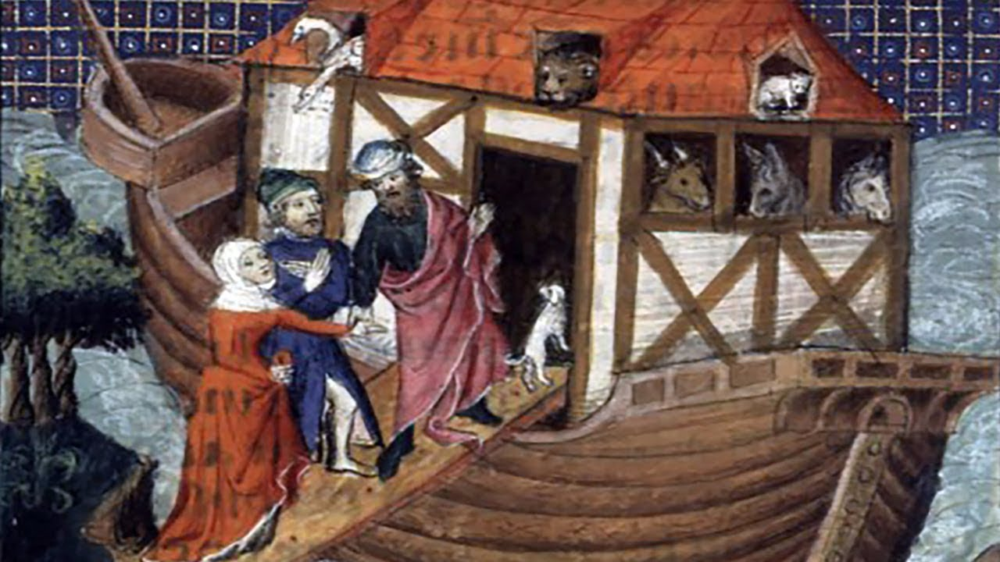

# **Biblical Series VII: Walking with God: Noah and the Flood**  

by Dr. Jordan Peterson

*Keywords: Noah, Covenant, Obedience, Flood, Faith*

## Section I

Thank you. I looked today, and these lectures have now been viewed a million times. That’s pretty amazing—or they’ve been glanced at a million times. That’s also possible. All right. Let’s get right into it. Last week, I think, was mostly remarkable for the absolute dearth of content that was actually Biblically related. I’ll just recap what I laid out so that it sets the frame properly for what we’re going to discuss tonight.I presented you with an elaborated description of this diagram, essentially, which I spent quite a bit of time formulating—probably about 25 years ago, I guess, which kind of accounts for its graphic primitiveness. I was really pushing the limits of my 486 computer to produce that, I can tell you. It’s a representation of the archetypal circumstances of life. The archetypal circumstances are the circumstances that are true under all conditions for all time. So you can think about them as descriptively characteristic of the nature of human experience. That’s not exactly the same as the nature of reality, because you can divide reality into its subjective and objective elements. There’s utility in doing that. But these sorts of representations don’t play that game. They consider human experience as constitutive of reality. That’s how we experience it, and so we’ll just go with that.

The idea, basically, is that we always exist inside a damaged structure. That structure is partly biological and partly sociocultural. It’s partly what’s been handed to us by our ancestors, both practically, in terms of infrastructure, and psychologically, in terms of the active, learned content of our psyches. That would include, for example, our ability to utilize language, the words that we use, the phrases that we use, and the mutual understanding that we developed as a consequence of interacting with each other. Archetypally speaking, that structure’s always dead and corrupt. The reason it’s dead is because it was made by people who are dead. The reason it’s corrupt is because things fall apart of their own accord. The fact that people don’t aim properly, let’s say, speeds along that process of degeneration. What that means is that young people always have a reason to be upset and cynical about the current state of affairs. It’s forever that way.

It’s useful, I think, to consider such conceptualizations as the patriarchy in that light. It’s an archetypal truth that the social structure is corrupt and incomplete. What that means is that it’s something that you have to contend with in every moment of your life. It’s a permanent fact of existence, and to be upset that the social structures—or even the biological structures—within which we live are incomplete and imperfect, and to take that personally…That’s the worst part of it. To take that personally is to misread the existential condition of humankind.

It’s always the case that what you have been given, and what you live in, is degenerate, corrupt, and in need of repair. It’s easier to just accept that, because there’s also a positive element. The positive element is, well, you’ve been granted something, rather than nothing, and maybe you haven’t been granted pure hell. There’s room for gratitude, especially in a country like ours, where many things actually function quite well. Even if it’s a broken machine, it’s not one that’s completely devastated, and it’s not absolutely hellbent, at every second, on your misery and destruction. It easily could be. Many societies are like that. The fact that we happen to live in one that isn’t corrupt beyond imagining is something to be eternally grateful for.So we live inside a damaged structure. We also bear responsibility for that damage, because we don’t do everything we can to constantly repair it. People say, what’s the meaning of life? What they really mean is, what’s the positive meaning of life? Because—as we’ve already discussed—the negative meanings of life are more or less self-evident. Well, the positive meaning of life is to be found in noting the state of lack of repair of the walled city that you inhabit, and then sallying forth to do something about that—to repair the breaches, fix up the walls, and to make the structure that you inhabit as secure and as productive as it possibly can be.

There’s no shortage of opportunities to do that. You can do that in your own mind; you can do that in your own room; you can do that in your own household; you can do that in your own local community. Maybe, if you get good at doing that at all those levels, you can start to look beyond that. There’s challenges. That’s the thing that’s kind of interesting about this insufficient structure: it has a set of challenges built into it, because of its insufficiency, and, perhaps, even because of its corrupt nature. It calls forth the potential response from you of heroic adventure. Heroic adventure is to man the barricades and repair the city. You can always do that. It doesn’t matter what your personal circumstances are. There’s always something that isn’t right near you—that isn’t correct or laid out properly—that you could just fix, if you wanted to.

One of the things that we’re going to talk about tonight is the idea that, if you adopt an attitude that’s like that, the rule that you should play is to make things better, wherever you are, however you can. What would actually happen would be that things would get better, wherever you are, in all sorts of ways. We’ve really, as a species, you might say—or even as singular individuals—explored that rarely. It isn’t something that’s put forth as a proposition that often. It’s quite surprising to me.

I had an interesting experience the other day. I went to The Keg. I go there because I have food allergies, and they’re very careful with people who have food allergies. The waiter took me to the table. He said that he’d been watching my lectures. That’s a very common experience. He said that he’d had two promotions at The Keg in the past four months because he’d been watching my lectures. I really found that an affecting experience. You might say, well, he’s working as a waiter at The Keg, and there’s nothing particularly heroic about that. I disagree with that, actually, because I don’t care where you’re located.

You can do a hell of a job. I mean that literally. You can take whatever job you have and make it a real nice little piece of absolute misery. Or you can act like a civilized human being and notice that, no matter where you are, there’s a richness and a complexity that’s completely inexhaustible, right at hand. And then you can take that seriously. You can say, well, I happen to be a waiter at The Keg. Perhaps that’s not what I expected—and he’s a young guy—and perhaps that’s not where I want to end up, but it’s not nothing. It’s a rich environment, and I can make it a lot better, if I want to. I can get along properly with my coworkers, and not gossip behind their back. I can treat my customers properly. And if an opportunity comes my way, I can take it, and I can see what happens.

He said that’s what he started doing. Things were working out much better for him. He was in a much better job than he was three months ago. In three months; that’s nothing. That’s a nice trajectory. It’s an uphill trajectory. That’s what you want, really. An uphill trajectory’s actually better than being somewhere good, as far as I’m concerned. One of the things that really makes your life meaningful is the clear realization that you’re heading somewhere better than where you are now. And then it’s even better if you also understand that there’s a direct causal relationship between the things that you’re doing and the steepness of that incline.

I get a lot of letters from people like that. They are most frequently young men, although not always. They say, I’ve been listening to these lectures, and I’ve decided that I’m going to try to take responsibility for my life. I started to stop doing all the stupid things that I know are stupid and that I shouldn’t be doing. I’ve started doing some of the things that aren’t stupid that I know I should be doing. It seems pretty obvious, really, if you think about it. But, obvious though it may be, that isn’t necessarily what people do. And then they write and say, you can’t believe what difference that makes. They’re thrilled about it, and so I’m thrilled about it.

I really don’t experience anything that’s better than a letter like that or a message like that. It’s so good to see things that aren’t so good replaced by something better. I truly believe it’s an open question: to what degree could we make things better if that’s what we actually aimed at doing? In some of the stories that we’ve covered already—the story of Cain and Abel, in particular—there is really an analysis of that problem, which is so remarkable. It occurs so early in this document. It’s such a foundational story. It basically says that there’s two modes of being in the world: there’s one where you adopt the responsibility for being properly, and you make the sacrifices necessary for doing that. Then everything will flourish properly. The other one is a pathway of resentment, bitterness, rejection, murder, and genocide. And that just seems exactly right to me.

Carl Jung once said that modern people didn’t see God because they didn’t look low enough. That’s a phrase that I really, really like. People denigrate the opportunities that are right in front of them. There’s no reason to do that. What’s right in front of you is the majesty of being. That’s what’s right in front of you. It’s inexhaustibly complex and full of potential. There’s no reason to assume that wherever you happen to be isn’t as a good of a starting place as anywhere else. I know some people have terrible, terrible lives. They are in situations that are absolutely unbearable. But I also do know that even situations like that can be made a hell of a lot worse by the worst kind of attitude. That’s for sure.That’s where you are. You’re in a damaged structure—you are a damaged structure. But at least it’s got some walls. You’re not being fed to the lions on a regular basis. That’s a good thing. You can emerge forward heroically, magically to confront the chaos that constantly threatens the structure within which you live. You can free something as a consequence of that. You can learn something; you can strengthen yourself. That’s the other thing: what informs you, and what you’re made of, is what you encounter when you voluntarily encounter the unknown. The more you voluntarily encounter the unknown, the more you get made of. The more you get made of, the more there is to you. And the more you’re good at encountering the unknown, restructuring order, and calling forth proper order out of the potential of being…God, you got to think, why wouldn’t you do that, since you can do that?

It’s an endless mystery. It’s also encapsulated, to some degree, in the story of Adam and Eve. What happens to Adam is that he becomes self-conscious and ashamed of himself. He regards himself as a lowly sort of creature. There’s endless reasons why people would do that. We’re rife with imperfection, and so Adam hides from God. I think that’s actually the answer to the conundrum: people don’t aspire to the highest good because they’re deeply ashamed of themselves, their weaknesses, and their insufficiencies. That’s not the only reason. There’s the desire to avoid responsibility, and there’s all the negative motivations, as well, like resentment, hatred, and the desire to make things worse. I don’t want to give us too much of a break. It’s something like that. But it’s ok to not be in a very good place if what you’re trying to do with that not very good place is to make it better.

One of the things that I really have learned as a clinical psychologist is that you just could not believe how powerful incremental progress is. You can do the calculations. It’s like compound interest. If you make your life a tenth of a percent better a week…Man, in two or three years, you’re in such a better place than where you were that it isn’t even like the same domain. If you keep that up for ten or twenty years—especially if you’re young, start to straighten yourself out early, and start to fix the things that you can fix—you can transform your lives in ways that are completely unimaginable. God only knows what the upper limit of that is in terms of human possibility. We are amazing creatures when we really get our act together and stop running at 10 percent of our capacity.

So that’s what you do. The fact that things aren’t exactly the way that they should be at least gives you something to do, and maybe something great to do, because there’s no shortage of suffering and trouble that besets the world that you could conceivably ameliorate. The utility and intrinsic meaning of that is self-evident. It also makes me curious about nihilism, for example, and despair. I understand those emotions. I understand them deeply, and the intellectual mindset that goes along with it. But they just seem beside the point, in some sense, because there are so many things that need doing that all you really have to do is open your eyes, look at them, and then decide that you’re actually going to do something about them. You might think, well, what’s within my scope of influence is so trivial that it’s not wroth doing. It’s like, it won’t stay trivial for long if you do it. Not at all, and I don’t think it’s trivial to begin with. I really don’t believe that anything done right is trivial.

My experience, in my life, has been that anything that I actually did paid off. It didn’t pay off necessarily in the way that I expected it to pay off. That’s a whole different story. But if it was genuine commitment to do something, even if it went sideways and the outcome was really something other than what I expected, the net consequence, over time, was nothing but good. Every new frontier that can be conquered is an advance forward, and there’s no shortage of frontier. We’re surrounded by the unknown. We’re surrounded by our own ignorance. We can continually move into the domain of chaos—or we can restructure pathological order. That’s the secret to proper being.

So then you encounter chaos, and then you can regard yourself as the sort of entity that, despite its insufficiency, has the capability to conquer chaos—despite the danger of that. That’s the other thing. The fact that you’re fragile is actually a precondition for your heroism. If you weren’t fragile, there wouldn’t be anything heroic about doing something difficult, right? If you couldn’t be hurt, damaged, defeated, or end up in failure, then where’s the moral courage in the endeavour? It has to be that the fragility is built into the courage. It’s not a reason not to engage in it, at all. In fact, quite the contrary.So what do you do? Well, you put the city back together, and maybe the way you want it, so it’s functional, efficient, and beautiful, and so that people can flourish in a manner that makes them feel that the unbearable catastrophe of being is worth it for the experience. That’s what you’re aiming at. It’s not an impossibility. And then, not only do you repair the city when you do that, but you make yourself the sort of thing that continually repairs the city. That’s even better. That’s the end goal. It’s not the repair of the city that’s the goal: it’s the transformation of yourself into the thing that continually repairs the city. There’s just no reason for that not to happen. The more it can happen, the better.

There’s an undercurrent to the story of the flood, and that’s the fact that the city can become corrupt, and that’s because people don’t engage in heroic endeavour—or, perhaps, because they engage in precisely the opposite of that, which is outright destructive behaviour. This is also something that’s worth considering, too. If you consider your own manner of being, you can say things to people, such as, tell the truth and be good. Those are cliches, obviously, and so they lack power. But you can take them apart,and utilize them in a manner that stops being a cliche. You do that by being more humble about them, I would say.

Maybe you can’t tell the truth because you don’t know what the truth is. But one thing you can do is to stop saying things that you know to be untrue. You might say, well, how do I know that they’re untrue? Well, you need a whole elaboration of a philosophy of truth to answer that question. We’re not going to bother with that question, because, at the moment, it’s beside the point. That isn’t the issue. The issue is that there are times in your life where you know that the thing that you’re saying is not true. It’s a deception. It’s a lie of some sort, and you’re using it to manipulate yourself, another person, or the world. You’re also fully possessed by the idea that you can get away with it.

There’s a Satanic arrogance about that. In fact, that is the archetypal arrogance that’s portrayed in the mythological character of Satan. Satan is precisely the archetype of the element of the mind that believes it can twist and bend the structure of reality without paying the price. You can’t imagine anything that’s more arrogant than that. You really think that you can twist the structure of reality? And that that’s going to work out for you, without it snapping back? It’s so obvious that that can’t work that everyone knows it.

Anyways, back to the initial point. You know, by the rules of the game that you yourself are playing, that, some of the time, you’re violating the rules of the game that you’re playing. The first issue with regards to, say, stating the truth or behaving in a responsible manner would be merely to stop cheating at whatever game it is that you’ve chosen to play. That’s a good start. That’ll straighten out your life.

## Section II

[TIMESTAMP](https://youtu.be/6gFjB9FTN58?t=1291)

Well, how does the flood tie into this? We live in a corrupt structure, and we’re corrupt as individuals. Part of that corruption is just happenstance. It’s the way things fall apart. But the other part of it is that, not only are we not aiming up, but we’re actually aiming down. The flood story’s a warning, and it’s a very clear warning. The warning is that, if you aim down enough, and then if enough of you aim down at the same time, everything will degenerate into something that’s indistinguishable from the chaos from which things emerge at the beginning of time. It’s something like that.

The cosmos that’s presented in mythological representations is chaos versus order. The order is on top, you might say, and the chaos is always underneath. The chaos can break through, or the order can crumble, and you can fall into the chaos. That chaos is intermingled potential. The way that you destroy the order and let the chaos rise back up—which is exactly how it’s portrayed in the flood story—is by inhabiting the corpse of your father and feeding on the remains with no gratitude and no attempt to replenish what it is that you’re taking from it.
That’s one mythological motif.

The warning in the flood story is, don’t do that for very long, because things will happen that are so awful that you cannot possibly imagine it. That’ll happen to you personally; it’ll happen to your family; it’ll happen to your community, and it’s happened to people over and over throughout history. It’s quite interesting. It’s very soon after the story of Cain and Abel when you see evil enter the world. In the story of Adam and Eve, along with self-consciousness, the evil, there, is the knowledge of good and evil; that’s the ability to self-consciously hurt other people. Of course, instantly, Cain takes that to the absolute extreme. He uses that capacity to destroy, really, what he loves best. He gets as close as a human being can to destroying the divine ideal. Of course, his brother is Abel, and Abel is favoured by God. Cain destroys him. Cain tells God at the end of that episode that his punishment is more than he can bear. I think the reason for that is, where are you when you destroy your own ideal? What’s left for you? There’s nowhere to go. There’s no up, and when there’s no up, there’s a lot of down.

There’s an idea that was put forth very nicely in Milton’s [Paradise Lost](https://en.wikipedia.org/wiki/Paradise_Lost) when he was describing, from a psychological perspective, essentially what hell is: you’re in hell to the degree that you’re distant from the good. That might be a good way of thinking about it. If you destroy your own ideal—which you do with jealousy, resentment, and the desire to pull down people that you would like to be—then you end up in a situation that’s indistinguishable from hell. The way the Biblical story unfolds is, well, it’s Cain, and then it’s the flood. Cain adopts this mode of being that’s antithetical to being itself—at least to positive being itself. He does it knowing full well what he’s doing. The net consequence of that, as it ripples through the entire social structure, is that God stands back and says, this whole thing has got so bad that the only thing we can do is wipe it to the ground. That is no joke. That’s exactly how things work.

One of the things that’s extraordinarily terrifying about that sequence of stories—and I believe this to be true. I think I realized this independently of any of the analysis that I was doing of mythological stories. I looked at what happened in places like the Soviet Union, Maoist China, and Nazi Germany. The most penetrating observers of those societies, the people who were most interested in how it was that those absolute catastrophes came about, all said the same thing: it was rooted in the degeneration of the individuals who made up the society. You hear that people were following orders. No; that explanation doesn’t hold water. You hear that you would be punished if you resisted. There was some truth in that, but nowhere near as much as people might think, especially at the beginnings of the process. It was more that people decided—each and every one of them—to turn a blind eye to the catastrophes and to participate in the lies. That warped entire societies, and they veered their way downward to something as closely approximating hell as you could manage, especially in places like Nazi Germany and, well, in all three of those places.

One of the things that’s so frightening about the stories in Genesis is that they say something very clear: your moral degeneration contributes in no small way to the degeneration of the entire cosmos. You say, well, I would like my life to be meaningful. People say that. Really? Would you really like your life to be meaningful? You’d think people would trade a little nihilism for not having to face that particular realization. I think people do that all the time. It’s a terrible weight to realize. But we are networked together. That’s the vulnerability that’s associated with our intense capacity to communicate. It’s certainly possible that the ripples of our individual actions have consequences that are far beyond the limits of our immediate consciousness. I also think that people know that, too. They know that in the way that people know things when they don’t want to know them, which means they know them embodied; they can feel them; they can sense them; they have an emotional response to them, but there’s no damn way they’re going to let them become articulated, because they don’t want to know. When you’re feeling guilty and ashamed about the things you’ve done or not done—I know that can get out of hand, as well—it’s often because there is a crooked little part of you that’s aiming at the worst possible outcome.

One of the things Jung said about the [shadow](https://en.wikipedia.org/wiki/Shadow_(psychology))—Jung’s famous idea that everyone has a dark side, and that that dark side needs to be incorporated and made conscious—was that the shadow of the human being reaches all the way to hell. That’s the thing that’s so interesting about reading Carl Jung: he actually means what he says. It’s not a metaphor. The part of you that’s twisted against being is aligned with the part of the conscious cosmos, let’s say, that’s aiming at making everything as terrible as it can possibly be.

It’s a terrible shock to realize that. That’s partly why people don’t realize it. It’s something that people keep at an arm’s length. It’s the same as recognizing yourself as a Nazi concentration camp guard, which is a very useful exercise. There’s absolutely no reason why you couldn’t have been or still could be one. And if you think otherwise, all the more reason for assuming that you would be unable to resist the temptation if it was, in fact, offered to you. And if you don’t think it’s a temptation, then there’s so much that you don’t know about human beings that you’re not even in the game. If it wasn’t a temptation, then people bloody well wouldn’t have done it. Plenty of people did it, and it’s no wonder.

So things get serious in Genesis very, very rapidly. The depth of the seriousness is ultimate—archetypal. It gets as serious as it can get. The story of Noah and the flood opens in a fragmentary manner. I believe that these passages are a part of a longer story that we only have bits and pieces of, and also that it’s part of more than one story."And it came to pass, when men began to multiply on the face of the earth, and daughters were born unto them, that the sons of God saw the daughters of men that they were fair; and they took them wives of all which they chose."

There’s two ways of looking at the past. You can kind of see that in the political landscape that we inhabit. On the more conservative end of the spectrum, people regard the past as the land of giants. There were heroes of the past, who established the current conditions that we exist in. The people on the left are more concerned, perhaps, with a lineage of corruption that’s come down through the centuries. Both of those perspectives are accurate. You can say, well, there were the great heroes of the past, who established our modes of being. You can think of them as composite beings, if you want. It’s a perfectly reasonable way of thinking about it. You can also think of the accumulation of corruption and evil that’s come along the centuries, as well. You see both of those reflected in these initial few lines: "that the sons of God"—so those are the heroes—"saw the daughters of men that they were fair; and they took them wives of all which they chose".And then this statement comes in as somewhat of a non sequitur: "And the Lord said, My spirit shall not always strive with man, for that he also is flesh: yet his days shall be an hundred and twenty years."

I looked at a variety of interpretations of that line, because it doesn’t seem to follow so clearly from the previous line. Exactly what it means isn’t obvious. The first line talks about the heroes of the past. The seconds lines says, wait a second; there’s something corrupt about the human mode of being. One of the consequences of that, as far as God is concerned, is that there are conditions under which the divine spirit will not strive with man. What that means is that the divine impulse towards good will abandon you because of things that you’ve done.The secondary consideration, here, is that, perhaps, because of the degeneration of people, it’s not so obvious that our lifespans are limited—that the spirit that inhabits us will only do so for a limited amount of time. That’s tangled, in a strange way, in with the idea of human moral culpability. That’s posed against the notion of the giants of the past. And then the narrative returns to the giant idea, and reads: "There were giants in the earth in those days; and also after that, when the sons of God came in unto the daughters of men, and they bare children to them, the same became mighty men which were of old, men of renown."

That’s the end of that sequence of fragments. It’s very broken. But you can see a dual narrative underneath it. One of the narratives is that there’s the kind of corruption, lurking—despite the nature of the giants of the past—that would cause God to withhold his grace and allow men to deteriorate. That sets the stage for Noah and the flood."And God saw that the wickedness of man was great in the earth, and that every imagination of the thoughts of his heart was only evil continually."

One of the things I really didn’t like about going to church when I was kid—I went to a pretty moderate church. It was the United Church, which is hardly even become a church now. It’s so moderate, so to speak. One of the things I didn’t like was the constant harping by the ministry on the sinful nature of human beings. It didn’t speak to me properly, partly because I really didn’t understand what it meant, and partly because it seemed sort of self-flagellating in an unattractive way. I don’t know if there is an attractive way to be self-flagellating. There was something about it that was also rote and fake that I didn’t like. But, you know, I thought about that more in later years. I started to understand that there was some real utility in asking people to keep the evil that they’re doing clear and conscious in the forefront of their imagination.

I think I mentioned to you guys last week this little episode from what we know of Mesopotamian culture, surrounding the emperor and the New Year’s festival. They would take the emperor outside of the walled city and strip him of his garb, so that he was reduced to just an ordinary man. And then they would humiliate him ritually and ask him how it was that, over the last year, he wasn’t a spectacular embodiment of [Marduk](https://en.wikipedia.org/wiki/Marduk). Marduk was the Mesopotamian deity who made order out of chaos, essentially. The emperor was supposed to sit and think, well, ok, I’m emperor. I should be doing a good job. Maybe I should even be doing a great job. But, probably, I’m coming up short in a bunch of ways, and that actually happens to be important, as I’m running the entire show. I should be very, very cognizant of how I’m failing to live up to the ideal.

That is the constant clarion call—that’s degenerate, I would say—in institutional Christianity. That was actually the idea: look, theres a bunch of ways that you’re not being everything you could be. It’s not supposed to be a whip, or to knock you down. Although, maybe it’s a whip to knock down your pride—pride that stops you from being aware of your insufficiencies. It’s more like a call to the opposite. It’s like, well, you should stop doing those things. You could be so much more than you are. That would be so much better for you and everyone else that it’s just not good that you continue breaking your own rules, let’s say.

## Section III

[TIMESTAMP](https://youtu.be/6gFjB9FTN58?t=2161)

As I said, we could start this game by assuming that you should at least play the game that you’re playing straight. And it is the case that, if you watch yourself…It’s a terrifying thing to do, but if you watch yourself, you’ll see that you lie a lot. When I learned this, to begin with, I was in my 20s. I’m a smart person, and I was very proud of that. I was also a small person, and I was moved ahead one year in school, so I was a very small person in my classes. I was also very mouthy—which might not come as much of a surprise—and somewhat provocative. I got pushed around a fair bit—because everyone gets pushed around—and my weapon was to be mouthy. It was a fairly effective weapon, although it tended to backfire. If you’re effectively mouthy with large, obnoxious people, then they tend to respond in a relatively negative, physical way. That sort of thing was happening to me a fair bit. But I was quite proud of the fact that I had some intellectual power.

It was then, in my 20s, when I learned about some of the danger of that. I started to read Milton’s Paradise Lost. I started to understand the danger of the intellect. The danger of the intellect, as far as I can tell, is that it tends towards pride and arrogance. It also tends to fall in love with its own productions. In Paradise Lost, that’s Lucifer. Lucifer is the intellect that falls in love with its own productions, and then presumes that there’s nothing outside of what it thinks. That’s the totalitarian mentality: We have a total system, and we know how everything works. We are going to implement it, and that will bring about heaven on earth. That’s associated with intellectual arrogance.

At the same time, another thing was happening to me. I was noticing my intellectual arrogance, and I started to understand what that meant. I also started to understand that there was more to life than the intellect—much more. I smoked too much, and I drank too much, and I weighed like 130 pounds. I wasn’t in good physical shape. I had a lot of things to do, when I went to graduate school, to put myself together. At the same time, I was trying to understand why things had gone so crazily wrong with the world—its encapsulation in the Cold War, and what role I might be playing in that—if any—and what role any of us were playing in that. At the same time, I was working at a prison, only a little bit. I worked with this crazy psychologist. He used to put jokes on his multiple choice tests. He was a really eccentric guy. I really liked his courses. He taught a course on creativity, and he was also a prison psychologist. He was an eccentric guy. For some reason, he liked me—maybe because I was eccentric, too. He invited me to go out to the Edmonton maximum security prison with him a couple of times, which I did. That was a very interesting experience. I was trying to figure out what role each individual’s behaviour bore to the pathology of the group. It was something like that.

I went out to the prison, and I met a little guy, smaller than me. I was a little bigger by then. He was a pretty innocuous guy. The prison looked like a high school—which is really quite telling, in my estimation—and I was out in the gymnasium. There were all these monsters in there, weightlifting. I remember one guy, who was tattooed everywhere. He had a huge scar running down the middle of his chest. It looked like somebody had hit him with an axe. I was in there, and I had this weird cape that I used to wear, that I’d bought in Portugal, and some boots to go along with it. Yeah…It was like a 1890s Sherlock Holmes cape. It was from the 1890s, because this little village was up on a hill. It was a walled city on a hill, and they sold these things. I don’t think they’d changed the style since 1890, so I though they were really cool. So I was wearing that, which wasn’t, perhaps, the most conservative garb to don if you’re going to go to a maximum security prison.

Anyways, I was in the gymnasium, and the psychologist left. God only knows…I mean, that’s what he was like. All these guys came around me, and they were offering to trade their prison clothes for my cape. I was being made an offer I couldn’t refuse. I didn’t really know what to do. And then this little guy said something like, the psychologist sent me to come and take you away, or something like that. And so I thought, well, better this little guy than all these monsters.

We went outside the gym, into the exercise yard. We were wandering around, and he was talking to me, and he seemed like a kind of innocuous guy. And then the psychologist showed up at the door and motioned us back, which was kind of a relief. I went into his office. He said, you know that guy that you walked out in the yard with? I said, yeah. He said, one night he took two cops and had them kneel down. While they were begging for their lives, he shot them both in the back of the head. I thought, hmph…

See, the thing that was so interesting was that he was so innocuous, right? What you’d hope is that someone like that would be very much unlike you, let’s say, and certainly wouldn’t be like someone innocuous that you’d met. What you’d want is that the guy would be like half werewolf and half vampire, so you could just tell right away that he was a coldblooded killer. But no. He was this sort of ineffectual, little guy, who was certainly not ineffectual if you gave him a revolver and the upper hand.

That made me think a lot about the relationship between being innocuous and being dangerous. Another thing happened—I met another guy out there. A week or two later, I heard that he and a friend of his had held another guy down and pulverized his left leg with a lead pipe. The reason for that was that they thought that he was a snitch, and maybe he was. That time, I did something different. Instead of being shocked and horrified by that—although I certainly was—I thought, how in the world could you do that? Because I didn’t think I could do that. I thought that there as a qualitative distinction between me and those people. I spent about two weeks trying to see if I could figure out under what conditions I could do that—what kind of psychological transformation I would have to undergo to be able to do that. That was a meditative exercise, let’s say. It only took about 10 days for me to realize that not only could I do that, but that it would be a hell of a lot easier than I had thought it would be. That’s sort of where that wall between me and what Jung described as the shadow started to fall apart. That, also, was very useful; I started to treat myself as a somewhat different entity.

I thought I was a good guy, and there’s no reason for me to think that. You’re not a good guy unless you really made a bloody effort to be a good guy. You’re just not. It’s not easy. And so you’re probably a moderately bad guy. That’s a long ways from being an absolutely horrible guy, but it’s also a long ways from being a good guy. But I had a little more respect for myself after that, because I also understood that there was a monstrous element to the human psyche that you needed to respect, and that was part of you. And I understood that you should regard yourself, in some sense, as a loaded weapon. It’s very useful to regard yourself as a loaded weapon around children, because, around children, you are a loaded weapon. The terrible experiences that many children have with their parents are testament to that.

Anyways, at about the same time—and I don’t exactly know how these things were causally related. I guess it was because I was trying to figure out who I was and how that could be fixed. Something like that. I started to pay very careful attention to what I was saying. I don’t know if that happened voluntarily or involuntarily, but I could feel a sort of split developing in my psyche. I’ve actually had students tell me that the same thing has happened to them after they’ve listened to some of the material that I’ve been describing to all of you. But I split into two, let’s say.

One part was the old me that was talking a lot, that liked to argue, and that liked ideas. There was another part that was watching that part, just with its eyes opened, and neutrally judging. The part that was neutrally judging was watching the part that was talking, and going, that wasn’t your idea; you don’t really believe that; you don’t really know what you’re talking about; that isn’t true. I thought, hm! That’s really interesting! That was happening to like 95 percent of what I was saying, and then I didn’t really know what to do. I thought, ok, this is strange. Maybe I fragmented, and that’s just not a good thing, at all. It’s not like I was hearing voices, or anything like that. It wasn’t like that. People have multiple parts.

So then I had this weird conundrum: which of these two things are me? Is it the part that’s listening and saying, no, that’s rubbish; that’s a lie; you’re doing that to impress people; you’re just trying to win the argument. Was that me? Or was I the part that was going about its normal, verbal business? I didn’t know, but I decided that I would go with the critic. And then what I tried to do—what I learned to do, I think—was to stop saying things that made me weak. I mean, I’m still trying to do that. I’m always feeling, when I talk, whether or not the words that I am saying are making me align or making me come apart. I really do think that the alignment is the right way to conceptualize it, because if you say things as true as you can say them, then they come out of the depths inside of you. We don’t know where thoughts come from. We don’t know how far down into your substructure the thoughts emerge. We don’t know what process of physiological alignment is necessary for you to speak from the core of your being. We don’t understand any of that—we don’t even conceptualize that. But I believe that you can feel that.

I learned some of that by reading [Carl Rogers](https://en.wikipedia.org/wiki/Carl_Rogers), who’s a great clinician. He talked about mental health, in part, as the coherence between the spiritual—or the abstract—and the physical—that the two things were aligned. There’s a lot of ideas of alignment in psychoanalytic and clinical thinking. But, anyways, I decided that I would start practicing not saying things that would make me weak. What happened was that I had to stop saying almost everything that I was saying—95 percent of it. That’s a hell of a shock—this was over a few months—to wake up and realize that you’re mostly deadwood. It’s a shock. You might think, well, do you really want all of that to burn off? Well, there’s nothing left but a little husk—5 percent of you. Well, if that 5 percent is solid, then maybe that’s exactly what you want to have happen.I told you that story’s an elaboration of this line: "And God saw that the wickedness of man was great in the earth, and that every imagination of the thoughts of his heart was only evil continually." It’s a question worth asking: just exactly what are your motives? Well, maybe they’re purer than mine were, and it’s certainly possible. I don’t think that I’m naturally a particularly good person. I think I have to work at it very, very hard. I don’t necessarily think that everyone is like that. But some people are worse than that, and everyone’s like that, to some degree.

So it’s worth thinking about: just how much trouble are you trying to cause? The other thing you might think about is, if you’re not doing something important with your life, by your own definition—because that’s the game that we’re playing, and you get to define the terms, at least initially—maybe you’re prone to cause trouble, just because you don’t have anything better to do. Trouble is more interesting than boring. That’s something you learn if you read Dostoevsky. Dostoevsky knew that extraordinarily well. And so if you’re not pushing yourself to the limits of your capacity, then you have plenty of leftover willpower, energy, and resources to devote to causing interesting trouble. I would also say that this is an archetypal scenario: "And God saw that the wickedness of man was great in the earth, and that every imagination of the thoughts of his heart was only evil continually." That’s something to meditate on.

It’s not self-destructive, because it’s like the diagnosis of an illness. It’s like, if that does happen to be the case for you, to some degree—maybe it’s only 10 percent of you, or maybe it’s 90 percent—well, then coming to terms with that is excellent, because, maybe, you can stop doing it. What would be the downside to that? You’d have to give up your resentment, hatred, and all of that, obviously. That’s annoying, because those emotions are easy to engage in, and they’re engaging, and they have a feeling of self-righteousness with them. But you’re not doing this to put yourself down: you’re doing this to separate the wheat from the chaff and to leave everything that you don’t have to be, behind."And it repented the Lord that he had made man on the earth, and it grieved him at his heart. And the Lord said, I will destroy man whom I have created from the face of the earth; both man, and beast, and the creeping thing, and the fowls of the air; for it repenteth me that I have made them."

What’s the idea? Well, the idea is that the cosmos that God created had become corrupt. That’s a funny thing about Genesis that always hits me, is that that’s also true. I told you that the Mesopotamians believed that human beings were made out of the blood of [Kingu](https://en.wikipedia.org/wiki/Kingu), who was the worst monster that the dragon of chaos could imagine. That’s a pretty harsh diagnosis. But the reason the Mesopotamians believed that is because they knew—as did the authors of Genesis—that human beings are the only creatures in the cosmos of being who are actually capable of conscious deceit and malevolence. The question is, to what degree does the expression of that conscious deceit and malevolence corrupt things so badly that it would be better that they didn’t exist at all?

There’s a story associated with a flood in the [Epic of Gilgamesh](https://en.wikipedia.org/wiki/Epic_of_Gilgamesh) that has exactly the same underlying narrative structure. In fact, some people think that the story of Noah was derived from it. The Gods, who repented of their creation, determined that erasing it would be better than allowing it to propagate. You see the same thing in the Mesopotamian creation myth, the [Enuma Elis](https://en.wikipedia.org/wiki/En%C3%BBma_Eli%C5%A1). The early Gods, who are representative of the giants of humanity, I would say, make so much noise, and are so careless, that the original creator God, Tiamat, decides to wipe them from the face of the earth.

When you read something like this, if you read it from an informed, historical perspective, it starts to have a depth that makes it transcend this archaic and fairytale-like element of the story. I’ve read some very terrible things about what happened in Nazi Germany, and what happened when the Japanese invaded China, and just what happened generally in the history of mankind. Things can get so bad that it takes the imagination of a very bad person to conceptualize them. When they get that bad, this is the only kind of language that works to describe them.

That’s another thing that I’ve discovered by working with my clinical clients: when their lives are really not going well—when they’re close to suicide, or when they’re close to homicide, or when there are things going on in the family that are so corrupt and terrible that they reach back generations and are aimed at nothing but misery and destruction—the only language that suffices has a religious tone. There’s nothing else available to describe what’s happening with the proper level of seriousness. It might be that you’ve never encountered a situation that required that level of seriousness. But that doesn’t mean that those situations don’t exist. They exist. You generally do everything you can to avoid being ensconced in them, but they certainly do exist. The probability that you’ll encounter a situation like that, or two, at some point in your life is extraordinarily high. You’ll tangle with someone who’s malevolent right to the core, and maybe it’ll be you that is malevolent. That’ll be a big shock. And then these poetic descriptors start to become much more real."But Noah found grace in the eyes of the Lord. These are the generations of Noah: Noah was a just man and perfect in his generations, And Noah walked with God."

That’s an interesting line. If you remember back in the story of Adam and Eve, what happened to Adam—once he ate of the fruit of the tree of the knowledge of good and evil, woke up, the scales fell from his eyes, he became self-conscious, and he developed the knowledge of good and evil—is that he won’t walk with God when God calls him in the garden. And so Noah is Adam without the fall, essentially. There’s something that Noah’s doing right, that motivates God to spare him—or maybe to show him a pathway through the emerging chaos. Something like that. That’s worth thinking about, a lot.

There will be situations in your life where what you face is the emergent chaos. Maybe that will be some terrible catastrophe inside your family, or maybe it will be something that’s occurring on a much broader social level, but chaos is coming. Unless you want to be a denizen of the chaos, or even a contributor to it—and perhaps that is what you want; many people under those circumstances choose that—what you’re going to want to know is how to build an ark and get through it. If you’re interested in life, and if you’re interested in proper being, and if you’re disinclined to produce any more suffering than necessary, then you want to know how to conduct yourself when the catastrophe comes, so that you have a reasonable possibility of moving through it and starting anew.

When this old story says, well, God’s not happy, and he’s going to wipe everything out, it’s like, you might want to take that seriously. And then when it says, but there was one person who had a mode of being that protected him from that, that’s also something that you might want to take seriously. You might want to know what that being is—you might need to use it. These sorts of things are practical in the deepest possible sense. They’re real in the deepest possible sense, and practical in the deepest practical sense. So Noah walked with God.

## Section IV

[TIMESTAMP](https://youtu.be/6gFjB9FTN58?t=3414)

I’m going to switch way ahead, here. I said at the beginning of the lecture series that the Bible is a hyperlinked text, and everything refers to everything else. There’s utility in reading it in linear order, but it’s not a linear document. There’s an infinite number of pathways that you can use to walk through it. All of the document expands upon and refers to all of the rest of the document. And so I’m going to switch to the [Sermon on the Mount](https://en.wikipedia.org/wiki/Sermon_on_the_Mount), which I think is probably the key document in the New Testament. I’m going to switch to it because I think it’s the closest thing we have to a fully articulated description of what it would mean to walk with God, so that you’re in the ark when the flood comes. It’s the most fully articulated realization of that idea that leaps out of the metaphorical. If I say, well, you should conduct yourself like Noah, walk with God, and build an ark, obviously those are poetic and metaphorical suggestions. It’s not that easy to bring them into practice. There’s a big distance between you and the archetype. It isn’t obvious how to manifest it in your own life. What has to happen is the archetype has to be differentiated and articulated so that it becomes sufficiently practical and personal, so that you can actually implement it.

I’m going to take apart some of the Sermon on the Mount. It starts in Matthew 5, and I’m not going to talk about Matthew 5. I’m going to talk about the end of Matthew 6 and most of Matthew 7."Consider the lilies of the field, how they grow; they toil not, neither do they spin. And yet I say unto you, That even Solomon in all his glory was not arrayed like one of these. Wherefore, if God so clothe the grass of the field, which to day is, and to morrow is cast into the oven, shall he not much more clothe you, O ye of little faith? Therefore take no thought, saying, What shall we eat? or, What shall we drink? or, Wherewithal shall we be clothed?"Those are famous lines, and that’s sort of Christ the hippy. It’s like, hey, let it all hang out—that’s an old phrase. Do your thing, and everything will come to you. These lines have been interpreted in that manner many times. But that’s seriously not the proper interpretation, because there’s a kicker with this injunction. The kicker is this: "for your heavenly Father knoweth that ye have need of all these things. But seek ye first the kingdom of God, and his righteousness; and all these things shall be added unto you."

That’s a lot different than the hippy thing, right? There’s a very, very, very interesting idea, here. It’s certainly one of the most profound ideas that I’ve ever encountered. The idea is that, if you configure your life so that what you are genuinely doing is aiming at the highest possibly good, then the things that you need to survive and thrive on a day-to-day basis will deliver themselves to you. That’s a hypothesis, and it’s not some simple hypothesis. What it basically says is, if you dare to do the most difficult thing that you can conceptualize, your life will work out better than it will if you do anything else. Well, how are you going to find out if that’s true?

It’s a [Kierkegaardian](https://en.wikipedia.org/wiki/S%C3%B8ren_Kierkegaard) leap of faith. There’s no way you’re going to find out whether or not that’s true unless you do it. No one can tell you, either: working for someone else is no proof that it will work for you. You have to be all-in in this game. The idea is, "seek ye first the kingdom of God, and his righteousness." It’s like, that’s actually a fairly important caution when you’re talking about not having to pay attention to what you’re going to eat or what you’re going to wear. What it’s essentially saying is that those problems are trivial in comparison. The probability—if you manifest yourself properly in the world—that those things will come your way is extraordinarily high. I believe that’s exactly right. I’ve watched people operate in the world, and I would say that there is no more effective way of operating in the world than to conceptualize the highest good that you can and then strive to attain it. There’s no more practical pathway to the kind of success that you could have if you actually knew what success was. That’s what this sermon is attempting to posit.

It’s like in the story of Pinocchio. What happens at the beginning of the story of Pinocchio is that Geppetto wishes on a star. We talked about that a little bit. Geppetto aligns himself with the metaphorical manifestation of the highest good he can conceptualize. He makes a commitment, let’s say. He aims at the star. For him, the star is the possibility that he can take his creation—a puppet, whose strings are being pulled by unseen forces—and have it transform into something that’s autonomous and real. Well, that’s a hell of an ambition. We’re wise enough to put that in a children’s movie but too foolish to understand what it means.

It’s such an interesting juxtaposition that we can both know that and not know it at the same time. You can go to the movie; you can watch it, and it makes sense. But that doesn’t mean that you can go home, and think, I know what that meant. Well, people are complicated. We exist at different levels, and all of the levels don’t communicate with one another. But the movie is a hypothesis, and the hypothesis is that there is no better pathway to self-realization and the ennoblement of being than to posit the highest good that you can conceive of and commit yourself to it. And then you might also ask yourself—and this is definitely worth asking—do you really have anything better to do? And if you don’t, why would you do anything else?"Take therefore no thought for the morrow: for the morrow shall take thought for the things of itself. Sufficient unto the day is the evil thereof."

I spent a long time trying to figure out what that meant, too, because it’s not one of those lines that can easily be read as pro-grasshopper and anti-ant—you know, the old fable of the grasshopper and the ant. I’m not going to tell it, but the ant works, and the grasshopper fiddles. The ant has a pretty good time in the winter; the grasshopper dies. This is like a pro-grasshopper line, but it’s not. It says something else. It says that, if you orient yourself properly and then pay attention to what you do every day, that works. I actually think that that’s in accordance with what we have come to understand about human perception. What happens is that the world shifts itself around your aim. You’re a creature that has an aim. You have to have an aim in order to do something. You’re an aiming creature. You look at a point, and you move towards it. It’s built right into you. And so you have an aim.

Let’s say your aim is the highest possible aim. Well, that sets up the world around you. It organizes all of your perceptions, and it organizes what you see and what you don’t see; it organizes your emotions and motivations. So you organize yourself around that aim. Then what happens is that the day manifests itself as a set of challenges and problems, and if you solve them properly, then you stay on the pathway towards that aim. You can concentrate on the day. That way you get to have your cake and eat it, too, because you can point into the far distance and live in the day. It seems to me that that makes every moment of the day supercharged with meaning. If everything that you’re doing, every day, is related to the highest possible aim that you could conceptualize…Well, that’s the very definition of the meaning that would sustain your life.

Back to Noah. All hell’s about to break loose, and chaos is coming. When that’s happening in your life, you might want to be doing something that you regard as truly worthwhile. That’s what will keep you afloat when everything is flooded. And you don’t want to wait until the flood comes to start doing that: if your ark’s half built and you don’t have a captain, the probability is very high that you’ll drown.

"Take therefore no thought for the morrow: for the morrow shall take thought for the things of itself. Sufficient unto the day is the evil thereof." That’s not a particularly optimistic formulation."Judge not, that ye be not judged. For with what judgement yet judge, ye shall be judged: and with what measure ye mete, it shall be measured to you again."

It’s a sensible description. I wouldn’t call it a piece of advice, because I don’t think that any of this is advice: it’s a description of the structure of reality. That’s not the same as advice. It basically says that you’ll be held accountable by the rules of the game that you choose to play. That, I also think, is perfectly in keeping with the understanding of human psychology. You have to play a game that other people will allow you to play, will cooperate with you while you’re playing, and will compete with you while you’re playing it. You have a fair bit of flexibility in setting up the parameters of the game. But you don’t have any choice about whether or not you’re going to be in a game. You’re in a game, and you’re going to be held accountable by the rules of the game. That’s how the game works. You might want to pick a game by which rules you would be willing to be held accountable."And why beholdest thou the mote that is in thy brother’s eye, but considerest not the beam that is in thine own eye? Or how wilt thou say to thy brother, Let me pull out the mote out of thine eye; and, behold, a beam is in thine own eye?"

You might be wondering what a beam is. A mote is a dust speck, and a beam is a very large piece of lumber. And so the issue is not so much the blindness of others—even though there’s as much blindness among others as there is for you. The issue, here—the description, here—is that you should be concerned about what’s interfering with your own vision, first. You should leave other people the hell alone in relationship to that. And so, if your mode of being in the world is such that you want others to act better to improve things for you—or if you identify the evil and the catastrophe as something that’s outside, that someone else needs to fix, or that someone else is responsible for—then you’re not going to fix that. You’re going to remain blind to the things that you’re doing and not doing that make things not go well. And so it’s just better to think, right, I’m probably blind in many, many ways. Maybe there are some ways that I can rectify that.

It’s highly probable that you’re blind in all sorts of ways. In fact, it’s virtually certain, and so it’s just more useful to think, how is it that I’m wrong in this situation? I’ll tell you something that I learned to do when I was already with my wife, which happened frequently. When you actually communicate with people, you find out that there are many things you don’t agree on. That’s because you’re actually different creatures. If you’re actually going to have a truthful conversation, then you’re going to find out that you don’t see things the same way. Then you can either pretend that’s not the case and gloss over it, and then end up in a 30-year, silent war, or you can have the damn fight when you need to have it and see if you can straighten it out.

Now and then we would get in a situation when we were at [loggerheads](https://en.wiktionary.org/wiki/at_loggerheads#English); we couldn’t move. It would spiral up into hate speech, let’s say. Yeah. Everyone laughs, because they know they manifest plenty of hate speech towards those they love. So one of the things we learned to do was, when we hit an impasse, was to separate and go our own ways, and sit, and think, ok, we’re at this unpleasant situation. We can’t figure out how to move forward. I’d always think, of course it’s her fault. Obviously it’s her fault—at least 95 percent. But maybe there was something I did that contributed like 5 percent to it. I would sit and think, and ask myself a question: Is there anything I did in the last 6 months that increased the probability that this impasse would manifest itself? I’ll tell you, you have no idea how fast your mind will generate an answer to a question like that. There’s undoubtedly some idiotic thing that you did, that you know, that you remember, that increased the probability that you’re going to have your hands around the throat of the person that you love. And then you can go tell them that. And then you can have a conversation—especially if they do the same thing. You say, look, here’s how I’m an idiot in this situation. The other person says, well, yeah. Here’s how I’m an idiot. Then you’re two idiots, and then maybe you can have a conversation."Thou hypocrite, first cast out the beam out of thine own eye; and then shalt thou see clearly to cast out the mote out of thy brother’s eye." It’s hard to argue with that. "Ask, and it shall be given to you; seek, and ye shall find; knock, and it shall be opened unto you: For every one that asketh receiveth; and he he that seeketh findeth; and to him that knocketh it shall be opened."

That sounded pretty optimistic. But, again, I think it’s a description of the structure of existential reality. When I’m in my clinical practice, I observe—this is also the case with my students—that people’s lives aren’t what they would like them to be. So then you ask, why? Well, forget about tragedy and catastrophe. That’s self-evident. We’re not going to discuss that, although the degree to which you bring about your own tragedy is always indeterminate. But I would never say that every terrible thing that is visited on a person is something they deserve. I think that’s a very dangerous presupposition, especially because everyone gets sick and dies.

One of the main reasons that people don’t get what they want is because they don’t actually figure out what it is. And the probability that you’re going to get what would be good for you, let’s say—which would even be better than what you want. You might be wrong about what you want, easily. But maybe you could get what would really be good for you. Well, why don’t you? Well, because you don’t try. You don’t think, ok, here’s what I would like if I could have it. I don’t mean in a way that you manipulate the world to force it to deliver you goods or status, or something like that. That isn’t what I mean. I mean, something like, imagine that you were taking care of yourself like you were someone you actually cared for. And then you thought, ok, I’m caring for this person. I would like for things to go as well for them as possible. What would their life have to be like in order for that to be the case?

People don’t do that. They don’t sit down and think, all right, let’s figure it out. You’ve got a life that’s hard, obviously. Three years from now you can have what you need. You got to be careful about it. You can’t have everything. You can have what would be good for you, but you have to figure out what it is. And then you have to aim at it. Well, my experience with people has been that, if they figure out what it is that would be good for them, and then they aim at it, then they get it.

It’s a strange thing. It’s not that simple. You may formulate an idea about what would be good for you, and then you take 10 steps towards that, and then you find out that your formulation was a bit off, so you have to reformulate your goal. You’re kind of zigzagging as you move towards the goal. But a huge part of the reason that people fail is because they don’t ever set up the criteria for success. And so, since success is a very narrow line and very unlikely, the probability that you’re going to stumble on it randomly is zero. And so there’s a proposition, here. The proposition is, if you actually want something, you can have it. The question, then, would be, well, what do you mean by actually want? And the answer is that you reorient your life in every possible way to make the probability that that will occur as certain as possible.

That’s a sacrificial idea, right? You don’t get everything. Obviously. But maybe you can have what you need. And maybe all you have to do to get it is ask. But asking isn’t a whim, or today’s wish: you have to be deadly serious about it. You have to think, ok, I’m taking stock of myself. If I was going to live properly in the world, and if I was going to set myself up such that being would justify itself in my estimation—and I don’t mean as a harsh judge—exactly what is it that I would aim at? Well, one of the things I’ve found is that—in test of this theory, let’s say…You could try this. This is a form of prayer. Sit on your bed one day and ask yourself, what remarkably stupid things am I doing on a regular basis to absolutely screw up my life? And if you actually ask the question—but you have to want to know the answer, right? That’s actually what asking the question means. It doesn’t mean just mouthing the words. It means you have to decide that you want to know. You’ll figure that out so fast that it’ll make your hair curl.

## Section V

[TIMESTAMP](https://youtu.be/6gFjB9FTN58?t=4586)

Jung thought about this. He thought that people had two poles of consciousness. One was the individual consciousness that we each identify with. The other was something he called the [Self](https://en.wikipedia.org/wiki/Self_in_Jungian_psychology). You might think of the Self as the divine within. That’s a close enough approximation. It’s the universal part of your consciousness—it’s your conscience. That’s another way of thinking about it, whatever your conscience is. But it’s something that you can consult.

It’s like the Socratic [daemon](https://en.wikipedia.org/wiki/Daemon_(classical_mythology)). Socrates said that the thing that made him different from everyone else in Greece was that he consulted his daemon, his genius. He asked himself how it was that he should conduct himself in the world, and then he did that, whatever it was. He didn’t try to force a solution. He didn’t try to force a solution selfishly. He asked: I’m going to manifest myself in the best possible manner in the world. I would like to do that. What would that be? Well, you’re perfectly capable of thinking—God only knows how. You’re perfectly capable of immense feats of imagination, dream, and fantasy. God only knows how you do all of that. What would happen if you consulted yourself about the best possible outcome for you? You might get an answer. Well, that’s what this proposition is."Or what man is there of you, whom if his son ask bread, will give him a stone? Or if he ask a fish, will he give him a serpent? If ye then, being evil, know how to give good gifts unto your children, how much more shall your Father which is in heaven give good things to them that ask him?"

This is a question about the fundamental nature of being, I suppose. One of the hypotheses in the New Testament—which is a different hypothesis, in some sense, than the one that structures the Old Testament—is that faith makes being good. It’s a very interesting proposition, so the notion would be—and it’s an action-oriented issue, as well. You act out the proposition that, if you act properly in the world, that being will reveal itself to you as benevolent. But you will never know unless you do it. So this is a call to that. Act out the proposition that, if you act properly, that being itself is benevolent. There’s no reason to assume the contrary. To assume the contrary would be to be as cynical and bitter as possible. It’s not like we don’t have reason for that; it’s not like I don’t understand why that happens to people."Therefore all things whatsoever ye would that men should do to you, do ye even so to them: for this is the law and the prophets."

That’s a reciprocity issue, right? This is another thing I learned from Jung. Jung reversed this. This is the [Golden Rule](https://en.wikipedia.org/wiki/Golden_Rule), and it’s often read as, be nice to other people. It’s like, that is not what this rule means. It doesn’t mean that even a little bit. It means something like—and we’ll reverse it so that it concentrates on you rather than on the other person, to begin with. It means something like, conceptualize how things could be great—if they were great for you, if you were taking care of yourself—and then work to make that the case for everyone else.

You see that in Buddhism. Buddha reached nirvana. That’s the theory. He was tempted with the offer to stay there. He rejected that offer, and came back to the profane world. He felt that the attainment of nirvana was insufficient unless everyone attained it simultaneously. It’s something like that. It’s to treat yourself properly. That’s a hard thing to do, because you’re a fallen, shameful, cowardly, deceitful, malevolent, mortal creature. And so it’s not easy, and you know it. It’s not easy to treat something like that properly.

It isn’t obvious that people treat themselves better than they treat other people. I don’t think that’s obvious, at all. But, maybe, you could start with yourself, and think, ok, I’m going to take care of myself as if I have value. What would that look like? And then I’m going to work to extend that courtesy to everyone else. The hypothesis here is that, if you take all of the moral wisdom that mankind has generated over its millennia of struggle, evolved and then manifested in metaphors and stories, and then codified into articulated law, and you pick one principle that dominated all of that, this would be the principle.

It’s interesting, too, because it’s "the law and the prophets." The law is the rule, but the prophets are the process by which the rules are being updated. And so the prophets are superordinate, in some sense, to the law. The proposition that’s set forth in this particular statement is that this maxim, which is to optimize your own mode of being and then to work to do the same for everyone around you, is not only the thing that’s at the core of the law, but it’s at the core of the process that generates and updates the law. It’s a hell of a thing for someone to say."Enter ye in at the strait gate: for wide is the gate, and broad is the way, that leadeth to destruction."

Well, who in the world could possibly argue with that? Everyone in their right mind knows that there’s a million ways of doing things wrong. There’s one way, if you’re lucky, to do things right. And so the notion that it’s a very, very narrow pathway that you tread up if you’re doing things right—that’s wisdom. That’s the line between chaos and order that you’re supposed to be on, constantly. It’s a very, very thin line. If you’re a little bit too far in one direction, then it’s too much chaos, and if you're a little too far in the other direction, then it’s too much order. Both of those aren’t good. The balance has to be exactly right. You can feel that. I truly believe you can feel that, and I think it’s your deepest instinct. I mean that biologically; I don’t mean that metaphorically. I think that your psyche is arranged to exist in a cosmos that’s composed of chaos and order. I think that’s why you have the hemispheric structure that you have. This is deeper than metaphor.

When you feel as if you’re meaningfully engaged in the world, when the terror of your mortality strips away, when you’re engaged, and it’s timeless, that’s the deepest instinct that you have, telling you that you’re in the right place at the right time. And then what you do is practice being there. That narrow spot that’s so difficult to find—you wander around it. Maybe, if you’re lucky, you can watch. This is an experiment. Watch yourself for two weeks like you don’t know who you are, because you don’t. Notice that there’s gonna be times when things array properly for you. It’s not easy to notice, because, when they’re arrayed like that, you’re so engaged that you don’t exactly notice. But you’ll say, I’m in the right place. How did I get here? What am I doing right? How is it that this could happen more often? I’d like this to happen more often. How would I have to conduct myself for that to happen more often? And then you practice that. Maybe, instead of 10 minutes a month or 10 minutes a week, it’s like 15 minutes a day, and then it’s half an hour a day, and then it’s an hour a day, and then it’s four hours a day. And then, maybe, if you’re extraordinarily careful, you get to a point where you’re like that a good proportion of the time."Because strait is the gate, and narrow is the way, which leadeth unto life, and few there be that find it. Beware of false prophets, which come to you in sheep’s clothing, but inwardly they are ravening wolves." That’s particularly good advice for today’s political situation, I can tell you. "Ye shall know them by their fruits. Do men gather grapes of thorns, or figs of thistles? Even so every good tree bringeth forth good fruit; but a corrupt tree bringeth forth evil fruit." Well, that’s what I learned from studying the history of totalitarianism in the 20th century: that a corrupt tree brings forth evil fruit, and that’s for sure.

It’s so funny. People think about their relationship with divinity and God in a primitive and childish way. Why can’t a miracle just manifest itself, so that I would be convinced? The funny thing is, first of all, you wouldn’t be. If a miracle actually happened, you would actually forget about it in about six months. You think that’s not true, but it’s true. You would actually forget about it, because that’s what people are like. But there are negative miracles that are happening all the time, which actually lends some credence to my supposition. You don’t pay any attention to that. If we can’t learn from what happened in the 20th century, then we’re absolutely incapable of learning. What happened in the 20th century was as bitter a set of lessons as you could possibly imagine.

It’s associated precisely with this: "a corrupt tree bringeth forth evil fruit. A good tree cannot bring forth evil fruit, neither can a corrupt tree bring forth good fruit. Every tree that bringeth not forth good fruit is hewn down, and cast into the fire."

Well, that’s a flood motif, right there: the constant archetype of the tree. That’s the archetype of being. It’s the archetype of the Self, often. What’s the warning, here? If you’re mostly deadwood, you’re going to burn up. You can think about that metaphysically. You can project that into eternity, and you think about that as a form of hell. The funny is that, when that’s happening to you in realtime, it is like an eternity in hell. It’s a perfectly reasonable way of thinking about it, but you can strip the metaphysical elements off, and you can say, well, if you’re mostly deadwood, then a spark will light you on fire. That’s also very much worth thinking about."Wherefore by their fruits ye shall know them. Not every one that saith unto me, Lord, shall enter into the kingdom of heaven; but he that doeth the will of my Father which is in heaven."

That’s an interesting line, I think. One of the proper critiques of traditional Christianity—this is the sort of critique that Nietzsche put forward—was that Christianity had degenerated in its moral mission. Jung was a little bit more sympathetic, and I’ll tell you why in a minute. Nietzsche’s idea was that Christianity had lost its way when it generated the presupposition that humanity was saved, in some final sense, by the sacrifice of Christ. It meant that the work was already done. I’m being harsh in my judgement for the purpose of rhetorical simplification, but the idea was that, if you just professed faith that that had already occurred, then you were granted eternal salvation.

Well, it’s not so straightforward, and I think that’s what this line actually represents. It says, well, how do you enter into the kingdom of heaven? Again, you can think about that under the aspect of eternity, or you can think about it as a psychological statement. The answer is quite straightforward. It’s that you do what Noah did to make him immune from the flood, and that’s to walk with God. That’s what this sermon is about. It’s laying out the practical elements of that. The practical elements are to aim at the highest possible good, play that out in the world, and then you may have the opportunity to inhabit the highest possible good that you’re positing into existence. Perhaps not, but you can’t think of a more practical way of going about that.

If you build a house, then maybe you can live in it. If you don’t build a house, you’re not going to be able to live in it. If you build a good house, then you’ll be able to live in a good house. If you build a perfect house, then maybe you can live in a perfect house. But if you just say that the house has already been built for you…Well, then the probability that you’ll be able to live where you need to live is…There’s no probability that you’ll be able to live where you need to live."Many will say to me in that day"—that’s judgement day—"Lord, have we not prophesied in thy name? and in thy name have cast out devils? and in thy name done many wonderful works? And then will I profess unto them, I never knew you: depart from me, ye that work iniquity."

That’s judgement day. That’s an archetypal idea. Partly it’s archetypal because every day is judgement day. The part of you that’s equivalent to the logos, the part of you that’s your own ideal, sits in eternal judgement on your iniquity. That’s the source of guilt, shame, withdrawal, and then resentment, murderousness, and genocide. It’s because you can intuit the ideal. The problem with intuiting the ideal is that an ideal is always a judge. There is no difference between an ideal and a judge, and so you’re eternally judged by your own ideal. If you have no ideal, then you’ve got no direction and no meaning in your life. And, of course, the more extreme the ideal, the harsher the judge.

Jung was very curious about why the [Book of Revelation](https://en.wikipedia.org/wiki/Book_of_Revelation) was tacked onto the Bible, because the Book of Revelation is a very weird book. In the gospels, Christ is, I would say, perhaps, primarily merciful. There’s a war in his character between truth and mercy, but it’s one of the two—perhaps mercy. Jung’s observation was that the gospel Christ was too merciful, and that’s why the Book of Revelation was tacked onto the New Testament. In the Book of Revelation, Christ, who’s the transcendent ideal and above the pyramid, is nothing but a judge, and everyone fails. Of course, the ultimate ideal is the ultimate judge. That’s the archetypal reality, there. You can say, well, I don’t want to be judged, and so I’ll dispense with the ideal. But then you’re Cain. Cain is exactly the person who dispenses with the ideal. There’s no escaping from it. There’s no escaping from eternal judgement. That’s the archetypal story.People put a lot of work into these representations, and there’s thousands of them. They weren’t messing around. These are serious pieces of work. We don’t understand them, but that doesn’t mean that the people who created them didn’t know what they were doing. The people who created these pieces of work were geniuses. It’s not like they understood in an articulated manner exactly what they were trying to represent. But what they were representing were the metaphors at the core of our culture—to the degree that our culture is functional and good. These are the metaphors upon which it’s founded, and they’re not for the faint of heart.

You say, religion is the opiate of the masses. It’s like, yeah? Then how do you explain this, exactly? Because if it was opiates you’re after, you might just get rid of that panel. The other thing that’s so interesting about the proposition—look at Revelations, and look at the judgement. Almost everyone ends up on the right side of this panel. So if you are just conjuring up some sort of pathetic wish fulfillment, why in the world would you tilt the scales in that manner? You think that’s supposed to make people feel good? I don’t think so. There’s almost nothing about this picture that should make people feel good. If you understand it properly, it should terrify you to the depths of your soul. That’s what the picture is for."Therefore whoever heareth these sayings of mine, and doeth them, I will liken him unto a wise man, which built his house upon a rock: And the rain descended, and the floods came, and the winds blew, and beat upon that house; and it fell not: for it was founded upon a rock. And every one that heareth these sayings of mine, and doeth them not, shall be likened unto a foolish man, which built his house upon the sand: And the rain descended, and the floods came, and the winds blew, and beat upon that house; and it fell, and great was its collapse.

"And it came to pass"—this is a very interesting line. Now and then—this particularly happens in Biblical settings—you run across lines that you cannot believe actually exist. You cannot imagine how someone could have imagined up and conjured up the line. These two lines are like that, as far as I’m concerned: "And it came to pass, when Jesus had ended these sayings, the people were astonished at his doctrine: For he taught them as one having authority, and not as the scribes."

That was another thing that I didn’t really appreciate about the Churches that I attended: the lessons were taught by scribes, and the words were mouthed, but there was no power in them. There was no meaning in them. It was like when I was 20 years old and I was saying all these things I didn’t mean. They were words that sounded good. They were like gilded cloth, I suppose, that you can wrap around yourself, but there’s no substance to them. There’s a big difference between listening to something that has substance and listening to something that is spoken because it sounds like it should sound good.

This line says that whoever spoke the lines that we just described was someone who sounded like he knew what he was talking about, and not someone who was just repeating something for the sake of sounding good. It certainly seems to me that the lines that we just reviewed have the awesome impact of authority.Back to Noah. "But Noah found grace in the eyes of the Lord. These are the generations of Noah: Noah was a just man and perfect in his generations, and Noah walked with God. And Noah begat three sons, Shem, Ham, and Japheth."

Have you seen the [new NRA ad](https://en.wikipedia.org/wiki/Dana_Loesch#National_Rifle_Association_spokesperson)? You might want to look that up. I would say that’s the most shocking manifestation of political polarization in the United States that I’ve yet seen. Most of it I’ve seen on the left—what’s shocked me mostly has been on the left. But the new NRA ad…That’s a whole new thing.

It’s this attractive woman doing a voiceover. She kind of looks like Demi Moore, but she’s kind of tough looking, and she has contempt on her face. That’s a dangerous thing. In the background, there’s nothing but images of [Antifa](https://en.wikipedia.org/wiki/Antifa_(United_States)) riots, Berkley riots, fire, and protests. She’s describing that as a conspiracy, essentially—a conspiracy that involves the intellectual elite, including Hollywood, which is named. The accusation is that there’s a cabal of corrupt intellectuals, let’s say, who are bringing the country to its knees, and it’s time to get your goddamn guns. Look up the ad and see what you think.

There’s lots of people who would be perfectly happy if that was the direction in which we were headed. One of the things that I’m hoping is that we might be able to talk our way through it. But we’re in a situation where every act of individual idiocy will push us one iota closer to the brink. That will make the 15 percent of the population—or 30 percent of the population—who would love to see everything degenerate into chaos perfectly happy, because that’s their aim."The earth also was corrupt before God, and the earth was filled with violence. And God looked upon the earth, and, behold, it was corrupt; for all flesh has corrupted his way upon the earth. And God said unto Noah, The end of all flesh is come before me; for the earth is filled with violence through them; and, behold, I will destroy them with the earth.

"Make thee an ark of gopher wood; rooms shalt thou make in the ark, and shalt pitch it within and without with pitch. And this is the fashion which thou shalt make it of: The length of ark shall be three hundred cubits, the breadth of it fifty cubits, and the height of it thirty cubits.

"A window shalt thou make to the ark, and in a cubit shalt thou finish it above; and the door of the ark shalt thou set in the side thereof; with lower, second, and third stories shalt thou make it. And, behold, I, even I, do bring a food of waters upon the earth, to destroy all flesh, wherein is the breath of life, from under heaven; and every thing that is in the earth shall die. But with thee will I establish my covenant; and thou shalt come into the ark, thou, and thy sons, and thy wife, and thy sons’ wives with thee."

That’s a fairly optimistic twist on the story: not only is it Noah, but he gets to save his whole family, and down a couple of generations. That’s a good thing to think about.

I had this client, and she had a very hard upbringing—not a lot of encouragement, to say the least. Let’s say, a lot of discouragement. She had a son, and what was really interesting about her in relationship to her son was that she refused to do to her son all the things that she could have learned to do to him—given her extensive experience with being made as miserable as possible by someone who was hellbent on bringing her to her knees. She learned the opposite lesson, from all her misery and torment, which was not to move that forward down the generations. So the idea, here, is that, if you walk properly, aim properly, act properly, and act with God in the manner that we’ve been discussing, perhaps that isn’t only for you. Perhaps it’s also the thing that will save your family. And then, by implication, perhaps it will also save society.

That’s exactly what happens with Noah. First it’s him, and then it’s his family, but everything else goes. By acting properly and saving himself and his family, he actually saves the world. The most profound people that I’ve read, who’ve meditated deeply on the problem of, say, totalitarian catastrophe—and I would put [Aleksandr Solzhenitsyn](https://en.wikipedia.org/wiki/Aleksandr_Solzhenitsyn) at the top of that list. His entire corpus—three volumes, 700 pages long, each in tiny type—is a long scream about the absolute necessity of individual honesty and ethical behaviour as the only bulwark against totalitarian catastrophe. I’ve read many writers who’ve attempted to diagnose the problems of the 20th century. I think Solzhenitsyn came to the same conclusions that [Viktor Frankl](https://en.wikipedia.org/wiki/Viktor_Frankl) came to as a consequence of his experiences in the Nazi concentration camps.

I’m also an admirer of Frankl, but Solzhenitsyn takes it to an entirely different level of profundity and makes an extraordinarily strong case that not only do societies deteriorate because the people within the societies become individually corrupt, but that the only way to stave that off is for the individuals within that society to reject that corruption, in the confines of their own personal lives. He tells endless stories of people that he met in the Gulag—the work camps, the death camps, in the Soviet Union—who were so incredibly tough that even under the most possible extreme conditions there wasn’t a chance that they were going to step off that straight and narrow line. There was nothing the authorities could do to move them. Just watching that was enough to transform Solzhenitsyn. Of course, one of the things he wondered was—after spending a good amount of time in the work camps—well, just exactly how did I get here? And it wasn’t, well, it was Hitler’s fault, and it was Stalin’s fault—although, it was definitely the fault of both of them. For Solzhenitsyn, it was also his fault, because he’s playing the same game. He just wasn’t as good at it."And of every living thing of all flesh, two of every sort shalt thou bring into the ark, to keep them alive with thee; they shall be male and female. Of fowls after their kind, and of cattle after their kind, of every creeping thing of the earth after his kind, two of every sort shall come unto thee, to keep them alive."

There’s another message in the story, which is that it isn’t only Noah, his family, and human society that’s dependent on Noah’s appropriate actions in the world. It’s the entire living planet. In an era of excessive, extreme, and generally disingenuous environmental catastrophizing, that’s something to consider very seriously.

Perhaps there’s nothing better that you can do, for everything, all things considered, including those things that are outside the confines of human society, than to get your act together and align yourself properly along all of the dimensions of your being, from the tiniest microcosm to the ultimate macrocosm. That’s the way that all being is redeemed. That’s what the story suggests. As cynical, modern people, we read it as if it was written by primitive people, who thought that it was really the case that someone could build a boat and put two of every kind into it, and thereby save the world. It’s embarrassing to see something interpreted in a manner that shallow—especially by people who don’t have ignorance as a justification.

These stories have to appeal to everyone, right? And there’s lots of people in the world who aren’t very bright. And so they tend to take things concretely—like how a child would take things concretely if you read them a story. And the story can be taken concretely, but it has to be, because the stories have to be for everyone. But, if you’re sophisticated, that doesn’t mean that you should dismiss it as if it was written for a child. Maybe you have the obligation to look a bit deeper and think for a moment that it wouldn’t be conserved for these many of thousands of years if there wasn’t something more to it than a casual, intellectual dismissal would indicate."And take thou unto thee of all food that is eaten, and thou shalt gather it to thee; and it shall be for food for thee, and for them. Thus did Noah; according to all that God commanded him, so did he. And the Lord said unto Noah, Come thou and all thy house into the ark; for thee have I seen righteous before me in this generation. Of every clean beast thou shalt take to thee by sevens, the male and his female: and of beasts that are not clean by two, the male and his female. Of fowls also of the air by sevens, the male and the female; to keep seed alive upon the face of all the earth."For yet seven days, and I will cause it to rain upon the earth forty days and forty nights; and every living substance that I have made will I destroy from off the face of the earth. And Noah did according unto all that the Lord commanded him. And Noah was six hundred years old when the flood of waters was upon the earth. And Noah went in, and his sons, and his wife, and his sons’ wives with him, into the ark, because of the waters of the flood. Of clean beasts, and of beasts that are not clean, and of fowls, and of every thing that creepeth upon the earth, there went in two and two unto Noah into the ark, the male and the female, as God had commanded Noah. And it came to pass after seven days, that the waters of the flood were upon the earth."In the six hundredth year of Noah’s life, in the second month, the seventeenth day of the month, the same day were all the fountains of the great deep broken up, and the windows of heaven were opened. And the rain was upon the earth for forty days and forty nights. In the selfsame day entered Noah, and Shem, and Ham, and Japheth, the sons of Noah, and Noah’s wife, and the three wives of his sons with them, into the ark; they, and every beast after his kind, and all the cattle after their kind, and every creeping thing that creepeth upon the earth after his kind, and every fowl after his kind, every bird of every sort. And they went in unto Noah into the ark, two and two of all flesh, wherein is the breath of life."

That makes Noah the ultimate shepherd—tender of the garden, and shepherd of all things. That’s a hell of a role, and maybe that’s the one that keeps you afloat during the flood."And they that went in, went in male and female of all flesh, as God had commanded him: and the Lord shut him in. And the flood was forty days upon the earth; and the waters increased, and care up the ark, and it was lift up above the earth. And the waters prevailed, and were increased greatly upon the earth; and the waters prevailed exceedingly upon the earth; and all the high hills, that were under the whole heaven, were covered. Fifteen cubits upward did the waters prevail; and the mountains were covered."And all flesh died that moved upon the earth, both of fowl, and of cattle, and of beast, and of every creeping thing that creepeth upon the earth, and every man: All in whose nostrils was the breath of life, of all that was in the dry land, died. And every living substance was destroyed which was upon the face of the ground, both man, and cattle, and the creeping things, and the fowl of the heaven; and they were destroyed from the earth: and Noah only remained alive, and they that were with him in the ark. And the waters prevailed upon the earth an hundred and fifty days."And God remembered Noah, and every living thing, and all the cattle that was with him in the ark: and God made a wind to pass over the earth, and the waters assuaged; the fountains also of the deep and the windows of heaven were stopped, and the rain from heaven was restrained; and the waters returned from off the earth continually: and after the end of the hundred and fifty days the waters were abated."And the ark rested in the seventh month, on the seventeenth day of the month, upon the mountains of Ararat. And the waters decreased continually until the tenth month: in the tenth month, on the first day of the month, were the tops of the mountains seen. And it came to pass at the end of forty days, that Noah opened the window of the ark which he had made: And he sent forth a raven, which went forth to and fro, until the waters were dried up from off the earth."Also he sent forth a dove from him, to see if the waters were abated from off the face of the ground; but the dove found no rest for the sole of her foot, and she returned unto him into the ark, for the waters were on the face of the whole earth: then he put forth his hand, and took her, and pulled her in unto him into the ark. And he stayed yet other seven days; and again he sent forth the dove out of the ark; and the dove came in to him in the evening; and, lo, in her mouth was an olive leaf pluckt off: so Noah knew that the waters were abated from off the earth."And he stayed yet other seven days; and sent forth the dove; which returned not again unto him any more. And it came to pass in the sixth hundredth and first year, in the first month, the first day of the month, the waters were dried up from off the earth: and Noah removed the covering of the ark, and looked, and, behold, the face of the ground was dry. And in the second month, on the seven and twentieth day of the month, was the earth dried. And God spake unto Noah, saying, Go forth of the ark, thou, and thy wife, and thy sons, and thy sons’ wives with thee."Bring forth with thee every living thing that is with thee, of all flesh, both of fowl, and of cattle, and of every creeping thing that creepeth upon the earth; that they may breed abundantly in the earth, and be fruitful, and multiply upon the earth. And Noah went forth, and his sons, and his wife, and his sons’ wives with him: every beast, every creeping thing, and every fowl, and whatsoever creepeth upon the earth, after their kinds, went forth out of the ark."And Noah builded an altar unto the Lord; and took of every clean beast, and of every clean fowl, and offered burnt offerings on the altar."—an immediate return to the sacrificial motif—"And the Lord smelled a sweet savour"—that’s Noah’s proper sacrifice—"and the Lord said in his heart, I will not again curse the ground any more for man’s sake; for the imagination of man’s heart is evil from his youth; neither will I again smite any more every thing living, as I have done. While the earth remaineth, seedtime and harvest, and cold and heat, and summer and winter, and day and night shall not cease."And God blessed Noah and his sons, and said unto them, Be fruitful, and multiple, and replenish the earth. And the fear of you and the dread of you shall be upon every beast of the earth, and upon every fowl of the air, upon all that moveth upon the earth, and upon all the fishes of the sea; into your hand are they delivered."

I’ve heard commentators—David Suzuki, for example—claim that the substructure of Western culture, in lines such as this, deliver the earth over to human beings and justify our ravaging of being. I don’t think that’s a very careful reading. It seems to me that, given the importance of such matters, a very close reading is actually necessary.

In the story of Adam and Eve, when Adam and Eve are thrown out of the garden, God tells Eve that she’s going to be subordinated to her husband. He doesn’t say that that’s what should happen: he says that’s what’s going to happen. The same thing, as far as I’m concerned, is contained in lines like this. It isn’t necessarily that this is something that should happen. It’s something that did happen. It’s quite remarkable, how long ago these lines were penned. It wasn’t obvious until, perhaps, the 1960s that we had dominated the earth so completely that its very future existence was in our hands. That’s a prophetic element of this tale."And the fear of you and the dread of you shall be upon every beast of the earth, and upon every fowl of the air, and upon all that moves upon the earth, and upon all the fishes of the sea. Unto your hand are they delivered." That’s exactly right. "Every moving thing that liveth shall be meat for you; even as the green herb have I given you all things. But flesh with the life thereof, which is the blood thereof, shall ye not eat. And surely your blood of your lives will I require; at the hand of every beast will I require it, and at the hand of man; at the hand of every man’s brother will I require the life of man."

This is a hard section to interpret. It means, something like, God describes the dominion over the planet that revivified humanity will have, and notes the power that goes along with that, and then puts a limitation on it. The limitation is to maintain the sanctity of life, despite your power. Although it’s not easy to extract from the manner in which this has been translated, what God is telling Noah is that, if you kill yourself, if you kill someone else, and if an animal kills a human being, there will be a price to pay for that. So there’s an opportunity, which is that the descendants of Noah can dominate the earth. But there’s a moral limitation placed on that, which is, nonetheless, life itself is to be regarded as sanctified and sacred."Whoso sheddeth man’s blood, by man shall his blood be shed: for in the image of God made he man. And you, be ye fruitful, and multiply; bring forth abundantly in the earth, and multiply therein. And God spake unto Noah, and to his sons with him, saying, And I, behold, I establish my covenant with you, and with your seed after you; and with every living creature that is with you, of the fowl, of the cattle, and of every beast of the earth with you; from all that go out of the ark, to every beast of the earth. And I will establish my covenant with you, neither shall all flesh be cut off any more by the waters of a flood; neither shall there any more be a flood to destroy the earth."And God said, This is the token of the covenant which I make between me and you and every living creature that is with you, for perpetual generations: I do set my bow in the cloud, and it shall be for a token of a covenant between me and the earth. And it shall come to pass, when I bring a cloud over the earth, that the bow shall be seen in the cloud: And I will remember my covenant, which is between me and you and every living creature of all flesh; and the waters shall no more become a flood to destroy all flesh."

There’s a negotiated agreement, of sorts. The negotiated agreement is, as far as I can tell, to the degree that humanity agrees to act in the manner of Noah, then the threat of catastrophic destruction will remain at bay."And the bow shall be in the cloud; and I will look upon it, that I may remember the everlasting covenant between God and every living creature of all flesh that is upon the earth. And God said unto Noah, This is the token of the covenant, which I have established between me and all flesh that is upon the earth…This is the token of the covenant, which I have established between me and all flesh that is upon the earth…"

So that’s a good place to stop. There’s no lecture next week, by the way, because the theater was booked. There’ll be a one week break. When we get back, we’ll finish the story of Noah—there’s not much left of it—talk about the Tower of Babel, which is a very short story but a very, very interesting one, and then we’ll move on to the story of Abraham. Thank you very much for coming. We’ll see you in two weeks.