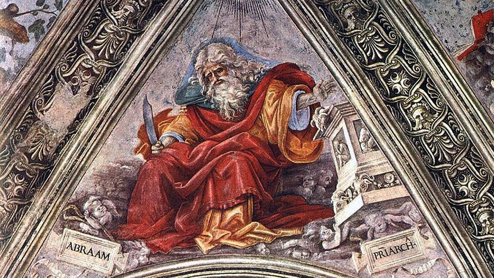

# **Biblical Series IX: The Call to Abraham**  

by Dr. Jordan Peterson

*Keywords: Abraham, Call, Faith, Sacrifice, Covenant*

## Section I

So I’ve been thinking this week about doing this once a month, on continuing basis. If I do that, I think it’ll be here, although it’s harder to rent this theatre during the academic year. But if it isn’t here, it’ll be somewhere else. I’d like to continue doing this. I’m learning an awful lot from doing it. Once a month would really be good, because then I could really do the background work. I could probably do that for a couple of years. Obviously, this is going very quickly. But that’s ok. It shouldn’t go any faster than it can go. That’s how it seems to me, anyways.

This has been a very steep learning curve for me, with regards to these stories. I didn’t understand them very well. I’ve got better at using the resources online to help me do my background investigation. I have a lot of books. Some of you may have noticed that, online, I’ve posted a [conversation](https://www.youtube.com/watch?v=f3vqXCLhJLE) I had with Jonathan Pageau and his brother, Matthieu. I hope it’s Matthieu. Names escape me so badly, but I believe that’s right. He just finished a book on the Bible. I’ve been doing a lot of thinking and talking about these stories, trying to understand what they’re about. And then there’s all these commentaries. There’s a great—I think it’s called Bible Hub, that has every single verse of the Bible listed there. With each verse, they’ve aggregated 10 commentaries from about 10 commentators from the last 400 years. So there’s like a dense page on every line.

That’s one of the things that’s really interesting about this book, too: it’s aggregated so much commentary that it’s much bigger than it looks. The book is much bigger than it looks. It’s been very interesting to become familiar with those, too. The fact that this site is set up with all the commentaries, split up by verses, means that you can rapidly compare the commentaries, and get a sense of how people have interpreted this over at least several hundred years—but, of course, much longer than that: the people who wrote the commentaries were reading things that were older than that. So that’s been very, very interesting.Last week we talked about a couple of things. We talked about how you might understand the idea of the divine encounter. And then we also paralleled that with the idea that God disappears in the Old Testament—he bows out as the stories progress. That seems to be an emergent property of the sequencing of the stories, right? All the books were written by independent people, and then they were aggregated by other people. And so the narrative continuity is some kind of emergent property that’s a consequence of this interaction between readers and writers over centuries. It’s strange that, given that, there are also multiple coherent narratives that unite it. It’s really not that easy to understand that. But it does, at least, seem to be the case.

The third thing we talked about was that, as God bows out, so to speak, the individual personalities of the human characters that are involved seem to become more and more developed. What it means is that God steps away, and man steps forward. That’s what it means. But why it’s arranged like that—or, say, the ultimate significance of that—is by no means clear.

So Abraham, who we’re going to concentrate on today, is quite a well-developed character. I would say there are multiple endings and beginnings in the Biblical stories. The most important ending, I suppose, is the ending of the Garden of Paradise, and the disenchantment of the world, and the sending forth of Adam and Eve into history—into the future, and into a mode of being that has a future as part of it, and that has history as part it, and that has the necessity of sacrifice and toil as part of it. That’s obviously crucial. That is replayed with the story of Noah, because everything is destroyed, and then the world is created anew. Sacrifices have to be made in order for the world to begin. And then you see the same thing happen, again, after the Noah story and the Tower of Babel.

History, as we really understand history, seems to start with Abraham. The stories of Abraham sound like historical stories. Scholars debate the historical accuracy of the Bible. I suppose there’s no way of ever determining once and for all the degree to which you might regard the accounts as equivalent to modern, empirical history. This is a psychological interpretation of the Biblical stories, not a historical interpretation. It certainly does seem to be the case that, from a psychological perspective, we enter something like the domain of a relatively modern conceptualization of history with Abraham."Beyond the accounts of divine commands that Abraham carries out"—this is from [Friedman](https://en.wikipedia.org/wiki/Richard_Elliott_Friedman), the man I mentioned in the last lecture, who wrote [The Disappearance of God](http://richardelliottfriedman.com/product/disappearance-of-god/) and a variety of other books that are well-worth reading—"the narrative also includes a variety of stories in which Abraham acts on his own initiative. He divides land with his nephew Lot; he battles kings, he takes concubines; he argues with his wife Sarah; on two occasions he tells kings that Sarah is his sister out of fear that they will kill him to get his wife; he arranges his sons’s marriage. In the place of the single story of Noah’s drunkenness, there are in the case of Abraham the stories of a man’s life."

One of the things I was really struck by—reading this in depth, and reading the commentary—is how much like a story about a person it is. Abraham isn’t a divine figure in any archetypal sense. I mean, he has archetypal elements, because he’s obviously the founder of a nation, but, fundamentally, he’s a human being. He has adventures, and he makes the mistakes of a human being. It’s the mistake part that really struck me.

I was talking with a friend of mine this week, [Norman Doidge](https://en.wikipedia.org/wiki/Norman_Doidge), who’s a very remarkable person, in many ways. He was taking me to task. He was reading my book, which will be out in January. In the book, in one section, I contrasted the God of the Old Testament with the God of the New Testament. I made the case, sort of based on [Northrop Frye’s](https://en.wikipedia.org/wiki/Northrop_Frye) ideas, that the God of the Old Testament was really harsh and judgemental, and that the God of the New Testament was more merciful, and, at least to some degree, more sweetness and light. Norman took me to task about that, saying that was an overly Christianized interpretation, which would make sense, because I derived it in part from Northrop Frye. I really have come to understand that he’s right about that.

The God in the Old Testament is actually far more merciful than he’s made out to be. It’s good news, fundamentally, if you regard the representation of God as somehow key to the description of being itself. Abraham makes a lot of serious mistakes, and yet he has a life, and he’s blessed by God, despite the fact that he’s pretty deeply flawed, and engages in deceptive practice. He’s a good man, but he’s not a perfect man, by any stretch of the imagination. Things work out really well for him, and he’s the founder of a nation, and all of that. That’s good news for everyone, because perfect people are very, very hard to find. If the only pathway to having a rich and meaningful life was through perfection, then we would all be in deep trouble. That’s very satisfying, to read that.

The other thing that I’ve been struck by is that Abraham—and I think this is actually absolutely key to the interpretation of this story—goes out and does things. That’s the thing. One of the things that I’ve noticed in my life is that nothing I’ve ever done was wasted. By ‘done,’ I mean put my heart and soul into it—attempted with all of my effort. That always worked. Now, it didn’t always work the way I expected it to work. That’s a whole different issue. But the payoff from it was always positive. Something of value always accrued to me when I made the sacrifices necessary to do something worthwhile. And so I think part of the message in the Abrahamic stories is—go do something. I’ve thought about this in a variety of ways outside of the interpretation of the story.

I have this program—some of you might be familiar with it—which is called the [Future Authoring Program](https://selfauthoring.com/future-authoring.html). It’s designed to help people make a plan for three to five years into the future. What you do is answer some questions—it’s a writing program—about how you would like your life to be, what you would like your character to be, three to five years down the road, if you were taking care of yourself like you were taking care of someone that you actually cared about. You kind of have to split yourself into two people, and treat yourself like someone you have respect for and want the best for. That’s not easy, because people don’t necessarily have respect for themselves, and they don’t necessarily want the best for themselves. They have a lot of self-contempt, and a lot of self-hatred, a lot of guilt, a lot of existential angst, and a lot of self-consciousness, and all of that. And so people don’t necessarily take care of themselves very well. I think you have an obligation—it’s one of the highest moral obligations—to treat yourself as if you’re a creature of value that is, in some sense, independent of your actions. You might think about that, metaphorically, as a recognition of your divine worth, in the Biblical sense, regardless of your sins, so to speak. I think that’s powerful language, once you understand it.

Anyways, with the [Self Authoring Program](https://selfauthoring.com/) and the [Future Authoring Program](https://selfauthoring.com/future-authoring.html), you answer questions about how you would like your friendships to be conducted. It’s useful to surround yourself with people who are trying to move forward, and, more importantly, who are happy when you move forward, and not happy when you move backwards—not when you fall; that isn’t what I mean. When you’re doing self-destructive things, your friends shouldn’t be there to cheer you on, because then they’re really not acting like friends, obviously. I know it’s obvious, but it still happens all the time, and people allow it to happen. It’s not a good idea.

How would you like to sort your family out? I was thinking about this, too, because I was thinking about Noah’s ark. There was a phrase in that story that I didn’t understand, which was that "Noah was perfect in his generations." I thought, I don’t know what that means. When you’re going through a book like the Bible, if you don’t understand a phrase, that actually means you missed something. It doesn’t mean that that’s just not germane to the story: that means you’re stupid. You didn’t get it, man. You didn’t get it. You didn’t understand it. The idea that Noah was perfect in his generations, and that’s why he could build an ark that would sustain him and humanity itself through the flood, meant that, not only did he walk with God—which is something that we talked about in the context of the Sermon on the Mount—but that he established proper relationships with his family, with his children. What that meant was that, not only was he well integrated as a person, but his level of integration had reached the point where it stretched out beyond him, and encompassed his family. So it was Noah and the family that was in the ark.

I really understood this, this year. I had a really tumultuous year. You can think about it from a personal perspective. I can think about it as a year that had no shortage of floods. Part of the reason that I was able to get through it—I also had terrible health problems—was because my family really came together around me: my kids, my wife, my parents, and my friends, as well—particularly a certain group of friends. All of that came together in my mind this week. I thought, oh, that’s what it means to be perfect in his generations. It meant that he hadn’t just straightened himself out: he’d also straightened out his relationships with his family. I can tell you that, when crisis strikes you—which it will. It will. The floods will come. That’s why the apocalypse is always upon us. The flood will definitely come in your life, and the degree that you’ve organized yourself psychologically, and also healed the relationships between you and your family, could be the critic element that determines whether you live or die when a crisis comes, or whether someone in your family lives or dies. So the idea of the ark containing the man who walks with God, and whose generations are perfect, and that that’s what sustains humanity through the crisis—you couldn’t be more psychologically accurate than that.

I was thinking about another line in the New Testament, this week. I think it’s from the Sermon on the Mount, but I’m not absolutely sure. Christ compares the kingdom of heaven to a mustard seed. A mustard seed is a very tiny seed. It grows into quite a spectacular, complex plant. I was thinking about how you should operate in the world in order to make it a better place, assuming that that’s what you should be doing. That is what you should be doing. There’s lots in the world to fix. Everything that bothers you about the world, and about yourself, should be fixed. You can do that. My dawning realization…

I have a friend. He lives in Montreal. His name is James Simon. He’s a great painter, and he’s taught me a lot of things. He’s helped me designed my house, and beautify it. I bought some paintings from him a couple of years ago. He did this series of paintings where he went around North America, and stood in different places, and then he painted the view from here down. And so it’s his feet planted in different places: on roads, on the desert, in the ocean. I have one, actually, hanging over my toilet, which is him standing over a urinal. Well, you know, he was trying to make a point. The point was that, wherever you are, it’s worth paying attention. So all these places that he visited, he looked at exactly where he was: standing by the side of the road in the desert—kind of mundane, in some sense. But then, maybe he put 40 hours into that painting, and it’s very, very realistic, with really good light. What he’s telling you as a painter is, everything is worth paying attention to an infinite amount, but you don’t have enough time. The artist does that for you. The artist looks and looks and looks and looks, and then gives you that vision, so then you can look at the painting. It reminds you that everything that there is, is right where you are. That’s a hard thing to realize, but it’s actually true.

I’ve been telling people online, in various ways, and in lectures, that they should start fixing up the world by cleaning up their room. I wanted to just elaborate on that a little bit before I get back to the lecture itself. So it’s become this weird internet meme. It’s a joke, and good: it’s a joke. I’m really happy about the fact that so much of this has got humor in it. That’s really important. That’s what stops things from degenerating into conflict. I was thinking about this idea of cleaning up your room in relationship to the mustard seed idea.

The thing about cleaning up your room…This is also something I learned from Carl Jung and his studies on alchemy. For Jung, when the alchemist was attempting to make the [philosopher’s stone](https://en.wikipedia.org/wiki/Philosopher%27s_stone), he was not only engaged in the transformation of the material world, but he was engaged in a process of self-transformation that occurred at the same time as the chemical transformation. It was a psychological work, in some sense.

Let’s say you want to sort out your room, and beautify it, because the beauty is also important. Let’s say all you have is just a little room. You’re not rich; you’re poor, and you don’t have any power. But you’ve got your damn room, and you’ve got this space right in front of you that’s a part of the cosmos, that you can come to grips with. You might think, well, what’s right in front of you? The answer to that is, it depends on how open your eyes are. That’s the proper answer. William Blake said this, for example—Aldous Huxley made comments that were very similar: in a transcendent state, you can see infinity in the finite. You might say, well, you can see infinity in what you have within your grasp, if you look. You could say, maybe, that’s the case with your room.

So you want to clean up your room. Ok, how do you do that, exactly? Well, a room is a place to sleep. If you set your room up properly, then you figure out how to sleep, and when you should sleep, and how you should sleep. And then you figure out when you should wake up, and then you figure out, well, what clothes you should wear, because they have to be arranged properly in your dresser, and then you have to have some place to put your clothes. If you’re going to have some clothes, you have to figure out what you’re going to wear those clothes to do. That means you have to figure out what you’re going to do, and then your room has to serve that purpose. Otherwise, it isn’t set up properly. If it doesn’t serve your purposes, you will be unhappy in the room, because the way that we perceive the world is as a place to move from point A to point B in. And then, if the place that we’re in facilitates that movement, then we’re happy to be there. If the place that we’re in serves as an obstacle to that movement, then we’re unhappy to be there. And so, to set up your room means that you have to have somewhere to go that’s worthwhile, or you can’t set up your room. And then your room has to be set up to facilitate that.

The next thing is, well, maybe you have to make it beautiful. That’s not easy, right? That means you have to have some taste, and that doesn’t mean you have to have money. It doesn’t. You can be garish with money, and you can be tasteful with nothing. All you need is taste, and taste beats money when it comes to beatifying things—not that money is trivial, because it’s not, but taste is crucial. People who are very artistically oriented can make beautiful things out of virtually nothing. The literature suggests that, if you’re going to make beautiful things, putting real constraints on what you allow yourself to do facilitates creativity, instead of interfering with it.

Let’s say you have to make something out of nothing—which, I suppose, would be a Godly act. You have to make something out of nothing; you have to be creative in order to do that. So then, to beautify your room means that you also have to develop your capacity to be creative, so then you can make your room shine. But then what will happen, if your family isn’t together, they’ll interfere with that—you’ll interfere with that, because you won’t have the discipline to do it properly. But then, when you start building this little microcosm of perfection with what you have at hand, it’ll evoke all the pathologies of everyone in your household. They’ll wonder what the hell you’re up to, in there. They won’t necessarily be happy, because if they’re in a lowly place, let’s say, and so are you, and you’re trying to move out of that, then the higher you move out of that, the more the place they’re in looks bad. You might say, well, what they should do is celebrate your victory over chaos and evil, but that isn’t what will happen. What will happen, instead, is that they will attempt to pull you back down.

I mean, obviously, all families don’t do that, but all families do that to some degree, and some families do almost nothing but that. What that means is that, if you’re going to organize your room, then you’re going to have to confront the devils in your house. That’s often a terrifying thing; some of those devils have lineages that go back many, many, many generations. God only knows what you have to struggle with in order to overcome that. And so, to sort yourself out, and to fix up your room, is a nontrivial matter. You’ll learn by doing that, and then, maybe, you can fix up your family a little bit, and then, having done that, you’ll have enough character so that, when you try to operate in the world—at your job, or maybe in the broader social spheres—you’ll be a force for good, instead of harm. You’ll have learned some humility by noting just how difficult it was to put your damn room together—and yourself, for that matter. You’ll proceed cautiously, with your eyes open, towards the good.

## Section II

[TIMESTAMP](https://youtu.be/UoQdp2prfmM?t=1453)

Those are some of the things I’ve been thinking about this week. They’re germane to what we’re going to discuss tonight. What happens at the beginning of the Abrahamic stories is, basically, God comes to Abraham and just says, go. Get going, man. Do something! Get going! You might think, well, where should I go? God is somewhat vague about that. Where he sends Abraham—it’s a real fixer-upper, man. There’s starvation there, and there’s tyranny, and there’s marital dissolution, and there’s deceit. It’s just like where you live, you know? It’s exactly the same thing. It’s tyranny and catastrophe. That’s the tyrannical Great Father.

Abraham ends up having to sojourn in Egypt. There’s a famine, and so mother nature’s on the rampage. Abraham lies about his wife, as we’ll see. So it’s the world. It’s tyranny, vulnerability, and deceit. And yet, God says, go, because if you do go, then you’ll become a father of nations. And you think, again, that’s pretty good news, although it’s strange. You’d expect that, if God chose Abraham, he’d send him immediately to the land of milk and honey. That isn’t what happens, at all, and Abraham never gets there. But his mission is still regarded as divine, and thank God for that. That’s what your mission will be, because that’s what you’ll encounter in your life. Those are archetypal things that everyone encounters: the tyranny of the social structure, the rapaciousness of nature, and the deceitful quality of the human psyche. That’s the world.

That’s a negative view, in some sense, but it’s positive in the story. What it basically says is something that’s akin to the Sermon on the Mount, which is that, if you’re aligned with God, and you pay attention to the divine injunction, then you can operate in the midst of chaos, tyranny, and deception, and flourish. You could hardly hope to have a better piece of news than that, given that that’s exactly where you are. I didn’t see any of that in the Abrahamic stories, to begin with. It’s been very interesting to have that reveal itself."The Abraham section thus develops the personality and character of a man to a new degree in the Biblical narrative while picturing in him a new degree of responsibility…"

So here’s the other thing that’s really struck me, and I think this is of absolutely crucial importance. I don’t know of how much importance, but it’s certainly important to me. One of the things that has just blown me away in the last year—because I’ve talked to lots of people live, but also lots of people online, but it’s more obvious live, and it’s obvious in this theatre, as well. I’ve gone around and spoken, and a large proportion of my audience has been young men under 30. I’ve spoken to them a lot about responsibility. What’s so odd about this is that, of all the things that I’ve spoken about—because I can see the audience, and I can feel how the audience is reacting. I’m always paying attention to all of you, insofar as I can manage that. I get some sense of how what I’m saying is landing, which you have to do if you’re going to speak effectively to people. What happens is that, if I talk about responsibility, everyone is silent, just like they are now. Just silent, and not moving. Focusing, attentive. I say, pick up your responsibility. Pick up the heaviest thing you can, and carry it. The room goes quiet, and everybody’s eyes open. I think…It always makes me break up. I don’t know why.

I was speaking to an English journalist today. He was going to write an article in Spectator magazine. I was talking about this. At the same point in the discussion, I had the same emotional reaction. I don’t really understand it. There’s something about it that’s so crucial. We’ve been fed this unending diet of rights and freedoms, and there’s something about that that’s so pathologically wrong. People are starving for the antidote, and the antidote is truth and responsibility. It isn’t because that’s what you should do in some I know better, or someone knows better than you, for you, sense. It’s that that’s the secret to a meaningful life. Without a meaningful life, all you have is suffering, nihilism, self-contempt, despair, and all of that. That’s not good.

It’s necessary for men to stand up and take responsibility. They all know that, and they are starving for that message. The message is more that that’s also a good thing, to stand up and take responsibility. You’re cursed so much now, from when you’re young, with this notion that your active engagement with the world is part of what is destroying and undermining the planet, and adding to the tyranny of the social systems. How about not so much of that, ok? It’s too soul-deadening. It’s antihuman, right to the core. My sense, instead, is that if you are able to reveal the best of yourself to you and the world, that you would be an overwhelming force for good. Whatever errors that might be made along the way would wash out in the works.

That’s the other thing that you see in the Abrahamic stories. Abraham is not a perfect person, by any stretch of the imagination. He’s a real person. He makes mistakes, but it doesn’t matter: the overarching narrative is, maintain your covenant with God, and, despite your inadequacies, not only will you prevail, but your descendants will prevail. It’s like, great. That’s really good news. It’s been really something to see that in the stories. So that’s responsibility."It is not just that Abraham is kinder, gentler, more intrepid, more ethical, or a better debater than his ancestor Noah. Rather, both the Noah and the Abraham stories are pieces of a development of an increasingly stronger stance of humans relative to the deity. Before the story is over, humans will become a good deal stronger and bolder than Abraham."That’s really something to say, because Abraham is pretty bold. So let’s read the stories. The first one is about Abraham, Sarah, and Lot. "Now these are the generations of Terah: Terah begat Abram"—so his name’s Abram, to begin with, and that actually turns out to be important. It’s not Abraham—"Nahor, and Haran; and Haran begat Lot"—so Haran is Abram’s brother—"And Haran died before his father Terah in the land of his nativity, in Ur of the Chaldees. And Abram and Nahor took them wives: the name of Abram’s wife was Sarai; and the name of Nahor’s wife, Milcah, the daughter of Haran, the father of Milcah, and the father of Iscah."But Sarai was barren; she had no child. And Terah took Abram his son, and Lot the son of Haran his son’s son, and Sarai his daughter in law, his son Abram’s wife; and they went forth with them from Ur of the Chaldees, to go into the land of Canaan"—so that’s exile—"and they came unto Haran, and dwelt there. And the days of Terah were two hundred and five years: and Terah died in Haran."

There’s a reason that Sarai is introduced as barren: it’s to set the stage. I think it was Anton Chekhov that said, when he was talking about the stage setting for a play, that if there was a rifle hanging on the wall, it had better be used before, I believe, the second act, or it shouldn’t be hanging there, at all. So this is stage setting. Part of the reason that the Biblical writers are pointing out that Abram’s wife is barren is because it’s a real catastrophe for Abraham, and for Sarai, as well, that she’s barren. It’s showing the trouble that Abraham’s in at the beginning of the story. It’s also…See, what happens as the story progresses is that Abram and Sarai are eventually granted a son, but it’s way late in the story, and they’re very, very old by the time it happens. And, of course, you’re not going to be a father of nations without having a child. The writers are attempting to make the case that, if you forthrightly pursue that which God directs you to pursue, let’s say, then all things are possible. That’s the idea in the narrative.

You might say that’s naive. It’s not. You think it when you’re naive, right? And then you dispense with that idea. And then, when you stop being the sort of person who dispenses with ideas, you come to another place. That’s the place where you have no idea what might be possible for you, if you got things together, and pursued what you should pursue. You don’t know how much of what’s impossible to you, right now, would be become possible under those conditions. It’s an unknown phenomena.

I’ve watched people put themselves together, across time, incrementally and continually. They become capable of things that are not only jaw-droppingly amazing, but, sometimes, metaphysically impossible to understand. So we don’t know the limits of human endeavour. We truly don’t. It’s premature to put a cap on what it is that we are, or what it is that we’re capable of. You’re already something, and maybe you’re not so bad in your current configuration. But you might wonder, if you did nothing for the next 30 years except put yourself together, just exactly what would you be able to do? You might think that’s worth finding out. But, of course, that’s the adoption of responsibility.

One thing that I’ve also learned over the years…I’ve been curious about this battle between meaning and nihilism. I could see for a long while the rationale in nihilism, and the power of the nihilistic argument. But it occurred to me, across time, that the power of the nihilistic argument is more powerful than naive optimism, but it’s not more powerful than the optimism that is not naive. The optimism that is not naive says, it’s self-evident that the world is a place of suffering, and that there are things to be done about that. It’s self-evident that people are flawed, and that there’s things to be done about that. The non-naive optimist says, the suffering could be reduced, and the insufficiency could be overcome, if people oriented themselves properly, and did what they were capable of doing. I do not believe that that’s deniable.

I think that human potential is virtually limitless, and that there’s nothing, perhaps, that’s beyond our grasp, if we’re careful as individuals, and as a society. I think that there’s no reason for nihilism, and that there’s no reason for hopelessness, and there’s no reason to bow down before evil. We’re capable of so much more. I think that you can easily—you know that, first, because you’re not happy with who you are, and you’re ashamed and embarrassed about it, as you should be. And you know it because, if you look out there, you see people who are capable of doing great things, and you know that we’re not giving it our all. And, still, we’re not doing so badly. You might wonder, if we devoted 90 percent of our effort to putting things right, instead of 55 percent of our effort, or maybe even less than that, just how well could things be put together? I think that you can figure that out by starting with your room, by the way."Now the Lord said unto Abram"—this is the opening of the story—"Get thee out of thy country, and from thy kindred, and from thy father’s house, unto a land that I will shew thee:"

This is one of those phrases where every clause is significant. Go somewhere you don’t understand! That’s the first thing: "get thee out of thy country." Back in the 1920s, there was a whole slew of American writers who ended up as expatriates in Paris—Hemingway among them, Fitzgerald, and a variety of others. It was very inexpensive in Paris, at the time. Part of their transformation into great literary figures was the fact that they were out of their country. Now they could see what their country was, because you can’t see what your country is until you leave it. So you have to go into the unknown. That’s God’s first command: go into the unknown! You already know what you know, and that’s not enough, unless you think you’re enough. And if you’re not enough, and you don’t think you’re enough, then you have to go where you haven’t been. And so that’s the first commandment to Abraham. That’s a good one. That makes perfect sense: go to where you don’t know. Yes.

"And from thy kindred." Well, what does that mean? It means grow up! That’s what it means. It means get away from your family enough so that you can establish your independence. And that isn’t because there’s something wrong with your family—although, perhaps there is, as there is, perhaps, wrong with you—but it means get away. I talk to people very frequently whose families have provided them with too much protection, and they know it themselves. That means they’re deprived of necessity.

One of the things that you see in the United States, for example, is that the children of first generation immigrants often do better than their children. The reason for that is that the children of first generation immigrants have necessity driving them. You don’t know how much you need necessity to drive you, because maybe you’re not very disciplined. If a catastrophe doesn’t immediately befall you when you don’t act forthrightly, then maybe you never act forthrightly, right? The gap between your foolishness and the punishment is lengthened by your unearned wealth, so you never grow up and learn. You have to get yourself away from your dependency in order to allow necessity to drive you forward. That’s to become independent, and to become mature.

I think part of what’s happening in our culture is that the force that’s attacking the forthright movement forward of young men, in particular, is afraid of the power of men. It’s confused about the distinction between power and authority and competence. A man who has authority and competence has power as a byproduct. But the authority and competence is everything. People who can’t understand that fail to make the distinction between power and authority of competence. They’re afraid of power, and so they destroy authority and competence. That’s a terrible thing, because we need authority and competence. What else is going to allow us to prevail in the long run? And so you get away from your country, and you get away from your kin, and from your father’s house, right? And you go out there, and you establish yourself in the world. It’s a call to adventure. The first lines in the Abrahamic stories is a call to adventure. Great.

"Unto a land that I will shew thee." Well, what does that mean? I’ve been struck very hard by a number of writers, Carl Jung, obviously, among them. I mean, he wrote things, like Nietzsche, that, if you understand them, they just break you into pieces. One of the things that Jung understood, and the psychoanalysts understand, is one of the most terrifying elements of psychoanalytic thinking, and is very tightly allied with religious thinking, which is that you are not the master of your own house: there are spirits that dwell within you, meaning, you have a will, and you can exercise a certain amount of conscious control over your being, but there are all sorts of things that occur within you that seem to be beyond your capacity to control. Your dreams, for example—that’s a really good example—or your impulses. You might think of those as so foreign from you that you don’t even want them to be part of you. But more subtly, even, how about what you’re interested in, what compels you? Where does that come from, exactly? You can’t conjure it up of your own accord.

So if you’re a student, and you’re taking a difficult course, you might say to yourself, well, I need to sit down and study for three hours. But then you sit down, and that isn’t what happens: your attention goes everywhere. You might say, well, whose attention is it, then, if it goes everywhere? You say it’s your attention. Heh. Well, if it’s your attention, maybe you’d be able to control it, but you can’t. And so then you might think, well, then just exactly what the hell is controlling it? And you might say, it’s random. Well, it better not be random. I can tell you that. That happens to some degree in schizophrenia. There’s an element of randomness in that. It’s not random. It’s driven by the action of phenomena that I think are best considered as something like subpersonalities—although, even that is only a partial description.

You can’t make yourself interested in something. Interest manifests itself, and grips you. That’s a whole different thing. So what is it that’s gripping you? How do you conceptualize that? Is that a divine power? Well, it’s divine as far as you’re concerned, because it grips you, and you can’t do anything about it. So there’s a calling in you towards what you’re compelled by, and what you’re interested in. Sometimes that might be quite dark, and sometimes not. But you’re compelled forward by your interest. And so the idea that what moves you away from your country, and your father’s house, and the comforts of your childhood home is something that’s beyond you, and that you listen to and harken to. That’s exactly right.

You can say, well, I don’t want to call that God. It doesn’t matter what you call it, exactly. It doesn’t matter to what it is, to what it’s called: it still is. If you do not listen to it—and I’ve been a clinician, and talked to enough people now, as old as I am, to know this absolutely: if you do not listen to that thing that beckons you forward, you will pay for it like you cannot possibly imagine. You’ll have everything that’s terrible about life in your life, and nothing about it that’s good. And, worse, you’ll know that it was your fault, and that you squandered what you could have had. This is not only a calling forth, but it’s a warning.

"Unto a land that I will shew thee." That’s it: "that I will shew thee." And you don’t want to be too concrete about this. There’s all sorts of new territories that you can inhabit. There’s abstract and conceptual territories. If you go to university and you study biology, or you study physics, or any discipline, you’re in a territory, right? You’re in the territory that all the scholars have established, and then, as you master the discipline, you move out beyond the established territory, into the unknown. That’s a new land, right? Maybe it’s even a land of your enemies, for that matter. But it’s a new land. The frontier’s always in front of you.

When the earth was less inhabited than it is now, the psychological frontier and the geographical frontier was the same thing, and now they’ve separated, to some degree. There’s not so much geographical frontier, but the frontier’s a place that never disappears. The land that’s beyond the land that you know is always there, and it’s always where you should go. All of that’s packed into these four phrases.You look at the world through a story. You can’t help it. The story is what gives value to the world, or the story’s what you extract from the value of the world. You can look at it either way. You’re somewhere, and it’s not good enough. That’s the eternal human predicament: wherever you are isn’t good enough. To some degree, that’s actually a good thing, because if it was good enough, well, there’s nothing for you to do. So it’s actually, maybe, a good thing that it’s insufficient. That might be why, sometimes, having less is better than having more. I don’t want to be a [pollyanna](https://en.wikipedia.org/wiki/Pollyanna_principle) about that. I mean, I know that there’s deprivation that can reach to the point where it’s completely counterproductive. But it isn’t always the case that…If you start with little, you start with more possibility. It’s something like that. So you always move from what’s unbearable about the present, to some better future, right? And if you don’t have that, then you have nothing but threat and negative emotion. You have no positive emotion, because the positive emotion is generated in the conception of the better future, and in the evidence, that you generate yourself, that you’re moving towards it. That’s where the positive and fulfilling meaning of life comes.

So you want to set up this structure properly. It’s very, very important. What it means is that you want to be going somewhere where it’s good enough so that the going is worth the while—and you can ask yourself that. That’s partly what we tried to build into the [Future Authoring Program](https://selfauthoring.com/future-authoring.html): We know what’s wrong with life. It’s rife with suffering, insufficiency, deception, and evil. It’s all of that, obviously. What would make the journey worthwhile? Well, you can ask yourself that. It’s like, all right; in order to bear up under this load, what is it that I would need to be striving to attain? And if you ask yourself that, that’s to knock, and the door will open. That’s what that means: if you ask yourself that, then you will find an answer. You’ll shrink away from it; you’ll think, well, there’s no way I could do that. Well, you don’t know what you could do. You don’t know what’s possible, and you’re not as much as you could be. God only knows what you could do and have and give if you sacrificed everything to it.

That’s the reason Abraham is constantly making sacrifices. It’s archaic, right? He’s burning up, like, baby lambs. Well, they’re alive; that’s something. And they’re valuable; that’s something. You have to admit—even if you think about it as a modern person—that the act of sacrificing something might have some dramatic compulsion to it. To go out into a flock, and take something that’s newborn, and to cut its throat, and to bleed it, and to burn it, might be a way of indicating to yourself that you’re actually serious about something. It isn’t so obvious that we have rituals of seriousness like that, now. And so it’s not so obvious that we’re actually serious about anything. And so maybe that’s not such a good thing. Maybe we shouldn’t be thinking that these people were so archaic and primitive and superstitious. It’s possible that they knew something that we don’t.

In the Abrahamic stories, one of the things that maintains Abraham’s covenant with God is his continual willingness to sacrifice. That sacrificial issue is so important: you are not committed to something unless you are willing to sacrifice for it. Commitment and sacrifice are the same thing. It borders on miraculous that those concepts are embedded into this narrative at the level of dramatic actions, instead of abstract explanation. People are acting this out. The fundamental conception is so profound; it’s quite awe-inspiring. It’s breathtaking, really, when you understand what message is trying to be conveyed. You have to make sacrifices. What do you have to sacrifice? You have to sacrifice that which is most valuable to you, currently, that’s stopping you. God only knows what that is—it’s certainly the worst of you. It’s certainly that. God only knows to what degree you’re in love with the worst of you.You move from the unbearable present to the ideal future, and you can’t help that. You have to live in a structure like that. That’s your house—that’s another way of thinking about it. If you want to get your house in order, and if you want it to be a place that you can live properly, then you have to plan the future that is perfect. And then I think, well, what does that mean? It means that it’s good for you.

One of the things that I do all the time with my clinical and consulting clients is to try to figure out what would be good for them. But we do more than that: we try to think, ok, how can we set this up so it’s really good for you, and that all the side consequences of that are good for other people? People are often, also, timid about trying to get something that’s good for themselves. They feel that it’s selfish, or that they don’t deserve it. We set it up so that it’s plainly obvious that it will not harm the structure of the universe for you to have what you need, and to do it in a way that’s a benefit to other people. There’s no downside to that. And so it’s ok if you reach out and take that.

One of the things that’s interesting about the Biblical stories—the Abrahamic stories, as well—is that God doesn’t really seem to be opposed to the success of the people that he’s chosen. What happens to them, as they progress through their journey, is that they get larger flocks, and they get more authority, and they get life more abundant. That’s what happens. God doesn’t seem to be a miser in the Old Testament: if you put in the effort, and you accept the covenant, and you accept the sacrifices, then you get to be successful, and maybe successful beyond your wildest dreams. That actually seems to be ok with God. That’s pretty cool, given the general notion of Old Testament God as only casting out curses and death wherever he happens to wander. I mean, there’s certainly no shortage of that. But, again, it seems to me that that’s very good news, and that you also don’t have to be perfect in order to have that happen.This is the issue about going into the unknown. If you leave your country and your kin and your father’s house, and you go out into a land that your intuition guides you to, you’re going to undergo these radical transformations. This is a sacrificial transformation, too, because you’re moving forthrightly and voluntarily into chaos. That’s the same as the dragon fight. That’s the hero’s story. What will happen, there, is that you will transform yourself. And so the call to an ideal is also the call to a sequence of deaths and rebirths that move you closer and closer to the ideal. That’s what God is calling Abraham to do in the first sentence of the story.

## Section III

[TIMESTAMP](https://youtu.be/GmuzUZTJ0GA?t=2899)

You see these things echoed in the strangest places. These are stills that I took from Pinocchio. This little cricket is the still, small voice, right? That’s the thing that calls to you. It’s your conscience, in part; it’s your intuition, in part. It’s the thing that opens up the great, sacred book of the world. That’s what happens, here. The animators are at pains to show you that. It’s a leather-bound book with gilt lettering. It’s a valuable book. It’s something that’s quiet that’s showing it to you. You have to meditate. You have to be somewhere where the world isn’t drowning you out in order to understand how to open this, to listen to that voice that tells you where you should go, what you should do next. And then what happens is that something beckons to you in the night. It’s a star. It’s something that transcends the horizon. It glitters. It’s brilliant. It’s not day-to-day. It’s something that’s beyond you—something that represents a transcendent ideal, and then makes it manifest to you, if you’re quiet enough to listen. That’s what you wish upon, so strangely, right?

People do that: they wish upon a star. They teach their children that, and they don’t know why. What do you mean you wish upon a star? What in the world does that mean? It means you lift your eyes to the heavens, and make a pact with the transcendent, and then your heart’s desire will come to you. That’s what it means. That’s not naive. It’s the most sophisticated thing that you can know, and it’s the birth of the hero.That’s the nativity star, obviously. This is where it takes place: anywhere. The person is just a carpenter and a toymaker. But that’s pretty good, a carpenter. If you’re a deceitful carpenter, then your house falls down. And if you're a toymaker, then you love children. That’s a good start. Geppetto, who lives in—it’s not a grand house. It’s just an everyday house, but everything that’s happening in it is good. That means it’s a palace, because everything in it that’s happening is good. There’s this saying—and I don’t remember where it came from—that it’s better to have bread and water in peace than a feast in conflict. That’s not a saying; that’s just the darkest possible description of the truth. There’s nothing worse than eating a grand meal with people you hate and despise, that are at each other’s throats. It’s much better to have bread and water in peace. It’s just clearheaded analysis of the structure of the world, to say things like that. And so the magical transformation can happen in the most mundane of places. The reason for that is that the mundane nature of places is an illusion. Every place is the potential birthplace of the kingdom of God. That’s the case.Geppetto is a good guy. He has a kitten. The kitten likes him. He makes puppets, and he’s a humble person. He knows that, compared to the ideal that he’s attempting to subscribe to, he’s—he’s not abased before it, or anything like that. He’s not despicable in relationship to it. But the reason he’s on his knees is because the thing he’s pointing at is above him. It wouldn’t be the right aim if it wasn’t above him. The fact that he’s on his knees is only an indication that his aim is proper: you should be on your knees to something that you actually admire. And if you don’t feel like being on your knees in front of it, then perhaps you don’t actually admire it, and then that means you haven’t got the stage set properly. But your aim should be something that fills you with awe. Why do something else? Well, perhaps because it’s easy, and perhaps because it’s malevolent, and all of those things. But those are no answers to the problems that beset you. They just make things worse, and that’s clear.And so then Geppetto, having made his pact—his covenant, just like Abraham—falls into a dream. The rest of the movie actually takes place in a dream. It’s the dream within which transformation takes place. That’s laid out, at least in part—time stops in the Pinocchio story. Everything happens to Pinocchio, in some sense, in a land that’s outside of normal time. That’s the infinite archetypal space. That’s a real place. The infinite and the finite coexist, and most of the time we’re in the place of the finite, but that doesn’t mean that the place of infinite doesn’t exist. It just means that we can’t get access to it. We get intimations of it, from time to time. When things are going perfectly well for you, on those rare occasions when everything comes together, for the brief moment, you inhabit that divine place, and you have some sense of what your life could be like, if you organized it from the smallest element to the largest element. That’s a place that you can inhabit, if not forever, in a manner that, at least, felt like forever.Because of Geppetto’s decision, the transcendent manifests itself. It takes the form of the blue fairy. That’s the positive element of nature. We could say, well, it’s not so clear that nature’s on your side. She’s the Red Queen in Alice in Wonderland, who runs around screaming "off with their heads!" And who says, "in my kingdom, you have to run as fast as you can just to stay in the same place." That’s mother nature. But then we might say, well, how do we know that mother nature’s attitude towards you isn’t negative, because your attitude towards things isn’t proper? That’s what this film attempts to indicate.

The idea is that, if you aim properly, then nature aligns itself behind you. It also arrays itself in front of you, perhaps even as an antagonist. But the power that it provides you with, from within, might be sufficient to overcome it from without. I think that the clinical evidence is clear about that. One of the things that we do know is that, if you take people who are confronting terrible things, and shrinking from them, and you teach them how to structure their behaviour so they can advance with courage, everything works better for them. Their fears decrease, and their character grows. And so there might be enough of nature within us to help us withstand the nature that’s outside of us. It depends, at least to some degree, on how it is that we orient ourselves in the world.Geppetto wants an autonomous individual as a son. That’s also something that makes him a great person, because autonomous individuals have their own will. If you’re a tyrant, it’s the last thing that you’re going to want. If you’re the tyrant who’s jealous of his son, it’s even more so the last thing you’re ever going to want. And so to aim, and to want the development of the autonomous individual, are the same thing. I would say that’s the core story, in some sense, of Western culture: to aim high, and to develop the autonomous individual, are the same thing. That’s what happens in Pinocchio. That’s what happens in the story of Abraham.The magical transformation takes place. One of the things that’s so interesting about the Pinocchio story—this is part of its mythological substructure—is that, from the scientific perspective, there’s only two determining forces with regards to the destiny of the individual: nature and culture, and both are deterministic. Scholars wrangle about which of those is the greater force. But, in mythological stories, there’s always a third element. The third element is something like autonomous consciousness. There’s no place for autonomous consciousness in the deterministic story of nature and culture, but we all act as if autonomous consciousness is the primary reality. The Biblical stories are predicated on the idea that autonomous consciousness is what gives rise to the world. I don’t think that we’re in a position to presume that that is necessarily an error. So what that means is to aim high, and to develop the autonomous individual, and, simultaneously, to formulate an allegiance with the conscious power that brings being into existence. That all takes place inside this little puppet. And then he has his adventures. He’s still half jackass and half deceptive, but despite that, and despite all the errors, he has the capacity to move forward, and to transform himself into something that can be properly considered and described as a true son of God. That’s the right aim.It works like this, as far as I can tell. When I had talked to people about doing the [Future Authoring Program](https://selfauthoring.com/future-authoring.html), they often put it off. It’s not surprising, because it’s hard. But it’s more than that: they think, well, I don’t know how to write; I’m going to do a bad job; I don’t really like assignments; I’m going to have to do it perfectly; I need to wait until I have enough time. One of those is enough to stop you cold, and all five of them—you’re just done. I tell people, do it haphazardly, a tiny bit at a time, and badly, because you can do that. I tell my students, when they’re doing their master’s thesis, write a really bad first draft. And then we have a little conversation about that, because they don’t think I mean that. It sounds like a cliche, in some sense. It’s not a cliche, at all. You’re a terrible writer, but if someone put a gun to your head, and said, "you have to have your 100 page thesis done by next Monday, or I’ll shoot you, but I don’t care how terrible it is," you would sit down and write it. The thing is, then you have it, right? Then you have something, and then you can fix it. You can iterate and fix it. That bad first draft, that’s the most valuable thing. That’s what you need: you need a bad first draft of yourself.

There’s an idea that Jung developed about the trickster, or the jester, or the comedian. The trickster is the precursor to the saviour. That’s one of the things I learned from Jung that was just so unlikely. You’d never think that. It’s so amazing that that might be the case. The satirical and the ironic and the troublemaker, the comedian—the fool is the precursor to the saviour. Why? Because you’re a fool when you start something new. And so, if you’re not willing to be a fool, then you’ll never start anything new. And if you never start anything new, then you won’t develop. And so the willingness to be a fool is the precursor to transformation. That’s the same as humility. If you’re going to write your destiny, you can do a bad first job. You’re going to get smarter as you move forward.Something beckons to you. That’s what happens, here. Maybe the star that Geppetto wished on was the wrong damn star, but at least it was a star, right? At least it was in the sky. At least it moved him forward. And so you say in your life, well, something grips you, and fills you with interest. And you think, should I do that? The answer is, if not that, then something! What if it’s a mistake? It’s a mistake! Rest assured. What do you know? You’re going to stumble around, right? And what’s going to happen is this: you’re going to not stay in stasis; you’re not going to wander around in circles. I see people like that. They say, well, I never knew what to do, and now I’m 40. That’s not so good. That’s not so good, and there is a literature, too, that suggests that people are a lot more unhappy, when they look back on their lives, about the things they didn’t do than they are about the mistakes they made while they were doing things. And so that’s really worth thinking about, too.

There’s redemptive mistakes. A redemptive mistake would be a mistake that you make when you go out and try to do something. You think, ok, I’m going to try to do this, and you’re not good at it. You make a bunch of mistakes. What’s the consequence, if you pay attention? You’re not quite so stupid anymore. That’s the thing: you’ve been informed by the results of your errors. What happens is you follow the beacon; you follow the light, and you’re blind, so you don’t know where the light is. It’s dimly apprehended, only, and you’re afraid to follow it. But you decide to take some stumbling steps towards it, and, as you take stumbling steps towards it, you become illuminated and enlightened and informed because of the nature of your experience, and because you’re pushing yourself beyond where you are; you’re going into the country that you have not yet been in. You learn something. What happens, then, is the star moves. You move 10 feet towards it, and you think, no, that’s not right. I didn’t get it right. It isn’t there; it’s actually there. So then you see it somewhere else, and you shift yourself slightly. You move forward.You continue as you change. The thing that guides you forward moves. It’s like God in the desert in Egypt. The pillar of light that you’re following is moving. It’s not a permanent thing. You move towards it, and it moves away. It guides you forward. So you say, is what I’m aiming at paradise itself? The answer to that is no, because what do you know? You couldn’t see paradise if it was right in front of you, but you might get a glimmer of it. And so you move towards it, and you grow. The next time you open your eyes, you see a little bit more clearly. That just happens over and over. It keeps moving, and so you move like this. But the thing that’s so cool is that each of those zags and zigs is a catastrophe. I hit a wall, my God! And then I had to die a little bit, and I barely got back up. It’s a phoenix transformation at each turn.

It’s painful, but the thing is that, even though you travel 20 miles on that road, and you’ve only moved three miles forward, you’ve moved three miles forward, instead of moving backwards. That’s the thing, too: if you stand still, you fall backwards. You cannot stand still, because the world moves away from you, if you stand still. There’s no stasis; there’s only backwards. And so, if you’re not moving forwards, then you’re moving backwards. Perhaps that’s more of the underlying truth of the [Matthew principle](https://en.wikipedia.org/wiki/Matthew_effect): "to those who have everything, more will be given. From those who have nothing, everything will be taken." It’s a warning: do not stay in one place.Well, as you zig and zag, maybe the cataclysm of each transformation starts to lessen. There’s not so much of you that has to die with every mistake. Maybe you end up oriented at least reasonably properly. If you were sensible, that would have been your trip. But it wasn’t, right? It’s that, and perhaps it’s a lot worse than that. Perhaps there’s no shortage of backtracking. But it doesn’t matter, because as you stumble forward, you illuminate and inform yourself. Perhaps that’s partly because the world is made of information. If you encounter it, and tangle with it, then it informs you, and then you become informed, and then you’re in formation, and then you’re ready.God says to Abraham, "I will make of thee a great nation, and I will bless thee, and make thy name great; and thou shalt be a blessing." That’s a good offer, fundamentally.

What does it mean to be made a great nation of? Well, perhaps it has something to do directly with your descendants, but I don’t think it’s just that. If you’re a force for good in the world, and that radiates out from you, and if you’re good enough, it’s difficult to say how much of an impact on things you could have. Dostoevsky was a very crazy person, partly because of his epilepsy. He said, "a man is not only responsible for everything he does, but for everything everyone else does." And you think, well, no—and yes; sometimes no; sometimes that’s what you think, if you’re cataclysmically depressed: your sins are so egregious that they’re unforgivable, and that, in some manner, you’re at fault for everything that’s terrible with the world. But there’s actually redemptive truth in that. Things wouldn’t be so bad if you weren’t so far from what you could be.

That’s terribly pessimistic, because it’s all on you, man. But it’s terribly optimistic, because, God, there’s a lot of things that you could do. And if you’re crying out for something to do, then that’s the best news that you could possibly have: Things aren’t so good, but neither are you. If you stop doing the things that you knew to be destructive, which is the right place to start—if you’re going to clean up your room, what do you do first? Well, you just get rid of the mess. No one has to come in and tell you, hopefully, what’s the worst mess. It just announces itself to you. You can certainly know, yourself.

It’s a very easy meditative exercise to sit down and think, ok, I’m doing one thing really stupidly that I should stop doing. It’s like, how long is it going to take you to figure out what that is? It’s about two seconds, right? You’ve known it forever. You could even make it less demanding. You could say, there’s some stupid things that I’m doing, that I know are stupid and wrong, that I could stop doing, that I would stop doing. And then you can just start with that. You can just do that, and maybe it’s just a little thing—although, it’s not; it’s a step forward on the proper voyage. It’s not a small thing. You could do this for a year, or even a month: just try not to do things that you know to be stupid and wrong. That means not to say things that you know to be stupid and wrong, as well. Maybe that’s the most important thing. Just do it as an experiment. See what happens.

It’s so fun. I have people writing to me, from all over the world, who are saying they’re doing that. They’re saying, well, I cleaned up my room, then I stopped saying stupid things. My God! Things are way better. Who would have guessed it? It’s low-hanging fruit, man. That’s the other thing: if there’s a lot of things wrong with you, it’s really easy to start fixing it, you know? There’s so much territory that you can inhabit."…I will make of thee a great nation, and I will bless thee." That’s good. I mean, the whole nation thing, that’s positive. But to have God on your side…You might want that when things get rough. That would be good. "…And make thy name great; and thou shalt be a blessing." Wonderful. That’s a good deal."And I will bless them that bless thee"—that’s good, too—"and curse him that curseth thee: and in thee shall all families of the earth be blessed." That’s something.
Wouldn’t it be something if you could wake up, and your day was composed, in part, of people thanking you for all the good things you’ve done in the world? Wouldn’t that be good? It’s not impossible for that to happen.

"So Abram departed, as the Lord had spoken unto him; and Lot went with him: and Abram was seventy and five years old when he departed out of Haran." That’s old. Abram lives a long time, but this is also part of the story. He has a wife who can’t have children. He has nothing. Obviously, he’s been hanging around dad’s shack for a little too long, given that he’s 75, right? It’s time to get a little fire lit underneath him, a bit. He’s not got much going for him, but he still decides to move forward.

I’ve seen this: if you don’t have your destiny in hand by the time you’re 30, it’s rough. You start hurting. And if you don’t have your destiny in hand by the time you’re 40, then you really start hurting. Forty’s a real fork in the road. A fork in the road is always where you meet the devil, by the way. That’s because every time you have to make a decision, the possibility of evil beckons.

I had a friend—I told you a little bit about him. He killed himself just after 40. He had a book published with a very small press. He was quite a good writer, but he could not get himself together. It hit him too hard at 40. I’m not saying that it’s hopeless at 40. I’m not saying that. I’m not saying that, partly because of these verses, and partly because of what I’ve seen in my clinical practice. I’ve had people come to me who have had very chaotic and ill-spent lives, let’s say, who were in that neighbourhood of age—it’s true for people who are older, as well—who then decided to make a real effort, and to try to make where they were better, instead of being bitter about where they weren’t. That bitterness really does you in. It’s really not good. It’s the opposite of gratitude. It’s the manifestation of resentment. It makes you malevolent. It’s very, very bad to be bitter. It’s hell to be bitter. If you’re 40, and you’re not successful, then you have to accept your lot, and you have to start to improve what’s right in front of you. And if you do that, it doesn’t take very long.

It’s quite interesting to watch people. Things can be a lot better in six months, and they can be way better in two years. It’s an uphill struggle, but it’s by no means impossible. I don’t know, again, what the limit of that is. I suppose it depends to some degree on the degree of your commitment. But, anyways, it’s another indication of the real validity of this story. God isn’t setting this up to be easy, right? Abraham’s old, and his wife is old, too—more than that, she’s barren. How’s he going to be the father of nations? How is he going to be successful? Well, the initial departure point is radically insufficient. That’s very inspiring, because it means that you can start from where you are.

## Section IV

[TIMESTAMP](https://youtu.be/GmuzUZTJ0GA?t=4332)

"So Abram departed, as the Lord had spoken unto him; and Lot went with him: and Abram was seventy and five years old when he departed out of Haran. And Abram took Sarai his wife, and Lot his brother’s son, and all their substance that they had gathered…"

He has a relationship with Lot, right? He doesn’t have his own son, but his brother died, and so he takes his nephew as his son. That’s grateful. He could be very angry, and have nothing to do with him, because he didn’t get his own son. But that isn’t what happens. He’s offered a substitute, let’s say, and he accepts it, so good for him. That’s also something, that I’ve seen, that’s characterized people that can make the best of a bad lot: they don’t get exactly what they want, but something comes along that offers possibilities that are sufficient, perhaps, if exploited properly. They open their heart, and welcome them in, instead of rejecting them in bitterness. That’s a good thing, and that’s part of Abraham’s character."And Abram took Sarai his wife, and Lot his brother’s son, and all their substance that they had gathered, and the souls that they had gotten in Haran; and they went forth to go into the land of Canaan"—into exile, let’s say—"and into the land of Canaan they came." That’s another repetition of the transformation story. You have to go to a land where you’re not welcome."And Abram passed through the land unto the place of Sichem, unto the plain of Moreh. And the Canaanite was then in the land. And the Lord appeared unto Abram, and said, Unto thy seed will I give this land: and there builded he an altar unto the Lord, who appeared unto him. And he removed from thence unto a mountain on the east of Bethel, and pitched his tent, having Bethel on the west, and Hai on the east: and there he builded an altar unto the Lord, and called upon the name of the Lord."

Now, we don’t understand these rituals, precisely. I don’t know if the people who did this engaged in a meditative ritual. Was that the idea, that you take something of value, you undertake this dramatic life and death transformation? Was that an aid to meditation? And what do you do? Do you sit down and think? Do you pray? Pray being to ask: What do I do next? How do I orient myself in the world? It’s a useful exercise, to do that. I think it’s something that people could do every morning. I think it’s useful to sit down, and think, ok, what’s the most important thing I should do today? I have an array of things that call to me to be done, some of which I will do with joy, and some of which I will bear as responsibilities. But they array themselves in front of me. What should I attend to first? Well, do you ask, or do you decide?

It seems to me, when I do it—because I do it all the time; I do it every morning. I try to sit down, and think, ok, I’ve got things that I would like to do, and things that call to me out of necessity. What do I do first? It’s not so much a decision as it is a question. I don’t know what I’m calling on—I’m calling on my capacity to think, I suppose. But that’s not my capacity, exactly. I can commune with whatever provides answers, and I can think that that’s me thinking, but…It isn’t that I believe that I can’t think. I do believe that I can consciously think, but that’s not the same as calling for inspiration. It’s not the same process, just like a dream is not conscious thinking: it’s something that happens to you. That kind of inspiration is also something that happens to you.

I ask myself, what’s the most important thing I could do next? And then I have an answer to that. It isn’t because I decided that I’ll do it, whatever it is, and that I want to know what it is. Those are the decisions. But there’s an involuntary aspect to the sorting that occurs. That’s the psychological equivalent, I suppose, to this. I guess the sacrifice is, when I feel that I will do whatever it is that calls to be done, then I don’t do the other things that I might want to do. That’s a sacrifice. To me, it’s the proper sacrifice, because my sense is that things don’t go properly unless you do what’s most important. And if I want things to go properly—and I do, because I’ve had my taste of things not going properly—it’s not so difficult to do what makes things go properly, under those circumstances.

I think this is partly why the story of Sodom and Gomorrah is embedded in the Abrahamic stories. That’s an apocalyptic story: if things go badly enough, the whole city is destroyed. The reason it goes badly is because the people in the city do not behave properly. The people in the city might be you. So if you’re not behaving properly, then you go, and so does the city, and maybe you want that, or maybe you don’t want that. And if you don’t want that, and you know that if you don’t do things properly then it’s you and the city—if you actually know that—then maybe that terrifies you badly enough so that you’re willing to make the sacrifice to do the right things, instead of the impulsive things that you might otherwise do.

I learned from [Viktor Frankl](https://en.wikipedia.org/wiki/Viktor_Frankl), [Carl Jung](https://en.wikipedia.org/wiki/Carl_Jung), [Aleksandr Solzhenitsyn](https://en.wikipedia.org/wiki/Aleksandr_Solzhenitsyn), and from reading the works of many people who wrote on the holocaust and the catastrophes in the Soviet Union. The people who studied it most deeply always came to the same conclusion: the state became corrupted because each individual allowed themselves to be corrupted, or perhaps participated joyfully in the process of being corrupted. The consequence of that was the end of the world. So what that means is that, if you don’t behave properly, then you bring about the end of the world. Maybe you think, well, that’s only the end of your world. Fair enough. Or maybe it’s only the end of your family’s world, which, I suppose, might give you some pause. But there’s more to it than that, because you’re connected to everyone else, and what you do that isn’t good distributes itself, and all the things that you don’t do that could be good take away from the whole. And so, if you know that—and I do think you know that, if you take it seriously. If you look at the historical, cataclysmic events of the 20th century seriously, I do not think that you can fail to come to that conclusion."And Abram journeyed, going on still toward the south." That’s interesting, because to go south means to go down downhill. It’s not good, to go south. It’s colloquial for going to where you shouldn’t go. And so this is what happens to Abraham: his ascent is preceded by a descent. That’s very common in life, I would say. The redemptive element of this narrative is that, if the covenant is constructed properly—so it’s an ark, which is your decision to align yourself with God, for all intents and purpose—then even the journey south can be part of a broader journey upward.

"And there was a famine in the land…" That’s mother nature failing to cooperate. I mean, that’s gotta be pretty disheartening for Abraham, don’t you think? He finally gets it together, when he’s 75, to leave, because God says, get going, and the first place he goes, everyone’s starving to death. It’s like, you know, you might think about that as a test of faith, wouldn’t you say? But he keeps going. And then what happens? Well, he has to go to Egypt. So great; he goes where everyone’s starving, and then, to get away from where everyone’s starving, he goes to a tyranny. So the whole beginning of the story’s not particularly auspicious.

"And Abram went down into Egypt to sojourn there; for the famine was grievous in the land." It’s a repetition of the same idea, again, of a downhill voyage into chaos. It’s repeated over and over, that the beginning of Abraham’s journey is basically a sequence of experiences of exile, chaos, tyranny, and catastrophe.

You should be able to relate to that. You know how hard it is to get things together, you know? You go out to do what you’re supposed to do, say, and you’re beset by the intransigence of the world and failure. So what are you supposed to do about that? Maintain your faith in the good, and continue to move forward. That’s the idea. Even if you don’t buy the metaphor, what are you going to do instead, that won’t make it worse? So even if it isn’t enough that you’re pursuing, you’re at least forestalling the transformation of the chaos of your life into sheer hell. That can certainly happen. You see people who are having a terrible time, and then you see people who are having a terrible time, and who are also in hell. It’s a lot better to just have a terrible time than to have a terrible time and be in hell at the same time."And it came to pass, when he was come near to enter into Egypt, that he said unto Sarai his wife, Behold now, I know that thou art a fair woman to look upon: Therefore it shall come to pass, when the Egyptians shall see thee, that they shall say, This is his wife: and they will kill me, but they will save thee alive."

Abram is really having a rough time. He’s a failure. He’s wandering around through the land of starvation, and now he’s going to go be a quasi-slave in Egypt. He has this incredibly attractive wife, and all he can look forward to is the fact that the most successful man in Egypt, the Pharaoh, will take her from him. So he’s got the whole embitterment thing nailed down, as far as I can tell. And this is when he makes one of his errors, let’s say, and one of the errors that humanizes him.

"Say, I pray thee, thou art my sister: that it may be well with me for thy sake; and my soul shall live because of thee. And it came to pass, that, when Abram was come into Egypt, the Egyptians beheld the woman that she was very fair. The princes also of Pharaoh saw her, and commended her before Pharaoh: and the woman was taken into Pharaoh's house. And he entreated Abram well for her sake: and he had sheep, and oxen, and he asses, and menservants, and maidservants, and she asses, and camels."

So, actually, things work out pretty well for Abram, despite his deceit, which is quite interesting. I guess it’s because, if the overarching structure is solid—something like that—then errors can still be forgiven, to speak about it from a metaphorical perspective."And the Lord plagued Pharaoh and his house with great plagues because of Sarai Abram’s wife."

Well, it doesn’t seem very fair, because the Pharaoh didn’t know. But it’s not the right way to look at it. The right way to look at it—there’s a story later in the Bible about David. David could be a pretty bad guy. When he becomes king, he’s in his castle, and he’s looking over the city, and he sees a woman sunbathing nude, on a roof, out on the city. He’s smitten by her—floored by her. He has inquiries made about who she is. Her name is [Bathsheba](https://en.wikipedia.org/wiki/Bathsheba), and he finds out who her husband is. Her husband actually happens to be a general in his army. He arranged for that general to be put at the thick of the battle and killed. And then he takes Bathsheba.

The Lord is not pleased by that, let’s put it that way. That’s interesting. It’s an interesting story because you might say, well, why can’t the king do whatever the hell he wants? Seriously; he’s the king. He’s not just like the Prime Minister or the President. He’s the king. So you might say, well, why is the king subject to any rules, whatsoever? What’s the rationale for the king being subject to rules? Well, the rationale emerges in these stories. There are social strictures that are such that, even if the ruler of the land transgresses against them, there will be hell to pay. That’s continually presented, over and over, in the Biblical stories. It’s a natural law sort of idea.

 There are intrinsic rules to the game of social human being, and maybe intrinsic rules to the natural state of human being. You break those rules consciously or unconsciously at your absolute peril—and not only at your peril, but at the peril of the state. It doesn’t matter who you are. I would say this is actually an indication of God being fair, rather than being unfair. Because the rule is, Pharaoh or not, you don’t get to take someone else’s wife, and ignorance is no excuse. You might say that’s a little bit harsh—and perhaps it is a little bit harsh—but the idea is not without merit. Of course, Abram is complicit in this. Despite that, he is successful."And Pharaoh called Abram and said, What is this that thou hast done unto me? why didst thou not tell me that she was thy wife? Why saidst thou, She is my sister? so I might have taken her to me to wife: now therefore behold thy wife, take her, and go thy way. And Pharaoh commanded his men concerning him: and they sent him away, and his wife, and all that he had."And Abram went up out of Egypt, he, and his wife, and all that he had, and Lot with him, into the south. And Abram was very rich in cattle, in silver, and in gold."

It’s interesting: Abraham goes to the place of famine, and then he goes to the place of tyranny, and then he lies, and then he almost loses his wife, but because he goes, things work out for him. So hooray for that.

"And he went on his journeys from the south even to Bethel, unto the place where his tent had been at the beginning, between Bethel and Hai; Unto the place of the altar"—so he makes another sacrifice—"which he had make there at the first: and there Abram called on the name of the Lord."

So he’s had an adventure, right? He’s finished his journey. There’s a culminating point in this narrative, and now he doesn’t know what to do. He’s left the place he’s at; he doesn’t know what to do, so it’s time to build an altar, make a sacrifice, and ask for divine guidance, once again. He’s been there, done that. What’s next? The question is asked seriously, and this is something to consider: if you want to know what to do, ask seriously.

Abraham sacrifices a life to his vow. So what do you do? Well, you don’t sacrifice an animal. You don’t make a blood sacrifice; you do it psychologically. You say, I’m going to sacrifice my life to this aim. That’s what you do, if you’re serious. What do I do next? Well, I’m going to sacrifice my life to this aim. What is it that I should do that’s worth sacrificing my life to? That’s a serious question. Maybe that’s the sort of question that people don’t ask, because they’re afraid of the seriousness of the question and the potential magnitude of the answer. Do you really want to know what you should do that would be worth sacrificing your life to? Well, the answer is yes, because it’s worth it. But the answer is also no, because it’s your life, you know? What if you’re wrong? And you’re probably wrong. But maybe that doesn’t matter. Maybe the rightness is in the process, and not in the decision. It’s the beginning of a sequence of decisions, as we’ve already pointed out."…place of the altar, which he had make there at the first: and there Abram called on the name of the Lord. And Lot also, which went with Abram, had flocks, and herds, and tents. And the land was not able to bear them, that they might dwell together: for their substance was great, so that they could not dwell together. And there was a strife between the herdmen of Abram’s cattle and the herdmen of Lot’s cattle: and the Canaanite and the Perizzite dwelled then in the land."

That’s interesting, too. Abram’s having a pretty good time of it, now. He’s out of starvation—hey, that’s good—he’s out of the tyranny, and now he’s kind of wealthy. And then the story flips on him: he’s wealthy, and now a bad thing happens to him. He’s got all this wealth, and so does his nephew, and now they can’t get along, because they have too much stuff. That’s quite comical, as well. I think that’s a comic interlude, here. Now, they handle it properly."And Abram said unto Lot, Let there be no strife, I pray thee, between me and thee, and between my herdmen and thy herdmen; for we be brethren. Is not the whole land before three? separate thyself, I pray thee, from me: if thou wilt take the left hand, then I will go to the right; or if thou depart to the right hand, then I will go to the left."

So basically, they sit down and say, well, one of us has got to get out of town. It can be one or the other; it doesn’t really matter. We can flip a coin, but we have to separate. They do it amicably."And Lot lifted up his eyes, and beheld all the plain of Jordan, that it was well watered every where"—so that’s an intimation of Eden, right, because Eden means well-watered place—"before the Lord destroyed Sodom and Gomorrah, even as the garden of the Lord, like the land of Egypt, as thou comest unto Zoar."

It’s so interesting. You get foreshadowing here, again. Lot and Abram are making their decision about where to go, and Lot looks out and sees a reasonable place. But then this warning comes up that there’s a city out there where things are not going to go well. Things are being done badly, and things are not going to go well."Then Lot chose him all the plain of Jordan; and Lot journeyed east: and they separated themselves the one from the other. Abram dwelled in the land of Canaan, and Lot dwelled in the cities of the plain, and pitched his tent toward Sodom. But the men of Sodom were wicked and sinners before the Lord exceedingly."

Now, the word sin—I mentioned this to you before—is an interesting word. It’s the derivation of an archery term, in my understanding of its derivation. The Greek work was [hamartia](https://en.wikipedia.org/wiki/Hamartia), and hamartia is an archery term that means to miss the bullseye. It’s worth thinking about that metaphorically, because you got to think about all the ways you can miss the bullseye. You can close your eyes; that’s very common. You could just not lift up the damn bow and arrow to begin with. You could face the wrong way. You could be unskilled in your aim. I also like the archery metaphor because human beings are built on a hunting platform. We always aim at things—we’re ballistic creatures on a trajectory, always. We’re always at something. We’re always aiming at the mark, which is, of course, what you do when you hunt. You have to hit the mark precisely. That’s what we’re like psychologically. We have to aim at something and then move towards it. And so to sin is to miss the mark, to miss the bullseye, to fail to take aim, to aim badly, to aim carelessly, or to not aim at all. That’s like a sin of omission, that’s to not do, and then to be wicked is to aim at what you know you shouldn’t aim at.

Again, I don’t think of that as an external morality, precisely. I think that you can read the entire Biblical narrative from a psychological perspective. We’re not talking about external codes of conduct, here—although we could. The wickedness that’s being described is the act of you doing something that you know to be wrong, period. You may do something, and you don’t know if it’s wrong or not. That isn’t the sort of thing that we’re talking about. And we’re not talking about the things that you do, that are right, that other people think are wrong. We’re not talking about those, either. We’re talking about those things that you consciously do although you know them to be wrong yourself. Those are the things that seem to get people into the most trouble in these stories. I believe that to be the case. I think that’s very accurate, psychologically.

It’s amazing. I see this all the time: If you do something wrong, and it’s because you’re ignorant, you don’t know better, it doesn’t go well for you. That’s the case. But if you do something wrong, and you know it’s wrong, the punishment is manifold. I think the reason for that is because that makes you Cain. It means you betray your own ideal. If you just don’t know, well, you haven’t betrayed your ideal; you’re just not together. Maybe you’re even wilfully blind. But if you do something that you know to be wrong, then you’ve betrayed your own ideal. Then that lands you—once Cain destroyed Abel, Cain said to God, "I cannot bear my punishment."

## Section V

[TIMESTAMP](https://youtu.be/GmuzUZTJ0GA?t=5659)

"And the Lord said unto Abram, after that Lot was separated from him, Lift up now thine eyes, and look from the place where thou art northward, and southward, and eastward, and westward: For all the land which thou seest, to thee will I give it, and to thy seed for ever. And I will make thy seed as the dust of the earth: so that if a man can number the dust of the earth, then shall thy seed also be numbered."Arise, walk through the land in the length of it and in the breadth of it; for I will give it unto thee."

So a cathedral is a cross, and the transformation takes place at the crux of the cross, which is exactly right: the transformation takes place at the point of maximal suffering. The cathedral’s designed to indicate that symbolically. What happens in a religious ceremony is also a journey. It’s a journey, in some sense, to the holy city. And then that’s also played out in the idea of pilgrimage, because you actually go to a holy city—Jerusalem, or wherever it is that you think the holy city is. You go there, and that takes you out of your country, away from your kin, away from your family, into a strange land. As you make the journey, you transform, and when you come back, you’re not the same. That’s the story of The Hobbit, right?

But let’s say you can’t afford to go on a pilgrimage, so you go the cathedral, and there’s a huge maze on the ground. It’s the world: north, south, west, and east, just as God describes, here. It’s laid out. You enter the maze at one side, and in the middle is a stone pattern that looks like a flower. It’s the place where being wells forth, and it’s at the center of the cathedral. What that means is that, if you accept your suffering, then you move to the place where the spirit of being wells forth. That’s what that means. You enter the maze, and you walk, and it’s divided into quadrants. You walk one quadrant completely, and then the maze pathway takes you into the next quadrant, and then you walk that completely, and then it takes you to the third one, and the fourth one, and then, when you walk the maze completely, everywhere, when you’ve gone everywhere in the world, north, south, east, and west, when you’ve traversed the territory completely, then you come to the center, and then it’s yours.

When I’ve been renovating houses—I like to do that—I’ve paid a lot of attention to the psychological process of the house renovation. Jung said this—this is something, man. He was talking about the stages of psychological integration. He looked beyond [Piaget](https://en.wikipedia.org/wiki/Jean_Piaget), I would say. Although, Piaget looked very far. He said, here’s a conjunction: you have to get your rationality and your emotion together. That’s a male-female conjunction, symbolically speaking: male rationality, female emotionality. You want to bring those together so that they are oriented in the same direction; your emotions and your rationality serve the same purpose. So then you’re unified in mind and spirit, let’s say. That’s not good enough. Once you’ve got that together, then you have a body, and then that’s a male-female conjunction, again—a divine conjunction, and the recreation of Adam before his division into female and male, and the reconstruction of the androgynous Christ. All those ideas are linked together.

So now you have your emotion and your rationality moving in the same direction, but you’re not acting it out. Now you have to unite that abstract part of you with your body, and start acting out what you think and feel. That’s the next conjunction, but it’s not the last one. The last conjunction is when you realize that there’s no distinction between you and your experience. They’re the same thing. So then, when you put together your house, you’re putting together yourself.

I’ve noticed, when I’ve lived in places—rented or owned, it didn’t matter—if there was a part of the place that I hadn’t attended to, whatever that might be—it might have meant clean, it might have meant fix, but it meant, at least, thoroughly investigated—then that meant chaos. It was like the desert, that part. That’s a way of thinking about it. It wasn’t mine, even if I owned it. I had to interact with it before it became mine, and I had to interact with it, and I had to put it in order, and then it became mine. To the degree that it became mine and was in order, then I was also put in order. You know that because you go into places that make you uncomfortable, and maybe it’s your own house. It’s highly probable.

Traditional Chinese doctors go into places and diagnose a person’s house conditions on the balance of yin and yang, chaos and order. You walk into a house—this is easy to do—and, hey, there’s too much chaos. You can detect that in no time flat. Everything is out of order and chaotic. You don’t even want to be there. You certainly don’t want to open the refrigerator. That’s for sure. There are things that should have been done years ago, everywhere. And every one of those things is a fight that hasn’t happened, and something that’s been avoided. You can’t even walk in there and maintain your health. As soon as you walk in there, you’re sicker than you were when you were outside. That’s one sort of place.

Another sort of place is, you go in and look at the living room, and the person has vacuumed the living room rug. The lines that were vacuumed are parallel to one another, and the furniture’s covered in plastic. You get a glass of water, and just as you’re going to set it down on the coffee table, the person rushes over and puts a coaster underneath it. Everything in that house says to you that it would be a lot more perfect in that house if you were either not there or dead. That’s the message that the whole house is blasting at you. If you happen to live there, then you’re going to be sick. What you’re going to be sick from is too much order. And in the other house, you’re going to be sick from too much chaos. And so when you interact with a house, the unexplored parts, that you have not yet contended with, are the chaos that has not yet been transformed by your embodied logos—action into habitable territory—and it does not belong to you."Arise, walk through the land in the length of it and in the breadth of it; for I will give it unto thee. Then Abram removed his tent, and came and dwelt in the plain of Mamre, which is in Hebron, and built there an altar unto the Lord. And it came to pass in the days of Amraphel king of Shinar, Arioch king of Ellasar, Chedorlaomer king of Elam, and Tidal king of nations; That these made war with Bera king of Sodom, and with Birsha king of Gomorrah, Shinab king of Admah, and Shemeber king of Zeboiim, and the king of Bela, which is Zoar. All these were joined together in the vale of Siddim, which is the salt sea."

Now, this is actually very much relevant. "The vale of Siddim, which is the salt sea" is the farthest south you can go, if south is down, because it’s the [Dead Sea](https://en.wikipedia.org/wiki/Dead_Sea), and the Dead Sea is the lowest place that there is. So what’s happened is that there’s chaos in the lowest place that there is. That’s what this story says. What happens to Lot is that he gets tangled up in the chaos of the lowest place that there is."And in the fourteenth year came Chedorlaomer, and the kings that were with him, and smote the Rephaims in Ashteroth Karnaim, and the Zuzims in Ham, and the Emins in Shaveh Kiriathaim, And the Horites in their mount Seir, unto Elparan, which is by the wilderness."And they returned, and came to Enmishpat, which is Kadesh, and smote all the country of the Amalekites, and also the Amorites, that dwelt in Hazezontamar. And there went out the king of Sodom, and the king of Gomorrah, and the king of Admah, and the king of Zeboiim, and the king of Bela (the same is Zoar;) and they joined battle with them in the vale of Siddim." So this is absolute chaos and mayhem in the lowest place. It’s hell, essentially."With Chedorlaomer the king of Elam, and with Tidal king of nations, and Amraphel king of Shinar, and Arioch king of Ellasar; four kings with five. And the vale of Siddim was full of slimepits." Low and hell-like, with war, isn’t enough; they had to throw the slimepits in there. Apparently, around the Dead Sea, there are pits of bitumen, like the tar pits near L.A. This actually seems to be historically accurate. "And the kings of Sodom and Gomorrah fled, and fell there; and they that remained fled to the mountain. And they took all the goods of Sodom and Gomorrah, and all their victuals, and went their way.""And they took Lot, Abram’s brother’s son, who dwelt in Sodom, and his goods, and departed." So Abram has a family member who falls into the lowest place. "And there came one that had escaped, and told Abram the Hebrew; for he dwelt in the plain of Mamre the Amorite, brother of Eshcol, and brother of Aner: and these were confederate with Abram. And when Abram heard that his brother was taken captive, he armed his trained servants, born in his own house, three hundred and eighteen, and pursued them unto Dan."

So now we know that Abram’s a pretty brave guy, right? He gets word that this horrible war has broken out in the worst of all possible places, and that his nephew is involved. The first thing he does is mount up his posse, get the hell in there, and rescue his nephew. Whatever goodness is from the Old Testament perspective, it isn’t harmlessness. It isn’t emasculation and castration. It’s not that; it’s not weakness. It’s not the inability to fight. None of that is associated with virtue. It’s a sort of strength that enables someone to mount and arm a team of 300 people when he finds out that his nephew has been kidnapped in a terrible war, and to get the hell out there and take him back. That’s a call to power, not a kind of peaceful meekness.

It’s funny, too, because there’s a line in the New Testament: "the meek shall inherit the earth." It’s in the Sermon on the Mount. That line always bothered me. I thought, no way; that’s not right; meek can’t be the right word. So when I was doing the story of Noah, and talking about the Sermon on the Mount, I spent a bunch of time looking at commentaries on that line—looking at the Greek roots, and the Hebrew roots, and trying to figure out what that meant. Meek does not mean meek. That’s wrong. Here’s what it means: those who have weapons and know how to use them, but still keep them sheathed, will inherit the earth. Jesus—that’s a lot different, man. It’s a lot better, right? The way it’s normally interpreted is, if you’re so weak that you’re harmless, then things will go well for you. It’s like, no. That’s not right. That can’t be right. It doesn’t fit with the narrative. It certainly doesn’t fit with this narrative."And he divided himself against them, he and his servants, by night, and smote them, and pursued them unto Hobah, which is on the left hand of Damascus. And he brought back all the goods, and also brought again his brother Lot, and his goods, and the women also, and the people." Good work, Abraham."And the king of Sodom went out to meet him after his return from the slaughter of Chedorlaomer, and of the kings that were with him, at the valley of Shaveh, which is the king’s dale. And Melchizedek king of Salem brought forth bread and wine: and he was the priest of the most high God. And he blessed him, and said, Blessed be Abram of the most high God, possessor of heaven and earth: And blessed be the most high God, which hath delivered thine enemies into thy hand. And he gave him tithes of all."And the king of Sodom said unto Abram, Give me the persons, and take the goods to thyself." Those are the goods that Abram rescued, of the kings. "And Abram said to the king of Sodom, I have lift up mine hand unto the Lord"—what does that mean? It means I made a vow; that’s what that phrase means—"the most high God, the possessor of heaven and earth, That I will not take from a thread even to a shoelatchet, and that I will not take any thing that is thine, lest thou shouldest say, I have made Abram rich: Save only that which the young men have eaten, and the portion of the men went with me, Aner, Eshcol, and Mamre; let them take their portion."

Abraham’s made this immense sacrifice, done this incredibly brave act, rescued his nephew, and rescued the king’s goods. They offer him a reward, and he says, I’m not going to take the reward. The reason for that is that he doesn’t want to contaminate the ethical purity of his actions. He doesn’t want to…What is it, exactly? He doesn’t want to benefit inappropriately from doing the right thing. It’s something like that. And so it’s another testament to his character, and a very complex testament, because he’s not a good man in any simple sense. I mean, look at what just happened: he’s led an army into battle and participated in slaughter. He refuses to benefit from it, except to get back what was his—that’s it: he refuses to benefit from it except to get back what was rightfully his, and that way he maintains his covenant with God."Even to a shoe-latchet, i.e. any thing, though never so small or mean, lest thou shouldst claim a share with God in the honour due to him"—this is from [Matthew Poole](https://en.wikipedia.org/wiki/Matthew_Poole), who is an English non-conformist theologian, commenting on that line—"to whose blessing alone I do and I will owe my riches. Or, lest thou shouldst say, Abram is enriched with my spoils; and however he pretended kindness and charity, yet indeed it was his covetousness that put him upon this work."After these things the word of the Lord came unto Abram in a vision, saying, Fear not, Abram: I am thy shield, and thy exceeding great reward." The vision issue, again…Well, we went through that last week. "…Fear not, Abram: I am thy shield, and thy exceeding great reward. And Abram said, Lord God, what wilt thou give me, seeing I go childless"—that’s the only thing that matters to Abraham at this point—"and the steward of my house is this Eliezer of Damascus?" No kin. "And Abram said, Behold, to me thou hast given no seed: and, lo, one born in my house is mine heir. And, behold, the word of the Lord came unto him, saying, This shall not be thine heir; but he that shall come forth out of thine own bowels shall be thine heir." So he gets promised the impossible, once again."And he brought him forth abroad, and said, Look now toward heaven, and tell the stars, if thou be able to number them: and he said unto him, So shall thy seed be. And he believed in the Lord; and he counted it to him for righteousness."

This is the covenant idea. Here’s the belief: it’s the willingness to act as if the world is constructed so that, if you do the right thing, the best possible outcome will occur. It’s a decision; that’s the covenant. It’s a decision about how to live in the world. The evidence can’t be there before you make the decision, and so you might hedge your bets.

When Christ comes back in the Book of Revelation to judge people, virtually everyone gets cast out with the chaff, and not saved with the wheat. He says something very interesting. He appears in the vision with a sword coming out of his mouth. It’s a horrifying vision. He divides humanity into the damned and the saved. He says something very interesting. He says, "to those who are neither hot nor cold, I will spew you out of my mouth." It’s a disgust metaphor, right? What it says is that the worst punishment isn’t waiting for those who committed to something and did wrong: the worst punishment is reserved for those who committed to nothing and stayed on the fence.

That’s really something to think about. It’s also something I believe to be true, because I see that stasis is utterly destructive. There’s no progress; movement backwards is all there is. There’s aging, suffering, and no progress. And so to not commit to anything is the worst of all transgressions. To commit means to put your body and soul into something. To offer your life as a sacrifice means that you’re willing to make a bargain with fate. The bargain is, I’m going to act as if, if I give it my all, then the best possible thing will happen because of that. And to not see the analogy between that and the active faith in God is to misunderstand the story completely. And it has to be an act of faith, because how are you going to know? You can look at other people, but that isn’t going to do it.

[Kierkegaard](https://en.wikipedia.org/wiki/S%C3%B8ren_Kierkegaard) was very clear about this sort of thing. There are certain sorts of truths that you can only learn for yourself through experience. That’s, of course, why Abram also has to go out alone, right? It’s the individuation process—like dying, it’s something that you do alone. There’s no way you can tell what’s within your grasp, let’s say, unless you make the ultimate sacrifice. And there’s no way of finding out without actually making it. And so that’s the sacrificial act. That’s reemphasized in the act of Abram being called upon to sacrifice Isaac. Think about that! It’s Abram; he’s been breaking himself into pieces trying to progress forward through starvation, tyranny, war, deceit, the potential loss of his wife, childlessness, and everything that can really befall you, in some sense. Finally, God grants him Isaac, when he’s old. It’s impossible. He gets Isaac, his son. Then what does God do, next? He says, well, you know that son that you’ve been waiting for, for so long? I’d like to see just exactly what you’re made of, so I think you should offer him up as a sacrifice. It’s a very barbaric story, in a sense—and maybe in more than just a sense. But Abraham does maintain his covenant. He’s willing to make the sacrifice. This is the thing: he’s willing to make whatever sacrifice is necessary to keep his covenant with God intact, and that’s that, and that’s the decision. Well, maybe it’s no surprise that people don’t do that."And he believed in the Lord; and he counted it to him for righteousness. And he said unto him, I am the Lord that brought thee out of Ur of the Chaldees, to give thee this land to inherit it. And he said, Lord God, whereby shall I know that I shall inherit it?"And he said unto him"—this is a sacrificial story, again—"Take me an heifer of three years old, and a she goat of three years old, and a ram of three years old, and a turtledove, and a young pigeon." It’s fairly specific, actually. "And he took unto him all these, and divided them in the midst, and laid each piece one against another: but the birds divided he not." There’s a reason for that, and I don’t know the reason for it. "And when the fowls came down upon the carcases, Abram drove them away. And when the sun was going down, a deep sleep fell upon Abram; and, lo, an horror of great darkness fell upon him."

That didn’t mean he was afraid of the dark, which is what I thought it meant, when I first read it. It isn’t what it means. It means that he fell into a trance, or something like that, and then he was enveloped by absolute horror. That’s how this story begins.Here’s the commentary of [Joseph Benson](https://en.wikipedia.org/wiki/Joseph_Benson), who’s an English Methodist Minister, who was born in 1749: "And when the sun was going down—about the time of the evening oblation"—washing—"for, he abode by them, praying and waiting till toward evening; a deep sleep fell upon Abram—not a common sleep through weariness or carelessness, but a divine ecstasy, that, being wholly taken off from things sensible, he might be wholly taken up with the contemplation of things spiritual." It really makes you wonder what Abraham was up to in his campsite. He was participating in something that enabled this experience. "And lo, a horror of great darkness fell upon him—this was designed to strike an awe upon the spirit of Abram, and to possess him with a holy reverence. Holy fear prepares the soul for holy joy; God humbles first, and then lifts up." Echoes of psychedelic experience."And he said unto Abram, Know of a surety that thy seed shall be a stranger in a land that is not theirs, and shall serve them; and they shall afflict them four hundred years; And also that nation, whom they shall serve, will I judge: and afterward shall they come out with great substance. And thou shalt go to thy fathers in peace; thou shalt be buried in a good old age. But in the fourth generation they shall come hither again: for the iniquity of the Amorites is not yet full."The commentaries of Joseph Benson, once again: "They shall come hither again—hither to the land of Canaan, wherein thou now art. The reason why they must not have the land of promise in possession till the fourth generation, is, because ‘the iniquity of the Amorites was not yet full.’ The righteous God has determined that they shall not be cut off till they are arrived to such a pitch of wickedness; and therefore, till it come to that, the seed of Abram must be kept out of possession."

So the interpretation of the story, essentially, is that Abraham’s descendants will end up enslaved in Egypt for a lengthy period of time and eventually come back to the land of Canaan. It’s interesting, too, because this is part of Abram’s bargain of God, and in this divine vision. He’s been promised everything, but it’s a pretty tough bargain. When God is pushed or reveals himself, let’s say, he says, look, you’re going to get your damn descendants, but it’s going to be a tough journey. They’re going to be enslaved for a very long time and eventually come back—and you won’t see it; you’ll be dead long before then. It’s a realistic promise, in a sense. And you might say, well, Abram is so desperate to keep the faith that he’s willing to read good into what isn’t good. I don’t think that’s the right way to look at it. I think the right way to look at it is that, the people who wrote these stories were very realistic, and they knew, even if things turned out well for you, it was still going to be real. It wasn’t going to be some fantasy. Let’s say you have a family that flourishes—people are still going to die; they’re still going to get sick; they’re still going to be alive, with all of its suffering. But it’ll be a life that’s rich enough and complete enough so that it will justify its nature, essentially."And it came to pass, that, when the sun went down, and it was dark, behold a smoking furnace, and a burning lamp that passed between those pieces."[Albert Barnes](https://en.wikipedia.org/wiki/Albert_Barnes_(theologian)), American theologian, commented on this: "The oven of smoke and lamp of flame symbolize the smoke of destruction and the light of salvation. Their passing through the pieces of the victims and probably consuming them as an accepted sacrifice are the ratification of the covenant on the part of God, as the dividing and presenting of them were on the part of Abram.""In the same day the Lord made a covenant with Abram, saying, Unto thy seed have I given this land, from the river of Egypt unto the great river, the river Euphrates: The Kenites, and the Kenizzites, and the Kadmonites…" et cetera.

I think we’ll stop there. I’m tiring out, and it’s 9:29, so that’s a very good place to stop. I should close properly and just sum up. So what happens, here, is that Abram enters into a covenant with God to act in the world. The action is an adventure story, essentially. The adventures repeat, and they’re punctuated by success and sacrifice and re-contemplation. It’s the hero’s journey uphill: I’m here; there’s a crisis; I collapse; I reconstruct myself to a higher place. Life is like that, continually, and that’s the story of Abraham. This is what’s so cool: that is what your life is going to be like. Whether you plan out your life or not, it’s going to be punctuated like that. Maybe it won’t go up; maybe it’ll go down. The question is, what sort of container do you need to be in, in order to tolerate the movement up and down? That’s what the story of Abraham provides: it provides a description of the covenant. The covenant and the ark are the same thing, except the covenant is the psychological equivalent of the ark. The covenant is, have faith in the structure of existence and go forth. That’s the covenant. The story is, that’s the best possible solution that you have at hand.