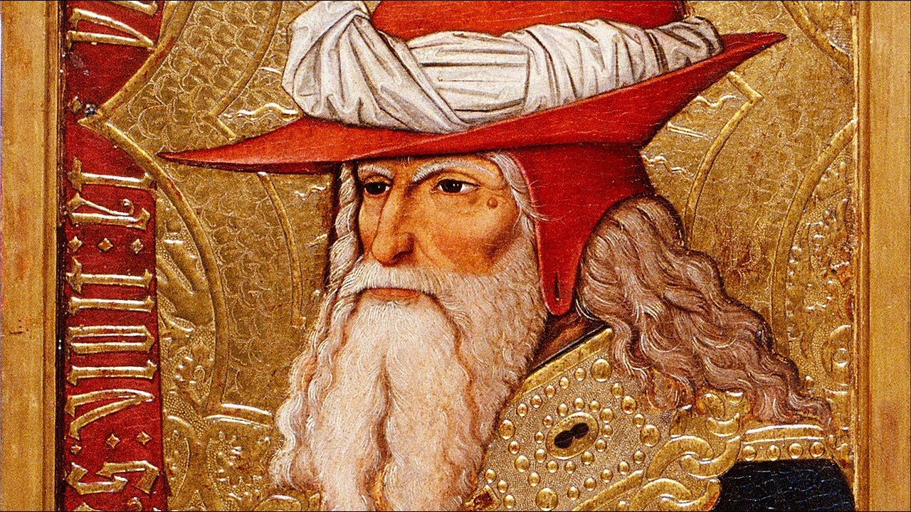

# **Biblical Series X: Abraham: Father of Nations**  

by Dr. Jordan Peterson

*Keywords: Abraham, Isaac, Nations, Covenant, Faith*

## Section I

Hello everyone. It’s been a very strange day. I’m going to tell you about what happened, and then I’ll start the lecture. I got up this morning and started to put my day together, and I tried to sign in to my Gmail account. It said that it had been disabled because I violated the terms of service with Gmail. I thought, ‘well, I didn’t violate any terms of service that I know of.’ I set up a new YouTube channel yesterday, called [Jordan B Peterson Clips](https://www.youtube.com/channel/UCodkb-qBktJI5NrUsPYpf7g/featured). We made some technical changes, and so I thought maybe it had something to do with that. And I had been shut out of Google one other time, years ago.

When you get shut out like that, there’s a little form you can fill out. So I filled out the form, and I said I had been shut out, and that I didn’t know why, and I sent it off. And then I realized that one of my staff members had called me and said that she was locked out of the YouTube account. I thought, ‘oh, yeah! The YouTube account is hooked to the Gmail account.’ That meant that I couldn’t get access to any of my YouTube videos. They were still up and online, but I couldn’t get access to them. I couldn’t post last week’s Biblical lecture, for example. That was worrisome, and made me suspicious. And then, about two hours later, I got an email from Google. They said that they had reviewed my request to be reinstated, and that I had violated Google’s terms of service, and that they weren’t going to turn my account back on. They didn’t say why; they didn’t say anything. There was no warning, whatsoever, about any of this. They didn’t tell me why, and they didn’t say why in the email response. And so I wrote them back—because they said I could—and I said, ‘this might not be a good idea,’ basically, ‘and you might want to think about it.’ And then I tweeted what had happened. I took screenshots, and I tweeted, and I contacted a whole bunch of journalists, because it turns out that I know a whole bunch of journalists.

What happened, then, was that I got a call from The Daily Caller in the United States. I had done an interview with them last week, which isn’t posted yet. They interviewed me, and, within 20 minutes, had posted it online. They have a fairly big audience, and so that was good. And then somebody phoned me from Ottawa, and I did a live radio show. That was good. And then a number of other journalists contacted me, and I sent them the information. But another one of my staff members, my son, emailed me and said, ‘look, you should hold off, because maybe there’s still a mistake.’ I thought, ‘yeah, it might be just a mistake. But then why in the world did I email Google, and they contacted me and said they would not reinstate it, and didn’t provide me with any information?’

I contacted the other journalists, and I said, ‘maybe this is just a mistake, so let’s hold off.’ And then, about half an hour later, while I was trying—I use this AdWords account that’s linked to Google. I don’t run ads on my videos, but I need the AdWords account because it helps me add some little gadgets to the videos that I wouldn’t otherwise be able to. I was always playing with that. The system came back online. I thought, ‘well, that’s interesting.’ Lots of people had emailed and twittered me. Some of the people were from within Google, and some people elsewhere, and they were doing whatever they were going to do to help me get all this material back up and running, and so something worked. My suspicions are that what worked was the publicity. But maybe not, you know?

Being in this situation is very weird. There has been a number of recent episodes where these larger companies—Facebook, Google, Patreon…Not that Patreon is a massive company, but it’s starting to become reasonably significant—have decided, on rather arbitrary grounds, to shut down their users. This is very ominous, partly because we’ve turned our communications over to very large systems, or very large systems have emerged to mediate our communication. There’s lots of benefit to it, so you don’t want to get too cynical about it. But we’re blind with regards to the policies that regulate the regulatory actions of these large organizations. That’s really a bad thing. Something else, that’s even more ominous, is that it’s highly probable that we’re going to build political algorithms into our artificial intelligence. This sort of thing will be regulated by machines that no one understands. That’s a really bad idea, and that’s a really likely possibility.

So anyways, I was all confused about this. I thought, ‘Jesus, maybe I flew off the handle,’ you know? It was stressful, man. I have like 150,000 emails in that account. That’s a lot of emails. It’s all my correspondence for the last 10 years, so it’s an archive as well as an ongoing email system. I have a commercial email system that I just set up three weeks ago, with like six different email addresses, now, to try to organize my correspondence, so I wasn’t completely unable to communicate. But my calendar was gone, and that’s a bloody disaster, because I’ve got things schedules out forever, and I don’t remember what they are. I can’t even remember what I’m doing in a day, much less in a month. But I thought maybe I’d flew off the handle, and I’d worried that I’d contacted journalists too soon. But, anyways, it all worked out.

Then what happened, just as I was coming to this lecture, I stepped outside, and there was a little package. Luckily, it wasn’t a bomb. My wife and I looked inside it, and there was a couple of bottles of wine in there, so that was nice, and there was a little note. I’m going to read you the little note, because it’s actually pretty interesting. This person said that they had finally tackled the [Self Authoring Suite](https://selfauthoring.com/self-authoring-suite.html), so they seemed to be happy about that, but that’s not so interesting, except peripherally.

"A friend on Twitter has contact with Google engineers. She said, ‘I spoke with some friends inside Google, who offered to help.’" I did get contacted by quite a few people at Google, who said that they had been watching my lectures, and so on, and were happy about what I was doing. "‘I spoke with some friends inside Google, who offered to help. But they suggested he set up a backup plan. The teams are feeling significant pressure from advocacy groups," and, quote, "‘I have at least four Google engineers who offered to speak up on his behalf. But they know the team dynamics, and, unfortunately, especially YouTube, is an SJW cesspool. I hope this information is useful to you.’" It’s like, yeah, it’s kind of useful, all right.

So that was part of what happened today. I still don’t really understand it, because I don’t know why it got shut down, and I don’t know if anything I did got it turned back on, and I don’t know the reasons for it. That’s also rather ominous. It seems to me that, when I was thinking it through, I have a fairly…what would you call it…respectable YouTube following. I don’t know if you’d necessarily call it respectable. It’s a fairly large YouTube following. It seems to me that it would have been appropriate for Google, if they were going to shut down my account, to tell me why—I would think—and also look me up, especially after I emailed them, and then maybe not to have emailed me back and said, ‘no, we’re not going to reinstate you, but we’re not going to tell you any reasons.’ They didn’t say they weren’t going to tell me any reasons; they just didn’t tell me any reasons. And then it also seems very strange to me that it just all of a sudden went back on, after two hours.

I don’t know what to make of that. Maybe more information will come to light over the next few days. I hope that I didn’t jump the gun, but it’s a very peculiar set of circumstances. I thought it was kind of amusing, actually, that the video that they stopped me from posting today was the last Biblical lecture. You wouldn’t necessarily think that that would be the sort of thing that people would want to stop from being posted. But we’re in very, very strange times. So that was my adventure for today.

I hate speakers who apologize to the crowd before talking to them, because, if you’re speaking to people, and they put all this effort into coming, then you shouldn’t tell them what a sorry and useless creature you are before you talk to them, and ask for their forbearance and forgiveness. You’re a little late for that, but I’m still going to do that a little bit today. I wanted to spend all day preparing this lecture—I mean, I’ve prepared it a lot beforehand, but that rattled me up a lot, and so I didn’t prepare as much as I could have. Anyways, we’ll stumble forward, and see how it goes. I’m reasonably familiar with the stories, now. Onward and upward.So I’m going to reiterate this. I’ve learned something…I have this idea that it would be a good idea for young people, and older people—citizens of the West, let’s say—to learn more about their culture and their civilization, because it’s a great civilization. It’s taken a lot of work to put together. I know a fair bit about it, but I wouldn’t consider myself nearly as educated as a person should be. But I’m not too badly educated. But I tell you, going through these Biblical lectures, verse by verse, just makes me even more aware of how unbelievably ignorant I am, for two reasons: One is because I’ve been using this [BibleHub.com](http://biblehub.com/) place—I think I told you last week, but I want to reiterate it, because it’s important. The way they’ve set it up is so interesting. You can go through the Biblical stories, verse"
by verse. For each verse, there’s a whole small font page of commentary, from multiple sources. Not only is the Bible a hyperlink in the way that I discussed in the first lecture, with all the verses referring to not all the other verses, but lots of them, but it’s got its tendrils out into literature, direct commentaries on the text, and all the literature that’s been influenced by it. It’s an unbelievably central and core text. It’s so interesting to read a book where every sentence has been commented on, well, really, in volumes. And then to just get a sense of that volume of material, how much brain power has been put into this….I’m so ignorant about this. There’s all this work, and it seems that we’ve left it to decay in the dust, and it’s a big mistake, man. It’s a big mistake, because the people who were writing these commentaries…A lot of it’s from the 14th, 15th, and 16th centuries. It’s kinda archaic, and some of it’s outdated, and some of it you wouldn’t agree with, but, if you read all the commentaries side by side, you get a pretty good blast of wisdom coming at you. The thing about wisdom is it stops you from running face-first into walls. It’s not just there so that you can talk to people at parties about what university you graduated from. It’s there because the information is unbelievably useful.

One of the things that I realized, that I want to return to tonight, that I’ve been thinking a lot about, is this idea of the ark. I think I mentioned to you last week that I figured out that there is this idea that Noah was perfect in this generations, and that meant that he had set his family in order; it wasn’t just him, but he had set his family in order, and, because of that, when the catastrophe came—like it comes to everyone—he was able to withstand it, because he had the support of the people who were near and dear to him. That’s really important when things come along to lay you low. If you’re alone, and the flood comes…Man, goodbye to you. If you’ve got 10 or 15 people supporting you in a tight network, and your interrelationships with them are pristine, and you can tell them the truth, and they can tell the truth back to you, it’s possible that you might be able to find a way that will preserve you, when the terrible things come knocking at your door.

The idea of the ark is very, very concrete in Noah. It’s actually a structure that he inhabits. It’s almost like a child’s story. I’m not being cynical about that. There are some bloody brilliant children’s stories. It’s really concretized, but then Abraham comes along. Instead of an ark, there’s a covenant, right? It says in the story of Noah that Noah walked with God. Of course, it isn’t clearly, exactly, if he’s walking with God, or before God, which we’ll get into later. I see this as part of the increasing psychologization of the sacred ideas that were acted out by archaic people. First of all, it’s concretized in the form of a ship that actually sustains you when the floods come. It’s very concrete imagery; the type of thing you might see in a movie. But then, with Abraham, it turns into a psychological covenant, in some sense. It’s like a contractual agreement. It’s a contractual agreement between Abraham and God, but that doesn’t really matter…Obviously, it matters, but it’s only half of what’s important about that. The other half is that it’s a contract.

One of the things that you do with your ideal, let’s say, is that you establish a contract with it. You also establish a social contract with other people, right? That’s what keeps society organized. There’s this idea, that emerges in the Abraham stories, of a sacred contract, and that has the same function as the ark. God tells Abraham to go forward into the world. We talked about that last week. He does that. He encounters famine, tyranny, and powerful people who want to take from him what’s his. God sends him out in the world, but it’s not like he has an easy ride of it. It isn’t easy, at all. It’s as hard as it can be. But there’s this consistent emphasis in the text—and I think it’s something really worth attending to—that, if you maintain your contract, and that has to do with honesty, trust, truth, and all of those things, then you have the best possible possibility of making your way through the catastrophe and the chaos.

I don’t want to be naive about this. When I read Jung, and I started to understand the idea of the hero archetype—you know, the idea that the human being is a logos force that can stand up against chaos, catastrophe, tragedy, and evil, and prevail…I never did think that’s what it meant, that, if you did stand up, and tell the truth, that you would necessarily prevail. It’s not a magic trick. It’s your best bet. That’s the thing: you don’t have a better option.

The idea’s emerging in the Abrahamic texts. It’s like, people are figuring this out: that would be progressive revelation. That’s one way of thinking about it. You can think about that in religious terms, but you could also think about it as humanity consulting itself, each individual talking to themselves, which is what we do when we think. Each individual communicating with every other individual, and gathering a body of wisdom that helps people orient themselves in the toughest conditions. It’s an incremental process. I really do believe that’s speaking purely secularly. I do believe that’s what manifests itself in Biblical stories. It’s the dawning enlightenment of mankind—something like that—as we start to understand the principles by which we have to live, in order to orient ourselves properly in the world.

I also do believe—this is the unspoken question. You don’t have any idea how rich and fulfilling your life could be, despite its tragedy and limitation, if you stopped doing the things that you know to be wrong. It’s a really grand experiment. One of the things that God tells Abraham, constantly, as the story progresses—especially every time Abraham makes a sacrifice—God says, "walk with me, and be perfect." It’s something like that. And so the injunction is, aim high; establish this relationship with the highest thing that you can conceive of. You might as well do that, because what are you going to do, establish a relationship with the most mediocre thing you can conceive of? Or are you going to establish relationship with the lowest thing that you can conceive of? People do that, and I wouldn’t recommend it. It’s a really bad thing. There’s a lot of pain associated with that, and maybe there’s pain that can expand into a world-destroying force, down that route. There’s absolutely no doubt about that. Is there something superstitious and foolish about attempting to establish a contractual relationship with the source of all being? I just don’t see that as an erroneous conception. It’s not necessary, perhaps, to get lost in the details. We can argue forever about what God might or might not be, but we could at least say that the concept of God is an embodiment of humanity’s highest ideal. We could at least agree on that. And then you might say, ‘well, is that real?’ The first thing I would say about that is, there’s a lot of things about the world we don’t understand. The second thing I would say is, it depends bloody well on what you mean by ‘real.’ That’s for sure. That turns out to be a very complicated question.

## Section II

[TIMESTAMP](https://youtu.be/3Y6bCqT85Pc?t=1167)

Ok, so Abram had just gone off to fight a bunch of kings, and get his nephew back, which seemed to be a pretty courageous act. So that brought a story to an end. It’s interesting. I think what happens in the narrative is that there’s a story. So Abraham is somewhere, and he goes somewhere else. That’s a story, and he has adventures along the way. Those adventures are usually the typical kind of adventure, which is a rift in the structure of the story, and exposure to a kind of chaos and novelty, and then a reconstitution of the mode of being. So that’s a classic story: you are somewhere; you’re a certain way; you’re moving forward; something happens that you don’t expect; it blows you into pieces; it introduces chaos; you face the dragon; you get the gold, or maybe the bloody thing eats you, and the story is over, and then you get to where you’re going. But then the question is, well, what happens when you get to where you’re going? That’s a really important issue.

One of the things that happens to people all the time in their life is that they get to where they’re going, and then they don’t know what to do. For example, when you graduate from university: It’s like, ok, story over. Who are you, now? Who are you the next day? What happens is, when you succeed, then there’s a success crisis. The success crisis is, well, I’ve run this story to its end. Now what? That’s exactly what happens in the Abrahamic stories. They’re punctuated by a period of contemplation and sacrifice. So every time an Abrahamic story comes to its end, then Abraham makes another sacrifice, and communes with God, and then he figures out what to do next. That seems psychologically right. What you should do when your story comes to an end, when you’ve achieved what it is that you want to achieve—or perhaps when you’re in terribly dire straits, but we won’t talk about that at the moment—the next question is, ok, now I’m that person, or I have that character. What do I need to do next? Some of that is always, well, what do I need to give up? What do I need to let go of so I can move to the next plateau? Assuming that your life is, hopefully, a sequence of upward moving…It’s like [Sisyphus](https://en.wikipedia.org/wiki/Sisyphus), but each time you climb up the mountain, you get a little higher on the mountain. It’s something like that. So it’s Sisyphus with an optimistic bent. And, maybe if you push the rock up the mountain properly, and let it roll down, and if you do that right, then it’s ok. Every time you roll it back up, it’s better, in some sense. I don’t think that’s unrealistic, either.

Abraham goes and rescues his nephew from this tyrannical king, and that’s very brave. He doesn’t take any reward for it, because, as far as he’s concerned, it’s just a manifestation of the right thing. And then he has another vision."After these things"—that’s the battle—"the word of the Lord came unto Abram in a vision, saying, Fear not, Abram: I am thy shield, and thy exceeding great reward. And Abram said, Lord God, what wilt thou give me, seeing I go childless, and the steward of my house is this Eliezer of Damascus? And Abram said, Behold, to me thou hast given no seed: and, lo, one born in my house is mine heir. And, behold, the word of the Lord came unto him, saying, This shall not be thine heir; but he that shall come forth out of thine own bowels shall be thine heir."And he brought him forth abroad, and said, Look now toward heaven, and tell the stars, if thou be able to number them: and he said unto him, So shall thy seed be. And he believed in the Lord; and he counted it to him for righteousness. And he said unto him, I am the Lord that brought thee out of Ur of the Chaldees, to give thee this land to inherit it. And he said, Lord God, whereby shall I know that I shall inherit it?"And then he does a sacrifice: "Take me an heifer of three years old, and a she goat of three years old, and a ram of three years old, and a turtledove, and a young pigeon."And then God comes down, and, well, Abraham goes into a trance—that’s what it appears to be, in the story—and has a great terror, and then God appears to him. I’ll just review this commentary, again. This is from [Joseph Benson](https://en.wikipedia.org/wiki/Joseph_Benson): "And when the sun was going down"—that’s about the time when you wash up for the evening—and he’s "praying and waiting till toward evening; a deep sleep fell upon Abram—not a common sleep through weariness or carelessness, but a divine ecstasy, that, being wholly taken off from things sensible, he might be wholly taken up with the contemplation of things spiritual."

Very strange—a very, very strange series of interpretations. It does seem that what happens to Abraham is that he falls into some sort of revelatory trance. And so, as I’ve taken some pains to explain, we don’t really understand such things. We can’t rule out their existence, because there’s too much evidence that they do, in fact, occur. Perhaps it’s a technology that we no longer possess. That’s one possibility. Perhaps we no longer know how to access these sorts of states of consciousness. It’s certainly possible.

"And lo, a horror of great darkness fell upon him—this was designed to strike an awe upon the spirit of Abram, and to possess him with a holy reverence. Holy fear prepares the soul for holy joy; God humbles first, and then lifts up."

I think that’s right, too. One of the experiences I’ve had in my life—fairly commonly, in a variety of different ways…This is especially true when I was paying a lot of attention to my dreams, which I did for about 15 years, I guess. Something like that. Now and then I would feel like I’d learned some things, and had sort of consolidated them, and then, before I went to sleep, I’d think, ok, I’m ready to learn something else. I didn’t say that without trepidation, because, usually, when you learn something, it’s not that pleasant. You usually learn something about why you’re wrong, and the deeper the thing that you learn, the more you learn about why you’re wrong. There’s a death that’s associated with that, because then you have to let that part of you that’s wrong die. That’s the sacrifice, right? You have to be willing to make a sacrifice before you’re going to learn something. And perhaps what you’ll learn is in proportion to your willingness to make a sacrifice. I really do believe that. I also think that, if you commit to something, that means that you don’t do a bunch of other things, right? So that’s a sacrifice of all those other things. You commit to it, and you set your sights on it. If you really commit to it, and you get the sacrifice right, so to speak, then the probability that that thing will be successful vastly increases. I think that’s also not a naive way of thinking, or a foolish way of thinking. My experience has been that that’s the case.

Back to the dream. I mean, I do think that we learn in trepidation, and that, most of the time, you have to be laid low before the new revelation can make itself manifest. I think that’s also what happens to people, often, in psychedelic experiences, when they have a bad trip. They don’t get through the bad part of it, and maybe that’s because there’s so much mess in their lives. Now, I’m speculating, but it’s informed speculation. There’s so much mess in their lives that the altered state of conscious makes manifest that it’s like a little trip through hell. But the mess is so complete, comprehensive, and all-pervading that there’s no way they can get through it. Now, if they could get through it, and start to sort those things out, there would be, perhaps, a compensatory, positive revelation, at the end. But the first thing is, if you want to learn something, you’re going to encounter…Well, you have to figure out what’s wrong before you can figure out what wisdom you need next, to guide yourself. That’s no laughing matter. So I think that’s what this refers to. I think that’s the sort of psychological experience that this refers to.

We built this a little bit into the [Future Authoring Program](https://selfauthoring.com/future-authoring.html). I read this really cool paper, once. It was a review by this guy named [Jeffrey Gray](https://en.wikipedia.org/wiki/Jeffrey_Alan_Gray). Jeffrey Gray wrote a book called [The Neuropsychology of Anxiety](http://www.oxfordscholarship.com/view/10.1093/acprof:oso/9780198522713.001.0001/acprof-9780198522713), and that is a great book. It is impossible to read. It took me, really, like six months to read it. The reason for that is that he reviewed about 3,000 papers, and they were all neurological papers, and heavy psychological-slash-biological papers. He actually read them all, and he understood them, and he synthesized them. And then he wrote this book about the synthesis. He’s very, very careful of his terminology. And so to read the book you have to understand brain anatomy, neuropharmacology, the whole literature on animal behaviour, and a whole whopping dose of human psychology and cybernetics. It’s a vicious book, but you really learn something when you read it, if you go through it bit by bit. It’s had an overwhelming influence on psychology, even among people who haven’t read it, which is most of the people who cite it, by the way.

He outlined this real cool study about how to motivate rats. Rats are a lot like us, in positive and negative ways. Biochemically and psychopharmacologically, they’re very, very similar, and they have very complex social environments. They have hierarchies, and they play, and they laugh. [Jaak Panksepp](https://en.wikipedia.org/wiki/Jaak_Panksepp) found out that rats laugh if you tickle them. You can tickle them with the end of a pencil eraser, but you can’t hear them laughing, because they laugh ultrasonically, like rats, so you have to record it, then slow it down. Then you can hear them giggling away, when you tickle them. You think, ‘you’re going to spend 50,000 dollars on a study demonstrating that rats laugh?’ And you think, ‘well, wait a second. That’s a major league study: Jaak Panksepp discovered the play circuit in mammals.’ That’s a bloody big deal. If you get that by rubbing rats with a pencil eraser, then good for you.

Anyways, Gray talked a lot about how to motivate a rat. You might have heard about [B.F. Skinner](https://en.wikipedia.org/wiki/B._F._Skinner). He used food pellets to motivate his rats. But what you don’t know about Skinner is that those rats were starved to three quarters of their normal body weight, so they would work for food, man. Skinner’s rats were kind of oversimplified. But you can get rats to work for food. They don’t have to be that hungry. They’ll do all sorts of things. They’ll press levers, and they’ll open doors, and they’ll solve problems. One of the things you can do to kind of measure how much the rat is motivated—let’s say you’ve run him through a maze, and he knows there’s some food at the end of the maze. You can tied a little spring to his tail, and see how hard he pulls when you open the door to the maze, because that’s how much work the rat is willing to do. So you can measure that. Or you can see how fast he skitters down the maze. You can get an estimate about the rat’s motivation. And so then you might say, ‘well, how motivated is a hungry rat?’ The answer would be, it depends on how hungry he is. But there’s another answer: it also depends on what’s chasing him when he’s going after the food. So if you have a rat, and you have food over here, and you waft in some cat odour—rats hate cat odour, and it’s innate; they never have to see or smell a cat to be absolutely petrified by cat odour—and then open the door, that rat will zoom to that food a lot faster than if it’s just hungry. So a rat running away from something that it doesn’t want, towards something that it does want, is a very motivated rat.

There’s this idea in the Old Testament that the fear of God is the beginning of wisdom. It’s a pretty harsh idea. But there’s something really useful about it. One of the things you see with people, all the time, is that maybe they’re trying to stumble forward, towards their ideal, as poorly defined as it might be, but then they’re afraid, right? They’re afraid about what they might encounter, and that stops them, because fear does stop people. It freezes you, like a prey animal. People move ahead, but then they get afraid, and then they stop moving ahead, and that’s not so good. Negative emotion is a really powerful motivator, so we’re more motivated by negative emotion than positive emotion, quantitatively speaking. Quantitatively speaking, you can measure that. That’s, I think, because we can only be so happy, but we can really be suffering and dead. You have to pay more attention to the negative, and that’s bad, because the negative can stop you.

In my clinical practice, I often talk to people who are trying to make a difficult life decision. They are weighing out the costs and the benefits of making the life decision. One of the things I always talk to them about is, wait a second, that’s an incomplete analysis. You have to weigh out the benefits and the costs of doing this, and you have to weigh out the costs and benefits of not doing it. That’s not the same as the zero that you assume that you’re starting with, right? Because to not make a decision also has a cost, and sometimes the cost of not making a decision is far worse than the cost of making a decision, even if the decision is risky. And so one of the things you can derive from that—and this is very useful, I think—is that—this is also, I think, why it’s so useful to contemplate your mortality, so to speak—you’re screwed no matter what you do. That actually frees you. You have path A that has catastrophes, and you have path B that has catastrophes, and you don’t get to have the no catastrophe path, but you get to pick which one. That’s really something. If you know that there’s terrible risk associated with everything that you do and don’t do, then you can afford to take some risks, because you’re not—this is all within the ark metaphor. I’m still making the case that, despite the fact that your life is essentially catastrophic, you can make a covenant with the highest ideal, and that will take you through it the best way possible. I’m still making that case.

So then you think, ok, ‘I’m trying to make this decision. I’m going to try to do something difficult, and isn’t that terrifying.’ And then you think, ‘yeah, but wait a minute. What’s really terrifying is not doing it.’ And then you think about the cost of not doing it. In the [Future Authoring Program](https://selfauthoring.com/future-authoring.html), we have people do this little meditative exercise, which is, ok, think about your insufficiencies, by your own definition, the way that you don’t do what you know you should do—about the things that you do, that you shouldn’t do, that you know you shouldn’t do beyond a shadow of a doubt. There’s some things like that. That’s bad habits, and poor aim, and resentment, and hatred, and aggression, and unresolved conflicts, and all those things that are dementing and warping you. And then think, ok, those things get the upper hand, man. They get the upper hand, and they take you to the worst possible place you could go in the next three to five years. What exactly does that look like? And so you sketch all that out, and you think, ‘hey, I don’t want to go there.’ The next time that a temptation comes up, you think, ‘well, it’d be a lot better for me if I didn’t succumb to this temptation.’ That’s kind of weak, eh? You’d look a little better if you didn’t eat like a cheesecake a day, or something like that. That’s something, but it’s not the same as, I’m going to have diabetes, and I’m going to lose my damn leg in five years if I don’t get my eating under control. That’s motivating. So then the temptation comes along, and you think, ‘oh, how about no?’ Seriously—how about no? Not just because a higher good would be obtained if I avoided it, but because a terrible catastrophe would be averted if I didn’t.

Well, so you want to get your fear behind you, right? You want to get it behind you, where it’s pushing you forward, instead of in front of you, where it’s stopping you. You get your fear behind you, pushing you forward, by actually thinking through the consequences of not putting your life together, and that the least of those is that you waste it, and suffer. You’re going to suffer anyways, man, so you waste it, and suffer. That’s a bad deal, because, maybe, if you’re going to suffer, you could at least do something noble, glorious, upright, powerful, honourable, admirable, helpful, and difficult. That’s just so much better, and maybe that’s good enough so that you think, ‘hey, a little suffering; it’s basically worth it. At least it’s a way forward.’

## Section III

[TIMESTAMP](https://youtu.be/3Y6bCqT85Pc?t=2194)

"And he said unto Abram, Know of a surety that thy seed shall be a stranger in a land that is not their’s, and shall serve them; and they shall afflict them four hundred years." God, he’s hedging his bets here a lot, right? He says to Abraham, ‘well, go out into the world,’ and then he confronts him with a famine, and he confronts him with a tyranny, and with powerful people who want to take his wife, and then he loses his nephew, and then he has to go fight a war, and now he’s reconstituting this covenant. God says, ‘yeah, a nation is going to come from you, but they’re going to be slaves to tyrants for like 400 years.’ He’s not a great salesman, exactly. But the thing I like about it is that it’s realistic. You gotta think, too, who knows why it is that the Bible exists, or why people wrote it? But, you know, if they’re gonna sell you something, I don’t know if this is the way to do it.

Unless you’re a salesman who’s sophisticated beyond belief—because you’d think that, if it was just a matter of controlling the masses, let’s say, which is one, say, Marxist interpretation of religion, or a matter of providing people with a primitive defense against death anxiety, which is essentially the Freudian interpretation, that you’d make the deals that God cut with Abraham a little more on the positive and polished side, instead of making them a realistic offer, constantly, like they are. That’s part of the reason, I think, it is reasonable to treat the Bible as literature. It’s more than literature. It’s something other than literature. But you can treat it as literature, and I think the reason you can treat it as literature is because the characters are all complex, including the character of God himself. It’s complex and sophisticated. It’s not one-sided. It’s paradoxical and incomprehensible, at times, but I think good literature is like that.

Here’s something about true art. This is something I learned from Jung. It’s so smart. Imagine that you inhabit the land that you know, conceptually and practically. And then imagine outside of that. There’s a massive space of things that you don’t know. And even outside of that, there’s a space of things that no one knows. So it’s the known territories surrounded by the unknown. That’s the canonical, archetypal landscape. The unknown manifests itself to you, and that’s where new knowledge comes from. But the question is, how is that knowledge generated? It doesn’t just leap from completely unknown to completely articulated in one move. That isn’t how it happens. It has to pass through stages of analysis before it becomes articulable.

The first stage of analysis, as far as I can tell, is that you act it out. So if something really surprises you, you first react to it with your body. That’s your first category. It’s not conceptual, at all. It’s embodied. And then maybe you’re at home, at night. Something startles you, and you freeze. It’s dark. Your imagination populates the darkness with whatever might be making the noise. That’s the sequence: embodied response, imaginative representation, exploration, articulation. That’s how information moves from the unknown to the known. Artists are the people who stand on that imagistic frontier. They put themselves out into the unknown, and they take a piece of it, and they transform it into some mythological image. They don’t know what they’re doing, exactly. They’re guided by their intuition, if they’re real artists. Otherwise, they’re just propagandists. They have to be contending with something that they don’t understand. What they do is they make it more understandable. And then people gaze at those artworks, or they listen to the stories, and then they start to become informed by them, but they don’t know how or why.

I was at the modern museum of art in New York. I’m afraid I don’t remember which one, unfortunately. I was in this amazing room. It had all these priceless paintings from the late renaissance hanging in it—each painting worth, who knows. A billion dollars, maybe. Priceless paintings. The room was a shrine. It was full of people from all over the world, who were looking at these paintings. You think, ‘well, what the hell are these people doing, coming to this room, looking at these paintings? What are they up to?’ One of them was the painting of the [Assumption of Mary](https://en.wikipedia.org/wiki/Assumption_of_Mary). Brilliantly composed. All these people were looking at it. I thought, ‘what are they doing? They don’t know what that means. Why are they looking at that painting? Why is it in this room? Why is that painting worth so much?’ And the answer to that is, well, we don’t really know. It happened; they’re sacred objects, in some sense. We gaze at them in ignorance and wonder. The reason for that is that the unknown shines through them at us, in partially articulated form. Well, that’s the role of art, and that’s the role of artists.

Real artists are contending with the unknown, and they’re possessed by it. They have a personality trait—openness—that makes them do that. They can’t even help it. I’ve had lots of creative people in my clinical practice. I can tell you, the worst thing for creative people is to not be creative, because they just die. Maybe you’re a tree with a few major branches. That’s your personality. So if you’re extroverted, you can’t be cut off from people, because you just wither. And if you’re agreeable, you have to be in an intimate relationship, or you die. And if you’re conscientious, and you’re unemployed, you’re just going to eat yourself up, because you have to have a duty, and you have to carry a load. You just can’t stand it, otherwise. Open people have to be creative. They have to be, because, otherwise, they die. They don’t have any vitality. They’re cursed with the necessity of putting a foot out into the unknown, and making sense of it. They’re also cursed with the necessity of trying to make a living while they’re doing that, which they can’t, because it’s almost impossible to monetize creative action, as many of you who are creative will no doubt find out. It’s very, very frustrating.

It’s not that creative action is without value. The creative people are entrepreneurs, and the creative people revitalize cities, and the creative people make things magnificent and beautiful. You think about what’s happened in Europe over the last 2,000 years. It’s amazing: an unbelievable collaboration to make things so beautiful that they’re jaw dropping when you walk into them. You think about the economic value of that, right? I think it’s either France or Spain that’s the most visited country in the world. It’s one of those two, I think. I think there’s more tourists in France than there are people, most of the time. Part of the reason for that is that it’s just so damn beautiful. You just can’t stand it. You think, ‘what’s the economic value of that?’ It’s absolutely incalculable. What’s interesting, too, is that you build that beauty in, and then the farther away you get from it in time, the more valuable it becomes, right? Instead of decaying, it has exactly the opposite effect: its value magnifies.

One of the things that I’m deeply ashamed of, as a Canadian, is that our sense of beauty is so underdeveloped. We’re so primitive…It’s not even primitive. That’s the wrong word. I don’t know what it is. It’s second-rate, at least. It’s terror, too, because people are afraid of beauty. But the idea that art is…The conservatives really have a problem with this, in particular. Conservative people tend not to be that creative, by temperament. It’s a mystery to me, because they should be concerned with economic development, and beauty is so unbelievably crucial to economic development. It just yells out at you.

Anyways, so that’s what artists are doing. One of the things I would say is, buy a damn piece of art! Find one that really speaks to you, and buy a piece of art, because you invite that into your life. Look out, if you do it. If it’s a real piece of art—because you’ll also get a little introduction to the artist, and then that’ll seep into your life. That’ll change things like mad. But it’s unbelievably worth it. It opens your eyes to the domain of the transcendent. That’s the right way of thinking about it. A real piece of art is a window into the transcendent. That’s what it is. You need that in your life, because you’re finite and limited, and bounded by your ignorance and lack of knowing. Unless you can make a connection to the transcendent, then you don’t have the strength to prevail. That’s part of the covenant with God. You can see that.

You look at these magnificent cathedrals that our civilization built over the centuries…They’re still building the [Sagrada Familia](http://www.sagradafamilia.org/en/) in Barcelona. It’s an amazing building. I think it’s going to take them 300 years to build that. People in the Middle Ages, they’d start building a cathedral, and they’d think, ah, we’ll be done this in 300 years. Imagine the vision that it took to invest in something like that! We look at quarterly reports. We can’t think 300 years into the future, to build something of that kind of remarkable…remarkable what? Those cathedrals are trees, first, right? They’re a forest, right? The gothic cathedrals, they’re forests, and the sun is shining through the branches. That’s the stained glass. They’re the perfect balance of light and structure. They’re representing something about the proper structure of being, which is something like the proper balance between light and structure. They represent the sacred tragedy of mankind. That’s why they’re in the shape of a cross. They’re open to the sky. That’s why they have a dome. They’re full of gold so that it glitters. That’s like the city of God. You can see that. Integral to our culture is the idea that duty is one pathway towards God, and if you can’t find another pathway, why don’t you use beauty?

I’m sure most of you do that with music. Music is the one thing that modern people can’t be cynical about. Thank God for that. We’ve been fascinated by music. It speaks meaning to people, even nihilistic, punk rockers are so damn engaged with their music that they can hardly stand it. You can knock on them and say, ‘look, you’re having a transcendent religious experience,’ and they’ll just tell you to fuck off, hah, because that’s what punk rockers have to do. But that’s still what’s happening.

Ok, so I got into all of that because I was talking about the Bible as literature. We need, in our culture, to justify the arts. I don’t want to do that by talking about high culture, or about something abstract and evanescent. That’s the wrong way to go about it. This is vital. One of the things that’s really interesting about the University of Toronto is that the one side of the campus, where we are, is beautiful, medieval cathedral, and the other side is Godawful factory. The thing is, the attitude towards knowledge has paralleled that architectural transformation. At one point, the humanities, let’s say, were a sacred endeavour, and so was the art of being educated in the university. That’s turned into mass factory, and that’s reflected in the architecture. This isn’t accidental. None of this happens by random chance. It’s not like there’s a conspiracy or anything, because there isn’t. But that doesn’t mean that these things aren’t tangled together. The loss of beauty in the universities is a catastrophe. Without that beauty, there’s no call to higher being.

I’ve mentioned to people that they should clean up their rooms. That’s become quite the internet meme. But I’m really serious about it, because it’s really hard to do that. I’ve been cleaning up my room, by the way, for about four months, now. My life was thrown into such a catastrophe, and also we were renovating. But it isn’t just that you clean it up; you also make it beautiful. It’s really hard to make something beautiful. It’s really worthwhile, and what’s really cool is that, if you learn to make something beautiful, even one thing, if you can make one thing in your life beautiful, then you’ve established a relationship with beauty, and then you can start to expand that relationship with beauty out into the world, into other elements of your life. That is so worthwhile. It’s just incredibly, crazily worthwhile. That’s an invitation to the divine. You have to be daring to do that.

People are terrified of colour; they paint their walls beige. They’re terrified of art; they buy some mass-produced thing because they don’t want anybody laughing at them for their lack of taste, and they would get laughed at, because they have no taste. Well, it’s right, because what do you know? But you have to develop it, and so you’re going to stumble along, and make mistakes, to begin with. Somebody comes over, and goes, ‘heh, what’s up with you?’ It’s kind of hard on your self-esteem. But you’re stumbling towards the kingdom of God. That’s what you’re stumbling towards when you try to make an aesthetic decision, and put something in your life that’s beautiful. It’s unbelievably worthwhile to do that. You have to steer clear of the frauds and the con artists and all of that. Art is full of that, of course, because it’s difficult to distinguish between the real thing and the fraud. But it’s unbelievably worthwhile. And so back to literature.

I’m telling you this partly because I’ve been thinking a lot about the humanities and the arts. Practically speaking—because I know that artistic types are also entrepreneurial types, and the same personality types, and so it’s very much worthwhile to make an economic and practical case for this sort of thing. You study literature and the humanities so that you can familiarize yourself with the wisdom of our civilization. You should do that, because people have been working on this thing for a long time. It’s rich beyond comparison, so why wouldn’t you do that? You teach yourself to read, and you teach yourself to speak, and you teach yourself to think, and you teach yourself to communicate. I can tell you, if you can read, think, and communicate, you are absolutely, 100 percent unstoppable.

That’s another thing that’s so interesting about the humanities education, that’s at the core of the university: there’s nothing more economically valuable than teaching people how to articulate themselves and communicate. They can identify problems; they can formulate solutions; they can negotiate consensus; they can negotiate on their own behalf, and on the behalf of others…There’s absolutely no downside to it, except that there’s responsibility that goes along with it, but it doesn’t matter, because there’s no escape from responsibility. You can either take it voluntarily or involuntarily. Those are your options. There aren’t any other options. And so we need to understand the role of art and literature, and stop thinking about it as an option. It’s not an option. "Man does not live by bread alone." That’s exactly right. We live by beauty. We live by literature. We live by art. Literally, not metaphorically. We cannot live without it, because life is too dismal and tragic in the absence of the sublime. And ourselves, we have to be sharp, so that we can survive properly, and orient the world properly, and not destroy things, including ourselves.

Back to the Bible, which I do think is reasonably construed as a piece of literature. It’s deep, and the people who wrote it had at least one foot in the unknowable, and they’re trying to communicate what they experienced in the unknowable, to make it known. That’s partly what we’re trying to do in this series, and what you’re trying to do while you’re listening, so good for that."And also that nation, whom they shall serve, will I judge: and afterward shall they come out with great substance." There will be a period of tyranny. There’s a psychological truth to that, too.

One of the things I learned from reading Nietzsche—because you can learn a lot from reading Nietzsche. That’s for sure. He talked about the Catholic Church. Nietzsche’s often construed as a great critic of Christianity, and he certainly was, but he was no casual critic. In fact, I think he was the sort of critic who you’d like to have as a friend. He was the sort of critic that said, ‘well, here’s the great things you’ve done, and that you could keep doing, but here’s a bunch of things that you did that you should really stop doing.’ He talked about the Catholic Church, and he said that the Catholic Church had disciplined the European mind, so that over a period of 1,000 years, 1,300 years, 1,400 years, there was this rule that there was a conceptual structure within which you had to interpret everything. What that did was turn the educated European mind into a systematizing, cognitive entity. Once that systematizing, cognitive entity had been established, then it could free itself from those underlying disciplinary structures, and go off, and do such things as produce the scientific revolution, for example, which required incredible systematic thinking.

Nietzsche had this really interesting idea about freedom. He believed that slavery was an intermediary between the undeveloped individual and the free individual—that you had to submit yourself to some intense disciplinary process, for some period of time in your life, before you could develop any true freedom. You think, maybe you want to learn to play the piano. It’s like, that’s not going to be any fun for a really long period of time, right? Because you’re really bad at it, and there’s a million things you have to memorize, and you have to stumble around like an amateur. The same thing happens when kids learn how to read, and some of them never get past that point, and they never get to the point where they can enjoy reading. But in order to put yourself together, you have to put yourself in a vise, and allow yourself to be constricted—and mangled, even—by the thing that enslaves. But the goal should be that, as a consequence of submitting to the discipline, that you become disciplined. And then, once you become disciplined, you can emerge from the disciplinary structure as someone who’s free. That’s something that’s very much worth thinking about, as well.

That’s illustrated, conceptually, in this piece of literature. The psychological meaning of what God tells Abraham is that all people are subject—not equally, obviously—to the tyranny that precedes freedom. That idea is repeated over and over in the Old Testament, and it comes out most particularly in the story of Moses. That’s the story of movement from tyranny. Where do you go from a tyranny? It’s an absolute catastrophe. You go from a tyranny into the desert, where you starve. It’s harsh. That’s what happens in the story of Exodus. That’s so interesting, too, because what it means is that, sometimes, if you’re going to move uphill, the first thing that happens is you move downhill a lot. So if you want to escape from the straits that bind you, you’re not going to move forward and up: you’re going to move forward and down. This is also something that Jung talked about a lot. On the road to enlightenment, you encounter all the things that you don’t want to encounter, first—all the weakness of your Self, all the realizations of the tyranny of the world, and the catastrophe of nature, and all of that. You step out of your ignorant encapsulation, and it’s an immediate plummet into something that’s a desert, let’s say, where everything’s chaotic, and where you’re wandering around without direction. A real catastrophe.

One of the things you might ask yourself is that, if enlightenment is possible, then why aren’t people enlightenment? If it was just a matter of going from a good place to a better place, it’s like, well, man, let’s just get at it! It’s no problem, right? Why would we ever stop doing that? But it seems not to be that. It’s that you’re here, and that’s not good, and it’s unstable, and you step out of it, and it’s down—down to where you don’t want to be. You have to contend with that. And then, maybe, you can start your struggle upward. God is telling Abraham this. He’s also telling him that it’s ok. It’s rough, though."And thou shalt go to thy fathers in peace; thou shalt be buried in a good old age. But in the fourth generation they shall come hither again"—that’s the Israelites: the descendants of Abraham—"for the iniquity of the Amorites is not yet full." God is going to leave the tyrants alone until they’ve manifested their full tyranny, for reasons that we don’t fully understand.

"And it came to pass, that, when the sun went down, and it was dark, behold a smoking furnace, and a burning lamp that passed between those pieces."[Albert Barnes](https://en.wikipedia.org/wiki/Albert_Barnes_(theologian)) said, "the oven of smoke and lamp of flame symbolize the destruction"—which we’ve already talked about: this catastrophe of the initial stages—"and the light of salvation. Their passing through the pieces of the victims and probably consuming them as an accepted sacrifice are the ratification of the covenant on the part of God, as the dividing and presenting of them were on the part of Abram.""In the same day the Lord made a covenant with Abram, saying, Unto thy seed have I given his land, from the river of Egypt unto the great river, the river Euphrates. Now Sarai Abram’s wife bare him no children: and she had an handmaid, an Egyptian, whose name was Hagar." So this is a big catastrophe for Abraham, especially in those times. Perhaps it’s a big catastrophe, now, although perhaps people aren’t as conscious of it as they once were. For Abraham, without a biological son, there was no vision forward into the future. We don’t really know what sort of timespan over which these archaic people thought. But the medieval people, we already said, could think 300 years into the future, without batting an eye. These people, who were concerned about their descendants, were obviously thinking about existence in a way that wasn’t just focused on their immediate existence, right? They were thinking about, well, their children, grandchildren, and maybe their great-grandchildren—and maybe the whole society that stemmed out from them. That’s smart.

One of the things I learned from [Piaget](https://en.wikipedia.org/wiki/Jean_Piaget), at least in part, was his idea of the equilibrated state, which he thought about as part of the biological basis of the idea of moral progress. It’s something like that. Piaget was very, very smart. He said that the proper equilibrated state is one where—imagine you have a family. You’ve got five people in it, and you’re doing what you want, in your family, what’s good for you. But you’re doing it in such a way that the other four members of your family agree with what you do, and that it also facilitates them doing what they want, and what they should be doing. And so it’s a really tricky range. It isn’t just for you; it’s for you in a way that’s for them. You could also see that that would be something that would be a multiplier, right? If you have everyone working voluntarily towards the same common goal, then you get a multiplying effect of that. And then you might think, well, it’s not just you and your family: It’s you and your family today, and next week, and next month, and next year, and 10 years from now, so you have to take the timespan into account. And then it should be you and your family in a way that works well in society, and then it should work well now, and next week, and next year, and into the future. It should be iterable.

It’s something like the idea of sustainability. I would say that’s a reasonable way of conceptualizing the holy city. It’s something like that. If you’re trying to make it concrete, it’s like, how should you live your life? Well, let’s say you live your life in a manner that justifies its limitation and tragedy. That’s a good start. But then, let’s say that it does that in a way that also reduces the limitations and suffering of the people that you interact with, now and into the future. Well, maybe there’s a way to do that. A good negotiation does that, right? Because if you’re negotiating with someone, like your wife, for example, what you want is for her to agree with the negotiation. Here is one of the things that Piaget said, which I think was brilliant: if you take an equilibrated system—a family, let’s say—and a dis-equilibrated system—that would be one where the father is a tyrant, and everyone is operating under his whip—and you put them into a head-to-head competition, the equilibrated system will outcompete the dis-equilibrated system, because the enforcement cost is such that it will slow the system down. You’ll get resistances from the people inside the system; the system will be working at counter-purposes to itself, plus there’s enforcement costs. And so a tyranny cannot beat an equilibrated system.

I was really excited to encounter that idea. When I encountered it, I was also trying to figure out if there was some quantitative difference between the system, say, of the Soviet Union and Maoist China, and the systems of the West, apart from just arbitrary world interpretation, as the postmodern nihilists might have it—if there was something fundamental at stake in the terrible Cold War that we fought, or if it was just a matter of opinion. The Piagetian take was that, well, roughly speaking, the West was an equilibrated system—not perfectly equilibrated, but reasonably equilibrated, in that people, even if they were slaves to some degree, were at least voluntary slaves, instead of involuntary slaves, and that was better. The system was actually technically better, and not just as a matter of interpretation. That’s a lovely thing to know. I think it’s a really, really solid idea. I haven’t been able to put crowbars under that idea, and lift it up. I think it’s a good one.

## Section IV

[TIMESTAMP](https://youtu.be/3Y6bCqT85Pc?t=3768)

"Now Sarai Abram’s wife bare him no children." Ok, so back to children. One of the things that’s worth thinking about with regards to reading these old stories—because modern people are very arrogant. We look at these old stories, and we think, ah, we’ve transcended all that superstition. It’s like, don’t be so bloody sure about that. These people weren’t stupid. There are ways that they viewed the world that we don’t have anymore. One of them seems to be this concern for descendants, because that just isn’t part of our way of thinking. We have a very short-term way of thinking. It’s not even one lifetime long. It’s certainly not multiple lifetimes long. It isn’t clear to me, at all, that that’s for the best. The constant complain that the environmentalists generate—some of which is justified, and some of which is anti-capitalist, anti-patriarchal nonsense that should be cleared out of that entire conversation—is that we need to take a longer view, and consider more things in our purview when we act. That’s fair enough. Do we really want an ocean with nothing in it but jellyfish? Because that’s really what we’re doing, and we’re doing it very, very, rapidly. That data on that are very clear.

When you lift up your eyes, and you make a connection with something that’s transcendent, then that should bring more of the world within your purview. Maybe that’s concern for the endless number of descendants that you might have. You might think, too, well, if you’re a successful person, if you have a successful family, God only know how many people you will be the father of. You’re a nexus, right? All sorts of things have come together in the cosmos to produce you. All sorts of things manifest themselves from you. You have no idea what the potential consequences of your actions might be, as they cascade across time. And so Abraham, at least, is concerned with these sorts of things. God is concerned, too, because he promises Abraham, if he maintains the covenant, that the most important things that he needs will come to him.

They’re pretty serious about this. Sarai talks to Abraham. She’s not very happy about the fact that she can’t have children. She says, "behold now, the Lord hath restrained me from bearing: I pray thee, go in unto my maid; it may be that I may obtain children by her. And Abram hearkened to the voice of Sarai."

Well, that’s not a very trivial thing, I wouldn’t think. I wouldn’t imagine that Sarai was very happy about turning her maid over to her husband, and potentially being usurped in the whole childbearing process. Not in the least. It’s also a major sacrifice on Sarai’s part. There’s no doubt about that. Of course, it’s very difficult for us to talk about the ethics of the fact that Hagar was more or less and involuntary participant in this. That was the times; that was absolutely the case. Of course, slavery and indentured servitude is the way of mankind, except in very, very limited circumstances.

Carl Jung had something to say about that, too, which I really liked. He said that part of the reason that modern people—it’s not the only reason. There’s the industrial revolution, obviously. But part of the reason that modern people have been able to escape from the catastrophe of tyranny and slavery is because we’ve agreed to make ourselves our own slaves. So instead of owning a slave, you own yourself, in a sense. You trot yourself off to work, and exploit yourself, so that you can stay alive. Maybe it’s not something that you want to do, but you’ve taken on the role of slave, in some sense, in relationship to your own survival, instead of forcing someone else to do it—which is also something, I think, that’s very noble about the West: we’re willing to enslaved ourselves as individuals, and we’re not doing that to other people, now. We’re doing it to some degree, obviously, because the society is imperfect, but that’s something that’s very much worth thinking about."And Abram hearkened to the voice of Sarai. And Sarai Abram’s wife took Hagar her made the Egyptian, after Abram had dwelt ten years in the land of Canaan, and gave her to her husband Abram to be his wife."

One of the other things that’s so interesting about doing this Biblical series, and it’s one of the things that’s so cool about Google…despite the fact that they cut off my account. Hah. You can find any piece of art that ever existed, on Google. That’s great. When I’m trying to illustrate these lectures, I type in, "Abraham renaissance," and I get like 200 renaissance paintings. It’s so great, and then I can look at them. One of the other things that’s so remarkable is that the major themes of these stories have been illustrated by people of spectacular, mind-expanding talent. There’s just this endless array of…Well, look at that. That’s an amazing painting. There’s dozens of paintings on this theme. It’s just another indication of just how obsessed people—you know, this is the only book that existed, for years. People were absolutely obsessed by it, and produced all these amazing things from it. We’re in danger from losing that. That’s a big mistake, because it’s magnificent. A little humility would go a long way towards restoring it."And he went in unto Hagar, and she conceived: and when she saw that she had conceived, her mistress was despised in her eyes." So Hagar was successful, and that was a hallmark of feminine success—now and certainly then—and so she started to lord it over Sarai, which seemed a little on the ungrateful side, I would say, because Sarai made a big sacrifice to allow Hagar to become Abram’s wife. A little bit of gratitude would have been in order, I suppose. At least that’s how the story goes. "And Sarai said unto Abram, My wrong be upon thee: I have given my maid into thy bosom; and when she saw that she had conceived, I was despised in her eyes: the Lord judge between me and thee."But Abram said unto Sarai, Behold, thy maid is in thine hand; do to her as it pleaseth thee. And when Sarai dealt hardly with her, she fled from her face. And the angel of the Lord found her by a fountain of water in the wilderness, by the fountain in the way to Shur. And he said, Hagar, Sarai’s maid, whence camest thou? and whither wilt thou go? And she said, I flee from the face of my mistress Sarai."And the angel of the Lord said unto her, Return to thy mistress, and submit thyself under her hands. And the angel of the Lord said unto her, I will multiply thy seed exceedingly, that it shall not be numbered for multitude. And the angel of the Lord said unto her, Behold, thou art with child and shalt bear a son, and shalt call his name Ishmael"—Ishmael means ‘God hears,’ by the way—"because the Lord hath heard thy affliction. And he will be a wild man; his hand will be against every man, and every man’s hand against him; and he shall dwell in the presence of all his brethren."And she called the name of the Lord that spake unto her, Thou God seest me: for she said, Have I also here looked after him that seeth me? Wherefore the well was called Beerlahairoi." That means the well of ‘sees me and lives.’

It’s an interesting interlude. God has established this covenant with Abraham. Obviously, things are going wrong in the household, in a really serious way. He’s now had a child by another woman, and the two women are not getting along, and one is beating the other because of her insubordination and contempt. She’s so desperate, she runs out into the desert, where she’s probably going to die. God comes along, and says to Hagar that her son shall, as well, be the father of nations. That’s partly a reflection back on the power of Abraham’s covenant. Even though things are going terribly wrong locally, let’s say, the fact that Abraham has made this overarching agreement with God means that all of these catastrophes are taking place within a bounded space—within the ark, we could say. That’s one way of looking at it.

I do think that’s right, because it seems to me that, if everything falls apart around you, there’s a couple of things you’re going to want: You’re going to want someone standing beside you, that you can trust. That’s for sure. You’re going to want your family around you. You’re going to want them to have your back, and you’re going to want to know that you didn’t do some goddamn stupid thing to bring all hell down on yourself. If you’re lacking any of those when that crisis comes, there’s a high probability it will flatten you, and you won’t be able to get up.

You can ask yourself this question: when things collapse around you, how much utility is knowledge of your own moral virtue? It’s bad to be laid low, but to be laid low, and to know that you were at fault for it, and, worse, that things that you did, that you knew you did, that were wrong, brought you there. I think that you have nothing to stand on, in that situation. That’s also the circumstances which, I think, you’re more likely, at least, to be abandoned by people around you. Given that you know that the catastrophe is coming, that the tragedy of life will strike you, the question is, well, how do you fortify yourself against that? Obviously, to some degree, you do that by being materially sensible. These ancient people, in the Old Testament, they weren’t blind to the utility of having a good crop and some animals. Taking care of themselves physically was an integral part of their life. But they’re also wise enough to know that there is an element of moral…What would you call it? There’s a necessity for moral integration that defends you against the catastrophe of existence, even more effectively than anything material. And, even more, that the stability of the material things is more dependent on the integrity of your spirit than the integrity of your spirit is dependent on the material things. I think the evidence for that is actually quite clear.

I read a very interesting book a while back, called [The Wealth and Poverty of Nations](https://en.wikipedia.org/wiki/The_Wealth_and_Poverty_of_Nations), that was written by a Harvard emeritus professor of history. One of the things that he claimed—I like it; I thought it was very smart—was that the only true natural resource is interpersonal trust. If you can set up a society where people trust each other, then it will instantly become rich. He used the example of Japan, which is a very conscientious and rich society. The Japanese have no natural resources—none to speak of, and yet they’re rich. And then you have countries like Russia, and much of South America, where there’s just natural resources that…Like Venezuela: more natural resources than you know what to do with. The places are absolute catastrophes of cynicism and corruption. He attempted to document the relationship between default interpersonal trust among citizens within countries, and their productivity, their GDP, and their standard of living, and found a very, very tight relationship.

I like that a lot. I’ve got a story about that, quickly, that I think is very interesting. I’ll tell you two stories, one sort of generic. Well, I’ll tell you a personal one, first. So one day I lent my car to one of my graduate students. He took it to Montreal, this old cadillac. There was a really bad rainstorm in Montreal. He was in one of the highways that are set into the ground, and there’s like six inches of water. He was turning a corner, hit the brakes, skidded on the water, and one corner of the bumper smacked it into the wall. So then he brought it back, and he was very apologetic about it. His name was Matt Shane. I’ll tell you that, because Matt might hear this, and I can shame him a bit for doing this, 20 years ago. He’s a professor at the Ontario Institute of Technology, I think, and quite a successful one.

Anyways, he brought the car back. I went and got it evaluated for damages. It was like 1,700 dollars or something to repair it. Maybe more. But it was almost as much as the car was worth. I thought, ‘well, I’m not going to do that.’ I went online, and I typed in the part. If you do that, you can get people to bid on sending you a used part from all over North America. That’s kind of cool. All these junk dealers have got together, and they have this network of communications. You put in a car part, and they send you a bid. So this guy said, ‘well, I’ll send you the bumper assembly, which is the whole bumper and the lights, for like 250 bucks.’ I thought, ‘yeah, ok. You can do that; that’d be good.’ So then I said yes.

He called me up about half an hour later, this guy from way down south. He had a really deep Mississippi accent. He said, ‘wait a sec; was that for the bumper, or for the bumper assembly?’ And I said, ‘well, it was for the bumper assembly.’ And he said, ‘oh, I thought it was for the bumper.’ But he said, ‘that’s ok. I’ll send it to you anyways.’ I thought, whoa, that’s pretty good. So then I said thank you, and I hung up. Half an hour later he called me up again. He said, ‘look, I just went out and looked at that bumper assembly. There’s a plastic trim piece on the side, and it has a scratch in it. I thought I’d better tell you that just in case you didn’t want it.’ I thought, wow, that’s so amazing! There’s a miracle, man. This guy, he’s somewhere in Mississippi. I’m never going to see him, ever—never going to have any contact with him again. He made a bad deal, right, because the part was worth more than he decided to sell it to me for, but he stuck with this deal, and then he went over and above the call of duty. He said, well, this part that I’m selling to you for way less than it’s worth is damaged, so I thought I’d better tell you. It’s like, man, you gotta recognize a miracle when you see one. That was a miracle. So I said, ‘hey, look, thanks for calling, man. It’s ok; I can handle the scratch. Send the part.’ He did, and I got the car fixed, and forgave Matt, and had a happy ending.

That’s trust, right? I didn’t know him from Adam, and he’s a primate full of snakes, just like the rest of us. And yet he was willing to simplify himself to the point where I could just take him absolutely at his word. That meant we could trade, even though we were strangers. It’s like, man, do not underestimate the utility of that. And then there’s eBay. So when eBay first started, the idea was—it’s not going to work: you’ll send me junk, and I’ll send you a cheque that bounces, and that’ll be the end of eBay, right? These escrow agents popped up, so you could insure your transaction with them. It was like 10 percent of the transaction. They would get the cheque and the goods, and make sure that they were ok, and then send them on, or insure the transaction. But what happened was the escrow agents didn’t make any money. The reason for that was no one cheated. You think about how amazing that is, right? You bring these people together across a whole continent. They’ve never seen each other before; they’re never going to interact with each other again, and this was before there were any reputation ratings on eBay. And yet the default interaction was, you describe your goods honestly, including their flaws, you set a reasonable price, I decide to pay, you ship the goods, and I pay you, and it works. What happened was that eBay produced a tremendous amount of capital that was previously frozen. So frozen capital is when you’ve invested money in something, but the thing is no longer useful to you, so the money is just sitting there, frozen, so to speak. You can’t get it loose, because you’ve got an attic full of junk. How are you going to get rid of that? Oh, eBay! All of a sudden, all of these things that were just junk became valuable. Everybody got richer, and none of that would have happened without the covenant that we established between each other, that’s predicated on trust. And so you might say that trust is the currency, and currency is trust, because it’s a promissory note. If people lie, then the currency gets debased very, very rapidly. And so the economy runs on trust. That’s part of the overarching covenant.

So Abraham makes this covenant with God, and he decides that he’s going to aim high, and live a good life, and tell the truth. That puts this boundary around him. It’s like a walled garden, and, inside there, there’s all sorts of things that are happening that are complex and difficult, but there’s a boundary outside. The boundary is, well, maybe things won’t—it’s like God says, after the flood: he says, ‘I’ll never send a flood again.’ That’s part of the story. There’s an intimation, there, that, no matter how bad things get, they won’t get so bad that they’ll be catastrophic. But there’s a coda to that, which is that you have to maintain a covenant.

We don’t know what that means, you know? It’s pretty obvious that, if you’re being hard-nosed and sensible, you understand that, and you trust people—that’s an act of courage, if you’re not naive. If you’re naive, it’s an act of stupidity, because you might get bit, and you probably will. If you’re naive, and you get bit, you will suffer for it. It will traumatize you. But if you’re not naive, and you know you can get bit, you might ask, what should you do with people? The answer is, you should trust them. Not because you’re naive, and not because they couldn’t betray you, and not because you don’t know that they could betray you, but because, if you hold out your hand in trust, then you’re inviting the best part of that person to step forward, and that won’t happen unless you take that initial step. That’s courage, not naivety. To trust someone once your eyes are open is an act of courage. That opens up the world.

There’s this idea in the story that you can withstand a fair bit of the catastrophe of life by establishing the proper covenant, and by acting in a trustworthy manner, and by extending your hand to people properly. You might say, well, ok. That’s sensible; I can understand how that would work, and I can certainly see how the opposite wouldn’t work. If I have to be absolutely terrified that you’re going to betray me at every possible moment, and we’re in a negotiation, we’re not going to get any work done, man. I’m going to be figuring out what you’re up to, all the time, and you’re going to be figuring out what I’m up to, all the time, and we’re just not going to get anywhere. You’ll come and say you’re going to do something, and I can just simplify you. I can say, ‘you’re going to do what you said you’ll do.’ I don’t have to worry about you. The same applies to me, and then we can go do something, and that’s how we generate wealth.

Well, what’s the ultimate limit of that? We know that there’s corruption in our society, and that people betray each other, and there’s deceit and all of that, and it causes things like the periodic collapse in 2008, which was complicated, but was partly engendered by corruption. What would be the upside if we really determined to act honestly? What do you think it is that people would be able to do with the world if we stopped acting in a corrupt manner? I mean, what is the upside? How far back could we push aging, do you think, if we hit it hard for 50 years? Could we triple our lifespan? It wouldn’t surprise me. All these terrible diseases that beset the planet, we could get rid of them. There’s no reason for hunger and starvation. We make enough food. It’s like, what would happen if we stopped acting badly? How much better could things get? Well, you start locally, I think. You start with yourself, and you start with your family.

There’s intimations of the divine. There’s intimations of the kingdom of God, and of the covenant with God in the Old Testament. You think, ‘well, we speak secularly.’ Well, that’s an unprovable assumption. Hold on a second—what’s the assumption, here, exactly? What is the upper end for humanity? Who’s gonna say, especially in this day and age? There’s so many things happening that you can’t even comprehend them. What could we do if we put all of our effort into it? Well, you could experiment with that, because you could start in your own household. You could start in your own room. You could make miracles happen in the confines of your own space. There’s no doubt about that. What you have to do is try. You’ll see that it happens. People are writing to me, and telling me that they’re trying this, and that’s exactly what’s happening. So we don’t want to be too cynical about where we might be headed.

## Section V

[TIMESTAMP](https://youtu.be/3Y6bCqT85Pc?t=5026)

"And Hagar bare Abram a son: and Abram called his son’s name, which Hagar bare, Ishmael—by tradition, the forefather of several Arab nations and of Mohamed himself. And Abram was fourscore and six years old, when Hagar bare Ishmael to Abram." So that’s the end of another story. And then, again, we have an encounter between Abraham and God."And when Abram was ninety years old and nine, the Lord appeared to Abram, and said unto him, I am the Almighty God; walk before me, and be thou perfect." [Alexander Maclaren](https://en.wikipedia.org/wiki/Alexander_Maclaren), who was a Biblical commentator, who lived in the early 19th century, said, "this phrase, ‘walking before god,’ is not precisely walking with God"—that’s what Noah did—"it is rather that of an active life, spent in continual consciousness of being naked and opened before the eyes of Him to whom we have to give account."

I was pretty happy to stumble across that. I mean, I might have picked and chosen, of course—you never know whether you do that—but it does seem in keeping with the narrative strain of the chapter, right? What we’ve hypothesized so far is that God has called to Abraham, and said, ‘get out there in the world. Go to where it’s unknown; go to where you’re a stranger. Get away from the familiar. Establish yourself, and great things will come of it, regardless of the proximal evidence.’ I think that’s what the "walking before God" refers to. It’s not like Abraham is acting in certainty. There’s no certainty, here. That’s the leap of faith—because it does require a leap of faith for you to move into the world. The world is, self-evidently, a catastrophe. There’s every reason for you to assume that you should sit in your basement, and hide from it. But it doesn’t help; it doesn’t make things better. The thing is, perhaps you’re not built for that. You’re not built to hide. I don’t think that people are built to hide. I think it destroys them. And so "walking before God," in some sense, means that Abraham is taking the lead: he’s the person that’s going out there, into the unknown. God says, great things are going to happen, but he’s a little short on details. That’s for sure. The weight is still on Abraham, and that’s a good thing. That ennobles Abraham.

That’s the other thing that’s so cool: if God had just laid out the whole story, and brushed the branches from Abraham’s path while he was walking forward, well, then there’d be nothing for Abraham to do. There’d be no nobility in his own pursuit. This is another thing that we don’t understand very well. It’s a really tough thing to understand. How much trouble would you want there not to be? It’s a weird question, right? You want to have something to contend with. You want to have something that forces from you the best that you have, so you have to have real problems. Something like that. If all your problems were solved, would you just lay down on the bed, and have pablum infused into your mouth? And so maybe you want difficult problems that you can solve. Something like that.

I don’t know what it is about it. There’s the overcoming and the growth that comes along with that. There’s something about the nobility of the enterprise. You certainly see that when you go about having children, for example. The psychological literature’s quite clear: if you do moment-to-moment comparison of people who have kids and people who don’t have kids, the people who don’t have kids are happier. So psychologists, who tend to get things wrong even when they make intelligent discoveries, like that one, immediately—some of them—jumped to the conclusion that, because happiness is the goal, that there’s something about children that make you unhappy, and that’s not good. It’s like, wait a second. Maybe that’s the wrong metric. Of course you’re less happy once you have children, because you have to worry about them. My neighbour down the street, who’s a very smart woman, said to me once, ‘you can only be as happy as your unhappiest child,’ which I thought was really good. That’s really smart. Well, if having children doesn’t make you happy, the answer isn’t, don’t have children.

Don’t be so stupid about being happy: that’s the answer. There’s a nobility in the pursuit. Of course, now you’re responsible. You have a new baby, and you think—especially if you’re a new parent—‘what the hell is this, and what am I going to do with it?’ And then you’re done for the rest of your life. You never sleep properly again, because you’re going to be worried about this creature you have to take care of. But what the hell good are you if you’re not doing that, or something else equally difficult? You just haven’t been called out yet, unless you take on a responsibility like that. The idea that happiness is the purpose of life…It’s like, great for happiness. If it comes along, you should be thrilled that it’s visiting you. But the notion that that’s what you should pursue—that’s the weakest possible notion. First of all, as soon as something terrible happens to you, you’re done. It’s like, ‘life is to be happy’—well, now you have cancer. So how’s that? How’s the happiness thing working out for you, now? Well, maybe it’s not you, you know? Maybe it’s your father that has alzheimer’s disease or some damn thing.

It’s a rare person that doesn’t have some catastrophe one person away from them. ‘Life is to be happy’—that’s not right. We can at least derive that from these stories. That isn’t what they say, at all. God’s perfectly happy, in these stories, to grant the people to whom he forms a covenant happiness and prosperity, but there’s never a word that that’s the purpose. The rule is, aim high, and get your bloody act together. That’s the rule: establish this contractual covenant with the ultimate ideal, and that will see you through the catastrophes. That’s a much more mature way of looking at life, as far as I’m concerned. All you have to do is have your eyes half open, and you see that the fundamental reality of life is tragedy and suffering. That’s inescapable. That doesn’t mean that it makes life unbearable, or that it makes being something that shouldn’t have existed. That isn’t what it means. It means that you have to contend with it, and you have to get ready. The willingness to adopt responsibility for yourself and for others is the precondition for that. And then, maybe if you do that properly, now and then you get some happiness. You can sit at the end of a day, and you have half an hour where your conscience is clear. There’s nothing that you need to be doing, and you can relax and think, ‘that’s all right; things are ok, and thank God for that.’ That’s, maybe, where you get your happiness. That’s something; that’s growing up, man. To not know that…To not be taught that….Everyone should be taught that. It’s so obvious. We should be taught that. That’s partly what these Biblical stories do."And I will make my covenant between me and thee, and will multiply thee exceedingly. And Abram fell on his face: and God talked with him, saying, As for me, behold, my covenant is with thee, and thou shalt be a father of many nations."

God says this a lot to Abram. It’s almost like he has to remind him now and then. It’s not surprising, because he keeps going through these unbelievable adventures that are psychologically and socially shattering. So it’s a good thing that this reminder pops up fairly frequently. But, of course, Abraham is also open to it. What does it mean? I’ll talk personally, for a moment. So I’ve asked myself a lot of questions in the last eight months. I can tell you that—and I’m still asking myself a lot of questions. I’ve been conferring with a lot of people. I’ve had a lot of people who were helping me negotiate whatever the hell this is that’s happening. I could ask them how I was doing, and they would tell me a bunch of things that I was doing wrong, and some things that I was doing right, and I could listen to them. I was asking questions all the time about how the hell I should manage this properly. What I was trying to do, and what seemed to serve me properly, was to figure out how to do it correctly. That was the issue. I didn’t really care what happened, and I guess I really don’t care what happens. But I do care if I do it correctly. I don’t want to screw it up. I don’t want to screw things up. That seems to be a reasonable goal for people. Wouldn’t you like that as a goal, that you don’t screw things up? Your life isn’t fully under your control, by any stretch of the imagination, but it might be nice to not have your conscience eating at you, saying, ‘look, you had a big opportunity, there, and you mucked it up, because you’re weak and blind, and you didn’t listen.’

That’s no good. The catastrophe’s bad enough, as I said, without you being the bloody source of it. Well, that’s Abram falling on his face, I guess, and also communing with God. He wants to get it right. There are things that beckon and promise, but it’s bloody easy to make a catastrophic mistake, and you’ll do that in your life, and maybe humility is one of the things that can prevent that. You can look, and you can think, ‘ok, what am I doing wrong? What could I do better? How could I do this properly? ‘And then, maybe, you get the intimation of the proper way to move forward, and maybe that’s what protects you when things are chaotic and in strife. Who knows what that’s worth?"Neither shall thy name any more be called Abram"—which means ‘high king,’ if I remember correctly—"but thy name shall be Abraham; for a father of many nations have I made thee." Oh, yes—"Abram: high father." Abraham means "father of a multitude." "And I will make thee exceedingly fruitful, and I will make nations of thee." Productive, right? That seems to be something that’s good to be.

I’ve thought deeply about death, the death of my family members, and about funerals. I thought about it partly because I had this weird experience, once, that I think I told you about, where I took one of my clients to see an embalming, which was a very strange experience. I had a chance to talk to the funeral directors. They have weird jobs. There’s this Freudian idea that people suffer from terrible death anxiety. There’s a whole line of social psychological theorizing called [terror management theory](https://en.wikipedia.org/wiki/Terror_management_theory), that’s predicated on the idea that we defend ourselves against death anxiety with our belief systems. It’s [Ernest Becker’s](https://en.wikipedia.org/wiki/Ernest_Becker) idea. He wrote [The Denial of Death](https://en.wikipedia.org/wiki/The_Denial_of_Death), which is a great book. But there’s a weakness in it. You see some people who aren’t like that: emergency room nurses aren’t like that, and palliative care nurses aren’t like that. My sister-in-law is a palliative care nurse. That’s a hard job. You go in there, you’re caring for people, and they’re in pain, and they’re on their last legs. You’re trying to make them comfortable, and you have a relationship with them, because how the hell are you going to make them comfortable if you don’t? And then they go and die on you, and that just happens every day.

What’s weird is that people can be palliative care nurses. It’s like, how do you figure that out? People can actually thrive in the face of death, strangely enough. These funeral parlor directors, they were interesting to talk to, because that’s all they do, right? They just deal with death and grief all the time. It was very interesting, talking to them. I talked to two of them. They found their job extremely meaningful. I asked them, ‘well, what does that do to your life? You’re saturated with death and suffering.’ This is the same answer that I got from palliative care nurses: ‘it doesn’t undermine your life; it enriches it.’ Who would guess that? What the hell? That just doesn’t make any sense, at all. But what it does is speak to human possibility. God only knows how tough you are. If you read history, and you read about what people have done, you think, ‘wow; we’re pretty tough.’

There’s a shipwreck in Antarctica, from 100 years ago or so. I read the story. It’s not a biography, if I remember correctly, of the captain. I might be wrong about that, but I’ve got the basic story right. Well, they had a shipwreck in Antarctica, and they were there for a whole year, in Antarctica, and none of them died. Not one. He didn’t lose a single man. Not one. He kept the morale high. They took this boat that was on the ship, and they crossed like 400 miles of the roughest ocean—the roughest, frigid ocean in the world. You don’t go in that ocean. And then they went to an island, and they walked across the island, across these mountains, that no one else has ever climbed since. They went to the city on the other side of the island, and they got a boat, and they went and rescued their compatriots, and everyone survived.

[Endurance](https://en.wikipedia.org/wiki/Endurance:_Shackleton%27s_Incredible_Voyage) is the name of the book. Read that book, man. You’ll think, ‘wow! People are really tough!’ It’s ridiculous. So who knows how tough you are? Maybe you find out by going out to find out how tough you are—you take on a challenge, one that you think you can master. It’s just a bit beyond your grasp. You master it, and then you’re a little tougher, and you think, ‘hey, that worked out pretty well.’ So then you’re more of a monster, and then you go out, and you find another challenge, that’s even bigger, and you think, ‘maybe I can do that, too.’ All of a sudden you can, and you get a little bit bigger. God only know what the limits is of you. You find out by pushing yourself against the world. Of course, that’s what Abraham is doing.

We’re very pessimistic, us modern people. We’re pessimistic about humanity. That’s for sure. Dismal, wretched, planet-destroying, cancer on the planet, right? As the [Club of Rome](https://en.wikipedia.org/wiki/Club_of_Rome) described us so pleasantly back in the 1960s. I don’t know; maybe we’re ashamed of the Cold War. Maybe we’re ashamed of all the destruction in the 20th century, and the hydrogen bomb, and the continuing catastrophes of our societies. We’re deeply ashamed of that, and ashamed of ourselves, personally. But it’s a hell of thing to call us a cancer on the planet. There’s just no excuse for that, because what you do with cancer is eradicate it. I don’t think that’s a very noble motive, personally. I think it says a lot about the people who would use such phraseology, that they would dare conceptualize humanity in that manner.

It would be nice if we could be optimistic. The problem with being optimistic is it’s naive. So then the question is, is there an optimism that’s not naive? I think there is. The optimism that’s not naive is just a visualization of how strong people can be. One of the things that I tell people—I told my students, in my class, in Maps of Meaning—here’s a goal: be the person at the funeral of your father that everyone can rely on. How would that be? Or do you want to be the person who’s broken, useless, and adding to the misery, in the corner? I’m not making light of people’s grief. I understand grief. But who do you want to be when there’s a crisis? Do you want to be the person that everyone can turn to for strength? Why the hell not? Why not that as a goal? That’d be a good goal, because then, if there’s a crisis—and there will be—it won’t be such a bloody crisis: there will be someone there who can deal with it.

When I went and talked to these people at the funeral home, I envisioned that. I thought, ‘ok, well, this is something you have to contend with, if you’re going to be alive and adult.’ You have to contend with death and suffering, and you have to be ready for it. You have to be there for the person. That’s all they’re going to have. There’s a goal, man. In this time of nihilism, what’s the point of life? People ask. They’re taught that at universities: ‘What’s the point of life? Everything’s interpretation. Humanity is a cancer on the planet.’ Well, how about no? How about not that? How about that there’s something to us?"And I will establish my covenant between me and thee and thy seed after thee in their generations for an everlasting covenant, to be a God unto thee, and to thy seed after thee. And I will give unto thee, and to thy seed after thee, the land wherein thou art a stranger, all the land of Canaan"—because, of course, Abraham went out into the land of strangers. But it says that, if he keeps his covenant, he’ll master the land of strangers. That’s a wonderful thing to know, and, I think, a true thing.

I’ve dealt with lots of strange people in my life. I’m a clinical psychologist. That isn’t to say that everyone that I’ve dealt with was strange, because that’s not the case. But I have encountered some very strange people. The way to deal with strange people is to—you never lie to a strange person, especially is they’re paranoid. You never lie to someone who’s paranoid. It will come back to bite you. If you’re in an extreme situation with someone who’s very unpredictable, the only thing you have that works is the truth. That works.

I’ll tell you a little story. This is in my book. So I had this landlord in Montreal. He lived next door to me. He was an ex-Hell’s Angels biker. He’d spent a lot of time in prison. His wife had borderline personality disorder. She committed suicide when I lived there. He was a rough guy. He was Quebecois. He spoke [Joual](https://en.wikipedia.org/wiki/Joual), which I could hardly understand. He didn’t really know what to make of me, and I didn’t really know what to make of him, but we got along. I was very careful talking to him, as you might imagine. My wife and I went over there, and we had spaghetti dinner one night, and we sort of communicated, and I bought a poster from him. He made these wooden posters that had neon on them. That’s how he made a living: he kind of trained himself to be a bit of an electronics guy. So he made these things.

He was trying to quit drinking, and we talked about that. He was a lot older than me, by about 20 years. I was about 25, at this point. We got along pretty well. But, every now and then, he’d go out and drink, and he could really drink. He was one of these guys who could drink like 60 beer. And you think, ‘well, no one can drink that much,’ and you’re wrong. I studied alcohol for like 10 years. Some of my subject’s fathers drank 40 ounces of vodka a day, and had been doing it for 20 years. So you can drink a lot, and he could drink a lot. He was trying to not drink, but he’d go out, and go on a binge, and then he’d be gone for like three days. He’d drink up all his money, and then we’d hear him out in the backyard, howling at the moon with this little ugly dog he had. He’d howl, and the dog would howl, and he’d howl, and the dog would howl. It was rather unsettling. It made my wife nervous. But, worse, now and then he’d come to the door, at like three in the morning. He’d knock on the door, and he’d be standing there…I don’t know how much experience you’ve had with rough guys who were alcoholic and drunk. They can be upright and unconscious at the same time. That was the state that he was in: he’d be just swaying. He’d ask me if I would like to buy his toaster or his microwave, because he needed some money to keep drinking. I didn’t really want to buy his toaster or his microwave, but when the ex-Hell’s Angel, Joual speaking, 60 beer-drunk Quebecois biker shows up at your door at three in the morning and offers to sell you his microwave, the easiest thing is to say, ‘I really need a microwave.’ Hah.

So I bought the microwave, toaster, and some other things. But then my wife talked to me. She liked my landlord. Even though she was afraid of him, she liked him. She said, ‘you can’t buy any more appliances. It’s not good for him.’ I thought, ‘huh. That’s an interesting problem. So what the hell am I going to do about this? No, I don’t want to buy your microwave, doesn’t seem to be the right way to answer, at three in the morning.’ One time he took me out on his 750 Honda, and he put me on the back of it. He wanted to show me his lair, I guess—his hangout. I got his wife’s helmet on, but it didn’t fit. It just sat on the top of my head. I got on the bike, and he said, ‘if the cops chase us, we’re not stopping.’ Hah. And then away we went. We went to these bars, downtown, on Saint-Laurent. They were very rough places. He got into like four fights that night.

He was a rough guy. These kind of punk guys would come up to him, and sort of challenge him, and act stupidly around him. He was very sceptical, and if you were acting stupidly around him for any length of time, he’d just hit you, because he felt that’s what you deserved, and perhaps he was right. So I had a firsthand opportunity to observe him. So anyways, sure enough, about a week or two after we had this conversation, he showed up at the door. Knock, knock, knock. I opened the door, and he was standing there, with his eyes kind of half closed. He was swaying. He had—I don’t remember what the appliance was, this time, but he wanted to sell it to me. I said, ‘Paul, I can’t buy this. I’m not going to buy this, because I know you’re trying to quit drinking. If I give you this money, then you’re going to go and drink it up. It’s not going to be good for you…’ What else did I tell him? I think I told him, as well, that this whole thing of him coming to my house at like two in the morning was scaring my wife, who he liked, and that it had to stop. Believe me, man, I was thinking about what I was saying. He was watching me like a rough guy watches you. A rough guy watches you like this: he thinks, ‘if you say one thing that indicates contempt, you’re going to bloody well pay for it.’ So I was finding my words like I was crossing a swamp, and trying to look for the rocks underneath the surface. I said what I had to say very, very carefully. He looked at me for about 15 seconds, and that’s a long time to be looked at, at three in the morning. He left, and he never came back to sell me anything again, and we got along fine.

That’s a good illustration of this issue with regards to truth and success in a strange land. I was in a strange land when I was talking to my neighbour, my landlord. I managed to say what was true carefully enough so that, despite the fact that he was a very violent person, and that he was a very intoxicated person, and that he had every reason to be suspicious of me, and we couldn’t communicate very well, and I didn’t do what he wanted, he took it, and he left, and there was no problem, and life went on just fine after that. So we don’t want to underestimate the utility of establishing this bounded relationship with the ideal, and attempting to live with some nobility, in truth, while aiming at the highest ideal. Nothing about that is anything but strengthening and positive. It’s exactly what you need to set against the catastrophe and uncertainty of life. As far as I can tell, that’s what these Abrahamic stories are attempting to communicate. So we’ll stop there. Thank you.