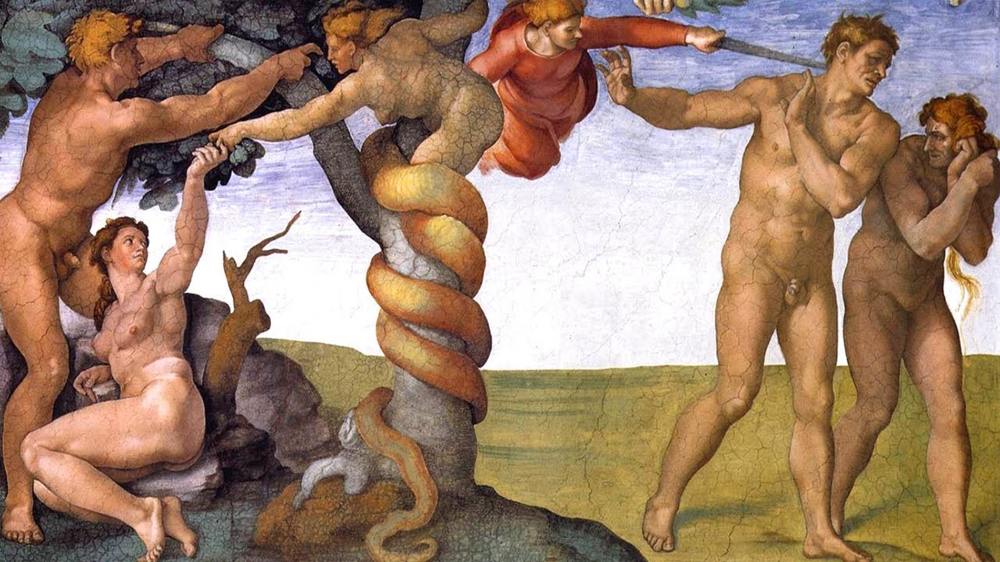

# **Série Bíblica IV: Adão e Eva: Autoconsciência, Mal e Morte**

por Dr. Jordan Peterson

YouTube Video (https://www.youtube.com/watch?v=Ifi5KkXig3s)

*Palavras-chave: Adão, Eva, Queda, Consciência, Mal, Morte, Éden*

---

## Seção I

Olá a todos. Esperamos conseguir passar do Gênesis 1 hoje. Essa é a teoria. Terminei meu novo livro ontem. Isso levou cerca de três anos de escrita — bastante tempo para escrever algo. Então, sim, está pronto… Exceto pela revisão final, edição de cópia e esse tipo de coisa. Não sei se está bom, mas está tão bom quanto eu consigo fazer.

Tenho pensado nas histórias que vou contar a vocês esta noite há muito, muito tempo — como as da semana passada, aliás, mas estas ainda mais. Uma das coisas que simplesmente não consigo entender é como pode haver tanta informação em histórias tão pequenininhas, especialmente a história de Caim e Abel. Essa história… Toda vez que a leio, ela me derruba, porque tem só uns parágrafos. Não tem quase nada. Toda vez que penso nela, outra camada surge de baixo, e eu não consigo entender. A abordagem racional que venho descrevendo a vocês se baseia na ideia de que essas histórias de algum modo encapsularam a sabedoria que geramos interpessoalmente e comportamentalmente, e depois em imagem, ao longo de vastos períodos de tempo, e então condensamos em palavras muito, muito densas e articuladas que são ainda mais refinadas pelo ato de serem lembradas e transmitidas ao longo de vastos períodos de tempo. Esse é um argumento bastante bom. Estou disposto a aceitá-lo, mas ainda me surpreende como pequenas passagens podem conter tanta informação.

Vamos desmontar isso hoje. Acho que é especialmente verdadeiro na história de Caim e Abel porque funciona no nível individual, no nível familiar, no nível político, no nível da guerra, e funciona no nível da economia. Isso é muito para uma história minúscula de um parágrafo cobrir. Você pode objetar: bem, com essas histórias, nunca se sabe o que você está lendo nelas e o que está realmente na história. Isso faz parte — vamos chamar de dilema pós-moderno, e tudo bem. Não há resposta real para isso, assim como não há resposta para "como você sabe que sua interpretação do mundo é — bem, vamos não dizer correta, mas suficiente?". Há alguma resposta para isso: é suficiente se você conseguir colocá-la em prática no mundo e as outras pessoas não objetarem demais, e você não morrer, e a natureza não lhe dar uma mordida com mais frequência do que o necessário. Essas são as restrições em que vivemos, então você tem alguma maneira de determinar se sua interpretação é, pelo menos, funcionalmente bem-sucedida, e isso não é trivial. Acho que você poderia dizer a mesma coisa sobre as interpretações que podem ser colocadas sobre essas histórias. No momento, isso é provavelmente bom o suficiente.

Espero que vocês achem as interpretações funcionalmente significativas em múltiplos níveis. Também acho que a chance de conseguir isso por acaso é muito, muito pequena. Conseguir uma interpretação de uma história que funcione em múltiplos níveis simultaneamente… Com cada nível, as chances de você ter tropeçado em algo por acaso têm que estar diminuindo. Há um termo técnico para isso na psicologia. É algo como Matriz Multitraço-Multimétodo, para determinar se algo é preciso. A ideia é que, quanto mais maneiras você consegue medir e obter o mesmo resultado, mais confiante você pode estar de que não está apenas se iludindo com sua hipótese a priori. Há realmente algo lá fora. Também é um método que uso em minhas palestras. Não tento contar às pessoas nada que não seja pessoalmente relevante, porque você deveria saber por que está sendo ensinado algo — você deveria saber para que serve o fato, e então deveria ser bom para você pessoalmente, pelo menos em algum sentido. Se você o colocar em prática no mundo, deveria ser bom para sua família, e talvez deveria ter algum significado para a comunidade mais ampla. Acho que é isso que significado significa. Não vejo realmente utilidade em ser ensinado fatos que não são significativos, porque há um número infinito de fatos, e não há como você lembrar todos eles. Eles precisam ter o aspecto de ferramentas, porque somos criaturas que usam ferramentas. Essas histórias têm esse aspecto. Até onde posso dizer, não há dúvida sobre isso.

As histórias em Gênesis 2 são muito famosas, obviamente. Praticamente todo mundo que é minimamente versado, grosso modo, na cultura ocidental, conhece essas histórias. Isso também é algo interessante: histórias podem ser tão fundamentais que todo mundo as compartilha. Você pode dizer a mesma coisa sobre um bom punhado de contos de fadas também — ou poderia, pelo menos, até recentemente. Mas o fato de que as histórias são tão fundacionais que todo mundo as compartilha é algo notável.

Freud meio que pensava que o judaico-cristão se baseava na ideia de que a figura do pai — o pai familiar — era expandida para dimensões cósmicas, de modo que a humanidade existia no mesmo tipo de relacionamento com o Pai cósmico que um bebê ou uma criança pequena existia em relação a seu próprio pai. Essa é uma crítica razoável, eu diria, mas implica — mais do que implica, no caso de Freud — que as pessoas que adotam uma crença religiosa que tem uma figura personificada em seu ápice estão essencialmente representando o papel de crianças dependentes. Pensei nessa crítica por um bom tempo. Acredite, essa tem sido uma crítica poderosa.

Um dos melhores livros que já li, chamado *A Negação da Morte* de Ernest Becker, levou essa linha de argumentação tão longe quanto qualquer livro que já vi argumentar. Becker tentou dar um fechamento à psicanálise freudiana sobre a religião. Ele fez um trabalho bem diabólico nisso. Acho o livro seriamente falho e errado, mas é realmente um ótimo livro. Alguns livros estão errados de maneiras realmente boas. Eles fazem um argumento poderoso, poderoso, e o levam ao extremo. Acho que Becker errou o ponto, e errou do mesmo jeito que Freud errou o ponto de Jung. Becker, que escreveu esse livro sobre a psicanálise da religião, nunca se referiu a Jung, exceto muito brevemente na introdução, e acho que esse foi um erro grave.

Becker levou o argumento de que a hipótese de Deus não é nada além de uma tentativa dos seres humanos de recriar um estado quase infantil de dependência, de poder contar com um Pai onisciente, e assim recuperar o conforto, talvez, que experimentamos quando éramos jovens e tínhamos um pai, hipoteticamente onisciente — para aqueles de nós que têm a sorte de ter alguém que vagamente se assemelhasse a isso. Quanto mais eu pensava nisso, mais isso me parecia bastante impossível ao longo do tempo. Charles Taylor escreveu um livro interessante chamado *Fontes do Eu: A Construção da Identidade Moderna*. Ele é um filósofo de McGill, e eu não necessariamente o chamaria de amigo da religião clássica, mas não importa: ele fez um ponto muito interessante sobre o cristianismo, em particular. Ele disse que se você vai inventar uma religião que lhe ofereça nada além de conforto infantil, por que no mundo você se daria ao trabalho de conceituar o inferno? Isso simplesmente parece um detalhe desnecessário para acrescentar a toda a história, né? Se é tudo sobre conforto, por que você hipotetizaria que a consequência de um erro sério era o tormento eterno? Esse não é o tipo de coisa que provavelmente vai fazer você se sentir confortável.

James Joyce, quando escreveu sobre isso, disse que tinha pesadelos terríveis quando era criança por causa dos sermões de fogo do inferno que os jesuítas costumavam vomitar. Ele escreveu o que lembrava deles. Eram bastante assustadores. Acho que foi em *Retrato do Artista Quando Jovem* que ele falou sobre os jesuítas lhe dizendo que o inferno era como uma prisão com paredes de sete milhas de espessura, que estava sempre na escuridão e consumida pelo fogo, e que as pessoas que estavam presas lá eram continuamente queimadas por esse fogo escuro que dava nova luz, que também, simultaneamente, rejuvenecia sua carne para que pudesse ser queimada eternamente — caso você estivesse se perguntando como seria queimada eternamente. Esse é aparentemente o processo. Não é fácil para mim ver isso como um cumprimento de desejo infantil, infelizmente. Você pode ser cínico sobre isso. Elaine Pagels, que escreveu um livro sobre o diabo, foi cínica sobre isso dessa maneira. Ela achava que os cristãos, por assim dizer, inventaram o inferno como um lugar para colocar seus inimigos, e tudo bem. Mas isso não é preciso, embora seja conveniente ter um lugar para colocar seus inimigos. Charles Taylor apontou, por exemplo, que o terror moderno da perda do eu, digamos — a perda existencial do eu e do significado — era, talvez, paralelo ao terror medieval do inferno em termos de intensidade existencial. O inferno não era apenas um lugar onde aquelas pessoas de quem você não gostava acabariam: era o lugar onde você iria se não andasse na linha corretamente.

Não acho que a crítica de Freud realmente se sustente na análise final. A crítica de Marx, é claro, era que a religião era o ópio do povo. Ele fez um argumento semelhante ao de Freud, embora um pouco mais cedo, e o baseou na pressuposição de que as crenças religiosas eram histórias contadas às massas ingênuas para mantê-las pacificadas e felizes enquanto seus senhores corporativos, por falta de um propósito melhor, continuavam a explorá-las e enfraquecê-las. Acho a crítica das instituições humanas como movidas inteiramente pelo poder muito questionável, para dizer o mínimo. Claro, toda instituição humana é corrupta por uma razão ou outra, e também é corrupta, especificamente, por coisas como engano, arrogância e a demanda por poder não merecido. A mesma coisa pode ser aplicada aos sistemas religiosos, mas isso não significa que eles sejam de alguma forma especial característicos dessas falhas. Talvez você ache que são, e talvez você possa fazer um caso para isso, mas não é evidente à primeira vista que seja uma crítica particularmente útil.

Eu não compro. Acho que isso é longe demais cínico. Acho que as pessoas que escreveram essas histórias — primeiro de tudo, o que você vai fazer? Você vai dirigir uma conspiração sangrenta por 3.000 anos com sucesso? Boa sorte com isso. Você não consegue dirigir uma conspiração por 15 minutos sem alguém te dedurar. É impossível. Seja o que for que esteja na base da construção — não apenas dessas histórias, mas das estruturas dogmáticas que emergiram delas… Acho que é um erro terrível reduzi-las a explicações unidimensionais. Geralmente acho que reduzir qualquer comportamento humano complexo a uma explicação unidimensional é frequentemente um sinal de um pensador seriamente limitado. Digo isso com alguma cautela, porque Freud fez isso com a religião, em certa medida, e Freud foi um pensador sério. Marx, suponho, foi um pensador sério também, mesmo que… bem… Ele é alguém que… Se você tiver algum senso, Marx simplesmente o deixa sem palavras.

Então, de qualquer forma, isso tudo para dizer que não acho que haja uma explicação simples para como essas histórias têm o poder que têm. Eu realmente não acho que você possa reduzir isso a conspiração política, e isso é certo. Não acho que você possa reduzir isso a infantilismo psicológico. Acho que você pode fazer um caso, como eu fiz, de que elas são repositórios da sabedoria coletiva da raça humana.

Tive uma carta interessante esta semana de alguém — recebo muitas cartas interessantes. Acho que vou fazer um arquivo delas e colocar na web em algum momento — com permissão das pessoas, obviamente. Ele disse que estava seguindo minhas palestras, e notou que eu vinha fazendo o que você poderia descrever como um caso quase biológico, ou evolutivo, para a emergência da informação que as histórias contêm. Ele disse, bem, como você sabe que alguém de uma religião diferente, ou falando de uma tradição religiosa diferente, não poderia fazer exatamente a mesma coisa? Pensei, bem, primeiro de tudo, em certa medida eles poderiam, porque as deles se sobrepõem. Falei um pouco com vocês sobre o daoismo, por exemplo, e a visão daoista do ser como o equilíbrio eterno entre caos e ordem. Não sei se vocês sabem disso, mas há um neuropsicólogo chamado Elkhonon Goldberg, que é aluno de Alexander Luria. Luria foi, acho, o maior neuropsicólogo do século XX. Ele era russo, e foi uma das primeiras pessoas a realmente determinar, em grande parte, a função do córtex frontal, que foi um mistério por um longo período de tempo. Goldberg — vocês sabem que temos dois hemisférios? Temos o hemisfério esquerdo e o hemisfério direito, e as pessoas frequentemente pensam no esquerdo para destros — destros do sexo masculino mais particularmente, porque as mulheres são mais neurologicamente difusas. É uma das coisas que as torna mais robustas a lesões na cabeça, por exemplo. Talvez os homens sejam menos difusos e um pouco mais especializados, o que os torna um pouco mais especializados mas um pouco mais sujeitos a danos.

De qualquer forma, temos dois hemisférios: o esquerdo, e o direito, e ninguém sabe exatamente por quê. Sabemos que eles abrigam consciências quase independentes, porque se você dividir o corpo caloso que os une — o que foi feito em casos de epilepsia intratável, por exemplo — cada hemisfério é capaz de desenvolver sua própria consciência, em certa medida — o direito geralmente não verbal, e o esquerdo verbal. Então houve essa ideia de que o esquerdo é um hemisfério verbal, e o direito é um hemisfério não verbal, mas isso não pode estar certo porque os animais não falam, e eles têm um hemisfério bifurcado. Então, se está certo, não é causalmente certo.

Goldberg hipotetiza, em vez disso, que os hemisférios foram especializados para rotinização e não rotinização, ou para novidade e familiaridade, ou para caos e ordem. Então isso é bem legal. Quando me deparei com isso, também pensei nisso como um sinal de… Como você chamaria… Validação de constructo Multitraço-Multimétodo. Eu nunca tinha pensado nos hemisférios operando dessa forma, e Goldberg chegou a isso em um caminho histórico que era inteiramente independente de qualquer pensamento inspirado em mitologia — completamente independente. Na verdade, foi motivado mais pela neuropsicologia materialista russa, que era materialista por razões políticas, e também por razões científicas. Mas a ideia é que temos um hemisfério que reage muito rapidamente a coisas que não conhecemos. É mais imaginativo e difuso, e está associado mais com emoção negativa, porque emoção negativa é o que você deveria sentir, imediatamente, quando encontra algo que não entende. Emoção negativa é uma forma de pensamento. É como, estou em algum lugar onde as coisas não são o que deveriam ser. O hemisfério direito faz isso, e gera imagens muito rapidamente para ajudá-lo a descobrir o que pode estar lá. O hemisfério esquerdo pega isso e o desenvolve em algo mais articulado, algorítmico e completamente entendido.

Há um equilíbrio dinâmico entre o hemisfério direito e o esquerdo, onde o esquerdo tenta impor ordem ao mundo — isso é Ramachandran, que é um neurologista muito famoso na Califórnia, e que também desenvolveu uma teoria como a de Goldberg. Ele disse que o hemisfério esquerdo impôs ordem rotinizada ao mundo, e o hemisfério direito gera novidade, e reage à novidade, e gera hipóteses novas. Ele achava — e há boas evidências para isso — que o que está acontecendo durante o sonho é que a informação se moveu do hemisfério direito para o hemisfério esquerdo, em pequenas doses, para que as revelações novas do hemisfério direito não demolissem as estruturas algorítmicas que o hemisfério esquerdo montou com tanto cuidado.

Gosto dessa teoria também, porque também ajuda a justificar a hipótese que venho expondo para vocês, que é que há uma parte de nós que se estende para o mundo, e tenta entender o que não sabemos, e que essa parte se estende com comportamento, emoção, imagem, e então, talvez, com poesia e narrativa. À medida que isso se desenvolve, então desenvolvemos representações mais articuladas desse conhecimento emergente. Você pode mapear isso muito bem na presunção do neurologista e do neuropsicólogo sobre o que constitui a razão para a diferenciação hemisférica. A outra coisa que é tão legal sobre o argumento da diferenciação hemisférica, até onde estou preocupado — e isso é realmente algo para se pensar, cara, porque é um… Há uma palavra que Ned Flanders usa para isso… Coçador de cabeça. Acho que é algo assim. Hah. De qualquer forma, fazemos a suposição de que aquilo para o que estamos biologicamente adaptados é a realidade. É na verdade uma definição axiomática, se você for darwinista, porque a natureza é o que seleciona — por definição, é isso que a natureza é: é o que seleciona. E se a natureza que seleciona impôs a você uma estrutura hemisférica dual — porque metade de você tem que lidar com caos, e metade de você tem que lidar com ordem — então você pode fazer um caso inferencial muito bom de que o mundo é feito de caos e ordem, e isso é realmente algo para se pensar, cara. Então você pode pensar nisso por um tempo, se quiser.

## Seção II

[TIMESTAMP](https://youtu.be/Ifi5KkXig3s?list=PL22J3VaeABQD_IZs7y60I3lUrrFTzkpat&t=1195)

De qualquer forma, por qualquer razão, há muito empacotado nessas histórias. Vamos investigar mais algumas delas. Vamos começar com a história de Adão e Eva. Agora, você pode se lembrar de que a Bíblia é uma série de livros. A Bíblia na verdade significa algo próximo de biblioteca. Esses livros foram escritos por todo tipo de pessoas diferentes, e grupos de pessoas, e grupos de editores, e grupos de pessoas que editaram repetidamente ao longo de períodos muito, muito longos de tempo. Eles são de autoria de ninguém e de muitos ao mesmo tempo. Havia uma tradição, por muito tempo, de que os primeiros livros foram escritos por Moisés, mas isso provavelmente não é tecnicamente correto, embora possa ser dramaticamente correto, digamos, ou correto da maneira que um conto de fadas é correto. Não estou tentando menosprezar contos de fadas dizendo isso.

Há vários autores, e a maneira como os autores foram identificados, provisoriamente, é por certas semelhanças estilísticas entre as diferentes histórias — usos diferentes de palavras — como as palavras para Deus — estilos poéticos diferentes, tópicos diferentes, e assim por diante. As pessoas vêm trabalhando provavelmente há 200 anos, grosso modo, para tentar descobrir quem escreveu o que e como tudo isso foi juntado. Não importa realmente para nossos propósitos. O que importa é que é uma agregação de tradições narrativas coletadas, e talvez você possa dizer que é uma agregação de sabedoria narrativa coletiva. Não precisamos ir tão longe, mas podemos, pelo menos, dizer que é tradições narrativas agregadas.

Havia alguma razão pela qual essas tradições, e não outras, foram mantidas. Uma das coisas que é realmente notável sobre a Bíblia como documento é que ela realmente tem um enredo, e isso é realmente algo. Quero dizer, é extensa, e vai a muitos lugares, mas o fato de que algo foi juntado ao longo de vários milhares de anos — 4.000 anos, talvez mais se você incluir as tradições orais que a precederam, e só Deus sabe quão antigas elas são. Parte da imaginação coletiva humana juntou uma biblioteca com um enredo. Vejo a Bíblia como uma tentativa coletiva da humanidade de resolver os problemas mais profundos que temos. Acho que esses são, principalmente, os problemas da autoconsciência — o fato de que não apenas somos mortais, e morremos, mas que sabemos disso. Esse é o predicamento único dos seres humanos, e faz toda a diferença.

Acho que a razão que nos torna únicos está exposta na história de Adão e Eva. Interessantemente — e só percebi isso de verdade depois que estava fazendo as últimas três palestras — a Bíblia apresenta um cataclismo no início dos tempos, que é o surgimento da autoconsciência nos seres humanos. Coloca uma fenda na estrutura do ser. Essa é a maneira certa de pensar sobre isso, e isso realmente recebe significado cósmico. Agora, você pode dispensar isso e dizer, bem, nada que acontece com os seres humanos tem significado cósmico, porque somos essas entidades de vida curta, parecidas com toupeiras, que são como cânceres neste pequeno planeta que está girando no meio do nada, na borda de alguma galáxia desconhecida, no meio do espaço infinito. Nada que acontece conosco importa. Tudo bem, e você pode seguir por esse caminho se quiser. Eu não recomendaria. Quero dizer, essa é parte da razão pela qual acho que, para todos os fins e propósitos, é falso: não é um caminho que você possa percorrer e viver bem. Na verdade, se você realmente percorrer esse caminho, e realmente levar a sério, você acaba não vivendo de jeito nenhum. É certamente muito reminiscente… Conversei com muitas pessoas que estão seriamente suicidas, e o tipo de conclusões que elas tiram sobre a utilidade da vida antes de desejar seu fim são muito parecidas com o tipo de conclusões que você tira se percorrer essa linha particular de raciocínio tempo suficiente.

Se você estiver interessado nisso, pode ler *Confissão* de Leon Tolstói. É um livro muito curto, e é poderoso. Tolstói descreve sua obsessão com o suicídio quando estava no auge de sua fama: o autor mais conhecido do mundo, família enorme, fama internacional, riqueza além do imaginável naquela época, influente, admirado… Ele tinha tudo o que você poderia imaginar que qualquer um poderia ter, e, por anos, ele tinha medo de sair em seu celeiro com uma corda ou uma arma porque achava que se enforcaria ou se mataria a tiros. Ele saiu dessa, e descreve por que isso aconteceu e para onde foi quando isso aconteceu. Se você estiver interessado nisso, esse é um livro muito bom.

As histórias bíblicas, começando com Adão e Eva, apresentam uma história diferente. Elas apresentam o surgimento da autoconsciência nos seres humanos como um evento cataclísmico cósmico. E você poderia dizer, bem, o que temos a ver com o cosmos? E a resposta para isso é, depende do que você acha que a consciência tem a ver com o cosmos. Talvez seja nada, e talvez seja tudo. Vou com tudo, porque é assim que parece para mim. Claro, qualquer um que quiser é bem-vindo para discordar. Mas se você acredita que a consciência é uma força de significado cósmico, do qual o ser em si é dependente — pelo menos em qualquer sentido experiencial — então não é irracional assumir que a reestruturação radical da consciência pode legitimamente receber algum tipo de significado cósmico ou metafísico. Mesmo que não seja verdade de fora da perspectiva humana — seja lá o que isso possa ser — é muito bem verdade de dentro da perspectiva humana, e isso é certo. Esse é o evento inicial, em certo sentido, depois da criação: a queda cataclísmica. Todo o resto da Bíblia é uma tentativa de descobrir o que diabos fazer sobre isso.

No Antigo Testamento, por exemplo, o que parece acontecer é que o estado de Israel é fundado. Ele sobe e cai, e sobe e cai, e assim há essa experimentação por séculos — milênios, até — com a ideia de que a maneira de se proteger contra as consequências trágicas da autoconsciência é se organizar em um estado. Mas então o que acontece é que o próprio estado começa a revelar suas patologias. Essas patologias se acumulam; o estado se torna instável e colapsa, e então sobe de novo, e então se torna instável e colapsa, e então sobe de novo — isso é principalmente das interpretações de Northrop Frye. As pessoas começam a se perguntar se não há algo errado com a ideia de que o próprio estado é o lugar da redenção. Há algo errado com essa ideia. Então, nos calcanhares disso, vem a revolução cristã, com sua hipótese de que não é o estado que é o lugar da salvação: é a psique individual. E então há uma ética que vai junto com isso também, que é bastante interessante.

A ética da redenção depois que o experimento do estado falha, digamos, é que é dentro do indivíduo que a redenção pode ser manifestada — mesmo no que diz respeito ao estado, porque o funcionamento adequado do estado depende do funcionamento adequado do indivíduo, e não o contrário, mais fundamentalmente. O modo adequado de ser individual que é redentor é a verdade, e a verdade é o antídoto para o sofrimento que emerge com a queda do homem na história de Adão e Eva. Isso se relaciona com os capítulos de que já falamos: há uma insistência em Gênesis 1 de que é a palavra na forma de verdade que gera ordem a partir do caos, mas ainda mais importante — e isso é algo que eu percebi mais claramente apenas fazendo essas palestras nas últimas três semanas — é que Deus continua dizendo, à medida que fala a ordem ao ser com verdade, que o ser que Ele fala ao ser é bom. Há esta insistência de que o ser que foi falado ao ser, através da verdade, é bom. Há uma dica, aqui, bem no início da história, sobre o estado de ser que Adão e Eva habitavam antes de caírem e se tornarem autoconscientes — na medida em que foram feitos à imagem de Deus e representando a verdade de que o ser em si estava devidamente equilibrado. Leva a Bíblia inteira para redescobrir isso, que é uma jornada de volta ao começo. Esse é um tema mitológico clássico: a pessoa sábia é a pessoa que encontra o que perdeu na infância e o recupera.

Acho que isso é uma ideia judaica. *Tzadik*, se me lembro corretamente, é uma figura messiânica, e também a pessoa que encontra o que perdeu na infância e o recupera. Há esta ideia de um retorno ao começo, exceto que você não cai para trás na infância e na inconsciência: você retorna, voluntariamente, ao estado da infância, bem acordado, e então determinado a participar, através da verdade, na manifestação do ser adequado. Agora, sou psicólogo, e ensino teoria da personalidade há muito, muito tempo. Conheço teorias de personalidade profundas muito bem. Sou razoavelmente versado em filosofia — embora não tão versado quanto deveria ser — mas posso dizer a vocês, em todas as coisas que já li, encontrei ou pensei, nunca encontrei uma ideia que se iguale a essa em termos de profundidade — não apenas profundidade, mas também em credibilidade. A outra coisa que vejo como clínico — e acho que isso é muito característico da experiência clínica, e também descrito explicitamente pelos grandes clínicos — é que o que cura na terapia é a verdade. Esse é o curativo.

Agora, há exposição às coisas que você teme e evita, também, mas eu diria que isso é uma forma de verdade encenada: se você sabe que há algo que você deveria fazer por seu próprio conjunto de regras e está evitando, então você está encenando uma mentira. Você não está contando uma, mas está representando uma. É a mesma coisa maldita. Então, se eu consigo fazer você enfrentar o que é que você está confrontando, que você sabe que não deveria estar evitando, então o que está acontecendo é que nós dois estamos participando do processo de tentar fazer você representar sua verdade mais profunda. O que acontece é que isso melhora a vida das pessoas — melhora radicalmente, e a evidência clínica para isso é esmagadora.

Sabemos que se você expõe as pessoas à coisa que elas temem mas evitam, elas melhoram. Você tem que fazer isso com cuidado, cautela, com a participação delas, e tudo isso, mas de todas as coisas que os clínicos estabeleceram — isso é credível, e é o número um. Isso está aninhado dentro dessa realização mais profunda de que a experiência clínica é redentora. É projetada para abordar o sofrimento na medida em que as pessoas que estão engajadas no processo estão ambas dizendo a verdade uma à outra. E então você pensa, bem, obviamente, porque se você tem alguns problemas e vem me contar sobre eles — bem, primeiro de tudo, só de vir me contar sobre eles você admitiu que eles existem. Esse é um começo bastante bom. Segundo, bem, se você me contar sobre eles, então sabemos o que eles são, e então se sabemos o que eles são, então talvez possamos começar a traçar algumas soluções. Então você pode ir representar as soluções para ver se funcionam. Mas se você não admitir que estão lá e não me disser o que são, e eu estiver posando, agindo egoisticamente, tomando a dianteira, e tudo isso em nossa discussão — como diabos isso vai funcionar? Pode ser confortável momento a momento enquanto ficamos encapsulados em nossa ilusão, mas não vai funcionar. Se você pensar bem, parece bastante autoevidente.

Freud achava que a repressão estava no coração de muito sofrimento mental. A diferença entre repressão e engano é uma questão de grau, e só isso. É uma diferenciação técnica. Alfred Adler, que foi um dos maiores associados de Freud, digamos — e muito subestimado, eu diria — achava que as pessoas entravam em problemas porque começavam a representar uma mentira de vida. Foi assim que ele chamou: uma mentira de vida. Vale a pena procurar, porque Adler, embora não tão carismático quanto Freud, era muito prático, e ele realmente prenunciou muitos desenvolvimentos posteriores na teoria cibernética. Claro, Jung acreditava que você poderia contornar a psicoterapia inteiramente fazendo apenas um esforço moral adequado em sua própria vida. Carl Rogers acreditava que era a comunicação honesta, mediada através do diálogo, que tinha consequências redentoras. Os behavioristas acreditam que você faz uma microanálise cuidadosa dos problemas que são colocados diante de você e ajuda a introduzir as pessoas ao que estão evitando. Todas essas coisas, para mim, são apenas variações seculares da noção de que a verdade o libertará, essencialmente.

É uma história bastante poderosa. A, não é tão fácil dispensar, e B, a outra coisa é, você dispensa disso por sua conta e risco. As pessoas que vi que foram realmente machucadas foram machucadas principalmente por engano, e isso também vale a pena pensar. Você leva uma surra da vida. Não há dúvida sobre isso — absolutamente nenhuma dúvida sobre isso. Mas pensei por muito tempo que, talvez, as pessoas consigam lidar com terremotos, câncer, até a morte, mas não conseguem lidar com traição, e não conseguem lidar com engano — elas não conseguem lidar com o tapete sendo puxado debaixo delas por pessoas que amam e confiam. Isso simplesmente as destrói. Isso as deixa doentes, e as machuca: psicofisiologicamente, as danifica. Mas, mais do que isso, as torna cínicas, amarguradas, visiosas e ressentidas. Elas começam a representar isso tudo no mundo, e isso piora.

Então Deus usa a verdade falada para criar ser que é bom. O cataclismo ocorre, e então os seres humanos passam milênios incontáveis tentando descobrir exatamente o que fazer sobre o fato de que se tornaram autoconscientes — e somos, de fato, autoconscientes. Nenhum outro animal tem essa distinção. Agora, você vai ler que se você colocar batom em um chimpanzé… que é meio que uma coisa estranha de se fazer. Hah. Bem, não vou perseguir isso mais. Mas o chimpanzé vai limpar o batom se você mostrar no espelho. E os golfinhos parecem ser capazes de se reconhecerem nos espelhos, então há os vislumbres de reconhecimento autoconsciente em outros animais. Mas colocar isso na mesma categoria conceitual que a autoconsciência humana é… Para minha maneira de pensar, é… Bem, é desinformado, para dizer o mínimo, mas também acho que é motivado por uma espécie de motivação anti-humanista subjacente.

Sua autoconsciência é tão incrivelmente desenvolvida comparada a isso que elas dificilmente estão no mesmo universo conceitual. É como comparar os gritos de alarme dos macacos vervet, quando veem um predador, com a linguagem dos seres humanos. É como, sim, sim. Há algumas semelhanças: são enunciados, e são enunciados com significado, mas não são linguagem. A autoconsciência dos animais é proto-autoconsciência, e só está lá em um número muito pequeno de animais. Não é nada como a nossa. Eles não estão conscientes do futuro como nós estamos. Eles não estão conscientes de seus limites no espaço e no tempo, e essa é a coisa crítica — mais particularmente o tempo. Os seres humanos descobriram o tempo, e quando descobrimos o tempo, descobrimos o fim de cada um de nosso ser. Isso fez toda a diferença. É disso que a história de Adão e Eva trata.

Gênesis 1 foi derivado da fonte Sacerdotal, onde Deus é conhecido como Elohim ou El Shaddai. Há Deus no singular, e há Deuses no plural, e suponho que seja porque parece que, se você analisar a história do desenvolvimento de ideias monoteístas, o monoteísmo emerge de uma pluralidade de Deuses. Como mencionei, acho que é porque os Deuses representam forças fundamentais, no mínimo, e essas forças fundamentais precisam ser organizadas hierarquicamente com algo absoluto no topo. Caso contrário, elas só fariam guerra. Você precisa organizar seus valores hierarquicamente, ou fica confuso. Isso é verdade se você for um indivíduo, e é verdade se você for um estado. Se você não sabe qual é a próxima coisa que deveria fazer, então há 50 coisas que você deveria fazer. Como você vai fazer alguma delas? Você não pode. Você precisa priorizar. Algo tem que estar acima de algo mais. Tem que estar arranjado em uma hierarquia para que não seja caótico. Então há algum princípio no topo da hierarquia e, talvez, a organização dos Deuses, ao longo do tempo. É a batalha de Deuses que Mircea Eliade mencionou. Se você estiver interessado nisso, pode ler *A História das Ideias Religiosas*, que eu realmente recomendaria. É um livro de três volumes, e é uma leitura bastante direta, até onde essas coisas vão. Eliade faz um trabalho muito bom descrevendo como, e até por que, o politeísmo tende ao monoteísmo. Mesmo em culturas politeístas, há uma forte tendência dos Deuses de se organizarem em uma hierarquia com um Deus no topo. Em uma cultura monoteísta, em certo sentido, todos os outros Deuses simplesmente desaparecem ao longo do tempo, e não sobra nada além do Deus do topo. Mas, mesmo em uma sociedade politeísta, há uma hierarquia de poder entre os Deuses.

A primeira história é mais nova que a segunda, então a história que vou contar a vocês hoje é mais antiga que a que já contei, embora sua ordem tenha sido invertida pelo redator, que é a pessoa — ou pessoas — hipotética que editou essas histórias juntas. Suspeito que tenha sido uma única pessoa, mas quem sabe. Não sabemos por que as histórias foram editadas juntas na ordem em que foram editadas, mas podemos inferir — quer dizer, elas foram editadas juntas nessa ordem porque o editor achou que faziam sentido assim, porque é isso que um editor faz. Um editor tende a pegar ideias diversas e organizá-las de alguma maneira que faça sentido. Parte da maneira que faz sentido é que você pode contá-las às pessoas, e as pessoas ficam interessadas, e as pessoas se lembram delas. Essa é uma das maneiras de saber se você tem um argumento certo, porque é comunicável, compreensível e memorável. E assim essa pessoa foi, digamos, motivada pela intuição a organizar as histórias dessa maneira particular.

O fio javista contém as histórias clássicas no Pentateuco: Gênesis, Êxodo, Levítico, Números e Deuteronômio, que tentaremos percorrer, talvez, nestas 12 palestras. Veremos como vai. É fortemente antropomórfico, então o Deus na conta javista é, para todos os fins e propósitos, algum tipo de meta-pessoa. Lidei com isso um pouco na semana passada. As pessoas tendem a pensar nisso como pouco sofisticado, mas quando você pensa que a mente — o fundamento da consciência — é a coisa mais complexa que conhecemos, então não é tão pouco sofisticado assumir que a coisa mais complexa que pode haver é assim — ou, pelo menos, é o melhor que podemos fazer com nossa imaginação. Não acho que seja tão pouco sofisticado. Também é o caso — e isso é praticamente falando — que não é de todo irracional pensar em Deus Pai como o espírito que surge da multidão e existe no futuro. Falamos sobre isso em relação à ideia de sacrifício, pelo menos um pouco.

## Seção III

[TIMESTAMP](https://youtu.be/Ifi5KkXig3s?list=PL22J3VaeABQD_IZs7y60I3lUrrFTzkpat&t=2408)

Você faz sacrifícios no presente para que o futuro fique feliz com você. A questão é, qual é esse futuro que ficaria feliz com você? A resposta para isso é que é o espírito da humanidade. É com quem você está negociando. Você faz a suposição de que, se você abrir mão do prazer impulsivo e conseguir seu diploma de medicina, quando terminar em 10 anos, e for um médico, a humanidade como tal vai honrar seu sacrifício e compromisso e abrir as portas para você. Você está tratando o futuro como se fosse um único ser, e também está tratando como se fosse algo como um juiz compassivo. Você está representando isso. Uma vez que começamos a entender que havia um futuro, talvez tenhamos que imaginar Deus nessa forma para concretizar algo com o qual pudéssemos barganhar — para que pudéssemos descobrir como usar o sacrifício e como nos guiar para o futuro. Um sacrifício é um contrato com o futuro. Não é um contrato com qualquer pessoa em particular: é um contrato com o espírito da humanidade como tal. É algo assim. Quando você pensa nisso dessa forma, isso deveria fazer você desmaiar de espanto, porque essa é uma ideia tão incrivelmente incrível de se ter, que você pode barganhar com o futuro.

Essa é alguma ideia, cara. Essa é como a ideia principal da humanidade: Nós sofremos. O que fazemos sobre isso? Descobrimos como barganhar com o futuro, e minimizamos o sofrimento dessa maneira. Nenhum outro animal faz isso, também. Leões — eles simplesmente comem tudo. Acho que um lobo pode comer 18 quilos de carne em uma única sentada. É como, há alguma carne — coma. Não é como, guardar algum mamute para amanhã. Isso não é coisa de lobo, cara. Isso é coisa de ser humano, e isso pode significar que você tenha que ficar com fome hoje. Talvez você seja um fazendeiro 6.000 anos atrás quando a agricultura começou, e você está morrendo de fome esperando pelo plantio da primavera. Você pensa, você muito bem melhor não comer essas sementes. Isso é realmente algo, ser capaz de se controlar para tornar o futuro real, e adiar o que você poderia usar hoje. E não apenas de alguma maneira impulsiva. Talvez seus filhos estejam morrendo de fome. Você pensa, nós não vamos tocar nas sementes de que precisamos para o futuro. E para os seres humanos terem descoberto isso, e então também terem descoberto que podíamos barganhar com o futuro… Cara, isso é algo. Acho que as histórias que são expostas neste livro realmente descrevem, pelo menos em parte, o processo pelo qual isso ocorreu.

As histórias javistas começam com Gênesis 2:4: "Esta é a história dos céus e da terra." Há duas histórias reais de criação no começo: a mais nova, que é a primeira, e a mais antiga, que é a segunda. A mais antiga começa no capítulo 2, e essa é a história que estamos entrando agora. Adão e Eva estão nisso, Caim e Abel, Noé, a Torre de Babel — no fio javista — Êxodo, Números, e há um pouco da versão Sacerdotal aí também, bem como os 10 Mandamentos. Há algumas representações adoráveis do paraíso. Esta é *O Jardim das Delícias Terrenas*. Diga de novo? Bosch! Sim, Hieronymus Bosch. Um louco — quero dizer, como ele não foi queimado na fogueira é absolutamente além de mim. Suponho que a maioria de vocês saiba sobre Salvador Dalí — Dalí é um amador comparado a Hieronymus Bosch. Você poderia passar um mês muito bizarro e surreal olhando para essa pintura. Não sei o que havia com Bosch, mas ele era algum tipo de criatura que apareceu apenas uma vez — e provavelmente para o melhor. Então há muitas representações do paraíso. Só Deus sabe o que é isso. Eu provavelmente poderia adivinhar, mas não vou. Esse é o leão deitado com o cordeiro. Essa é a ideia, talvez projetada de volta no tempo, de que havia um tempo, ou talvez haverá um tempo, quando os horrores da vida não são mais necessários para a própria vida existir. Os horrores da vida são, claro, que tudo come tudo mais, e que tudo morre, e que tudo nasce, e que todo o lugar maldito é uma casa de ossos, e é uma catástrofe do começo ao fim. Essa é a visão de que seja diferente disso.

Isso também era implícito nas ideias alquímicas, e acho que também é implícito na revolução científica: os seres humanos podem interagir com a realidade de tal forma que os elementos trágicos e malignos dela possam ser mitigados, e para que possamos nos mover um pouco mais perto de um estado que poderia ser caracterizado por algo assim, onde temos os benefícios da existência real sem toda a catástrofe que parece vir junto com isso. Carl Jung, quando escreveu sobre a emergência da ciência da alquimia, pensou na ciência como motivada por sonho. Para Jung, o sonho era a manifestação dos instintos. Era o limite entre os instintos e o pensamento. A ciência está aninhada dentro de um sonho, e o sonho é que, se investigarmos as estruturas da realidade material com atenção e verdade suficientes, poderíamos então aprender o suficiente sobre a realidade material para aliviar o sofrimento — para produzir a pedra filosofal, tornar todo mundo rico, tornar todo mundo saudável, e fazer todos viverem o tempo que quisessem viver. Esse é o objetivo: aliviar a catástrofe da existência. A solução para os mistérios da vida que poderiam nos permitir desenvolver tal substância — ou, digamos, um múltiplo de substâncias — forneceu a força motriz para o desenvolvimento da ciência.

Jung rastreou esse desenvolvimento de força realmente ao longo de mil anos. Seus livros sobre alquimia são extraordinariamente difíceis, e isso é realmente dizer algo sobre Jung, porque todos os seus livros são difíceis. Os livros sobre alquimia meio que dão um salto quântico… Isso na verdade é um salto muito pequeno, então eu não deveria dizer isso. Eles dão um salto massivo para uma dimensão inteiramente diferente de complexidade. Mas era isso que ele estava tentando alcançar. Ele voltou aos textos alquímicos e os interpretou como se fossem o sonho no qual a ciência foi fundada. Newton era um alquimista, aliás. As hipóteses de Jung são certamente bem suportadas pelos fatos históricos: a ciência realmente emergiu da alquimia. A questão é, o que os alquimistas estavam fazendo? Eles estavam tentando produzir a pedra filosofal, e essa era o medicamento universal para a patologia da humanidade.

Jung sentia que o que tinha acontecido era que o cristianismo tinha prometido a cessação do sofrimento — prometido por mil anos — mas o sofrimento continuou, sem diminuição. Ao mesmo tempo, o cristianismo tinha tentado realmente enfatizar o desenvolvimento espiritual, digamos, às custas do desenvolvimento material — pensando no desenvolvimento material como algo próximo de um pecado, tentando obter controle da impulsividade, e todas as coisas que vinham junto com uma existência de dois corpos. Havia uma razão para isso, mas por volta de 1.000 d.C., a mente europeia — um pouco educada até então, e um pouco capaz de se concentrar em um único ponto, talvez por causa de a muito tempo de intenso treinamento religioso — voltou seu sonho para o mundo material inexplorado. A mente europeia pensou, bem, você sabe, a redenção espiritual que temos buscado não pareceu produzir o resultado que foi prometido ou pretendido, então talvez haja outro lugar que devêssemos olhar — e esse foi no mundo material maldito, que deveria ser — pelo menos, de acordo com alguns elementos do pensamento clássico — nada além da criação do diabo.

O ponto que estou fazendo é que é muito difícil entender a quantidade de motivação humana que está embutida na tentativa de aliviar o sofrimento, erradicar doenças, e tornar as coisas o mais pacíficas possível. Quero dizer, você pode ser cínico sobre as pessoas, e pode falar sobre elas como motivadas pelo poder, e sendo corruptas, e todas essas coisas — e todas essas coisas são verdadeiras — mas você não deveria jogar fora o bebê com a água do banho, porque temos estado nos esforçando por muito tempo para acertar as coisas. Na verdade, não fizemos um trabalho tão ruim, para chimpanzés meio famintos, loucos, cheios de insetos com expectativa de vida de 50 a 70 anos. Merecemos um pouco de simpatia por nossa posição, até onde estou preocupado.

Algumas outras representações. Esta eu gosto — a da esquerda. Esse é o paraíso como um jardim murado, e é isso que paraíso significa. É *paradeisos*, que significa jardim murado. Por que um jardim murado? Bem, volta à ideia de caos e ordem. Um jardim murado é onde Deus coloca o homem e a mulher depois da criação. O muro é cultura e ordem, e o jardim é natureza. A ideia é que o habitat humano adequado é natureza e cultura em equilíbrio. Bem, gostamos de jardins. Por quê? Porque eles não estão completamente cobertos de ervas daninhas, mosquitos e borrachudos, certo? Então eles são um pouco civilizados, mas dentro dessa civilização, a natureza, em sua forma mais benevolente, é encorajada a florescer. As pessoas acham isso revigorante. A ideia de que o paraíso — o habitat adequado de um ser humano — é um jardim murado é uma boa. É murado porque você quer manter coisas fora — guaxinins, por exemplo. Você quer manter essas coisas fora, mesmo que seja impossível. Há todo tipo de coisas que você não quer em seu jardim, como cobras. Muros não parecem ser de muita utilidade contra elas. Mas a ideia de que o paraíso é um jardim murado é um eco de volta à ideia de caos e ordem… Muros, cultura, jardim, natureza… O habitat humano adequado é um jardim devidamente cuidado.

Os ambientalistas radicais de esquerda anti-teístas tendem a fazer o caso de que as predações do sistema capitalista ocidental são uma consequência da injunção que foi entregue em Gênesis por Deus ao homem, de sair e dominar a terra. David Suzuki falou muito sobre isso, aliás. Eles acreditam que essa declaração deu origem à nossa suposição inapropriada de que temos o direito de exercer controle sobre o mundo, e que isso é o que nos transformou nesses monstros predatórios terríveis — às vezes descritos como cânceres na face da terra, ou vírus que habitaram todo o ecossistema, que não estão fazendo nada além de vagar por toda parte e causar estragos o mais rápido possível, que é outra perspectiva sobre o elemento essencial da humanidade que eu acho absolutamente deplorável. Se você olhar o registro histórico, por exemplo, mesmo casualmente, você descobrirá que, no final do século XIX, Thomas Huxley — que é o avô de Aldous Huxley, e um grande defensor de Darwin — preparou um relatório para o governo britânico sobre a sustentabilidade dos oceanos. Ele concluiu que há tantos peixes lá fora, os oceanos são tão inesgotáveis, que não importa quanto a humanidade tentasse, por qualquer número de anos, a probabilidade de que pudéssemos fazer mais do que dar um dente no que estava lá era zero. Agora, Huxley acabou estando errado. Ele não percebeu que nossa população ia explodir tão dramaticamente — em parte porque ficamos um pouco ricos, e nossos filhos pararam de morrer na taxa de uns 60 por cento antes de completarem 1 ano — e que realmente conseguiríamos povoar a terra com algumas pessoas.

Só foi por volta de 1960 ou mais ou menos que acordamos para o fato de que havia tantos de nós que realmente tínhamos que começar a prestar atenção no que estávamos fazendo com o planeta. Isso é como 50 anos atrás. Bem, acabamos de começar a desenvolver a tecnologia — o meio — para entender que o mundo inteiro poderia ser bem considerado um jardim, e que precisamos viver dentro do equilíbrio adequado entre cultura e caos. Antes disso, estávamos gastando todo o nosso tempo apenas tentando não morrer, e geralmente de forma muito malsucedida. Então, não concordo com essa interpretação das seções iniciais de Gênesis: não acredito que tenha dado aos seres humanos o direito de agir como superpredadores no planeta. Acho, em vez disso, que o ambiente adequado para os seres humanos é apresentado de forma bastante adequada como um jardim, e que o papel das pessoas — e isso é explicitamente declarado na segunda história, em Adão e Eva — era cuidar do jardim. Isso significa tomar as decisões adequadas, e garantir que tudo prospere e floresça, para que seja bom para as coisas que estão vivendo lá que não são apenas pessoas — mas também bom para as pessoas, também. Acho que podemos, pelo menos, notar que essa é uma visão um pouco diferente da história do que a interpretação em última análise cínica que é tão comumente apresentada hoje.

Agora dentro desse jardim murado há um par de árvores, Adão e Eva, alguns animais, e tudo isso. Infelizmente, a árvore acontece de ter uma cobra enrolada nela. Isso é uma coisa interessante. Vamos falar muito sobre isso. A cobra, em ambas essas representações, não é uma cobra comum: ela tem uma cabeça humana, e tem uma cabeça humana, ali. Então, seja o que for essa cobra… Bem, esqueça de olhar isso de uma perspectiva religiosa. Se você não consegue, apenas imagine que você é um antropólogo, e nunca viu essa imagem antes. O que você vê? Bem, você vê muros, e vê um recinto bastante agradável. E então você vê uma árvore, e pessoas estão comendo da árvore. A árvore tem uma cobra nela. A cobra é eternamente associada à árvore. Passamos só Deus sabe quantas dezenas de milhões de anos como primatas que viviam em árvores, e tínhamos três predadores principais: cobras, pássaros, gatos. E assim a cobra está associada à árvore há muito, muito tempo. A lição que a cobra ensina às pessoas é, você muito bem melhor acordar, ou algo que você não gosta vai te pegar. E quem vai ser mais suscetível a prestar atenção à cobra? Essa vai ser Eva. A razão para isso é que Eva tem descendentes, e não há nada mais saboroso para uma cobra do que uma criança.

## Seção IV

[TIMESTAMP](https://youtu.be/Ifi5KkXig3s?list=PL22J3VaeABQD_IZs7y60I3lUrrFTzkpat&t=4049)

"E do solo fez o Senhor Deus crescer toda árvore agradável à vista, e boa para comer; a árvore da vida no meio do jardim, e a árvore do conhecimento do bem e do mal. E um rio saía do Éden para regar o jardim; e dali se dividia, e se tornava em quatro cabeceiras."

Isso produziu uma quantidade tremenda de especulação. O jardim do Éden é também a cidade santa — essa é outra maneira de pensar sobre isso — ou é Jerusalém, ou é o estado ideal, que poderia ser a cidade ideal, ou poderia ser o estado ideal de ser, ou poderia ser a psique ideal. São todas essas coisas empilhadas ao mesmo tempo.

Esta é a forma de mandala que as pessoas hipotetizaram constituir a estrutura do paraíso. Você nota que tem essa forma de cruz. Esse é o próprio Éden. Há o centro do Éden, e há os rios. Esses são rios, não cobras. Esses são os rios que saem dele, e eles são transformados nessas imagens de mandala que são representativas do que Jung descreveu como o self, que seria o elemento central do ser consciente que ele associou à divindade, e também com a ideia da cidade santa. Estou apenas mostrando isso para mostrar aonde a imaginação levou as ideias de paraíso.

"O nome do primeiro rio é Pisom: esse é o que cerca toda a terra de Havilá, onde há ouro; E o ouro dessa terra é bom: há bdélio e pedra de ônix. E o nome do segundo rio é Giom: esse é o que cerca toda a terra da Etiópia. E o nome do terceiro rio é Tigre: esse é o que vai para o leste da Assíria. E o quarto rio é o Eufrates." Há essa estranha mistura, aí, de geografia com geografia mítica, que você vê acontecer com bastante frequência nos livros. "E o Senhor Deus tomou o homem, e o pôs no jardim do Éden para o cultivar e guardar." Esse é um bom comando. Isso é o que você deveria fazer: cuidar da maldita coisa. É muito trabalho para fazer — levou uma semana inteira. Hah. "E o Senhor Deus ordenou ao homem, dizendo: De toda árvore do jardim comerás livremente: Mas da árvore do conhecimento do bem e do mal não comerás dela: porque no dia em que dela comeres certamente morrerás."

Bem, há um monte de perguntas, aí, que as pessoas vêm se perguntando há muito tempo. Deus é um personagem tortuoso na história de Adão e Eva. É como, ok, se não podemos comer a maldita coisa, por que colocá-la no jardim para começar? Essa seria uma pergunta. Você nos fez, e então nos disse para não comer isso, sabendo perfeitamente bem que a primeira coisa que íamos fazer era comer, porque as pessoas são exatamente desse tipo. Se você diz a elas, com sua curiosidade insaciável, isso é tudo bem e bom, mas aqui tem algo que você nunca deveria olhar, e você sai da sala… É como, todo mundo está lá tentando descobrir o que diabos é essa coisa, instantaneamente, né? Somos curiosos, curiosos, curiosos, curiosos. Você tem que se perguntar o que, exatamente, Deus estava fazendo aqui.

Há especulação gnóstica de que o Deus original, este, não era realmente um Deus muito bom. Ele era meio que um Deus inconsciente, mau. Ele queria que sua criação fosse inconsciente, e então proibiu que desenvolvessem consciência. Foi um Deus superior, e talvez na forma da serpente, que tentou os seres humanos em direção à consciência. Essa ideia foi limpa do cristianismo clássico bem cedo, embora haja algo interessante sobre ela, e há resquícios dela em formas diferentes que ficaram dentro da história — como a ideia de que a queda foi uma tragédia terrível, mas, por outro lado, foi a pré-condição para o maior evento da história, que foi o nascimento de Cristo e a redenção da humanidade. E assim é complicado. Vamos colocar dessa forma.

Só Deus sabe o que Deus estava fazendo. Esse é um bom exemplo dessa ambivalência. Para mim, de novo, é uma indicação da sofisticação das pessoas que juntaram essas histórias. Também considero isso um pouco milagroso, porque, você sabe, se você é apenas um propagandista simples, você não deixaria essa complexidade no texto. Você simplesmente se livraria disso. Se você é um propagandista, tudo deveria fazer sentido no plano ideológico. Aqui, Deus deveria ser bom, e é como, bem, melhor nos livrarmos dessa linha, porque há algo errado com ela, e não é óbvio o que é. Mas não foi isso que as pessoas fizeram. Para mim, isso indica que elas estavam fazendo duas coisas: estavam tentando não ser descuidadas demais com as tradições que lhes foram passadas — elas eram muito cuidadosas com elas, e estavam tocando nelas por sua conta e risco — e estavam realmente tentando entender o que estava acontecendo. Caso contrário, por que manter isso? Por que simplesmente não simplificar? Ou, talvez simplesmente atribuir isso ao diabo. Isso seria mais fácil do que fazer Deus fazer isso. "E o Senhor Deus disse: Não é bom que o homem esteja só; far-lhe-ei uma ajudadora idônea para ele. E o Senhor Deus formou da terra todo animal do campo e toda ave do céu, e trouxe-os a Adão, para ver como os chamaria; e tudo o que Adão chamou a todo ser vivente, isso foi o seu nome. E Adão pôs nomes a todo o gado" — gado significa animal, basicamente — "e às aves do céu, e a todo animal do campo; mas para Adão não se achou ajudadora idônea."

Bem, um par de coisas para especular, aí. Número um: por que Deus se importa com o que Adão chama os animais? A resposta para isso parece ser que está associado, de novo, com a magia da fala. Sabemos — de acordo com a história — que os seres humanos já foram feitos à imagem de Deus, e que Deus usou a linguagem para chamar a ordem do caos. Há um eco disso, aqui, mesmo que seja de uma tradição independente. O eco é que a coisa não é bem real até você nomeá-la. Isso é uma coisa interessante, e não sabemos exatamente até onde isso se estende. Certamente é o caso de que as coisas frequentemente existem em uma forma potencial estranha — forma interconectada — onde tudo é uma massa de confusão antes de você colocar o dedo nisso e nomear. O que está acontecendo, aqui? Você nomeia… É como, isso o esculpe de todo esse caos subjacente e o transforma em uma entidade agarrável com a qual você pode então contender. Você pode dizer, bem, era real antes de você nomeá-lo. Bem, sim. Era real antes de você nomeá-lo — da mesma forma que as coisas estão lá quando não há ninguém lá para percebê-las. Não é óbvio como as coisas estão lá quando você não está lá para percebê-las.

Vou contar uma coisa realmente estranha sobre percepção. John Wheeler é um físico, e aqui vai uma coisa realmente legal: Digamos que você saia à noite, e olhe para cima, e veja uma estrela. Um fóton dessa estrela entra em seu olho, e talvez esse fóton tenha estado viajando por uns 30 milhões de anos. Você sabe que esse fóton não teria sido emitido dessa estrela naquele momento se seu olho não estivesse lá naquele momento para percebê-lo? Você pensa, bem, como diabos isso pode ser? Aconteceu 30 milhões de anos atrás. Bem, eu não sei como pode ser, para dizer a verdade, mas sei que John Wheeler fez um trabalho muito bom detalhando por que isso é verdade, e necessariamente verdade. Wheeler é também o físico que desenvolveu a noção de "isso de bit". Ele acredita que o potencial do mundo é melhor interpretado como um lugar de informação latente. O que a consciência faz é transformar a informação latente em algo como realidade concreta. Ele não quer dizer isso metaforicamente. Um dos casos que ele faz, nesse sentido, é a história que acabei de contar: o fóton não poderia ter saído de onde estava a menos que tivesse um lugar para ir.

É complicado e confuso, porque, da perspectiva de um feixe de luz de um fóton, não há tempo, e não há distância de um ponto a outro. Claro, isso também é completamente impossível de entender. Mas, da perspectiva de um fóton, o universo é completamente plano — perpendicular à direção em que o fóton está viajando. Está lá, e aqui, ao mesmo tempo. Para nós, não é. É como 20 milhões de anos atrás. Mas para o fóton, é tudo aqui e agora. De qualquer forma, a razão pela qual estou lhes contando tudo isso é porque o relacionamento entre consciência e realidade de forma alguma é direto. É seriamente não direto. Os físicos debatem qual é o relacionamento entre consciência e realidade, e debatem sobre o que o tipo de fenômenos que acabei de descrever significa. Não sou realmente qualificado para entrar nesse debate, porque não sou físico, mas li uma boa parte de Wheeler — tanto quanto consigo entender — e sei, pelo menos, que é isso que ele afirmou. Também sei que essa afirmação é levada a sério entre o calibre dos físicos que conseguem entender Wheeler. Isso é bem interessante.

Então, de qualquer forma, há ênfase, de novo, nessa importância de nomear para tornar as coisas reais. Você sabe, às vezes as pessoas não nomeiam coisas apenas para que elas não se tornem reais. Se você tem um relacionamento — o que, sem dúvida, você tem — e ele tem problemas — o que, sem dúvida, tem — você muito bem sabe que muitas vezes há algo debaixo do tapete que ninguém quer nomear. Todo mundo está pensando, bem, contanto que não o nomeemos, ele não está realmente lá. Em certo sentido realmente não está, porque você pode agir como se não estivesse lá e se safar, pelo menos por curtos períodos de tempo. Mas assim que você nomeia essa coisa você lhe dá forma, e está lá, e ninguém pode ignorá-la. Isso é irritante, porque então você tem que lidar com isso ou enfrentar as consequências. A razão pela qual estou lhes contando isso é porque temos uma intuição de que podemos fazer as coisas não existirem não as nomeando. Você nomeia e ela vem à frente com clareza impressionante. Não é como se nomeá-la fosse a única coisa que lhe dá realidade, mas a afia, traz para foco, e lhe dá bordas e limites.

De qualquer forma, Deus está interessado o suficiente no que Adão tem a dizer para fazê-lo nomear todos os animais, e isso meio que os transforma em animais. Agora, há mais na história linguística do que isso. O psicólogo social Roger Brown estudou esse fenômeno realmente interessante, que está associado ao relacionamento entre percepção e ação. Você sabe como uma criança vai chamar um animal particular de gato? Bem, a palavra gato é muito curta, como a palavra cachorro. Poderíamos perceber gatos como organismos multicelulares — poderíamos ver as células; poderíamos ver as moléculas; poderíamos ver os átomos, ou poderíamos ver o ecossistema do qual o gato faz parte — ou talvez a classificação mamífera mais ampla da qual ele faz parte. Poderíamos perceber isso como a unidade de percepção, mas não fazemos. Percebemos as coisas no nível de gato. Você pode dizer o nível perceptual no qual as pessoas naturalmente percebem — que não parece ser determinado socioculturalmente em grande medida, aliás — porque as palavras são frequentemente curtas, facilmente lembradas e aprendidas cedo. Há este nível de análise, de todos os níveis de análise possíveis, no qual o mundo realmente existe no que o percebemos. Esse nível de análise parece ter algo a ver com a utilidade funcional do mundo para nós. A percepção nesse nível, e a nomeação nesse nível, dá às coisas uma realidade nesse nível.

A coisa sobre as coisas é que elas não são facilmente separáveis de outras coisas. Elas se enredam de todas as formas estranhas. No entanto, quando lançamos nosso olhar e usamos nossa linguagem para nos orientarmos no mundo, cortamos as coisas em objetos discretos e discrimináveis que podemos então utilizar. Há algo nisso que as torna mais reais, de certa forma, do que o potencial interconectado que eram antes — não é real da mesma forma, pelo menos. Acho que é ainda menos real. Acho que essa é uma maneira certa de pensar sobre isso, mesmo que não seja completamente irreal. É um eco. Adão é um pequeno Deus naquele ponto — um pequeno Deus Pai, e Deus já fez o trabalho de base, mas Adão tem que vir e dizer, bem, isso é um gato. Como, puff: seja lá o que for agora é um gato, e isso é um cachorro, e isso é uma ovelha. Dá a eles algo como forma pragmática. "Mas para Adão não se achou ajudadora idônea. E o Senhor Deus fez cair um sono pesado sobre Adão, e ele dormiu: e tomou uma de suas costelas, e fechou a carne em seu lugar; E da costela que o Senhor Deus tinha tomado do homem, formou uma mulher, e trouxe-a a Adão. E Adão disse: Esta é agora osso dos meus ossos, e carne da minha carne: ela será chamada Mulher, porque foi tirada do Homem. Portanto o homem deixará seu pai e sua mãe, e se apegará a sua mulher: e serão uma só carne."

Essa é uma declaração poderosa para colocar aí no final dessas três frases. O "portanto" vem como uma surpresa um tanto, mas há uma injunção aí. É uma boa injunção. Cara, eu te digo, pessoas que não fazem isso têm um inferno de um tempo em seu casamento. Isso é uma coisa boa de saber se você é casado, ou se está planejando se casar: Temos orientação muito forte em relação a nossos pais, e por boa razão. A injunção, aqui, é que isso é secundário assim que você se casa, e a falha em fazer isso faz seu casamento colapsar — e você merece que colapse, também, até onde estou preocupado, porque é um reflexo de sua imaturidade patológica e de sua indisposição de se extrair da garra de garras dos pais, que estão um pouco demais no lado interferente. Mas a injunção… Há uma injunção profunda, aqui. É muito complicada.

Uma das ideias é que o Adão original não era um homem: ele era mais como um ser hermafrodita. Nesse ser hermafrodita, havia uma espécie de perfeição indiferenciada que foi dividida em masculino e feminino. Parte do objetivo dos seres humanos é se reunir novamente como a unidade singular que restabelece a perfeição inicial. Esse é realmente o objetivo do casamento da perspectiva espiritual. Jung escreveu bastante sobre isso. É uma ideia tão boa.

Eu tinha esses amigos que foram para a Suécia se casar. Eles eram do norte de Alberta, mas ambas as heranças deles eram suecas. Eles fizeram essa coisa legal enquanto estavam se casando: eles tiveram que segurar uma vela entre eles enquanto estavam sendo casados. Você pensa, bem, o que é a vela? É uma fonte de luz; é uma fonte de iluminação; é uma fonte de esclarecimento; é a vela que você coloca nas árvores de Natal na Europa. Então é a luz que emergiu na escuridão, no fundo do inverno. É um símbolo de vida na escuridão; é o reaparecimento do sol no tempo mais escuro e frio do ano — que também está associado, simbolicamente, ao nascimento de Cristo por todo tipo de razões complicadas. Então a vela é tudo isso. A próxima pergunta é, por que você a segura acima de você? Porque o que está acima de você é ao que você está subordinado. Significa algo transcendente. Por que vocês dois a seguram? Porque vocês dois deveriam segurar a luz, certo? E vocês deveriam estar subordinados à luz. Você pergunta, bem, quem está no comando em um casamento? Bem, a luz! Essa é a ideia. Então vocês vêm juntos como uma coisa. Vocês não são mais duas coisas. Não é o que é bom para você, e não é o que é bom para sua esposa: é o que é bom para o casamento. O casamento é sobre o ser combinado, que é a remontagem do ser hermafrodita original no início dos tempos. Essa é a ideia, e isso tudo está empacotado nessas quatro frases.

Todas essas frases têm uma tremenda história de interpretação associada a elas. É simplesmente interminável, e essa é uma das linhas. Também é um antídoto para a ideia de que as mulheres tiradas dos homens — que também é o reverso do processo biológico, aliás — torna as mulheres, de algum modo, subordinadas aos homens. Isso não está embutido neste texto. Não vejo isso, de jeito nenhum, como embutido no texto.

Há algo mais que está associado a isso também. A razão pela qual a Bela Adormecida vai dormir é porque — você tem que se lembrar do que acontece. Ela tem pais que são bastante velhos, e então eles estão bem desesperados para ter um filho — como tantas pessoas estão agora. Elas têm apenas um filho — como tantas pessoas fazem agora — e não querem que nada aconteça com essa criança. É um milagre, e há apenas um deles, e ela é a princesa, e então não vamos deixar nada perto dela. Eles têm uma grande festa de batizado, e convidam todo mundo, mas não convidam Malévola. Malévola é a mãe terrível; ela é a natureza; ela é a coisa que faz barulho à noite; ela é o próprio diabo, por assim dizer, e ela é tudo o que você não quer que seu filho encontre.

Então o rei e a rainha dizendo, bem, simplesmente não vamos convidá-la para o batizado… É como, boa sorte com isso. Essa é uma história edípica, certo? a mãe edípica é a mãe que devora seu filho superprotegendo-o, de modo que em vez de ser fortalecido por um encontro com o mundo terrível, eles são enfraquecidos por proteção demais. E então, quando são soltos no mundo, eles não conseguem viver. Essa é a história da Bela Adormecida, e é isso que o rei e a rainha fazem. Eles pedem desculpas a Malévola quando ela aparece pela primeira vez. Eles têm um monte de desculpas meio idiotas de por que não a convidaram. Esquecemos — eu não acho. Você não esquece uma coisa dessas. E ela meio que faz esse ponto: você não simplesmente esquece o horror inteiro da vida quando tem um filho. Você pode desejar que isso fique à distância, mas você não esquece disso. A questão é, você o convida para a festa? E a resposta é, depende muito de quão inconsciente você quer que seu filho seja. Se você quer que seu filho seja inconsciente, bem, então você tem a vantagem adicional de que, talvez, eles não saiam de casa. Você pode tirar vantagem deles pelo resto de sua vida triste, em vez de ir encontrar algo para fazer por si mesmo. E então, claro, você pode se vingar deles se eles tiverem algum o que você chamaria de ímpeto em direção à coragem, que você sacrificou em si mesmo 30 anos atrás, e que você quer esmagar assim que vê isso se desenvolver em seu filho. Essa é outra coisa que seria bastante agradável.

É isso que acontece na Bela Adormecida. Bem, nada disso é agradável, e nada que acontece nessa história é agradável. A Bela Adormecida é ingênua pra caramba. Eles a colocam na floresta e a criam por essas três fadas certinhas, que também são completamente desprovidas de qualquer potência e poder reais. Não há nada de malévolo nelas. E então ela se apaixona tão mal pelo primeiro príncipe idiota que passa que ela tem transtorno de estresse pós-traumático quando ele cavalga em seu cavalo. É isso que acontece. E então ela vai para o castelo, e ela está toda perturbada porque conheceu o amor de sua vida por uns cinco minutos, pelo amor de Deus. É quando a roca — que é a roda do destino — aparece, e ela fura o dedo. Eles tentaram se livrar das rodas do destino, com sua ponta pontuda, mas ela a encontra, fura o dedo, e cai, inconsciente. Bem, ela quer estar inconsciente, e não é de admirar. Ela foi protegida a vida toda, e ela é tão ingênua que seu primeiro caso de amor quase a mata. Ela quer ir dormir e nunca acordar, então é exatamente isso que acontece. E então ela tem que esperar o príncipe vir resgatá-la. Bem, você pensa, quão sexista você pode ser? Seriamente, porque é assim que isso seria lido no mundo moderno — é como, ela não precisa de um príncipe para resgatá-la. É por isso que a Disney fez *Frozen*, aquela peça de lixo absolutamente horrível.

Você pode dizer, bem, a princesa não precisa de um príncipe para resgatá-la, mas, você sabe, essa é uma maneira estúpida de olhar para a história. O príncipe não é apenas um homem que está vindo resgatar a mulher — e, acredite em mim, ele tem seus próprios problemas, certo? Ele tem um dragão inteiro com o qual tem que lidar. O príncipe também representa a própria consciência da mulher. A consciência é apresentada muito frequentemente em histórias como simbolicamente masculina, como é com a ideia do logos. A ideia é que, sem essa consciência corajosa que vai para frente, uma mulher ela mesma vai flutuar para a inconsciência e o terror. Você pode ler como, bem, a mulher que está dormindo precisa de um homem para acordá-la. Claro — assim como um homem precisa de uma mulher para acordá-lo. É a mesma coisa maldita: essa é a luta do dragão na Bela Adormecida. Mas também é o caso de que, se ela está apenas inconsciente, tudo o que ela pode fazer é deitar lá e dormir como o sono da ingênua e condenada. Ela tem que acordar a si mesma e trazer sua própria consciência masculina para a frente para que ela possa sobreviver no mundo. Claro, as mulheres estão tentando fazer isso como loucas, mas essa é em parte o que está representado em uma história como essa. Essa é em parte o que está implícito nesta ideia: a menos que a mulher seja tirada do homem, por assim dizer, então ela não é um ser humano: ela é apenas uma criatura. Essa é em parte o que está embutido nesta história. Então você não quer ler isso como um… Você não quer ler nada assim, realmente. Não vou me preocupar com isso. Mas, realmente, podemos fazer melhor que isso.

"Portanto o homem deixará seu pai e sua mãe, e se apegará a sua mulher: e serão uma só carne."

A outra coisa sobre o casamento — isso é realmente vale a pena saber também, e aprendi isso, em parte, lendo Jung. O que você faz quando se casa? Isso é fácil: você pega alguém que é tão inútil e horrível quanto você, e então se acorrenta a ela, e então diz, nós não vamos fugir, não importa o que aconteça. Sim. Isso é perfeito, porque então você não tem permissão para fugir. O negócio é, se você pode fugir, você não pode contar a verdade um ao outro. Se você conta a verdade sobre você a alguém e eles não fugirem, então eles não estavam ouvindo. Se você não tem alguém por perto que não pode fugir, então você não pode contar a verdade a eles. Essa é parte do propósito do casamento. É como, vou apostar em você, e você aposta em mim. É uma aposta perdedora — nós dois sabemos disso — mas, dadas nossas circunstâncias atuais, é improvável que encontremos alguém melhor.

Duas coisas que saem disso… Você sabe, as pessoas ficam esperando encontrar o Sr. ou a Sra. Certo. Aqui vai algo para pensar, cara, e para colocar você de pé: se você fosse a uma festa e encontrasse o Sr. Certo, e ele olhasse para você e não fugisse gritando, isso indicaria que ele não era o Sr. Certo, de jeito nenhum. É como a velha piada nietzschiana: se alguém te ama, isso deveria imediatamente desencantá-lo com ele. Ou é a piada de Woody Allen: Eu nunca pertenci a um clube que me aceitaria como membro. Essa é uma coisa muito interessante para se pensar.

Você vai se acorrentar a alguém que é tão imperfeito quanto você. Então a questão é, você pode estar em uma situação em que você realmente pode negociar. Você pode pensar, bem, há algumas coisas sobre você que não estão indo tão bem, e há algumas coisas sobre mim que não estão indo tão bem, e estamos muito bem presos com as consequências pelos próximos 50 anos. Podemos ou endireitar isso ou sofrer através disso pelos próximos cinco décadas. As pessoas são do tipo que, sem esse grau de seriedade, esses problemas não serão resolvidos. Você vai deixar as coisas sem nome, porque sempre há uma saída. É a mesma coisa quando você está morando junto com alguém. As pessoas que moram juntas antes de se casarem são mais propensas a se divorciar, não menos propensas. A razão para isso é, o que exatamente você está dizendo um ao outro quando mora junto? Apenas pense sobre isso. Bem… Por enquanto, você é melhor do que qualquer coisa que eu possa enganar, mas eu gostaria de reservar o direito de trocar você — hah — convenientemente, se alguém melhor acontecer de tropeçar em mim.

Bem, como alguém poderia não ficar insultado até o âmago por uma oferta dessas? Eles estão dispostos a ir junto com isso, porque vão fazer o mesmo com você. Essa é exatamente a questão: sim, sim… Eu sei que você não vai se comprometer comigo, então isso significa que você não me valoriza ou nosso relacionamento acima de tudo mais. Mas, contanto que eu tenha permissão para escapar se precisar, então estou disposto a aguentar isso. Essa é uma coisa do cacete. Você pode pensar, quão estúpido é se acorrentar a alguém? É estúpido, cara. Não há dúvida sobre isso. Mas comparado às alternativas? É bem bom. Sem essa acorrentamento há coisas que você nunca, nunca vai aprender, porque você vai evitá-las. Você sempre pode ir embora, e se você pode ir embora, você não tem que contar a verdade um ao outro. É tão simples quanto isso. Você pode simplesmente ir embora, e então você não tem ninguém a quem possa contar a verdade.

## Seção V

[TIMESTAMP](https://youtu.be/Ifi5KkXig3s?list=PL22J3VaeABQD_IZs7y60I3lUrrFTzkpat&t=5531)

Este é um símbolo chinês antigo. Acho que é Fuxi e Nüwa. Acho que tenho a pronúncia errada, mas é realmente legal. Veja as cobras, aqui embaixo? Elas são meio que como o símbolo do DNA, o que acho muito interessante. Essa é a serpente cósmica original — o potencial do qual isso emergiu — então essa é a diferenciação disso em masculino e feminino. Então isso é como o desconhecido predatório. Essa é uma maneira de pensar sobre isso. A concepção mais fundamental da humanidade é o desconhecido predatório, e então a bifurcação disso nos dois elementos cognitivos fundamentais da percepção humana: masculino e feminino.

Você vê a mesma coisa, aqui. Isso é egípcio. e também extraordinariamente antigo. É a grande serpente que subjaz tudo, bifurcando a si mesma em Ísis, rainha do submundo, e Osíris, rei dos reis, faraó, rei da ordem.

Você vê a mesma coisa em um símbolo alquímico antigo. Eu amo este porque parece bastante com a coisinha que Harry Potter persegue. Isso não é acidental, aliás. O Apanhador é a coisa que persegue isso, e o Apanhador que persegue isso e o pega vence. Essa é uma ideia realmente antiga. Não consigo entender como diabos J. K. Rowling sabia disso, porque esse é um símbolo muito, muito arcaico e arcano. No Google é chamado de caos redondo, e a única referência ao caos redondo que consigo encontrar no Google é na minha página da web. E assim eu não tenho ideia de como Rowling chegou nisso. Quero dizer, sei que ela olhou para muitos textos antigos, mas a ideia de que se você jogar o meta-jogo e pegar isso, você ganha todos os jogos, está exatamente certa. Esse é o motivo para… Qual é o nome disso… Quadribol.

Há o potencial — isso é como o potencial do qual Deus fez o mundo no início dos tempos. Esse é o dragão. Na luta do dragão, esse é em parte a serpente que está no jardim do Éden. E então essa é a manifestação de masculino e feminino disso. Potencial, predatório, desconhecido, masculino, e feminino. É como uma única representação da história evolutiva da consciência cognitiva humana. É tão legal. E essa também é uma imagem do ideal: é a união de sol e lua, e é esta hiper-criatura, hermafrodita, que também é o Adão e Eva que existiam no início dos tempos antes da queda. É o propósito do casamento, e é um sacramento. Tudo isso nessas imagens. É simplesmente absolutamente inacreditável o que as imagens podem empacotar nelas.

E há algumas representações mais clássicas de Eva sendo extraída de Adão. Esta é uma linha legal: "E estavam ambos nus, o homem e sua mulher, e não se envergonhavam." Bem, alguém que escreveu isso só escreveria assim se estivesse surpreso de que não se envergonhassem, porque por que você apontaria isso, caso contrário? Há esta insinuação de duas coisas: Número um é, houve um ponto no tempo em que os seres humanos estavam nus, e não se envergonhavam disso. Número dois é, há um ponto no tempo — que é agora — quando eles estão nus, e se envergonham disso. A questão é, bem, o que está associado a nudez e vergonha? Isso frequentemente recebe uma conotação sexual em interpretações clássicas da história de Adão e Eva — por causa de sua associação com nudez, presumo. Mas acho que é muito mais complicado do que isso.

Minha filha… Ela provavelmente não vai ficar muito feliz que estou revelando isso nesta palestra. Minha filha nunca se preocupou realmente com nudez. Quando ela era uma criança pequena, era tudo a mesma coisa para ela, de uma forma ou de outra. Mas meu filho, quando ele tinha três anos, cara, aquela criança era privada. A porta do quarto dele estava fechada. A porta do banheiro estava fechada. Era como, saia daqui. Isso pareceu simplesmente acontecer por si só. Sabe, tínhamos dois filhos, e um era assim, e o outro não. Não achei que tivéssemos muito a ver com isso, de jeito nenhum. Foi realmente fascinante assistir isso emergir nele. Esse senso de autoconsciência realmente parece emergir em crianças que estão por volta dos três anos. Essa é, geralmente, também quando começamos a pensar que talvez ter seu bebê vagando nu em uma praia não seja exatamente a melhor ideia.

A nudez em crianças geralmente é ok, sob algumas circunstâncias, em exibição pública. Parecemos pensar nisso como meramente — é aceitável. Por quê? Não sei. Por que deixa de ser aceitável? Bem, isso tem algo a ver com sexualidade, obviamente, mas é um fenômeno muito complicado. A coisa toda da nudez é uma coisa muito complicada. Quero dizer, primeiro de tudo, as pessoas são meio estranhas, porque somos sem pelos — bem, comparados à maioria dos animais — e não sabemos por que isso é. Algumas pessoas acham que é porque perdemos nossos pelos quando estávamos vagando pela África. Somos realmente, realmente bons corredores. Podemos correr atrás de animais. Um ser humano em boa forma pode correr um cavalo até a morte em uma semana. Nós realmente podemos correr, cara, e muitos de nossos ancestrais — os [Kalahari](https://en.wikipedia.org/wiki/San_people) bushmen ainda fazem isso: eles simplesmente correm um animal até ele morrer. Eles também, às vezes, atiram neles com flechas envenenadas, mas eles podem simplesmente correr atrás deles até que morram. Temos resistência tremenda, e você tem que ser capaz de se livrar de muito calor se você vai correr pela areia, então não temos muito pelo.

Buckminster Fuller tinha uma explicação interessante. Ele acha que, em algum ponto durante nossa evolução, passamos muito tempo perto da água — éramos como peixes-macacos, algo assim. Bem, gostamos de estar na praia, e há muita comida lá, e gostamos de nadar. Somos realmente bons em nadar, para criaturas terrestres, e choramos lágrimas salgadas, como algumas criaturas marinhas fazem. As mulheres têm uma camada de gordura subcutânea, como algumas criaturas marinhas fazem. Nossos pés — coisas muito estranhas — são meio bons para bater na água, embora também possamos andar com eles. E assim ele achava que, talvez, essa adaptação fosse para uma existência na água, como focas e assim por diante — como se fôssemos meio que voltamos para o oceano, mas não completamente.

De qualquer forma, a evolução dessa falta de pelos é uma coisa interessante. Certamente nos expõe ao mundo de uma maneira que animais que têm uma cobertura de pelo não estão. E então estamos eretos, o que é muito estranho porque a maioria dos animais não está. Eles estão de quatro, então suas partes muito vulneráveis estão protegidas e não expostas à vista. Claro, quando você está em pé, nu, sua qualidade psicofisiológica está em exibição dolorosa. As pessoas reclamam disso o tempo todo. Se você olhar a tática feminista, por exemplo, sobre beleza, a ideia de que as mulheres têm distúrbios alimentares é diretamente atribuída à presença de muitas mulheres bonitas nas capas de revistas — mesmo que as mulheres comprem essas revistas, e sejam atraídas por elas, e seu humor melhore quando as compram. Se o estímulo fosse negativo, as mulheres evitariam as revistas, e não as comprariam. Então, como teoria, é uma teoria muito, muito ruim. Mas ainda é o caso de que padrões de beleza envergonham as pessoas, e isso é certo. Se você não for feio agora, cara, você vai ser em algum ponto de sua vida.

Essa é uma coisa meio dura de se lidar. É uma coisa dura de saber que há um ideal que você poderia ser — e talvez até já foi — que você não vai ser por muito tempo, ou nunca foi. Acho que é mais difícil para as mulheres, porque as mulheres são julgadas pelos homens mais por sua juventude e fertilidade. É assim que acaba do ponto de vista evolutivo. Os homens são julgados mais por seu status socioeconômico pelas mulheres. É duro dos dois lados. Então, de qualquer forma, é uma coisa terrível carregar o conhecimento com você de que você está exposto à avaliação mais séria possível da qualidade de seu ser que você poderia possivelmente estar exposto o tempo todo, e que isso é ainda mais amplificado se você estiver sem roupa. Parte da roupa é proteção, mas uma quantidade tremenda dela é meramente impedir que outras pessoas o avaliem severamente demais o tempo todo; isso apenas atrapalha. De qualquer forma, essa história faz o caso de que, em algum ponto, não éramos assim. Os animais não são assim, então parece perfeitamente plausível que não fôssemos assim. Mas, em algum ponto, isso mudou. "E estavam ambos nus, o homem e sua mulher, e não se envergonhavam. Ora, a serpente era mais astuta que todos os animais do campo que o Senhor Deus tinha feito. E disse à mulher: É assim que Deus disse: Não comereis de toda árvore do jardim?"

Gosto disso. Não me lembro quem fez a gravura. Quem é? Doré! Sim. Doré fez gravuras para *O Paraíso Perdido* que são absolutamente notáveis. Este é Satanás, e esta é a cobra, aqui. Claro, nas histórias de Gênesis, Satanás está estranhamente associado à cobra. Isso é uma coisa difícil de resolver. Na história de Adão e Eva, não há indicação, de jeito nenhum, de que a serpente que tenta Eva seja também Satanás, o autor de todo mal. E como diabos essas duas histórias se enredaram — bem, acho que descobri isso. Vou contar a vocês isso esta noite, mas levou muito tempo para descobrir. É tão brilhante. Simplesmente não consigo acreditar que as pessoas descobriram. É tão incrivelmente, espetacularmente brilhante. Essa é uma insinuação dessa ideia, certo? De que há um parentesco entre essas duas coisas.

De qualquer forma, a serpente é mais sutil que qualquer animal do campo. Sutil é uma palavra interessante. Vamos amplificar a palavra um pouco — isso é o que você faz na interpretação de sonhos junguiana: você meio que olha a conotação dos conceitos que estão associados ao sonho. Isso é do Oxford English Dictionary: Sutil: "De uma pessoa ou animal, uma ação, comportamento, etc.: astuto, engenhoso; manhoso, traiçoeiro." É algo que meio que se esgueira, certo? Não é algo que você realmente capta tão facilmente.

"De um olhar ou relance: manhoso, furtivo; sub-reptício. De uma pessoa: habilidoso; especialista; inteligente. De uma obra de arte, dispositivo mecânico, etc.: habilmente feito ou projetado; engenhoso."

Bem, acho que todos esses termos, até agora, são bastante atribuídos a cobras. Quero dizer, elas são coisas muito legais, e são muito bem projetadas. Elas são bastante notáveis, e também são muito sutis.

"Da natureza de ou envolvendo discriminação cuidadosa ou pontos finos; difícil de entender, abstruso. De uma pessoa, a mente, ou atividade intelectual; caracterizado por sabedoria ou perspicácia; discriminador, perspicaz e perspicaz."

Isso é interessante, porque o Satanás de Milton também é o intelecto, e você vê isso com muita frequência. É tão frequente que o vilão seja um cientista mau. Você vê a mesma coisa em *O Rei Leão*, com Scar. Scar é um intelecto — um intelecto arrogante, enganoso. Não há nada de estúpido em Scar. Ele não é sábio, mas é a voz má que está sempre sussurrando no ouvido do rei. Isso está associado ao orgulho do intelecto. Os católicos tinham alertado a humanidade sobre o orgulho do intelecto por séculos. Essa é em parte o que produziu o cisma entre catolicismo e ciência, embora isso seja muito superestimado se você olhar o registro histórico. A ideia era que o intelecto tem uma faculdade notável, e é o anjo mais alto no reino celestial de Deus. Essa é a maneira como Milton o retratou. Mas também é a coisa que pode dar mais terrivelmente errado, porque o intelecto pode se tornar arrogante sobre sua própria existência e realizações, e pode se apaixonar por seus próprios produtos. É isso que acontece quando você está possuído ideologicamente, porque você acaba com um dogma construído por humanos. Nas palavras de Soljenítsin, "isso o possui completamente do qual você acredita ser 100 por cento certo". Isso erradicou a necessidade de qualquer coisa transcendente. Então esse é o elemento sutil do intelecto que está associado, simbolicamente, com a cobra no jardim do paraíso. "De um sentimento, senso, sensação, etc.: agudo, aguçado. Envolvendo distinções que são finas ou delicadas, especialmente a tal ponto que são difíceis de discernir ou analisar; (também) quase imperceptível e elusivo. Tendo pouca espessura ou largura; fino, fino. Matéria sutil; matéria rarefeita." Mal ali. "E a mulher disse à serpente: Podemos comer do fruto das árvores do jardim: Mas do fruto da árvore que está no meio do jardim, Deus disse: Não comereis dele, nem tocareis nele, para que não morrais. E a serpente disse à mulher: Certamente não morrereis: Porque Deus sabe que no dia em que dele comerdes, então vossos olhos se abrirão, e sereis como deuses, conhecendo o bem e o mal."

Sneaky. Sutil. É uma história legal, né? A implicação instantânea é, bem, você não pode confiar em Deus. Isso é bem sneaky. E a próxima é, bem, ele está tentando dar um golpe rápido em você. E a próxima é, bem, ele está tentando fazer isso porque está com ciúmes, e ele não quer que você saiba coisas que ele sabe, porque isso não seria tão bom. E ele está mentindo para você, de qualquer forma, porque você não vai morrer. Se você comer, ao contrário do que foi informado, tudo o que vai acontecer é que seus olhos se abrirão, e você será como Deuses, conhecendo o bem e o mal. Isso soa muito bem. Quero dizer, Eva, o que ela sabe? Não é de admirar que ela seja suscetível a tais bajulações. É bastante interessante também, porque Deus diz a Adão e Eva para não comerem o maldito fruto, mas eles nunca prometem não comer. Eles não prometeram; eles apenas foram instruídos a, e, bem, eles deveriam ser obedientes? Quão obediente você quer que seus filhos sejam? Você quer que eles sejam obedientes o suficiente para que não se machuquem, mas desobedientes o suficiente para que saiam no mundo e façam algo corajoso, quebrem algumas regras, e aprendam algumas coisas. É uma história muito paradoxal.

De qualquer forma, a serpente vence esta rodada. Eva presta atenção à cobra. De novo, temos o mesmo conjunto de imagens: temos Adão, e temos Eva. Temos esta árvore, e temos esta serpente estranha. Essa é uma forma parecida com dragão, aí — uma forma parecida com esfinge que está associada à árvore. A cobra está eternamente associada à árvore. Passamos só Deus sabe quantas dezenas de milhões de anos como primatas que viviam em árvores, e tínhamos três predadores principais: cobras, pássaros, gatos. E assim a cobra está associada à árvore há muito, muito tempo. A lição que a cobra conta às pessoas é, você muito bem melhor acordar, ou algo que você não gosta vai te pegar. E quem vai ser mais suscetível a prestar atenção à cobra? Essa vai ser Eva. A razão para isso é que Eva tem descendentes, e não há nada mais saboroso para uma cobra do que uma criança.

## Seção VI

[TIMESTAMP](https://youtu.be/Ifi5KkXig3s?list=PL22J3VaeABQD_IZs7y60I3lUrrFTzkpat&t=6987)

"E quando a mulher viu que a árvore era boa para comer, e que era agradável aos olhos, e árvore desejável para dar entendimento, tomou do seu fruto, e comeu, e deu também a seu marido com ela, e ele comeu."

Ah, sim — as mulheres compartilham comida. Essa é uma coisa muito estranha, porque a maioria das criaturas não compartilha comida. Se você é um lobo, e você derruba algo em uma caçada, você come até se fartar. As criaturas dominantes comem até se fartarem, e se sobrar alguma coisa, os subordinados também comem. Mas não é assim que os seres humanos funcionam: nós compartilhamos comida. E você pode imaginar como isso evoluiu: muitas criaturas femininas compartilham comida com seus descendentes — você não precisa de muita torção nisso, de uma perspectiva evolutiva, até que você comece a compartilhar comida não apenas com seus descendentes, digamos, mas com seu parceiro. Essa é outra maneira de você atrair um parceiro. É como, vamos ser melhores juntos do que sozinhos. Bem, essa é a oferta do fruto. Qual é a parte autoconsciente? Bem, aqui está parte da barganha: Eu vou acordar você, em parte porque você precisa ser acordado, e em parte porque eu tenho este bebê que precisa de algum maldito cuidado. Então você muito bem melhor estar acordado, e parte da barganha é que eu vou te oferecer um pouco de comida. Em resposta, vamos fazer uma equipe, e esse é o acordo humano. É por isso que somos, mais ou menos, monogâmicos, e por que, mais ou menos, formamos pares, e por que algo que se aproxima do casamento é um universal humano. É transcultural.

Você pode encontrar exceções, mas quem se importa? Realmente, quem se importa? Você olha o padrão vasto… Bem, e o preço que pagamos por ter cérebros grandes é que somos muito dependentes, e leva muito tempo para nos programarmos. Por causa disso, precisamos de vínculo familiar relativamente estável, e é basicamente isso que evoluímos. Você não consegue isso sem tornar os homens autoconscientes. Criaturas masculinas — por que não engravidar e correr? Quero dizer, por que diabos não? Realmente, sem brincadeira. Essa é a coisa para se pensar: não é por que os homens abandonam seus filhos que é o mistério: é por que quaisquer homens alguma vez ficam com eles. Esse é o mistério. Você só tem que olhar para o reino animal. A coisa mais simples e fácil é sempre a coisa mais provável de ocorrer. É a exceção — o compromisso de longo prazo — que precisa de explicação.

"E os olhos de ambos se abriram" — implicando que antes disso eles estavam fechados — "e conheceram que estavam nus; e costuraram folhas de figueira, e fizeram para si aventais."

Isso é tão interessante. Seus olhos se abrem, o que indicava que eles não estavam para começar. Seja lá o que Deus criou para começar era meio cego, mas não — cego de alguma forma estranha. Eles não estavam vagando pelo jardim e esbarrando em árvores. Foi algum tipo de cegueira metafísica que foi removida pelo que quer que tenha acabado de acontecer. Seja lá o que acabou de acontecer também os fez perceber que estavam nus. Ok, então que tipo de abertura de olhos é essa? O que significa perceber que você está nu? Significa perceber que você é vulnerável. Isso é o que as pessoas descobriram. É como, ah não. Podemos ser machucados.

Então você é uma zebra em um rebanho de zebras, e há um monte de leões ao redor lá deitados na grama. Você não se importa. Esses são leões deitados. Leões deitados não são problema. São leões de pé, caçando, que são o problema. Você não é inteligente o suficiente para descobrir que leões deitados se transformam em leões de pé, caçando, então você não está, tipo, construindo um forte para manter os leões fora. Você está apenas comendo grama sem pensar. Você não está muito acordado, mas não é isso que acontece com os seres humanos. Os seres humanos acordam, e pensam, somos vulneráveis — permanentemente. Nunca vai embora. É o reconhecimento dessa vulnerabilidade eterna.

O que acontece? A primeira coisa que fazem é se vestir. Bem, o que acontece quando você está nu, e quando você precisa de proteção do mundo? Todos vocês estão usando roupas. Por quê? Bem, temos feito isso há muito, muito tempo. São dezenas de milhares de anos, no mínimo. Na verdade, você pode rastrear, mais ou menos, quando a roupa se desenvolveu fazendo testes de DNA no tipo de piolho que se agarra à roupa em vez do cabelo. Temos uma ideia bastante boa de quando a roupa emergiu, e de tipos diferentes, também. Mas o ponto é que eles estão nus, e pensam que isso não é tão bom; somos vulneráveis. Seus olhos se abrem o suficiente para que se tornem autoconscientes, e reconheçam sua própria vulnerabilidade. A primeira coisa que fazem — o primeiro passo da cultura — é se proteger com algo do mundo. Você se protege do mundo, e dos olhos curiosos de outras pessoas.

Este é um livro de Lynne Isbell: *Por Que Vemos Tão Bem*. "Da tentação de Eva ao assassinato venenoso do poderoso Thor, a serpente aparece ao longo do tempo e das culturas como uma figura de malícia e miséria. A proeminência mundial das cobras na religião, mito e folclore ressalta nossa profunda conexão com a serpente — mas por quê, quando tão poucos de nós temos experiência em primeira mão? A resposta surpreendente, este livro sugere, está no impacto singular das cobras na evolução dos primatas. Pressão de predação das cobras, Lynne Isbell nos diz, é em última análise responsável pela visão superior e grandes cérebros dos primatas — e por um aspecto crítico da evolução humana."

Isso foi testado recentemente. Os psicólogos sabem há muito tempo que as pessoas podem aprender a temer cobras, mas descobriram em primatas um conjunto de neurônios — neurônios pulvinares — que são especializados. "Neurônios pulvinares revelam evidência neurobiológica de seleção passada para detecção rápida de cobras." Isso é de 2013. Então a cobra definitivamente nos acordou.

A visão de cores como uma adaptação à alimentação de frutos em primatas. Não é por acidente que as mulheres se fazem parecer com frutos maduros para serem atraentes para os homens, certo? E isso também não tem origem sociocultural.

"E ouviram a voz do Senhor Deus passeando no jardim à tardinha: e Adão e sua mulher se esconderam da presença do Senhor Deus entre as árvores do jardim."

Isso é interessante. Qual é a implicação? Antes de serem acordados — antes de reconhecerem a nudez e a vulnerabilidade — não há razão para o homem e a mulher se esconderem de Deus. Por que eles estão se escondendo de Deus? Eles estão nus e vulneráveis. Ok, então pense sobre isso — pense sobre isso: Imagine que você tem a capacidade de viver verdadeiramente, corajosamente e francamente. Apenas imagine isso, e então imagine por que você poderia não fazer isso. Que tal medo e vergonha? Como isso funcionaria? Bem, digamos que a ideia de viver francamente, verdadeiramente e corajosamente é análoga — dado o que já sabemos sobre essas histórias — a andar com Deus no jardim. O que impede as pessoas de fazerem isso? O que impede as pessoas de se esconderem? Bem, é seu próprio reconhecimento de suas próprias inadequações. Elas olham para si mesmas, e pensam, como no mundo uma criatura como eu, com tudo o que há de errado comigo, deveria viver adequadamente neste mundo?

Do que você se esconde? Bem, você vai para casa, e senta em sua cama por cinco minutos e pergunta a si mesmo do que você se escondeu em sua vida. Cara, você terá livros de conhecimento se revelando para você em sua imaginação. Bem, por que você está se escondendo? Não é de admirar que você esteja se escondendo. Não é de admirar que as pessoas se escondam. Essa é a coisa que é tão aterrorizante sobre esta história. Acordamos e pensamos, meu Deus, olhe este lugar. Há algum problema sério aqui, e estamos em algum problema sério, e não somos o que poderíamos ser. E assim nos escondemos, e é isso que a história diz: as pessoas acordaram, se tornaram autoconscientes, reconheceram sua própria vulnerabilidade, e isso as fez se esconder de manifestar seu destino divino. É como, sim. Isso está exatamente certo.

Eu amo esta parte da história. É tão engraçada, e poderíamos usar um pouco de humor neste ponto. "E o Senhor Deus chamou Adão, e disse-lhe: Onde estás? E Adão disse: Ouvi a tua voz no jardim, e tive medo, porque estava nu." Então, caso houvesse alguma dúvida sobre isso, é por isso. "E Deus disse: Quem te disse que estavas nu? Comeste tu da árvore, de que te ordenei que não comesses?" Esta é onde Adão se mostra em toda a sua glória pós-queda, heroica: "E o homem disse: A mulher que me deste para estar comigo, ela me deu da árvore, e eu comi."

Então esse é o homem. De novo, há uma interpretação feminista moderna da história de Adão e Eva que faz a alegação de que Eva foi retratada como o vilão universal da humanidade por desobedecer a Deus e comer a maçã. É como, tudo bem. Parece que ela cometeu um erro, e então ela tentou o marido, e isso a torna ainda pior — embora, ele tenha sido tolo o suficiente para comer imediatamente, então isso apenas significa que ela foi um pouco mais corajosa que ele e chegou primeiro.

É Adão que aparece como realmente uma criatura triste nesta história, até onde estou preocupado. Olhe o que ele consegue em uma frase: Primeiro de tudo, não foi ele; foi a mulher. Segundo, ele até culpa Deus! Não foi apenas a mulher — e você a deu para mim! "E ela me deu da árvore, e eu comi." É como, ei, Adão é todo inocente — exceto que agora, não apenas ele está nu, desobediente, covarde e envergonhado, ele também é um dedo-duro, covarde e traidor. Ele a dedura como o segundo que tem a oportunidade, e então ele culpa Deus. Isso está exatamente certo. Você vai online, e lê o comentário que os homens escrevem sobre as mulheres quando estão ressentidos e amargurados com as mulheres. É tão interessante. É como, não sou eu: são aquelas vadias. Não sou eu: são elas — e não só isso, mas que mundo maldito este em que elas existem. É exatamente a mesma coisa. É exatamente a mesma coisa, e é absolutamente patético.

"E o Senhor Deus disse à mulher: Que é isso que fizeste? E a mulher disse: A serpente me enganou, e eu comi." Bem, pelo menos ela tem uma maldita desculpa. Primeiro de tudo, é uma cobra. Já descobrimos que elas são sutis. Segundo, acaba que a maldita cobra é o próprio Satanás, e ele é bastante traiçoeiro. Então o fato de que ela se enredou em sua bagunça é, bem, problemático, mas é uma desculpa muito melhor do que Adão tem.

"E o Senhor Deus disse à serpente: Porquanto fizeste isso, maldita és entre todos os animais e entre todos os animais do campo; sobre o teu ventre andarás, e pó comerás todos os dias da tua vida" — e cobras, aliás, são lagartos que perderam as pernas, só para você saber — "E porei inimizade entre ti e a mulher, e entre a tua semente e a sua semente; esta te ferirá a cabeça, e tu lhe ferirás o calcanhar." Eu amo essas imagens. Elas são tão inteligentes. E de novo, retire o contexto religioso delas e apenas olhe para elas por um segundo. O que você vê? Você vê a mãe eterna segurando seu bebê longe de uma cobra. Veja aí embaixo? Crocodilo, cobra — tudo predatório que tem estado atrás de nós por uns 60 milhões de anos. A razão pela qual estamos aqui é por causa disso. É por isso que é uma imagem sagrada.

Esta eu gosto ainda mais. Lá embaixo há algo como a lua, e então há um réptil lá embaixo que Eva está pisando. Isso é realmente antigo, e mostrei a vocês isso antes, mas acho tão legal. Ela está saindo desta coisa que é como um buraco no céu. Isso indica a recorrência eterna desta figura. É um arquétipo. O potencial do qual ela está emergindo é todos os instrumentos musicais, aqui atrás. E assim o que o artista está representando é a grande complexidade padronizada do ser, e a emergência da mãe protetora desse fundo, protegendo o bebê, eternamente, contra a predação. É como, como isso não pode ser uma imagem santa? Se você não acha que é uma imagem santa, então não há algo errado com a imagem: há algo errado com o perceptor.

"À mulher disse" — Deus está apenas delineando as consequências disso, agora mesmo. É como, ok, bem, agora você fez isso: você acordou. Isso é o que vai acontecer — "Multiplicarei sobremaneira os teus dores e a tua concepção; com dores terás filhos; e o teu desejo será para o teu marido, e ele te dominará."

Não diz que ele deveria. Diz que ele dominará. E por que "com dores terás filhos?" Bem, quando você desenvolve um cérebro tão grande, para que você possa ver, não é tão fácil dar à luz mais. E então você produz algo que é dependente além da crença — essa é uma das coisas que você poderia dizer condena você precisamente a isso. Então esse é o castigo de Eva por acordar. E Adão, "Porque deste ouvidos à voz de tua mulher, e comeste da árvore, de que te ordenei, dizendo: Não comerás dela: maldita é a terra por tua causa; com dores comerás dela todos os dias da tua vida." O que é isso? É a invenção do trabalho.

"Espinhos e abrolhos te produzirá; e comerás a erva do campo."

É a invenção do trabalho. O que as pessoas fazem que os animais não fazem? Trabalho. O que trabalho significa? Significa que você sacrifica o presente pelo futuro. Por que você faz isso? Porque você sabe que é vulnerável, e está acordado. A partir de agora, a partir deste ponto, não há retorno ao paraíso inconsciente. Não me importo quantos problemas você resolveu para que o hoje esteja ok. Você tem muitos problemas vindo, e não importa quanto você trabalhe, você nunca vai trabalhar o suficiente para resolvê-los. Tudo o que você vai fazer a partir de agora é ter medo do futuro, e esse é o preço de acordar. Esse é o fim do paraíso, e esse é o começo da história, e é assim que essa história vai.

" No suor do teu rosto comerás o teu pão, até que tornes à terra; porque dela foste tomado; porque tu és pó, e em pó te tornarás. E Adão chamou o nome de sua mulher Eva; porque ela era a mãe de todos os viventes."

"A Adão também e a sua mulher fez o Senhor Deus túnicas de peles, e os vestiu" — essa é William Blake, aliás — "E o Senhor Deus disse: Eis que o homem é como um de nós, sabendo o bem e o mal; e agora, para que não estenda a sua mão, e tome também da árvore da vida, e coma, e viva para sempre:"

"Portanto o Senhor Deus o lançou fora do jardim do Éden, para lavrar a terra de que fora tomado. E expulsou o homem, e pôs ao oriente do jardim do Éden querubins, e uma espada flamejante que se voltava por todos os lados, para guardar o caminho da árvore da vida."

Mais uma coisa, e então paramos. Adão e Eva são tentados pela cobra; eles comem o fruto; eles acordam; eles percebem que estão nus; eles percebem que são vulneráveis; eles percebem o futuro; eles percebem que vão morrer; eles percebem que vão ter que trabalhar; eles percebem a dificuldade na concepção, e a queda da humanidade do paraíso inconsciente. Ok. Isso faz sentido. E o conhecimento do bem e do mal? O que isso tem a ver com isso? Pensei sobre isso. Eu realmente pensei sobre isso. Tenho que dizer a vocês, pensei sobre isso por uns 20 anos, porque eu sabia que havia algo aí que eu não conseguia juntar. Ao mesmo tempo, eu estava lendo coisas. Vou contar uma coisa verdadeiramente horrível, e assim se você precisa de um aviso de gatilho, você está recebendo um. Acredite em mim, eu não dou avisos de gatilho levianamente. Vou contar uma coisa que você nunca vai esquecer.

Isso é o que a Unidade 731 costumava fazer na China. É uma unidade japonesa durante a 2ª Guerra Mundial. Até onde posso dizer, eles fizeram as coisas mais horríveis que foram feitas a qualquer um durante a Segunda Guerra Mundial, e isso é realmente algo. Então isso é o que eles fizeram: Eles pegavam seus prisioneiros e os colocavam em uma posição para que seus braços congelassem sólidos. Então eles os levavam para fora e derramavam água quente sobre seus braços. E então repetiam isso até que a carne saísse dos ossos. Eles estavam fazendo isso para investigar o tratamento de congelamento para soldados. Você pode procurar Unidade 731 se quiser ter pesadelos. Então essa é a Unidade 731. Esses são seres humanos. Alguém pensou nisso, e então as pessoas fizeram. O que é conhecimento do bem e do mal? Aqui está a chave, cara: Você sabe que é vulnerável. Nenhum outro animal sabe disso. Você sabe o que dói em você, e agora que você sabe o que dói em você, você pode descobrir o que dói em outra pessoa. E assim que você sabe o que dói em outra pessoa, e você pode usar isso, você tem o conhecimento do bem e do mal.

Bem, é um truque bem bom que a cobra puxou, porque não parece exatamente o tipo de coisa que poderíamos ter querido se tivéssemos conhecido as consequências. Mas assim que um ser humano é autoconsciente e consciente de sua própria nudez, então ele tem a capacidade do mal, e isso é introduzido no mundo exatamente nesse ponto.

Aqui está o resto da história: Então há a cobra, certo, e você é algum primata que vive em árvores. A cobra come primatas, e isso é ruim, então vamos ficar de olho nas malditas cobras. Então seu cérebro cresce, e você pensa, espere um minuto. Não há apenas cobras — há onde as cobras vivem. Por que simplesmente não saímos da árvore, caçamos as cobras, e nos livramos delas? Essas são meio que como cobras potenciais, e assim a cobra se torna cobra potencial. É o mesmo circuito que você está usando para fazer este pensamento. Você se livra das malditas cobras. É como São Patrício expulsando-as da Irlanda. Sem mais cobras. Tudo é paraíso. É como, não, não, não. Não é assim que funciona, de jeito nenhum.

Você tem cobras humanas. Você é uma tribo, você tem inimigos tribais, e você tem que se defender contra as cobras humanas, certo? Talvez seu império se expanda, e você se livre de todas as cobras humanas. Então o que acontece? Elas começam a crescer e se desenvolver dentro. Você se livra de todos os inimigos externos e faz uma grande cidade, e de repente há inimigos que surgem dentro.

A cobra não é apenas a cobra no jardim, e a cobra não é apenas a cobra possível, e a cobra não é apenas a cobra que é seu inimigo. A cobra é seu amigo, porque seu amigo pode traí-lo. E então é ainda pior do que isso, porque você pode traí-lo. Então mesmo se você se livrar de todas as cobras externas, você tem uma cobra interna, e só Deus sabe o que ela está aprontando.

É por isso que os malditos cristãos associaram a cobra no jardim do Éden com Satanás. É incrivelmente brilhante, porque você tem que pensar, qual é o inimigo? Bem, é a cobra, e tudo bem. Mas, você sabe, isso é bom se você for um primata que vive em árvores. Se você for um sofisticado ser humano com seis milhões de anos de evolução adicional, e você está realmente tentando resolver o problema do que é que é o grande inimigo da humanidade… Bem, é a propensão humana ao mal, certo? Essa é a figura de Satanás. É isso que essa figura significa — assim como há um logos que é a verdade que fala ordem do caos no início dos tempos, há um espírito antitético — o irmão hostil. Esse é Caim para Abel, que falaremos na próxima semana — que está fazendo exatamente o oposto. É motivado por absolutamente nada além de malevolência e a disposição de destruir, e tem todas as razões para fazê-lo. É isso que é revelado na próxima história, em Caim e Abel: os primeiros vislumbres do espírito antitético fora desta estranha insistência dos místicos cristãos, digamos, na identidade entre a cobra no jardim do Éden e o autor de todo mal ele mesmo.

---

---

**Notas**

[^1]: *Tzadik* — figura messiânica na tradição judaica; a pessoa que encontra o que perdeu na infância e o recupera voluntariamente, retornando ao estado de inocência com consciência desperta.

[^2]: *Multitrait-Multimethod Matrix* — método de validação de constructo em psicologia; quanto mais maneiras diferentes você mede algo e obtém o mesmo resultado, mais confiável é a conclusão.

[^3]: Serpente/Satanás — a tradição cristã posteriormente identificou a serpente do Éden com o autor de todo mal; ideia brilhante que revela que o maior inimigo da humanidade não é apenas o predador externo, mas a propensão humana ao mal (inclusive dentro de si).

[^4]: Árvore do conhecimento do bem e do mal — não é mera metáfora; representa a informação como "meta-alimento". O momento em que o ser humano se torna autoconsciente de sua vulnerabilidade é o momento em que adquire a capacidade de fazer o mal conscientemente.

[^5]: Nudez e vergonha — reconhecimento da vulnerabilidade permanente. O primeiro passo da cultura (roupas) é proteção contra essa vulnerabilidade exposta.

[^6]: Unidade 731 — referência histórica real (experimentos japoneses na China, Segunda Guerra Mundial) para ilustrar a capacidade humana real de mal deliberado e planejado que surge com a autoconsciência.

[^7]: "Pó és e em pó te tornarás" + trabalho — o preço da autoconsciência é a consciência da morte e a necessidade de sacrificar o presente pelo futuro (invenção do trabalho).

[^8]: **Árvore da Vida** — símbolo da imortalidade e da comunhão direta com o divino. Depois da Queda, o acesso a ela é bloqueado (querubins + espada flamejante). Representa o paraíso que não pode mais ser recuperado de forma simples.

[^9]: **Querubins e espada flamejante** — guardiões do caminho de volta ao Éden. Imagem de que a consciência é uma porta de mão única: não há retorno fácil ao estado de inocência.

[^10]: **Ser hermafrodita original (mito andrógino)**: antes da separação em Adão e Eva, o ser humano era completo em si mesmo. A separação é a origem da solidão e do desejo de completude (eros). O casamento é a tentativa de restaurar temporariamente essa unidade.

[^11]: **A costela e a origem da mulher**: a mulher não é "secundária" no sentido de inferior, mas extraída do homem — simbolizando que homem e mulher são da mesma substância. A narrativa enfatiza igualdade ontológica, não hierarquia.

[^12]: **Vergonha como consciência da vulnerabilidade**: a primeira emoção cultural não é culpa, mas vergonha diante da própria nudez/exposição. A roupa é o primeiro artefato cultural — proteção contra a vulnerabilidade agora consciente.

[^13]: **Trabalho como sacrifício primordial**: depois da Queda, o homem deve "ganhar o pão com o suor do rosto". O trabalho é a forma básica de sacrificar o presente pelo futuro. É a invenção humana da economia e da civilização.

[^14]: **Árvore da Vida vs. Árvore do Conhecimento**: o acesso à imortalidade é bloqueado precisamente porque o ser humano agora possui o conhecimento do bem e do mal (e portanto a capacidade de usar esse conhecimento para o mal). A imortalidade + malícia seria catastrófica.

[^15]: **Os querubins como proteção, não punição**: a espada flamejante não é apenas castigo; é misericórdia. Manter o ser humano longe da Árvore da Vida impede que ele se torne eternamente mal.

[^16]: **A Queda como ganho trágico**: a perda do paraíso é também o nascimento da moralidade, da responsabilidade e da cultura. Sem a Queda não haveria história, nem sacrifício, nem redenção possível.

[^17]: **Adão e Eva como drama de cada indivíduo**: todo ser humano repete a Queda ao atingir a autoconsciência (por volta dos 3-5 anos). A "expulsão do Éden" é o preço da individualidade.

[^18]: **A nudez de Noé e a vergonha de Caim**: o tema da nudez/vergonha reaparece. A vergonha é o preço da autoconsciência; a cultura existe para gerenciar essa vergonha de forma criativa.

[^19]: **O trabalho redentor**: o trabalho imposto como maldição torna-se, na tradição posterior, o meio de redenção (São Bento: "ora et labora"). O sacrifício do suor é o antídoto para a ociosidade que permite o mal.

[^20]: **A serpente como símbolo interno**: a tradição identifica a serpente com Satanás, mas o maior insight é que o mal não é apenas externo — ele surge da própria capacidade humana de escolher conscientemente o pior.

[^21]: **A "Tzadik" e o retorno consciente**: a figura do justo que recupera a inocância com consciência desperta. Diferente de Adão e Eva (que perdem a inocência), o Tzadik representa o ideal de quem passa pela Queda e volta mais inteiro.

[^22]: **Multitrait-Multimethod e a validade do mito**: quanto mais formas diferentes medimos o mesmo fenômeno psicológico (mito, neurociência, comportamento), mais confiável é a conclusão. O mito de Adão e Eva passa por múltiplos testes de validade.

[^23]: **Expulsão do Éden como porta de mão única**: a consciência não pode ser "desfeita". Tentativas de retornar ao paraíso (drogas, ideologias, regressão) são perigosas precisamente porque ignoram que a espada flamejante é real.

[^24]: **A Queda e o surgimento do mal deliberado**: antes da Queda, o mal era instintivo. Depois, o ser humano pode planejar o mal (Unidade 731, campos de concentração). Esta é a diferença qualitativa introduzida pela autoconsciência.

[^25]: **O trabalho como bênção disfarçada**: a necessidade de trabalhar impede a ociosidade que permite a ruminação e o ressentimento. O sacrifício diário do trabalho é uma forma de terapia existencial.

[^26]: **A mulher como "ajudadora idônea"**: a tradução "companheira" ou "ajudadora correspondente" enfatiza que a mulher é o par ontológico do homem, não uma serva. A narrativa é surpreendentemente igualitária em sua estrutura profunda.

[^27]: **A vergonha e a origem da cultura**: toda cultura começa como resposta à vergonha da vulnerabilidade exposta. Roupas, casas, leis, arte — tudo são tentativas de gerenciar a nudez agora consciente.

[^28]: **Adão e Eva como mito de desenvolvimento psicológico**: a história descreve com precisão o momento em que a criança se torna autoconsciente (por volta dos 3-4 anos) e a dor que acompanha essa transição.

[^29]: **O sacrifício do trabalho e a redenção futura**: o trabalho imposto na Queda prepara o caminho para o sacrifício voluntário mais alto (a cruz). O suor do rosto é o primeiro degrau de uma escada que termina no sacrifício supremo.

[^30]: **A Queda não é o fim da história**: a expulsão do Éden é o começo da jornada humana de retorno consciente. A Bíblia inteira é a história de como o ser humano, tendo comido do fruto, pode ainda assim escolher o sacrifício que redime.

---
