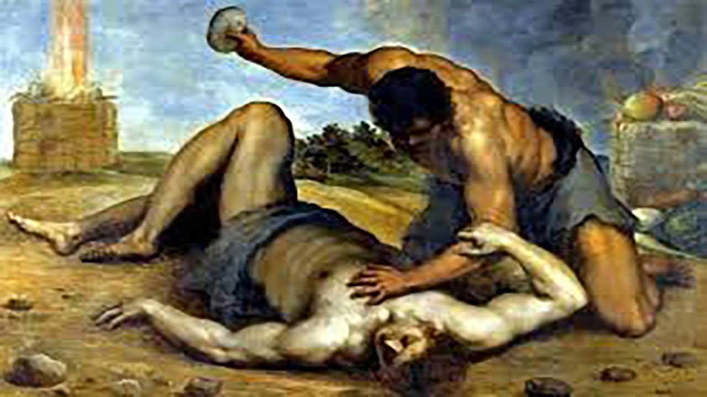

# **Série Bíblica V: Caim e Abel: Os Irmãos Hostis**

por Dr. Jordan Peterson

YouTube Video (https://www.youtube.com/watch?v=44f3mxcsI50)

*Palavras-chave: Caim, Abel, Sacrifício, Inveja, Assassinato, Irmãos*

---

## Seção I

Vou ler uma coisa para vocês. Recebo muita correspondência. Não sei de onde tirei isso. Estive em muitos lugares diferentes na semana passada, e isso apareceu em um deles. Vou ler para vocês. Não faço ideia do que pensar sobre isso.

Está escrito com letra feminina. É mais ou menos tudo o que consigo dizer. Não há endereço nem nome. "Isso não é uma pergunta, mas um comentário — ou, mais precisamente, talvez, uma mensagem. Passei este fim de semana em uma cerimônia de [Ayahuasca](https://en.wikipedia.org/wiki/Ayahuasca), que, para aqueles que não sabem, é um medicamento visionário de planta sul-americana. Alguns de vocês podem revirar os olhos para isso, mas a Ayahuasca o leva ao contato direto com o reino arquetípico do ser. Usuários deste medicamento — iniciados, devo dizer — se referem à Ayahuasca como ela, porque o espírito da planta é decididamente feminino, e um encontro com a Ayahuasca é um encontro com a grande mãe terra, a criação, a deusa, o vazio de onde todas as coisas vêm — a contraparte feminina do logos. Dr. Peterson, você apareceu em uma das minhas visões com Ayahuasca."

Pode explicar por que tenho estado bastante fatigado ultimamente. "Dr. Peterson, você apareceu em uma das minhas visões com Ayahuasca, e eu perguntei a ela: quem é Jordan Peterson? O que ele está fazendo?" O que eu também realmente gostaria de saber. "E ela respondeu com clareza cristalina: ele está aqui para invocar e iniciar o princípio divino masculino na terra neste momento. Então, estou aqui para agradecer profundamente e profundamente em nome da grande mãe ela mesma, a deusa, o princípio divino feminino que tem esperado ansiosamente o despertar do princípio masculino para a divindade e o serviço."

Então… Você não recebe uma carta dessas todo dia. Na verdade, recebo uma ou duas cartas assim todo dia. O que passou pela minha cabeça quando li isso — e isso é, claro, um paralelo completamente louco, mas uma das coisas que aprendi a fazer como psicoterapeuta foi simplesmente contar às pessoas que estavam falando comigo o que veio à minha cabeça. Não é exatamente o que estou pensando. Não é exatamente a mesma coisa. O que vem à sua cabeça é mais como um sonho. Vem sem ser convidado. É como sua imaginação. Se você está pensando, parece haver um elemento voluntário nisso, certo? Quero dizer, só Deus sabe como pensamos, mas parece parcialmente voluntário, pelo menos.

Jung pensava nisso como um diálogo entre a mente consciente e a mente inconsciente. Há um diálogo contínuo. Mas quando as coisas simplesmente aparecem em sua mente, não é muito diferente de entrar em uma sala e ter algo lá, o que é uma observação que também derivei de Jung, aliás. Ele apontou, com razão, que as pessoas não realmente pensam, mas que os pensamentos aparecem para elas. Agora você pode pegar os pensamentos que aparecem para você, e então pode submetê-los à crítica, elaboração, e assim por diante, em vez de simplesmente assumir que eles são verdadeiros logo de cara. Mas as pessoas frequentemente não fazem isso; algo aparece em sua cabeça e elas assumem que é verdade.

De qualquer forma, uma das coisas que eu costumo fazer em psicoterapia é simplesmente contar às pessoas o que aparece na minha cabeça. Por quê? Porque então a pessoa que está falando comigo recebe a opinião sem restrições de uma pessoa. Nem isso — reação. Não opinião. Não é realmente uma opinião, eu acho. Uma opinião, talvez, é o que eu penso depois. Há esse sabor pessoal nisso.

O que apareceu na minha cabeça foi a história sobre Sócrates. Quando ele estava sendo julgado pelos atenienses por corromper a juventude do país — algo do qual também fui acusado, aliás, embora não seja autoevidente para mim que sou eu quem está corrompendo. Alguém uma vez perguntou ao [Oráculo de Delfos](https://en.wikipedia.org/wiki/Pythia) quem era o homem mais sábio da Grécia. O Oráculo de Delfos disse que era Sócrates, porque ele sabia que não sabia de nada. Essa é essencialmente a história. Isso apareceu na minha mente. É uma comparação louca, mas eu tenho uma mente louca, então acho que é assim que funciona.

Agora, uma das coisas que vou fazer hoje — o que não fiz antes — é ler um pouco do meu livro que terminei na semana passada. Não li para ninguém ainda. Dei para alguns amigos para revisar. Uma pessoa em particular, um roteirista chamado [Gregg Hurwitz](https://en.wikipedia.org/wiki/Gregg_Hurwitz), tem sido incrivelmente útil. Ele é tão rápido e afiado nesse tipo de coisa. Posso mandar para ele um manuscrito denso de 20 páginas, e ele o destrói e me manda de volta em uns 90 minutos. É simplesmente inacreditável. Ele é tão bom nisso. Tem sido muito útil. Mas mais ninguém viu, exceto meu editor, e não li para ninguém. Mas parte disso pareceu particularmente apropriado para a palestra de hoje à noite. Então pensei que começaria a palestra de hoje lendo um pouco dele. É de um capítulo sobre a questão do sacrifício como tal. Isso é Abraão e Isaque. Essa é uma história muito estranha e pequena do Antigo Testamento. Essa é uma das histórias contidas no Antigo Testamento que faz as pessoas modernas pensarem que talvez devêssemos simplesmente não ter muito a ver com o Antigo Testamento, por assim dizer, especialmente no que diz respeito — e talvez não devêssemos ter nada a ver com o Deus do Antigo Testamento também. Quero dizer, no que diz respeito a Abraão, Deus lhe diz para sacrificar seu próprio filho. Agora resulta que Deus estava apenas brincando, por assim dizer. Estou sendo obviamente leviano, mas isso levanta a questão: o que você acha de um ser divino que exigiria tal coisa? Ou, inversamente, o que você acha de Abraão, que teria tais delírios? De qualquer forma, é um pouco difícil para a credibilidade moderna, e para a integridade moral do Antigo Testamento. Essas são histórias muito, muito estranhas, e elas não são o que parecem ser — ou são, e são mais.

Então vamos falar muito sobre sacrifício hoje à noite. Aqui estão algumas das coisas em que tenho pensado sobre sacrifício. Isso é do meu livro, chamado *12 Regras para a Vida: Um Antídoto para o Caos*. Vai sair em janeiro, o que acho que mencionei. Isso é da Regra 7, que é Busque o que é Significativo, Não o que é Conveniente.

E então aqui está um pouco da escrita que tenho feito nos últimos três anos sobre o motivo do sacrifício. Vou começar com apenas uma breve introdução antes de ler isso. Levei muito tempo para entender o que era significado no Antigo Testamento por sacrifício, o que é estranho. Uma vez que descobri, pareceu sangrentamente óbvio. Pareceu como, ah, bem, obviamente é isso que significa. Mas muitas vezes, se você descobre algo corretamente, parece autoevidente assim que você o descobriu corretamente. Veremos como isso vai, mas pareceu funcionar para mim, de qualquer forma.

Eu sabia, pelo menos implicitamente, do uso moderno da ideia de sacrifício. Todo mundo entende esse motivo. É que, se você quer melhorar as coisas no futuro, então você faz sacrifícios no presente. Talvez você até faça isso de forma multigeracional — na verdade, você definitivamente faz se for um bom pai. Eu diria que isso é particularmente típico de imigrantes, certo? Imigrantes frequentemente vêm de lugares terríveis, e têm que passar por coisas terríveis para chegar a uma nova comunidade onde recebem uma recepção rústica. Eles têm dificuldade para começar suas vidas. Uma grande parte da razão pela qual eles fazem isso é para melhorar suas vidas, e as vidas de seus filhos. Felizmente, quando eles vêm para o Canadá — geralmente, dado de onde vieram — isso realmente funciona. De onde vieram é pior, e aqui é melhor, mesmo que, você sabe, imigrantes frequentemente tenham que lutar para se firmar novamente. Eles têm que aprender um novo idioma, se inculturar, e enfrentar o fato de que não fazem parte da cultura principal. Mas muitos de vocês conhecem toda essa história.

Então a ideia de que você faz sacrifícios pelo futuro, e de que você faz sacrifícios por seus filhos — todo mundo entende isso. Faz parte de ser responsável, maduro, e carregar o fardo de ser adequadamente. Você faz isso por si mesmo também, se for disciplinado. Na verdade, é quase isso que disciplinado significa. Disciplinado significa que você é capaz de fazer sacrifícios. Você não é disciplinado se simplesmente faz algo que quer mais, em vez de algo que está fazendo. Isso não é disciplina. Talvez isso funcione, e ótimo. Se sua vida está funcionando dessa forma, ótimo, cara, mas isso não é disciplina. Disciplina é quando você quer fazer algo agora e, em vez disso, pensa: não, vou adiar minha gratificação, talvez para sempre, mas certamente por um período médio a longo de tempo. Você se concentra em algo que acha que dará frutos no médio a longo prazo. Você olha para o futuro, e decide que, ao tornar hoje um pouco menos impulsivamente prazeroso, digamos, você tornará amanhã um pouco mais seguro e produtivo. E então você realmente faz isso também. Isso é difícil.

Na semana passada discutimos a descoberta de Adão e Eva do futuro e a revelação da possibilidade do futuro, incluindo a possibilidade de tragédia e sofrimento no futuro. É nosso conhecimento da possibilidade de tragédia e sofrimento no futuro que nos motiva a sacrificar no presente, para que possamos reduzir a ansiedade, incerteza e dor desnecessárias que nos aguardam. Agora, essa é uma maneira negativa de colocar isso. Também estamos fazendo isso para que possamos ter alguma alegria, e para que possamos tornar a vida melhor, e tudo isso. Isso não é trivial. Mas a questão fundamental, especialmente quando você tem filhos pequenos, é afastar o sofrimento, certo? Isso é o que você quer fazer. Essa é sua principal obrigação moral se você é uma pessoa que tem qualquer — se seus olhos estão abertos, de jeito nenhum, essa é sua principal obrigação. E assim você faz os sacrifícios necessários, e estabelece o futuro.

O motivo do sacrifício está lá no Antigo Testamento, mas é tão concreto que é difícil traçar um paralelo entre os dois. Para mim, eles não se alinhavam de forma autoevidente. Eu ia à Igreja Unida até os 13 anos. Não me lembro de ninguém jamais ter apontado os sacrifícios que Caim e Abel estavam fazendo, ou o sacrifício que Abraão deveria fazer, ou que os sacrifícios que as pessoas estavam fazendo a Deus eram os precursores dramáticos da ideia psicológica de sacrifício que todos nós temos como pessoas civilizadas no mundo moderno. Embora, pareça óbvio — como eu disse — uma vez que você o expõe. Não me lembro de isso ter sido explicado para mim. Deixe-me ler isso, agora que meio que introduzi.

"Aqui está o que aconteceu à medida que a humanidade se desenvolveu. Primeiro foram os incontáveis dezenas ou centenas de milhares de anos antes do surgimento da história escrita e do drama. As práticas gêmeas de adiamento e troca começaram a emergir, lenta e dolorosamente."

Então aqui vai um estudo psicológico legal. É chamado de [Teste do Marshmallow](https://en.wikipedia.org/wiki/Stanford_marshmallow_experiment), e talvez seja até um estudo confiável, mesmo que tenha sido feito por psicólogos sociais. Provavelmente é replicável. É um estudo legal. Você pega crianças pequenas, e as traz para uma sala, e coloca algo que elas gostariam na frente delas — um marshmallow — e então as tortura. Você diz: vê esse marshmallow? E a criança pensa: sim, eu vejo esse marshmallow. Você pode ter esse marshmallow agora ou, se esperar — acho que o experimento é 10 minutos — então você pode ter dois marshmallows. E assim a criança fica em um grande dilema. Elas estão sendo pedidas para trocar um marshmallow real, concreto e tangível por dois marshmallows hipotéticos, futuros.

Não é tão fácil conjurar uma realidade futura hipotética que tenha o mesmo significado tangível de algo real bem na sua frente. É uma coisa incrível que as pessoas possam fazer isso. Então o experimentador sai. Algumas crianças pegam o marshmallow e simplesmente devoram aquela coisa, agora mesmo. Outras crianças — eles filmaram as crianças. Enquanto estão fora, as crianças fazem todo tipo de coisas. Elas assobiam, e olham para o teto, e sentam nas mãos. Elas tentam se distrair. Claro, elas estão olhando para aquele marshmallow como um esquilo olhando para uma noz, e estão tentando se conter. O que eu vejo nisso é o córtex pré-frontal dessa criança. Os sistemas corticais superiores estão em guerra com os sistemas motivacionais subjacentes — sistemas motivacionais mais primordiais que governam coisas como a fome. O sistema da fome, o sistema [hipotalâmico](https://en.wikipedia.org/wiki/Hypothalamus), diz que há algo doce e gorduroso bem ali, bem agora. Pegue aquilo e enfie para baixo — agora. Tenho certeza de que muitos de vocês têm uma batalha constante com seu hipotálamo em relação a coisas doces e gordurosas, e frequentemente perdem, então vocês podem sentir alguma simpatia pela criança. O hipotálamo tem esses tentáculos tremendamente poderosos subindo para o cérebro, para as partes que associaríamos mais com controle voluntário. Os centros de controle voluntário têm essas pequenas fitas fracas indo para baixo para controlar o hipotálamo. É bastante óbvio, se você sabe algo sobre neuroanatomia, qual parte está realmente no comando quando as coisas apertam.

Não é fácil para as crianças aprenderem a regular esses impulsos subjacentes e primordiais — aqueles que são conectados, e que compartilhamos com os animais. Mas elas fazem isso, e o legal é — isso é o que [Walter Mischel](https://en.wikipedia.org/wiki/Walter_Mischel) descobriu. Ele é o cara que fez o estudo. O resultado de longo prazo para as crianças que puderam adiar a gratificação no Teste do Marshmallow é muito mais positivo do que para as crianças que são impulsivas e comem o marshmallow instantaneamente. É adiamento da gratificação. É provável que isso esteja associado à traço de conscienciosidade, embora essa conexão específica ainda não tenha sido estabelecida. Mas eles parecem, conceitualmente, muito, muito semelhantes.

De qualquer forma, isso emerge em crianças provavelmente entre as idades de dois e quatro anos. Algo assim. Elas deveriam ter isso no lugar aos quatro, porque é muito difícil para elas realmente interagirem bem com outras crianças sem ter esse adiamento da gratificação no lugar. Se você não consegue adiar a gratificação, outras crianças não gostam de você, porque você quer tudo do seu jeito, e quer agora, e é propenso a ter uma birra, e esse tipo de coisa. Você não tem o tipo de autocontrole necessário para torná-lo divertido para brincar. Então você pode ver isso emergindo em crianças, e é bem interessante. Não só isso, mas à medida que emerge, prediz resultados positivos de longo prazo — assim como a traço de conscienciosidade faz, aliás. A traço de conscienciosidade é o segundo melhor preditor de sucesso de longo prazo, ao longo da vida, em culturas ocidentais. É o segundo depois da inteligência. Em nossas sociedades, as pessoas que se dão melhor ao longo do tempo são as pessoas que têm QI alto e trabalham duro. Eu diria que isso é uma validação bastante decente…Como você chamaria…É uma validação, em algum sentido, de que nossas culturas estão funcionando adequadamente. O que você quer, eu diria — se o sistema está funcionando meritocraticamente, como deveria, e se você está tentando extrair recursos daqueles que podem contribuir a uma taxa mais alta — é que as pessoas trabalhadoras e inteligentes se deem melhor. Esperançosamente, se esse for o caso, então todos se dão melhor. Esperançosamente. De qualquer forma, você pode ver isso se desenvolvendo em crianças.

## Seção II

[TIMESTAMP](https://youtu.be/44f3mxcsI50?t=1091)

"Primeiro foram os incontáveis dezenas ou centenas de milhares de anos antes do surgimento da história escrita e do drama. As práticas gêmeas de adiamento e troca começaram a emergir, lenta e dolorosamente. Então elas se tornaram representadas, em abstração metafórica, como rituais e contos de sacrifício. É como se houvesse uma figura poderosa no Céu, que está julgando você. Você melhor mantê-la feliz, ou cuide-se. Temos estado nos observando lidar com Ele por um longo tempo. Ele parece gostar quando você abre mão de algo que valoriza. Então pratique compartilhar e sacrificar, até ficar bom nisso." "Ninguém realmente disse nada disso" — tão tempo atrás, embora tenham dito algo muito semelhante — "Mas estava implícito na prática, e então nas histórias. A ação vem primeiro. O implícito vem primeiro. As pessoas assistiram os bem-sucedidos terem sucesso e os malsucedidos falharem por milhares e milhares de anos. Pensamos sobre isso, e tiramos uma conclusão: Os bem-sucedidos entre nós sacrificam. Os bem-sucedidos entre nós adiam a gratificação. Os bem-sucedidos entre nós barganham com o futuro. Uma grande ideia começa a emergir em forma cada vez mais articulada. Essa ideia é o ponto de uma história longa e profunda. É o moral da história." Vou fazer um foreshadowing, aqui. "Qual é a diferença entre os bem-sucedidos e os malsucedidos? Os bem-sucedidos sacrificam, e as coisas melhoram à medida que os bem-sucedidos praticam seus sacrifícios. A questão se torna cada vez mais precisa e, simultaneamente, mais ampla. Qual é o maior sacrifício possível, para o maior bem possível?"

Se você empurrar uma questão nessa direção, talvez chegue um momento em que você não consiga formulá-la de forma mais precisa e ampla. Esse é o ponto em que a questão, em certo sentido, e, talvez, até a resposta para a questão, se torna arquetípica. Torna-se arquetípica, porque não pode ser superada. Essa é como uma questão última, em certo sentido. Como você vai fazer uma pergunta mais ampla do que essa? Dadas as pressuposições iniciais — de que você tem que fazer sacrifícios — então o ponto final lógico disso é algo como, ok, se você tem que fazer um sacrifício, qual é o maior sacrifício possível, e para o maior bem possível? Essa é uma boa pergunta. "A resposta se torna cada vez mais profunda. O Deus da tradição ocidental, como tantos deuses, requer sacrifício. Já examinamos por quê. Mas às vezes Ele vai ainda mais longe, e requer o sacrifício do que é mais amado. É por isso, e essa é outra das descobertas fundamentais da humanidade: Às vezes, as coisas não vão bem. Isso é autoevidente. Mas aqui está o problema: Às vezes, quando as coisas não estão indo bem, é precisamente aquilo que é mais valorizado que é a causa." "Por quê? É porque o mundo é revelado através do template de seus valores. Se o mundo que você está vendo não é o mundo que você quer, portanto, é hora de examinar seus valores. É hora de se livrar de suas pressuposições atuais."

Há um experimento famoso que mencionei, algumas vezes, eu acredito, nesta série de palestras: [o experimento do Gorila Invisível](https://en.wikipedia.org/wiki/The_Invisible_Gorilla). No experimento do Gorila Invisível, há dois times de jogadores, cada um com três membros. Um time está vestido de preto, e o outro time está vestido de branco. Cada time está passando uma bola de basquete de um para o outro entre os membros do time, e circulando. Você vê um vídeo deles fazendo isso. Eles basicamente preenchem a tela do vídeo. O time branco está passando uma bola de basquete para os membros do time branco, e o time preto está passando uma bola de basquete para os membros do time preto. Seu trabalho, no que diz respeito ao experimentador, é contar o número de vezes que o time preto passa a bola de basquete de um para o outro. Isso é o que você faz. Agora, você tem uma ambição, um objetivo e um valor. A ambição, o objetivo e o valor são todos a mesma coisa, e é performar bem na tarefa. Agora, a coisa que é tão legal sobre isso — e isso é realmente tão legal. É simplesmente inacreditável que isso seja o caso. É como uma validação completa de um certo elemento da visão de mundo budista.

Então, eles passam a bola por alguns minutos, então o experimentador diz a você, quantas, e você diz 15, e você está feliz consigo mesmo, porque esteve prestando atenção. O experimentador diz, sim, isso está certo — ou talvez não; talvez você tenha perdido uma. E então o experimentador diz, você viu o gorila? E metade de vocês diz, que gorila? Como, realmente? E o experimentador diz, sim. Ele rebobina o vídeo e o reproduz, e como um minuto e meio nos três minutos do vídeo, com certeza, entra esse cara com uma fantasia de gorila, um metro e noventa e três, mais ou menos. Ele fica no meio do jogo — bem no meio do jogo — do mesmo tamanho que os jogadores. Perfeitamente, obviamente, evidente. Ele bate no peito por uns segundo e meio, e então meio que sai de fininho.

Metade das pessoas que assistem o vídeo não veem o gorila, o que é absolutamente chocante. O que isso significa é que suas ambições o cegam para a natureza da realidade. Agora, elas iluminam alguma realidade, mas o cegam para a maior parte dela. Isso é bom, porque você não é — não há muito de você, em certo sentido. Você é uma coisa muito pontual, como um feixe de laser, e então você simplesmente não pode estar prestando atenção a tudo, o tempo todo. Se você está sofrendo terrivelmente, então uma possibilidade é que você está tão fixado no ponto que sua fixação pode estar integralmente relacionada a por que as coisas estão indo tão catastroficamente erradas. Agora, talvez não, porque há muita arbitrariedade sobre a vida. E talvez você sofra mesmo quando não merece. Isso parece acontecer no livro de Jó, por exemplo. Jó é um cara bom, e Deus tem uma aposta com Satanás — o que parece outra coisa relativamente desagradável de se fazer — para, digamos, torturá-lo. Satanás faz isso, muito bem, para ver se Jó vai se virar contra Deus. Parece algo meio de parque infantil para Deus fazer, mas o ponto é que, mesmo em um documento como o Antigo Testamento, há sugestão ampla de que, às vezes, as pessoas simplesmente são eliminadas, e machucadas, mesmo que estejam vivendo vidas boas, morais, mirando adequadamente, e tudo isso. Há uma arbitrariedade na vida. Mas é possível que seja o que você está se agarrando que está te machucando. É até possível que a coisa à qual você está se agarrando mais forte, que está machucando mais, possa facilmente ser alguém que você ama.

Muitas vezes eu vejo pessoas em terapia, e elas estão miseráveis por uma razão, ou outra. Às vezes, é porque um relacionamento muito próximo com um membro da família simplesmente não está funcionando. O membro da família, para simplificar, diremos, não está realmente orientado para ajudá-las a ter uma boa vida. O membro da família está, em vez disso, orientado para torná-las tão sangrentamente miseráveis quanto você pode possivelmente tornar qualquer um, e explorando o vínculo entre membros da família para possibilitar isso. E então, às vezes, o sacrifício necessário é apenas se distanciar dessa pessoa, às vezes substancialmente, e às vezes se distanciar seriamente delas, como nós não conversamos mais, nunca. Então isso é bem difícil, e dói, e tudo isso, mas é um bom exemplo do fato de que, às vezes, para se extrair do pedaço miserável de caos no qual você acontece de estar enredado, você tem que soltar o que mais ama.

"Se o mundo que você está vendo não é o mundo que você quer, portanto, é hora de examinar seus valores." Isso é realmente vale a pena pensar, porque a alternativa é amaldiçoar o destino. Se não for você, e não há nada que você possa fazer para mudar, não há algo que você está fazendo que está errado, então é o próprio destino. É o próprio mundo. São outras pessoas, digamos, porque elas são uma grande parte do mundo. Ou, é a natureza do próprio mundo. Ou, é o próprio Deus, de qualquer forma que você acredite ou não acredite, porque é fundamentalmente tudo a mesma coisa nesse tipo de situação que estou descrevendo. Uma das coisas que é realmente interessante — e mencionei isso antes, sobre os israelitas no Antigo Testamento — é que eles acertaram isso. É realmente algo.

O que acontece com os israelitas, repetidamente no Antigo Testamento, é que eles ficam todo inchados sobre como são maravilhosos, e então cometem erros morais. Eles são arrogantes, e então Deus vem, e simplesmente os corta em pedaços, por como geração após geração. Eles cambaleiam de volta aos pés, mas sempre mantêm a mesma atitude, que é, fizemos algo errado. Fizemos algo errado. É como um axioma, em vez de uma observação: se as coisas não estão se desenrolando para nós, como deveriam, então não podemos amaldiçoar Deus; temos que olhar para nós mesmos. E você pensa, bem, por que não amaldiçoar Deus? Porque talvez seja culpa dele. Essa é uma questão realmente boa. Uma das coisas que tentei descobrir nos últimos 30 anos é, bem, por que simplesmente não amaldiçoar Deus? Porque há esse elemento arbitrário da existência, e somos vulneráveis, e há bastante sofrimento, e as coisas são injustas. Há problemas, certo? Há injustiça, e há injustiça, e todas essas coisas, e sofrimento sem fim. Por que simplesmente não colocar isso aos pés de Deus? Se Deus existe ou não, no que diz respeito à metafísica desta discussão particular, não é relevante. O ponto permanece o mesmo, de qualquer forma. A resposta, até onde posso dizer, é que, se você se recusa a assumir a responsabilidade por si mesmo, e tenta colocá-la aos pés da sociedade, ou do próprio ser, então você instantaneamente começa a agir de uma forma que piora tudo — não apenas para você, mas para todos os outros, e talvez até para o próprio ser. Não é útil.

Agora, se você decidir que é você, que você tem o problema — talvez isso nem seja verdade. Talvez você seja alguém que foi torturado pela aposta entre Deus e Satanás, e azar o seu se esse for o caso. Mas ainda parece ser a coisa apropriada para um ser humano, que está de pé em seus próprios dois pés de maneira adequada, assumir a responsabilidade por si mesmo, independentemente dos contra-argumentos que possam ser feitos contra isso. Isso é realmente algo.

"É hora de se livrar de suas pressuposições atuais." Também penso nisso como uma questão de madeira morta. Uma das coisas que você vê com motivos como a fênix — lembre quando Harry Potter vai lutar? Ele é como São Jorge. Ele vai lutar…Que diabos é essa coisa…O basilisco que te transforma em pedra quando você olha para ele. É um dragão, para todos os fins e propósitos. Está protegendo uma virgem. Qual é o nome dela…Não é Virgínia. É próximo disso, no entanto. Ginny? Ginevera, que é uma variante de virgem, e uma variante de Virgínia. Bem, quando ele é mordido pelo dragão, e envenenado — esse é o dragão do caos, certo? A coisa que te transforma em pedra quando você olha para ela. Quando ele é mordido por ela, e está indo morrer — e, sim, bem, se você for mordido pela coisa que transforma em pedra quando você olha…Cara, se você não estiver morto, vai desejar estar. É uma das duas.

E então a fênix voa, e chora lágrimas no ferimento, e isso o cura. A fênix é a coisa que permite que a madeira morta queime de vez em quando, digamos. Bem, acho que é uma vez a cada 100 anos com a fênix, e, claro, é bastante dramático. Toda a maldita ave tem que subir em chamas, e então não sobra nada além de um ovo. Mas há uma mensagem muito séria aí também, que é que você pode se comparar, em certo sentido, a uma floresta. Uma floresta tem que queimar, de vez em quando, para que a madeira morta se limpe — para que a floresta possa realmente se manter, e continuar sua existência. Se você impedir a floresta de queimar por um longo período de tempo — o que aconteceu nos Estados Unidos quando eles estavam tentando gerenciar os incêndios florestais com muito rigor — então tudo o que acontece é que a madeira morta se acumula, e se acumula, e se acumula, e se acumula, e se acumula, até que toda a maldita floresta seja madeira morta. E então um raio a atinge, e ela queima tão quente que queima os topos. E então não sobra nada. Nada cresce. Essa é uma boa lição moral, que é, não espere muito para deixar a maldita madeira morta queimar. Talvez um pouco de autoimolação em uma base diária possa ser preferível a se queimar até o leito rochoso uma vez a cada 20 anos, ou mais, porque talvez não sobre nada de você quando você fizer isso.

Isso acontece com as pessoas o tempo todo. Vi isso acontecer com as pessoas muitas, muitas vezes. A madeira morta se acumula, a bagunça ao redor delas se acumula. O caos com o qual elas não lidaram se acumula. Um dia a faísca chega, e elas queimam tão longe, e tão rápido, que não sobra o suficiente delas para se recuperar. E então elas são as pessoas que foram comidas pelo dragão, e agora estão dentro de sua barriga — outro motivo arquetípico muito comum. Bem, talvez um herói venha e as resgate, ou talvez elas simplesmente fiquem lá para sempre. Esse é um precursor da ideia do inferno. Não é algo que eu recomendaria. Então, um pouco de remédio em uma base regular é muito melhor do que uma imolação total em termos que não sejam os seus, esporadicamente.

"É hora de se livrar de suas pressuposições atuais." Há outra coisa que…Quando Soljenítsin escreveu sobre a União Soviética e suas patologias — ela meio que atingiu o pico em termos de seu autoritarismo patológico quando se tornou ilegal reclamar que sua vida não estava indo bem. Você simplesmente pensa em quão horrível isso é, digamos, porque, você sabe, muitas vezes sua vida não está indo bem, e não quero dizer isso de alguma maneira casual. Quero dizer, talvez você tenha diabetes, e talvez vá perder seus pés, ou algo. Não é algo realmente trivial que está acontecendo aqui; algo não está bom. Ou talvez seja econômico, ou talvez você esteja desempregado. Mas, veja, a ideia na União Soviética era, bem, já temos todas as respostas. Tudo já está perfeito. É isso que os totalitários pensam. Bem, se tudo está perfeito, e você está sofrendo, então, bem, talvez haja algo errado com você. Tudo está perfeito, afinal. Se você está sofrendo, o que você vai fazer? Sair e dizer que está sofrendo? Bem, então você é evidência de que as coisas não estão perfeitas. Você é como um viúvo, ou um órfão, em uma história do Antigo Testamento. Quando os reis ficavam altos e poderosos demais, então eles não prestavam atenção suficiente às viúvas e órfãos. Então um profeta viria e diria, você sabe, essas viúvas e órfãos são muito mais importantes do que você pensa, e se você não prestar atenção neles adequadamente, então as coisas vão desmoronar ao seu redor de uma forma que você simplesmente não pode nem imaginar. Bem, então você é meio que seu próprio viúvo, e seu próprio órfão, mas você não tem permissão para dizer, ei, olhe, as coisas ainda não estão perfeitas, porque ainda estou passando por um momento bastante difícil, aqui. Você não tem permissão para admitir seu próprio sofrimento. Se você não pode admitir seu próprio sofrimento, então você certamente — o sofrimento, especialmente o sofrimento excessivo, deveria ser tratado como evidência de que você não está fazendo algo bastante certo, ainda. Deveria ser tratado como evidência de que você está errado. Há alguma… 

## Seção III

[TIMESTAMP](https://youtu.be/44f3mxcsI50?t=2774)

Eu estava em um elevador, uma vez, em um hospital. É uma coisa muito aterrorizante. Essa pessoa entrou, que estava em um estado absolutamente de choque. Realmente não estava bom. Não me lembro como isso aconteceu, mas engajei a pessoa em conversa. Ela disse que acabara de ser diagnosticada com o que parecia ser câncer terminal. O que foi horrível sobre isso foi que ela estava passando pela vida no elevador, e tentando descobrir o que tinha feito para merecer tal destino. Ela imediatamente assumiu como uma falha moral. Não é isso que estou dizendo. Você não pode vir até alguém que tem câncer e dizer, bem, se você não fosse um idiota sangrento ao longo de toda a sua vida, você não teria câncer. Acredite em mim, isso acontece muito mais do que você pensa. Pessoas que têm doença como essa são culpadas por isso. Não é isso que estou dizendo. Não é assim. É uma atitude mais generalizada de que se a vida ainda não é o que deveria ser, então você tem uma responsabilidade primária de fazer algo sobre isso. O lugar para começar a olhar é para seus próprios erros, e corrigi-los. Essa é uma aposta segura, cara, porque você provavelmente está fazendo algumas coisas que não precisaria estar fazendo, que, se você corrigisse, tornariam as coisas melhores. "É hora de soltar, e sacrificar quem você é pelo que você poderia se tornar."

Caso algum de vocês esteja interessado em como pegar um macaco, agora vocês vão saber como fazer. Primeiro, você tem que pegar um jarro grande de gargalo estreito, apenas grande o suficiente no diâmetro no topo para um macaco colocar a mão dentro. Então você tem que enchê-lo parcialmente com pedras, para que seja pesado demais para o macaco carregar. Então você espalha alguns petiscos perto do jarro, para atraí-los, e coloca alguns dentro do jarro de gargalo estreito. Um macaco vai aparecer, se você tiver sorte, e pegar os petiscos. Ele vai querer os que estão dentro do jarro também, então ele vai colocar a mão lá, e pegar o que está lá. Se você configurou sua armadilha para macaco corretamente, então ele não vai conseguir tirar a mão, porque ele pegou os petiscos dentro. Então ele está preso. E você pode simplesmente andar até o jarro e pegar o macaco. Ele não vai sacrificar a parte para preservar o todo.

Algo valioso, dado, garante prosperidade futura. Algo valioso, sacrificado, agrada ao Senhor. O que é mais valioso, e melhor sacrificado? — ou, o que é pelo menos emblemático disso? Um corte de escolha de carne. O melhor animal em um rebanho. Uma posse mais valorizada. O que está acima disso? Algo intensamente pessoal e doloroso de abrir mão. Isso é simbolizado, talvez, na insistência de Deus na circuncisão como parte da rotina sacrificial de Abraão, onde a parte é oferecida, simbolicamente, para redimir o todo. O que está além disso? O que pertence mais de perto à pessoa toda, em vez da parte? O que constitui o sacrifício definitivo — para o ganho do prêmio definitivo?

É uma corrida apertada entre filho e eu. O sacrifício da mãe, oferecendo seu filho ao mundo, é exemplificado profundamente pela grande escultura de Michelangelo, a *Pietà*. Maria está contemplando seu filho crucificado e arruinado. Esse é o corpo dele, depois de ser crucificado. É culpa dela. Foi através dela que ele entrou no grande drama do ser. Então, qual é o significado desta escultura? É uma grande escultura. É simplesmente uma escultura absolutamente inacreditável. Você simplesmente não consegue acreditar que alguém pudesse existir que pudesse fazer algo assim. Não foi a única coisa que Michelangelo fez, certo? Não foi como, isso é tudo. Foi algo que ele simplesmente jogou fora em alguns meses enquanto estava fazendo outras coisas inacreditáveis. É um objeto de contemplação, que é por que está em uma grande catedral, e em uma grande cidade. É um objeto de contemplação. A ideia é algo como, bem, qual é o papel da mãe se ela está acordada?

Tive um cliente vindo me ver não muito tempo atrás: uma mulher, com cerca de 30 anos, tentando tomar decisões sobre sua vida. Ela era bastante orientada para a carreira, e então perguntei a ela sobre — embora, talvez tendo um pouco de problema com sua carreira. Vi isso muitas, muitas vezes. Essa é uma história que é uma amálgama. Falei com ela sobre os outros elementos de sua vida. Você só faz cinco coisas na vida. Então, você tem sua carreira em dia. O que você faz fora de sua carreira que é significativo e envolvente? Como vão as coisas com sua família? Você tem um relacionamento íntimo? E qual é seu plano para sua própria família? E além dessas cinco coisas, há algo como, faça algum exercício, de vez em quando, não coma tão mal, e tente ficar longe das drogas. Isso meio que traça a vida. Se você perder qualquer uma dessas cinco coisas, ou se fizer qualquer uma dessas outras coisas erradas, então você está encrencado. Você pode se safar perdendo algumas delas, mas não todas. Ela disse algo nas linhas de, bem, não tenho certeza se devo trazer uma criança para este mundo. Pensei, oh, Deus. Cristo. Você tem que inventar algo melhor que isso! É um clichê tão sangrento, que foi o que eu disse a ela. Disse, você deve ter pensado nisso quando tinha 16 anos. É como, realmente? Você não consegue fazer nada melhor? Essa era uma mulher muito, muito inteligente. É como, realmente, você não consegue fazer nada melhor que isso? Sim, obviamente este é um véu de lágrimas, e um poço de sofrimento, e tudo isso. Se você perguntar a 30 pessoas que estão se perguntando sobre ter filhos por que estão se perguntando, 20 delas vão dizer isso. Isso te diz quão original é. Não é original, de jeito nenhum. Não é um pensamento. É um meme; algo que vive em sua mente. Não é um pensamento. Certamente não é algo que você deveria simplesmente levar ao pé da letra e dizer, bem, não vou ter uma família. Não, você meio que olha para isso, e o critica um pouco.

Essa é a outra que é muito comum: já há pessoas demais no planeta. Eu realmente não gosto dessa declaração. É como, exatamente quem você vai pedir para sair? Exatamente como você vai fazer com que elas saiam? É uma questão séria. E quem diz que há pessoas demais? O que diabos há de errado com as pessoas, aliás? Estamos correndo por aí, e arruinando o planeta. Sim…Acho que foi o [Clube de Roma](https://en.wikipedia.org/wiki/Club_of_Rome) que profetizou, aliás, que haveria tantas pessoas no planeta até o ano 2.000 que haveria fome generalizada. Eles estavam completamente e absolutamente errados sobre isso. Acho que foi o Clube de Roma que nos comparou a um vírus ou a um câncer na face do planeta. É como, oh, realmente? É isso que você acha das pessoas, hein? Hm, não é algo para se pensar sobre os seres humanos — vírus e câncer. O que você faz com vírus e câncer? Convida-os para dentro, e faz com que se sintam em casa? É como, não. Você tenta erradicá-los. Você muito bem melhor vigiar suas metáforas, pessoal, porque não está claro se você as inventa, ou se elas o controlam, então você melhor vigiá-las.

## Seção IV

[TIMESTAMP](https://youtu.be/44f3mxcsI50?t=5253)

Então, de qualquer forma. Maria é a Grande Mãe. Ela é a Mãe. É isso que Maria é. Se ela existiu ou não não é o ponto. Ela existe, pelo menos, como uma hiper-realidade. Ela existe como a Mãe. Qual é o sacrifício da Mãe? Bem, isso é fácil. Se você é uma mãe que vale seu sal, você oferece seu filho para ser destruído pelo mundo. É isso que você faz. É isso que vai acontecer, certo? Ele vai nascer; ele vai sofrer; ele vai ter seus problemas na vida; ele vai ter suas doenças; ele vai enfrentar seus fracassos e catástrofes, e ele vai morrer. É isso que vai acontecer. Se você está acordada, você sabe disso, e então você diz, bem, talvez ele viva de uma forma que justifique isso. E então você tenta fazer isso acontecer. É isso que a torna digna de uma estátua como aquela. Conceda o sacrifício da Mãe.

É certo trazer um bebê para este mundo terrível? Bem, toda mulher se faz essa pergunta. Algumas dizem, não, e têm suas razões. Maria responde sim, voluntariamente. Maria é o arquétipo da mulher que responde sim à vida, voluntariamente. É isso que aquela imagem significa, e não porque ela está cega. Ela sabe o que vai acontecer. Ela é a representação arquetípica da mulher que diz sim à vida, sabendo muito bem o que a vida é. Não ingênua, e não alguém que engravidou no banco de trás de uma Chevy 1957, em uma noite de idiotice meio bêbada. Não isso, mas conscientemente, sabendo o que está por vir — e então, também, permite que isso aconteça. Essa é outra coisa que é um testemunho da coragem das mães.

Minha mãe era boa nisso. Minha mãe é uma pessoa muito agradável — agradável demais para o bem dela, mas é isso que acontece se você for agradável. Essa é a definição de agradável. Ela é uma pessoa legal — e ainda é, felizmente. Ela ainda está viva, e tivemos um relacionamento realmente bom. Sempre consegui fazê-la rir, o que é uma coisa boa. Mas ela era uma mulher durona. Eu estava jogando em este pequeno campo de beisebol, em um lote vazio, nesta pequena cidade em que cresci. Eu tinha cerca de 10 anos. Ela passou. Eu estava lá com um monte de meus amigos. Eu estava prestes a ter uma briga de socos com este pequeno garoto durão com quem eu andava. Havia meia garotas no time, e uma briga de socos tinha alguma relação com manobras de status em relação a isso. De qualquer forma, íamos ter uma briga. Minha mãe passou. Ela deu uma olhada, e eu pude ver por sua atitude que ela sabia exatamente o que estava prestes a acontecer. Ela olhou por um segundo, e então passou. E eu pensei, uau! Bom trabalho, mãe! Sem brincadeira, hein? A última coisa maldita de que eu precisava naquele momento era que ela viesse correndo e dissesse, vocês meninos não estão planejando ter uma briga, estão? É como, bem, sim, mãe. Na verdade, estamos planejando ter uma briga, e agora que você veio e interveio, eu realmente perdi antes mesmo da coisa começar. Então dois polegares para cima para a mãe. Ela também foi a pessoa que disse — tive alguns problemas com meu pai quando era adolescente. Ele tinha alguns problemas comigo. Era 50-50 — não, era provavelmente 70-30, comigo no final dos 70 dos problemas. De qualquer forma, saí de casa quando tinha cerca de 17 anos. Ela disse algo realmente interessante quando saí de casa. Ela disse, se fosse bom demais em casa, você nunca sairia. Pensei, ei, mãe, isso é bem bom. Para uma pessoa agradável, você tem uma espinha de verdade. Isso foi bem bom.

A mãe é a pessoa que também diz, saia lá e leve seus golpes, porque você é forte o suficiente para lidar com isso. Ela não diz, apenas fique lá em seu quarto, remoendo, porque o mundo é injusto e está te tratando mal, e seu sofrimento é demais. Ela diz, sim, há muito sofrimento lá fora, mas você é muito mais forte do que pensa. "No caso de Maria, no entanto — enquanto Ele se sacrificava — Deus, seu Pai, está simultaneamente sacrificando seu Filho." Essa é uma das curiosidades do modelo trinitário, é que Deus se sacrifica a si mesmo. A mesma coisa acontece na mitologia nórdica…Mitologia germânica. Zeus se sacrifica a si mesmo. Ele realmente fica pendurado em uma árvore. Ele realmente é ferido no lado. É um paralelo muito interessante. Mas acho que parte da ideia é que a raça humana está tentando descobrir, qual é o sacrifício definitivo? É algo como o sacrifício definitivo de valor. Bem, a história da Paixão — e eu disse a vocês que estava fazendo foreshadowing. Estou trazendo para consideração coisas sobre as quais não falaremos por muito tempo, e talvez não de jeito nenhum nesta série de palestras, porque não sei até onde chegarei. Há um sacrifício supremo exigido por parte da mãe, e há um sacrifício supremo exigido por parte do filho, e há um sacrifício supremo exigido por parte do pai, todos ao mesmo tempo. Isso torna o sacrifício supremo possível, e, hipoteticamente, esse é o que renova. Esse é o sacrifício que renova e redime. É uma ideia do cacete. A coisa sobre isso é que… 

Geralmente, o oposto de algo que é falso é verdadeiro. Seu oposto é falso, porque se a mãe não fizer o sacrifício, então você tem a situação edípica horrível, ou algo assim, no lar, que é seu próprio inferno absolutamente catastrófico. Se você quer uma visão realmente boa disso, assista o documentário *Crumb*. Esse foi classificado por alguns críticos como o melhor documentário já feito. É algum trabalho, cara. É a única coisa que já vi que realmente expõe a catástrofe edípica em seu pesadelo completo. Então você poderia olhar para isso. Se o sacrifício maternal não estiver lá, isso não funciona. Se o sacrifício paternal não estiver lá, se o pai não estiver disposto a colocar seu filho no mundo, digamos, para ser quebrado e traído, e todas essas coisas, então isso é um não-início, porque a criança não cresce. E então, se o filho não estiver disposto a fazer isso, então quem diabos vai assumir a responsabilidade? Se essas três coisas não acontecerem, então é cataclísmico; é caótico; é inferno. Se elas acontecerem, é o oposto disso? Você poderia dizer, bem, talvez dependa do grau em que elas acontecem. É um continuum. Quão completamente elas podem acontecer? Bem, não sabemos. Você poderia dizer, quão bom trabalho você faz de encorajar seus filhos a viverem na verdade? Essa é parte da resposta para esta questão. A resposta provavelmente é, você não faz um trabalho tão bom quanto poderia. Funciona bastante bem, mas você não sabe quão bem poderia funcionar se você fizesse realmente bem, ou espetacularmente bem, ou ultimamente bem, ou algo assim. Você não sabe.

As pessoas têm uma intuição disso. Uma das coisas que é realmente legal sobre ter um bebê pequeno…Há duas coisas que você não sabe…Há muito mais que duas. Há três coisas que você não sabe até ter um bebê. A uma é que você não cresceu ainda. Você na verdade não cresce até que outra pessoa seja mais importante que você. Você não pode. As pessoas acham que crescem se não têm filhos, mas não crescem. Elas apenas acham que crescem. Agora, há algumas pessoas que fazem sacrifícios de outros tipos, mas isso é uma bola de cera completamente diferente, até onde estou preocupado. Não é uma metáfora muito elegante, mas…Você aprende que é meio um alívio não ser o centro das atenções. Isso é legal — que você pode sentar para trás, porque, claro, seu filho, em sua família, e na sociedade, é imediatamente o centro das atenções. A menos que você seja narcisista, então você permite que isso aconteça. E então você aprende todo tipo de coisas realmente boas sobre outras pessoas.

Outras pessoas realmente gostam de bebês. É tão legal. Eu morava em Montreal quando tivemos nosso primeiro filho. Eu morava em um bairro bastante rústico, pelos padrões de Montreal. É como, Montreal é uma cidade tão ótima, como Toronto. Mesmo os bairros rústicos são mais como charmosos com um pouco de lado escuro. Algo assim. Mas havia alguns personagens rústicos em nosso bairro, e era bastante pobre, e nós a empurrávamos em seu carrinho de bebê. Esses caras velhos, grisalhos, destruídos, passavam, olhavam para ela, e simplesmente se iluminavam. Eles vinham e sorriam para ela, e você via o elemento positivo de sua humanidade valer a pena. Tem que haver algo seriamente errado com você se você não responder dessa forma a um bebê. Isso não é bom. Mas foi tão legal ver essas pessoas, com quem você geralmente meio que andaria na rua, e, de repente, as camadas que estavam nelas simplesmente caíam. Os bebês são meio que propriedade pública, estranhamente o suficiente, também — meio que como mulheres grávidas. As pessoas frequentemente tratam mulheres grávidas meio como se elas fossem propriedade pública, também — de uma forma positiva. Elas fazem todo tipo de coisas fofas.

A razão pela qual estou lhes contando isso é porque há um impulso forte nas pessoas de saber que há algo milagroso sobre a existência de um novo ser humano. O elemento milagroso é todo o potencial que está lá. Potencial é tudo o que está lá. Com cada nascimento, há o potencial para algo notável ser introduzido no mundo. Uma das coisas em que também pensei é que os bebês são genéricos até você ter um. Seu bebê não é um bebê genérico, de jeito nenhum. Instantaneamente, é uma pessoa com quem você tem um relacionamento que é mais próximo, talvez, do que todos os relacionamentos que você já teve, e que você pode manter perfeito, certo? A maioria dos relacionamentos que você já teve é com pessoas que estão estragadas em 50 maneiras diferentes, e você também, mas aqui você tem este bebê. Ainda não está arruinado. Você tem esta possibilidade de manter este relacionamento que começa — aquele bebê realmente gosta de você, e geralmente isso continua por bastante tempo. Eles têm dois anos, você volta para casa, e eles estão realmente felizes em vê-lo. É meio que como ter um filhote. É como, eles estão entusiasmados quando você volta para casa. Quantas pessoas estão entusiasmadas quando você volta para casa? É como, oh, é você de novo. Não, não uma criança pequena. Uma criança pequena está entusiasmada quando você volta para casa, e você pode manter isso acontecendo. Há este elemento pristino no potencial relacionamento entre pais e filhos que é terrivelmente desvalorizado em nossa sociedade. É quase como se estivéssemos voluntariamente cegos para isso. Acho que é uma catástrofe absoluta, porque há muito pouco na vida que pode se comparar a estabelecer um relacionamento adequado com uma criança. Eles fazem ótima companhia se você mantiver seu relacionamento com eles pristino.

Vale a pena. A razão pela qual estou lhes contando isso é porque as pessoas olham para bebês e pensam que isso poderia ser o potencial salvador da humanidade. É isso que elas pensam. É assim que elas agem, então é assim que elas pensam. O negócio é, também é verdade. Agora, quão verdadeira é, não sei. Mas é, acho, provavelmente porque as pessoas não ousam descobrir. É assim que parece para mim. "No caso de Cristo, no entanto — enquanto Ele se sacrificava — Deus, seu Pai, está simultaneamente sacrificando seu Filho. É por essa razão que o drama sacrificial cristão do Filho e do Eu é arquetípico. Nada maior pode ser imaginado. É por isso que é um arquétipo: você não pode ir além disso. Essa é a própria definição de 'arquetípico'. Esse é o núcleo do que constitui 'religioso'. O maior de todos os sacrifícios possíveis é o eu e o filho. Disso não pode haver dúvida." "Dor e sofrimento definem o mundo. Disso, igualmente, não pode haver dúvida. A pessoa que quer aliviar o sofrimento — que quer trazer o melhor de todos os futuros possíveis; que quer criar o Céu na Terra — vai, portanto, sacrificar tudo o que tem a Deus — à vida na Verdade." Então essa é uma página e meia do livro que vou lançar em janeiro. De volta a Gênesis. Já estamos no Gênesis 4. "E Adão conheceu Eva sua mulher; e ela concebeu, e deu à luz Caim, e disse: Adquiri um homem do Senhor."

Isso é depois que Adão e Eva foram expulsos do jardim do Éden. O que é realmente legal sobre isso — eu realmente acho que a história de Caim e Abel é a história mais profunda que já li, especialmente dado que você pode contá-la em 15 segundos. Não vou, porque eu não costumo contar histórias em 15 segundos, como vocês podem ter notado. Mas você pode ler tudo isso tão rapidamente. É tão densamente empacotada que é na verdade inacreditável.

Ok, então a primeira coisa é que Adão e Eva não são os dois primeiros seres humanos. Caim e Abel são os dois primeiros seres humanos. Adão e Eva foram feitos por Deus, e nasceram no paraíso. É como, que tipo de seres humanos são esses? Você não conhece nenhum ser humano assim. Os seres humanos não nascem no paraíso e são feitos por Deus. Os seres humanos nascem de outros seres humanos. Essa é a primeira coisa. É pós-queda. Estamos na história, agora. Não estamos em algum além arquetípico — embora ainda estejamos, em certa medida. Não no grau que era o caso com a história de Adão e Eva. Já fomos expulsos do jardim; já somos autoconscientes; já estamos acordados; já estamos cobertos; já estamos trabalhando. Somos seres humanos completos. Então você tem os dois primeiros seres humanos: Caim e Abel; seres humanos prototípicos.

O que é legal é que a humanidade entra na história no final da história de Adão e Eva, e então os padrões arquetípicos para o comportamento humano são instantaneamente apresentados. É absolutamente de cair o queixo, e não é uma história muito legal. Eles são irmãos hostis. Eles têm as mãos na garganta um do outro, por assim dizer, ou pelo menos é o caso em uma direção. É uma história dos dois primeiros seres humanos engajados em uma luta fratricida, que termina na morte do melhor deles. Essa é a história dos seres humanos na história. Se isso não lhe der pesadelos, você não entendeu a maldita história.

Agora, nessas histórias de irmãos hostis, que são muito, muito comuns, frequentemente o irmão mais velho — Caim — tem algumas vantagens. Ele é o irmão mais velho, e, em uma comunidade agrícola, o irmão mais velho geralmente herdava a terra, e não os irmãos mais novos. E a razão para isso era, bem, digamos que você tenha uns oito filhos, e você tenha terra suficiente para sustentar um pouco de família, e você divide entre seus oito filhos, e eles têm oito filhos, e eles dividem entre seus oito filhos. Logo, todo mundo tem um selo de correio no qual pode ficar e morrer de fome. E assim isso simplesmente não funciona. Você entrega a terra em um pedaço para o filho mais velho, e é assim que é. É azar para o resto deles, mas pelo menos eles sabem que vão ter que ir e fazer seu próprio caminho. Não é justo, mas não há como torná-lo justo.

Bem, você poderia dizer que o filho mais velho tem uma participação adicional na estabilidade da hierarquia atual. Ele tem mais participação no status quo. Isso o torna mais um representante emblemático do status quo, e, talvez, mais propenso a ser cego a seu favor. É algo assim. Esse motivo aparece com muita frequência na luta arquetípica dos irmãos hostis. A história de Caim e Abel se encaixa nesse padrão, porque Caim é o que não vai ceder, e que não vai se mover. Ele é teimoso. Enquanto o filho mais novo, que é Abel, é frequentemente o que é mais…Não tanto um revolucionário, mas, talvez, mais um equilíbrio entre o revolucionário e as tradições, enquanto o irmão mais velho tende a ser mais tradicionalista-autoritário — nessas representações metafóricas, pelo menos.

"E Adão conheceu Eva sua mulher; e ela concebeu, e deu à luz Caim, e disse: Adquiri um homem do Senhor." Há o primeiro ser humano: Caim. Disse a vocês que os mesopotâmicos achavam que a humanidade era feita do sangue do pior demônio que a grande deusa do caos poderia imaginar. Bem, o primeiro ser humano é um assassino, e não apenas um assassino, mas um assassino de seu próprio irmão. E assim, você sabe, o Antigo Testamento, esse é um livro bem duro. E você poderia pensar, bem, talvez isso seja um pouco demais para suportar. E então você poderia pensar, sim, e talvez seja verdade, também. Então isso é algo para se pensar.

"E ela novamente deu à luz seu irmão Abel. E Abel era um pastor de ovelhas, mas Caim era um lavrador da terra."

Lá você vê uma representação muito antiga. Há Abel. Ele tem suas ovelhas no altar. Caim está trazendo um feixe de trigo. Não sei exatamente o que está acontecendo aqui. Sangue, ou é um raio, talvez. É algo assim. A impressão geral da imagem é que algo transcendente está se comunicando com este sacrifício. Você pensa, oh, quão primitivo. Quão primitivo, que essas pessoas estavam sacrificando para seu Deus. É como, essas pessoas não eram estúpidas, e isso não é primitivo. Seja o que for, não é primitivo. É sofisticado além da crença. A ideia, como já apontei, é que você poderia sacrificar algo de valor, e que isso teria utilidade transcendente. Essa de forma alguma é uma ideia pouco sofisticada. Na verdade, pode ser a maior ideia que os seres humanos já tiveram.

É uma resposta para o problema que é apresentado na história de Adão e Eva, certo? Nos tornamos autoconscientes, e então descobrimos o futuro, e então soubemos que íamos morrer, e então soubemos que éramos vulneráveis, e então ficamos envergonhados, e então desenvolvemos o conhecimento do bem e do mal, e então fomos expulsos do paraíso. É como, esse é um grande problema. Então o que diabos você vai fazer sobre isso? Sacrifício. Essa é a hipótese. Bem, essa é uma hipótese do cacete, cara. É isso que estamos fazendo. Você faz muitos sacrifícios — até para sentar neste teatro — e muitas pessoas fizeram muitos sacrifícios para que um teatro como este existisse. Muitas pessoas fizeram sacrifícios para que pudéssemos realmente engajar livremente no diálogo em que estamos engajados, em um teatro como este. Tudo isso é construído sobre sacrifício, e sacrifício muito bem melhor funcionar, porque não temos uma ideia melhor.

Sacrifício. Qual é a posição contrária? Assassinato e roubo. Então, vamos com sacrifício, certo? E, talvez, não o consideremos tão primitivo. Não é tão primitivo.

"E ela novamente deu à luz seu irmão Abel. E Abel era um pastor de ovelhas, mas Caim era um lavrador da terra. E no decorrer do tempo aconteceu que Caim trouxe do fruto da terra uma oferta ao Senhor." Ok, então ele está participando deste ritual sacrificial. "Uma oferta ao Senhor." "E Abel, ele também trouxe das primícias de seu rebanho e da gordura deles. E o Senhor teve respeito por Abel e por sua oferta: Mas por Caim e por sua oferta ele não teve respeito. E Caim ficou muito irado."

Irado. Wroth é uma palavra dura. Essas são traduzidas muitas vezes. É difícil pegar o sabor completo das palavras. Mas, "irado, e seu semblante caiu," bem, ter seu semblante cair…Isso é meio que para cima. Cair é tê-lo pesado, deprimido, com certeza. Irado, com certeza. Ressentido, provavelmente. Wroth: isso é raiva. Então, Caim não é um marisco feliz, que seu trabalho duro tenha sido rejeitado por Deus. Agora isso vale a pena pensar. Você pensa em quão humana essa história é. Você está lá fora — bem, poderíamos dizer, você pode ser um personagem inútil, e está reclamando sobre como sua vida é catastrófica. É bastante óbvio para todos ao seu redor, e para você, que é sua culpa. Você simplesmente não tenta: você não acorda de manhã; você não consegue um emprego; você não se engaja nas coisas; você é cínico; você é amargurado; você está com raiva; você não tenta ajudar as pessoas perto de você; você não tenta consertar sua própria vida, e você não cuida de si mesmo. E então as coisas dão errado. É como, bem, realmente? O que você esperava? Mas isso não significa que alguém nessa situação simplesmente dirá, bem, tudo bem; eu mereço; e elas vão ficar felizes com isso. Elas não vão. Elas vão estar absolutamente amarguradas com isso e com raiva. Mas, você sabe, deixe isso de lado por um momento. Há pessoas que parecem lutar de forma muito franca, digamos, e ainda assim têm uma catástrofe após a outra acontecendo com elas. Não há resposta fácil nesta história. É como, você pode cair em desgraça com Deus porque seus sacrifícios são de segunda categoria, ou você pode simplesmente cair em desgraça com Deus, e você não sabe por quê. Bem, azar o seu. E então o que acontece, em qualquer caso, é exatamente isso, quase inevitavelmente: "Caim ficou irado, e seu semblante caiu."

Pessoas como essa escrevem para mim o tempo todo. Vi isso em muitos, muitos clientes. Elas geralmente não têm 20 anos. 30, mais comumente. Às vezes, 40. Suas vidas não foram bem. Elas estão em um poço de desespero, de uma forma ou de outra, e não apenas estão em um poço de desespero, mas estão extraordinariamente com raiva disso, e só Deus sabe o que elas fariam com essa raiva se tivessem aquela oportunidade de dar a ela voz completa.

Uma das coisas em que sempre pensei sobre Hitler é que as pessoas…Você tem que admirar Hitler. Essa é a coisa. Ele era um gênio organizacional. A coisa que não impede as pessoas de serem Hitler…As pessoas não recusam a ambição de se tornar Hitler porque não têm a motivação genocida. Elas não seguem esse caminho porque não têm o gênio organizacional. Elas têm a maldita motivação. Se você pegar cem pessoas, aleatoriamente, e conversar com elas — e realmente conversar com elas — você descobrirá que cinco por cento delas levariam seus pensamentos vingativos bem longe se apenas lhes fosse dada a oportunidade, e, de fato, elas fazem. Elas tornam a vida miserável para si mesmas, e frequentemente para suas famílias, e, às vezes, para qualquer um que possam chegar perto. E então talvez outro 20 por cento de pessoas tenham isso borbulhando nelas de forma bastante regular. Você pode ter alguma simpatia por Caim. Se você não tiver nenhuma simpatia por Caim, então você não é…Veja, Caim e Abel não representam apenas dois tipos arquetípicos de ser. Não é como você é Caim, e você é Abel. É como, você é metade e metade, e você é metade e metade, e você é metade e metade. É algo assim. Isso são dois padrões potenciais diferentes de destino. Você não manifesta um puramente e o outro zero. É como a linha entre bem e mal que corre pelo coração humano. É exatamente a mesma ideia. Talvez você seja mais como Caim, ou talvez você seja mais como Abel, mas ainda há um pouco de Caim em você, não importa quão Abel você seja. E talvez mais do que um pouco — e provavelmente mais do que um pouco. Se você assistir suas fantasias, o que eu recomendaria muito, você descobrirá que elas lhe mostram coisas escuras sobre você que o chocarão se você permitir que seja consciente do que está pensando.

Quando você está tendo uma discussão com alguém, especialmente alguém que você ama, é um bom momento para simplesmente assistir as imagens que passam no fundo de sua mente. Essa é parte de, digamos, entrar em contato com o que Carl Jung chamou de sombra. A sombra é a manifestação de Caim. Essa é uma maneira perfeitamente boa de pensar sobre isso. Uma das coisas que Jung disse sobre a sombra — porque Jung não era alguém com quem você mexe levianamente. Ele disse que a sombra humana tem raízes que chegam até o inferno. Jung quis dizer isso. Isso não é metáfora para ele. Ele pode não ter querido dizer no mesmo sentido que um cristão fundamentalista do sul dos EUA poderia querer dizer, mas eu diria que Jung quis dizer de uma forma que é muito mais aterrorizante, e também muito mais verdadeira. "E Caim ficou muito irado, e seu semblante caiu."

Então há Abel, queimando sua oferta lá. Ele está neste tipo de relacionamento com…vamos chamá-los de figura arquetípica da cultura. O Pai arquetípico. É algo que ele respeita. Essa é a coisa — a postura é uma indicação de respeito. E então há Caim, no fundo. Seu rosto está na sombra. Ele está com ciúmes do que está acontecendo. Ele está apenas passando pelos movimentos, talvez, e talvez Deus simplesmente não goste dele. Não sabemos. Mas ele está passando pelos movimentos. Ele não está muito feliz com isso. Essa é na verdade uma frase que você poderia esculpir em muitas lápides de pessoas como um epitáfio para suas vidas: passou pelos movimentos, mas não estava muito feliz com isso.

Esta é realmente uma interessante, eu acho. Não sei exatamente o que Deus está fazendo aqui. Ele está ajudando a acender a chama sacrificial. Essa é uma ideia interessante, eu acho, porque…Digamos que você tenha um impulso de fazer um sacrifício. Você pensa, bem, eu deveria mudar isso sobre minha vida. Bem, de onde vem esse impulso? Simplesmente se manifesta do nada, ou você inventou. Bem, você pode querer parar de pensar tão seguramente que você inventa seus próprios pensamentos. Você não inventa. Você pode sonhar coisas que você não sabe, e isso é uma coisa estranha. Os sonhos podem conter sabedoria que simplesmente…Bem, simplesmente impressiona a pessoa que tem o sonho uma vez que ela obtém a chave para o sonho, e uma vez que ela se lembra dele. É como, olhe, você acabou de revelar um monte de sabedoria para si mesma que você não sabia. De onde veio isso? Você não sabe. Como no mundo você pode sonhar coisas que você não sabe? Essa é uma questão difícil. Talvez falemos sobre isso, em algum ponto, nesta série de palestras, porque há algumas coisas razoáveis que podem ser ditas sobre isso. A ideia de que há algo que não é você…Jung chamaria de o Self, que ele pensava como a totalidade de seu ser através do tempo e do espaço. É algo assim, e que, você sabe, cada segundo que você existe é uma fatia do Self se manifestando através do tempo e do espaço. Ele pensava no Self como parcialmente a voz da consciência, seja lá o que for, que o ajuda a guiar quando você tem que tomar uma decisão difícil. Uma decisão difícil pode ser, bem, o que eu preciso sacrificar? Como eu preciso me disciplinar? Do que eu preciso abrir mão? Bem, como você descobre essas coisas? Esta imagem está tentando colocar a ideia de que, talvez, se você tivesse estabelecido o relacionamento adequado com Deus Pai — e falamos sobre o que isso poderia significar — então ele ajudaria a descobrir como fazer os fogos sacrificiais queimarem, para que você pudesse permanecer em um relacionamento adequado com Ele através do tempo. Isso é uma proposição tão irracional? Qual é a proposição alternativa? Bem, isso não está funcionando muito bem. Isso é certo.

Caim parece estar fazendo…Não sei o que é. É como se ele pensasse que só pode fazer isso ele mesmo, ou talvez ele queira apenas levar o crédito por isso, ou algo assim. Ele não está nesta…Grato, digamos, e indagador. Postura grata e indagadora. É isso que uma postura de oração deveria ser. Deveria ser grata e indagadora. Grato é, graças a Deus as coisas não estão piores para mim do que estão. Você deveria ser grato sobre isso, porque elas poderiam estar muito piores do que estão, cara. Elas podem ser tão ruins. Indagador seria, bem, eu realmente não sei como poderia melhorar, mas estou aberto a sugestões. Se eu puder descobrir como fazer isso, vou tentar. Essa é a humildade: uma indagação humilde. Como eu poderia melhorar as coisas? É algo assim. Que sacrifícios eu preciso fazer para melhorar as coisas? Essa é uma boa pergunta para se fazer.

Você poderia se fazer isso toda manhã. Que sacrifício eu tenho que fazer para melhorar as coisas? Você pode decidir o que constitui melhor. Que tal isso? Então, não é nem como se estivesse sendo imposto a você. Invente sua própria noção do que constitui melhor. Tente torná-la sofisticada. Não deveria ser apenas melhor para você, porque isso não vai funcionar muito bem, certo? Você simplesmente vai cair escada abaixo se fizer isso, porque você tem que viver com outras pessoas. E além disso, é estúpido. O que você vai fazer? Não há nada que você possa sequer dizer sobre isso. É tão…Essa é a atitude de um bebê de dois anos muito mal comportado e hiper-agressivo. Quero dizer isso tecnicamente. Você poderia se perguntar, bem, eu tenho este dia que se desenrola na minha frente. Que coisa eu poderia soltar que está impedindo meu progresso, que, se eu soltasse, tornaria minha vida melhor, e a vida de minha família melhor, e a vida de minha cultura melhor, e meu ser melhor? Isso lhe daria algo para fazer durante o dia, não daria? E para justificar sua vida miserável.

Você precisa disso. Esse é o ponto inteiro da primeira história de Adão e Eva. O que você tem? Uma vida miserável. Ok. O que vou fazer sobre isso? Bem, se você apenas tem uma vida miserável, você simplesmente vai sofrer estupidamente e ficar amargurado sobre isso. É isso que acontece com Caim. É como, bem, que tal não fazer isso? Isso simplesmente parece pegar um mau negócio e piorá-lo. Que tal fazer um sacrifício, e ver se você pode agradar a Deus e colocar o ser no caminho certo? Deus, isso seria algo para fazer. O que poderia ser melhor que isso? O que poderia possivelmente ser melhor que isso? É por isso que é arquetípico, cara, porque nada é melhor que isso. É onde isso atinge o topo.

Você pode fazer isso. Você pode fazer isso todo dia. Você tem que fazer em uma pequena escala, porque o que você é? Você não vai trazer esta utopia socialista ao ser em um único golpe. Você também pode pensar que uma das coisas que Caim poderia descobrir aí — há um par de coisas que não estão indo bem para ele. A favor do vento do fogo? Não o lugar certo para soprar. E o fato de que ele está envolto em névoa e fumaça, e respirando isso, e o fogo não está queimando, pode ser uma indicação de que ele está fazendo algo errado, ou ele estaria limpando os olhos e dizendo, Jesus, que tipo de universo estúpido e sangrento produziria fumaça assim? É como, sim, bem, esse é um resultado mais provável. "E o Senhor disse a Caim: Por que estás irado? e por que teu semblante caiu? Se procederes bem, não serás aceito?"

Agora essa é uma linha interessante. Olhei para uma variedade de traduções diferentes deste sétimo versículo. Essa é uma linha crítica, e a tradução realmente importa. Vou dizer a vocês o que acho que esta história é, e o que consegui descobrir. Tenho certeza de que não acertei completamente. Deus diz, se você proceder bem, não será aceito? Há uma dica aí, certo? É algo como, bem, as coisas não estão indo tão bem para você. A primeira coisa que você poderia pensar é, você não está procedendo bem. Isso não significa que você não está procedendo bem? Isso não significa que você não está agindo adequadamente? É a dica. Deus está sugerindo que, se você estivesse agindo adequadamente, você seria bem-sucedido.

Tive um amigo, em um ponto, que era uma pessoa muito amargurada. Ele tinha um monte de problemas. Alguns deles eram autoinfligidos, e alguns deles eram destino, suponho. Ele havia se tornado muito, muito destrutivo — destrutivo de forma assassina. Destrutivo de forma genocida, eu diria. Você podia ver isso em seus sonhos. Ele morou comigo por um tempo. Eu o conhecia muito bem. Ele era um amigo meu desde os 12 anos até o momento em que cometeu suicídio, quando tinha cerca de 40. Quando ele morou comigo, eu estava tentando ajudá-lo a se firmar, que era a razão pela qual ele tinha vindo morar comigo. Ele achava que talvez eu pudesse ajudá-lo a se levantar. Ele só conseguia aceitar empregos de nível relativamente baixo. Ele tinha alguma habilidade mecânica. Ele não se educou, mas era uma pessoa muito, muito inteligente. Ele provavelmente tinha um QI de 135, ou algo assim. Ele também estava amargurado, porque não se educara ao nível que seu intelecto exigiria. Ele tinha essa arrogância intelectual real, e pessoas realmente inteligentes frequentemente chegam a acreditar que apenas inteligente importa. Se elas são inteligentes, e tudo o que importa é inteligente, e então o mundo está meio que se colocando aos seus pés, então elas foram terrivelmente traídas. Então elas apontam para sua inteligência, que é mais como um talento ou um dom. É como um ídolo falso, que é exatamente o que é, e um muito perigoso. Elas ficam cínicas sobre a estupidez do mundo e o fato de que seus talentos não foram devidamente reconhecidos. Isso simplesmente não é tão útil. Inteligente é uma coisa boa, mas, eu vou dizer a vocês, se você não o usa adequadamente, ele vai devorá-lo, assim como todo talento atribuído arbitrariamente. Você pode ter o talento, mas é seu amigo se o usar adequadamente. Se você o usar mal, ele será seu inimigo. Talvez seja assim que Deus mantém as escalas cósmicas ajustadas.

De qualquer forma, meu amigo era uma pessoa muito inteligente, embora não tão inteligente quanto ele pensava que era, infelizmente. Ele não tinha feito o que teria sido necessário com essa inteligência para fazê-la se manifestar adequadamente no mundo. Isso também o amargurou, porque ele também sabia que havia mais que ele poderia ter feito se tivesse feito, e talvez mais que ele ainda pudesse fazer. O que eu estava sugerindo a ele enquanto ele estava morando conosco — porque ele estava a dois níveis de sem-teto naquele ponto — era que ele deveria encontrar um emprego que pudesse encontrar — trabalhando em uma garagem, trabalhando em uma loja, ou algo assim, porque ele tinha alguma habilidade mecânica — e que ele deveria se separar da arrogância que o fazia presumir que tal emprego estaria abaixo dele. Naquele ponto, nenhum emprego estava abaixo dele, mas, mais importante, não é tão óbvio que empregos estejam abaixo das pessoas.

Imagine que você tem um emprego como caixa em uma mercearia. Esse é um emprego bastante não especializado. Você pode ser algum bastardo miserável, ressentido e horrível fazendo esse emprego. Você pode entrar lá simplesmente exalando ressentimento e amargura, e cometendo erros, e garantindo que todo cliente que passa por você tenha um dia ligeiramente pior do que precisa. Você pode roubar tempo — e, talvez, roubar mercadorias — e ser ressentido sobre as pessoas que lhe deram a posição, porque elas estão acima de você na hierarquia de dominância, e você pode fofocar pelas costas de seus colegas de trabalho. Você pode pegar sua posição servil — autodescrita — e transformar isso em um pedacinho bem legal de inferno. Isso é certo.

Eu sempre penso no diner arquetípico dessa forma. Vocês já estiveram neste diner. Há um diner oposto realmente bom. Há um ótimo diner no YouTube. É Tom Waits lendo um poema de Bukowski. Acho que se chama *Nirvana*. É sobre um bom diner que ele aconteceu de visitar quando era criança. Um diner onde tudo estava indo bem. Você poderia ouvir isso. É ótimo. Mas este é o diner oposto, no qual estou pensando. Você entra em um diner, certo. São sete horas da manhã. Você pede bacon e ovos e torrada. Você olha ao redor do diner, e pensa, era como 1975 quando as janelas foram lavadas pela última vez. Há esse tipo de revestimento grosso de gordura de quem-se-importa nas paredes. O chão, também, tem aquele tipo de pegajosidade que você realmente tem que trabalhar para desenvolver ao longo dos anos. A garçonete não está feliz de estar lá. O cara atrás do balcão não está feliz que essa seja a garçonete com quem ele está trabalhando. E então você desce as escadas até o banheiro, e esse é seu próprio pequeno passeio. Você volta, e pede seus malditos ovos, e pede sua torrada, e pede seu bacon. Vem, e os ovos estão cozidos demais no fundo, então eles estão meio marrons, e então eles estão meio crus no topo. Eles estão frios no meio. Você realmente tem que trabalhar para cozinhar um ovo assim, cara, mas você pode dominar isso com uns 10 anos de amargura. Isso vai te ensinar a cozinhar um ovo assim. E então a torrada — aqui está o que você faz com a torrada. Você pega o pão branco — o pão pré-fatiado que ninguém deveria comer — e então você coloca isso na torradeira, e você cozinha demais. Você espera, e então você o tira da torradeira. Porque está cozido demais, você raspa. Você bate as migalhas para que não pareça muito queimado, e então você espera até que esteja frio, e então você coloca margarina fria nele. Primeiro de tudo, não é manteiga. Mas, se você colocar margarina fria nele, você também pode meio rasgar [...]

Você coloca isso no lado com ovos. E então você tem as batatas. Esta é como você cozinha as batatas corretamente: as batatas sobras — e você continua despejando novas batatas sobras nas velhas batatas sobras, ao longo de semanas. Algumas das batatas voltaram meio para a mãe terra. Então você as joga na grelha, e você meio que as queima um pouco, eu acho. E então você as coloca no prato. Jesus. Você não quer comer essas, cara. Isso é certo. Esse é o ponto.

Você tem o bacon, e você quer ter certeza de comprar o bacon de qualidade mais baixa possível. É assim que você começa. Então você joga na grelha — e sua grelha tem que estar superaquecida para fazer isso — e você tem que cozinhar o bacon de forma que esteja cru em lugares e queimado em outros lugares. Tem aquele odor delicioso de porco que apenas bacon barato, mal cozido, pode fornecer. Ou talvez você use aquelas salsichas de café da manhã pequenas que ninguém em seu bom senso deixaria a 15 pés de qualquer coisa viva. E então você serve isso. E você serve com o tipo de suco de laranja que é laranja apenas na cor, e com café que é…Agh…O que você diria? Foi começado cedo demais na manhã. Essa é a primeira coisa. Café de má qualidade começado cedo demais na manhã — ficou frio uma ou duas vezes, e foi reaquecido. E então você serve isso com branqueador. É como, aqui está seu café da manhã! É como, não, cara. Isso não é café da manhã. Isso é inferno, e você o criou. E então o que você faz se tem um diner como esse é — porque você tem uma vida miserável se tem um diner como esse, e você realmente trabalhou nisso — você vai para casa, e amaldiçoa sua esposa, e amaldiçoa seus filhos, e você caramba amaldiçoa Deus também, por produzir um universo onde um diner como o seu é permitido existir. E essa é sua vida maldita. Também, é isso que Deus está tentando apontar, aqui.

"Se procederes bem, não serás aceito? e se não procederes bem, o pecado jaz à porta." Bem, olhei muitas traduções para isso. Na verdade, a próxima linha é, "E para ti será o seu desejo, e tu dominarás sobre ele."

Sim. O que Deus realmente diz é algo como isto…As coisas não estão indo tão bem para você, mas se você estivesse se comportando adequadamente, elas estariam. Mas, em vez disso, é isso que você fez. O pecado veio à sua porta, e pecado significa puxar sua flecha para trás e errar o alvo. O pecado veio à sua porta. Mas ele usa uma metáfora. A metáfora é algo como, o pecado veio à sua porta como este gato-predador sexualmente excitado, e você o convidou para entrar. E então você o deixou ter seu jeito com você. É como se você entrasse em uma troca criativa — ele usa uma metáfora sexual. Você entrou em uma troca criativa com ele, e deu à luz algo como consequência. O que você deu à luz, essa é sua vida. E você sabia. Você é autoconsciente, afinal. Você sabia que estava fazendo isso. Você conspirou com esta coisa para produzir a situação em que você está.

Jung disse algo semelhante sobre a situação da mãe edípica. O que ele disse foi muito politicamente incorreto. Claro, tudo o que ele escreveu foi politicamente incorreto. É assim que você podia dizer que ele era um pensador, aliás. Ele falou sobre a aliança profana entre crianças hiper-dependentes e suas mães. Ele disse, bem, na verdade — Freud pensava nisso como uma coisa maternal. Não estou colocando Freud para baixo. Freud mapeou a situação edípica brilhantemente. Não estou colocando Freud para baixo. Mas, você sabe, Jung estava pegando as ideias e expandindo-as para fora. Ele disse que havia na verdade uma aliança profana entre uma criança hiper-dependente e uma mãe edípica, superdependente. A aliança era, a mãe sempre ofereceria — então talvez a criança seja suposta sair e fazer algo que exigiria um pouco de coragem e esforço. A mãe diz, bem, você tem certeza de que está se sentindo bem o suficiente para fazer isso? E então a criança poderia dizer, sim, ou a criança poderia dizer não. Mas o negócio é, a criança tomou a maldita decisão também. Você pode pensar, bem, isso é bastante duro. Mas apenas porque as crianças são pequenas, isso não significa que elas são estúpidas.

Você não conhece crianças se você não sabe como as crianças sabem manipular. Elas são incrivelmente boas nisso. Elas estão estudando você sem parar, tentando descobrir, A, o que você está aprontando, e B, como elas podem conseguir o que querem da forma que querem. Elas podem jogar um jogo manipulador, sem problema, especialmente se forem bem treinadas nisso. É meio que assim. Talvez a mãe seja um pouco tímida e um pouco inclinada a superproteger, e talvez a criança seja um pouco manipuladora, e um pouco disposta a não dar aquele passo corajoso para o mundo, e regredir para a dependência infantil, em vez disso. Então você tem uma dinâmica terrível se construindo ao longo do tempo que é como um círculo vicioso, ou como um loop de feedback positivo. Isso simplesmente se expande e se expande e se expande. Às vezes, em famílias, você vê uma criança hiper-dependente e uma criança perfeitamente independente, e a mesma mãe. As mães são muito complexas, e mãe para criança A e mãe para criança B não são a mesma mãe, mesmo que aconteçam de ser a mesma pessoa. A literatura é bastante clara sobre isso, mas você entendeu meu ponto.

A ideia de Deus era que, não apenas você não está procedendo bem, mas você não está procedendo bem porque você realmente gastou muito trabalho descobrindo como não proceder bem. Isso é como esforço criativo de sua parte. Se você quiser ler sobre pessoas verdadeiramente malevolentes, você poderia começar com os assassinos de Columbine. Eles deixaram alguns diários muito interessantes para trás. Eu os recomendaria. Há muitos assassinos em série sobre os quais você pode ler, e as pessoas que realmente saíram e fizeram coisas escuras. Li mais do que minha cota justa desse tipo de coisa, e entendo bastante bem. Se você realmente quiser ter seu semblante cair e ficar irado, 10 anos remoendo sobre sua própria catástrofe, meio que sozinho, e deixando suas fantasias tomarem forma, e incitando-as, permitindo que elas floresçam e, digamos, tomem posse de você…Isso é exatamente a maneira certa de pensar sobre isso. Isso o levará a algum lugar como isso. Há mais pessoas que são assim do que você pensa, e você é mais assim do que você pensa.

Então, Caim obviamente não está muito feliz com esta resposta inteira. A última coisa que você quer ouvir se sua vida se transformou em uma catástrofe e você cobra Deus por criar um universo onde esse tipo de coisa foi permitida, é que é sua própria culpa, e que você deveria se endireitar e voar direito, por assim dizer, e que você não deveria estar reclamando sobre a natureza do ser. Mas essa é a resposta que ele recebe. Então o que acontece? Bem, temos que inferir que, se Caim estava com raiva antes, ele está muito mais com raiva agora. Claro, é exatamente o que a história revela. "E Caim falou com Abel seu irmão: e aconteceu. quando estavam no campo, que Caim se levantou contra Abel seu irmão, e o matou."

Vou ler outra coisa para vocês. Isso é foreshadowing. Isso é do mesmo capítulo, aliás. "Faça o que é significativo, não o que é conveniente. Jesus foi levado para o deserto, de acordo com a história, para ser tentado pelo Diabo (Mateus 4:1), antes de sua crucificação. Essa é a história de Caim, reafirmada de forma abstrata. Caim está longe de feliz, como vimos. Ele está trabalhando duro, ou pelo menos pensa que está, mas Deus não está satisfeito. Enquanto isso, Abel está dançando entre as margaridas. Suas colheitas florescem. As mulheres o amam. Pior de tudo, ele é um cara bastante bom. Todo mundo sabe disso. Ele merece sua boa fortuna. Mais uma razão para odiá-lo."

Quando eu costumava ensinar em Harvard, de vez em quando minha esposa tinha alguns dos graduados mais jovens. Nós costumávamos brincar depois, porque muitos deles eram crianças muito notáveis. Eles eram super inteligentes, ou eram atléticos, ou tinham alguma habilidade dramática, ou eram músicos, ou tinham feito algum trabalho caridoso espetacular. Porque, basicamente, para ser aceito em Harvard, você tinha que ser o melhor de sua escola maldita, e então você tinha que ter pelo menos duas outras coisas excelentes acontecendo para você. O que era tão irritante sobre a maioria dessas crianças — essa era nossa brincadeira — você realmente gostava delas e as respeitava. Minha brincadeira era, você pensaria que elas teriam a boa graça de serem filhos da puta desagradáveis, pelo menos. Com todas essas outras coisas ótimas acontecendo para elas, elas tinham que adicionar respeitabilidade e simpatia também. Então você pensava, bem, você sabe, realmente não poderia acontecer com uma pessoa melhor. É como, bom Deus. Bem, essa é a situação de Abel. A coisa engraçada também é que esse é um ideal. Esse é o ideal. Uma pessoa ideal, digamos, seria alguém que você gostaria de ser, e alguém que está operando no mundo como você gostaria de operar, e alguém para quem a fortuna está sorrindo, e alguém que está fazendo os sacrifícios certos. É realmente o que você gostaria de ser. E assim Caim mata isso.

É uma história psicológica também. Você vê isso no cinismo que as pessoas têm sobre pessoas que se deram bem no mundo. Elas estão sempre procurando por alguma razão pela qual elas se deram bem. Elas devem ser desonestas, ou devem ser manipuladoras, ou devem ser arrogantes, ou devem ser psicopatas, e, claro, todas essas coisas existem. Mas é um truque muito ruim de se fazer em si mesmo fazer a proposição de que a pessoa no mundo que representa seu próprio ideal é esse ideal por razões desprezíveis. Porque o que você faz é treinar a si mesmo de que o ideal que você deveria perseguir só pode existir se for motivado por razões desprezíveis. E então o que? Não apenas Abel, seu irmão, está morto, como seu irmão, no campo, na realidade, mas você também matou seu próprio ideal. Bem, então o que diabos você vai trabalhar? Como você vai viver, então? Amargurado e miseravelmente. Isso é certo. Amargurado, miseravelmente, e sem esperança. É assim que você vai viver. É tão raro que eu veja — especialmente publicamente — que as pessoas honestamente admitem — com figuras esportivas elas farão. Esse é um lugar onde isso parece acontecer. Mas é tão incomum para expressões de admiração e gratidão se manifestarem em qualquer comunicação pública, de qualquer tipo. Jornais, TV, YouTube, Twitter. É quase sempre minando, fofocando pelas costas, e crítica, e muito frequentemente direcionada a pessoas que frequentemente não fizeram nada além de trazer coisas boas para o mundo para outras pessoas. Essa é parte da razão pela qual esta é uma história tão profunda.

"Ele é um cara bastante bom. Todo mundo sabe. Ele merece sua boa fortuna. Mais uma razão para odiá-lo." Isso é certo. "Caim remói sua desgraça, como um abutre em um ovo. Ele entra no deserto selvagem de sua própria mente. Ele obceca sobre sua má fortuna e traição. Ele nutre seu ressentimento. Ele se entrega a fantasias de vingança cada vez mais elaboradas. Sua arrogância cresce a proporções luciferianas. Eu sou maltratado e oprimido, ele pensa. Este é um planeta estúpido e sangrento. Pode ir para o inferno. E com isso, ele encontra Satanás no deserto, e cai preso às tentações dele. Ele faz o que pode, nas palavras inesquecíveis de John Milton, para confundir a Raça da Humanidade na primeira Raiz e misturar e envolver a Terra com o inferno — feito tudo para irritar o Grande Criador. Ele se volta para o Mal para obter o que o Bem lhe proibiu, e ele faz isso voluntariamente, autoconscientemente e com malícia. Que aquele que tem ouvidos ouça."

Então esses são os dois primeiros seres humanos. O fracassado ressentido, amargurado, levando o machado ao sucesso admirável. "E o Senhor disse a Caim: Onde está Abel teu irmão? E ele disse: Não sei; Sou eu o guardador de meu irmão? E ele disse: Que fizeste? a voz do sangue de teu irmão clama a mim da terra. E agora estás amaldiçoado da terra, que abriu sua boca para receber o sangue de teu irmão de tua mão;"

Se você quiser entender isso, o que eu recomendaria, você poderia ler *Crime e Castigo* de Dostoiévski. Esse é um grande romance. Acho que pode ser o maior romance já escrito. Não li todos os romances, mas, em minha experiência, é o maior romance. É exatamente isso. Diz o que acontece psicologicamente se você comete o crime definitivo. É incrível. É absolutamente incrível. Não há psicólogo como Dostoiévski.

"E Caim disse ao Senhor, meu castigo é maior do que posso suportar."

Uma das coisas que é interessante sobre isso é — acho que o castigo que Deus impõe a Caim…É como as consequências inevitáveis da ação de Caim. É como, bem, ele matou seu irmão. Não há como voltar disso. Boa sorte se perdoando por isso, especialmente se ele era seu ideal. Porque você não apenas matou seu irmão — e, claro, torturou seus pais e o resto de sua família — você privou a comunidade de alguém que é íntegro, e você fez isso pelas piores motivações possíveis. Não há como subir daí. Isso é o mais próximo do inferno que você pode gerenciar na terra, eu diria. "E Caim disse ao Senhor, meu castigo é maior do que posso suportar. Eis que tu me expulsaste hoje da face da terra; e de tua face serei escondido…"

Isso também. Também não há como voltar para Deus, digamos, depois de um erro como esse. Você fez tudo o que possivelmente poderia para irritar Deus — assumindo que ele existe — e a probabilidade de que você vá conseguir consertar esse relacionamento em seu estado agora quebrado, quando você não conseguiu consertá-lo para começar, antes de fazer algo tão terrível, começa a se mover em direção a zero.

"E acontecerá que todo aquele que me achar me matará. E o Senhor disse a ele: Portanto, qualquer que matar Caim, sobre ele recairá vingança sete vezes. E o Senhor pôs uma marca sobre Caim, para que qualquer que o achasse não o matasse."

Isso é uma coisa interessante. Eu me perguntei sobre isso por um longo tempo. Você poderia pensar, por que Deus tomaria Caim sob sua asa, por assim dizer, dado o que já aconteceu? Acho que tem algo a ver com a emergência da ideia de que era necessário prevenir matanças de vingança olho por olho. É algo assim. Há dicas disso mais tarde no texto. É como, bem, eu matei seu irmão, e então você matou dois dos meus irmãos, e então eu mato toda a sua família, e então você mata minha cidade inteira, e então eu mato seu país inteiro, e então nós explodimos o mundo. Essa provavelmente não é uma solução muito inteligente para o problema inicial, mesmo que o problema inicial, que pode ser um assassinato, não seja uma coisa fácil de resolver. Mas acho que é algo assim.

Esse é William Blake. Adão e Eva descobriram seu filho morto. Caim se tornou consciente, eu diria, do que ele fez e do que ele é. É outra entrada em uma forma de autoconsciência. A autoconsciência que Adão e Eva desenvolveram foi dolorosa o suficiente. Eles se tornam conscientes de sua própria vulnerabilidade, nudez, e, talvez, até de sua capacidade de mal. Mas Caim se torna consciente de seu engajamento voluntário com o mal em si, e vê isso como uma capacidade humana crucial.

Isso é algo que as pessoas modernas…Não é de admirar que não o levemos a sério. Entre círculos intelectuais, por décadas, a ideia de mal tem sido…É como, o que você é? Medieval, ou algo? A ideia inteira de mal é um não-início como ponto de partida intelectual, e como tópico. Isso é algo que eu simplesmente não consigo entender. Eu não consigo entender como você poderia possivelmente ter mais que um conhecimento superficial da história do século XX — muito menos um conhecimento profundo da história do século XX — e sair com qualquer outra conclusão do que, bem, o bem pode não existir, mas o mal…A evidência para isso é tão esmagadora que apenas a cegueira voluntária poderia possivelmente explicar a negação de sua existência.

Isso foi na verdade uma descoberta útil para mim. Também concluí que, se era verdade que o mal existia, então era verdade, por inferência, que seu oposto existia. O oposto do mal. Digamos o mal do campo de concentração. Poderíamos ser mais específicos sobre isso. Há esta coisa que costumava acontecer em Auschwitz, onde eles pegavam pessoas dos trens que chegavam — aquelas que viviam, e que não estavam empilhadas ao redor da parte de fora dos vagões e congeladas até a morte porque estava frio demais. Aquelas que apenas tinham que estar no meio, então estava quente o suficiente. Talvez os velhos morressem porque sufocavam, mas pelo menos alguns deles estavam vivos quando chegaram a Auschwitz. Eles tiravam essas pessoas pobres, e um dos truques que os guardas usavam para brincar com elas era fazer com que os prisioneiros recém-chegados erguessem sacos de sal úmido de cerca de 45 quilos e os carregassem de um lado do complexo — e esses complexos eram grandes. Essa era uma cidade. Não era como um ginásio; era como uma cidade. Dezenas de milhares de pessoas estavam lá. Eles as faziam carregar o saco de sal úmido de um lado do complexo para o outro, e então de volta. Isso era para fazer uma zombaria da noção de que o trabalho as libertaria. É como, não, não. Você trabalha aqui, mas não há nada produtivo nisso. O ponto inteiro é exatamente o oposto do sacrifício, em certo sentido. Vamos fazer você representar o trabalho, mas tudo o que fará é acelerar sua morte. E talvez possamos decorá-lo um pouco, porque não apenas acelerará sua morte, fará isso de uma forma muito dolorosa, enquanto simultaneamente aumenta a probabilidade de que as mortes de outras pessoas sejam dolorosas e aceleradas. É uma obra de arte. Isso é certo. Saber sobre esse tipo de coisa e não considerá-la como mal significa…Bem, você pode descobrir o que significa para si mesmo. "E Caim saiu da presença do Senhor, e habitou na terra de Node, a leste do Éden. E Caim conheceu sua mulher; e ela concebeu…" Um bastante comum [...]

"E Caim conheceu sua mulher; e ela concebeu, e deu à luz Enoque, e edificou a cidade, e vendeu—" É Caim que constrói as cidades e inicia a civilização. Isso é bem difícil, também. É o primeiro assassino fratricida que constrói as cidades depois do nome de seu filho, Enoque. "E a Enoque nasceu Irade…" Et cetera, et cetera. Estou passando pelas gerações. "E Lameque tomou para si duas mulheres: o nome de uma era Ada, e o nome da outra era Zilá." Esta é uma tentativa de preencher a genealogia e descrever como a cultura começou, em certo sentido, nessas comunidades tribais. "E Ada deu à luz Jabal: ele foi o pai de todos os que habitam em tendas, e de todos os que têm gado. E o nome de seu irmão era Jubal: ele foi o pai de todos os que tocam a harpa e o órgão. E Zilá, ela também deu à luz Tubalcaim, um instrutor de todo artífice em bronze e ferro." Tubalcaim, tradicionalmente, é a primeira pessoa que faz armas de guerra. "E Lameque" — de volta a Lameque, descendente de Caim — "disse a suas mulheres, Ada e Zilá: Ouvi minha voz; vós, mulheres de Lameque, ouvi meu discurso: porque matei um homem por meu ferimento, e um jovem por meu dano. Se Caim será vingado sete vezes, verdadeiramente Lameque setenta e sete vezes."

Bem, o que eu vejo nisso é esta propensão desta capacidade assassina de Caim se manifestando, à medida que a sociedade se desenvolve, para uma intenção assassina que transcende o mero assassinato de um irmão. Você me machuca; eu machuco você de volta. Não — você me machuca; eu mato você e seis outras pessoas. A coisa que acontece depois disso é, não é para torná-lo sete pessoas, mas para torná-lo setenta pessoas. E assim há esta ideia de que uma vez que aquela primeira semente assassina é semeada, ela tem esta propensão de se manifestar exponencialmente. Esse é um aviso. Essa também é a razão pela qual, acho, Tubalcaim, que é um dos descendentes de Caim, foi a primeira pessoa que fez armas de guerra.

E essa é basicamente a história de Caim e Abel. É uma história do cacete, até onde posso dizer. Acho que vale a pena pensar nisso praticamente para sempre. Tem tantas facetas. Acho que a mais utilmente reveladora dessas facetas é o potencial para a história, uma vez entendida, lançar luz não sobre sua própria falha — nem mesmo sobre sua rejeição pelo ser, digamos — mas sobre a propensão de assassinar o melhor, e o melhor em você, por vingança sobre essa violação. O que isso significa — e sabemos que o conhecimento do bem e do mal entrou no mundo, por assim dizer, com a transgressão de Adão e Eva — é que agora, não apenas a humanidade tem que contender com tragédia e sofrimento, e mesmo com os frutos não colhidos do sacrifício adequado, mas com a introdução de malevolência real no mundo.

Há a Queda na história, e então há a descoberta do sacrifício como um medicamento para a Queda. E então há uma contraposição, que é a emergência da malevolência como o inimigo do sacrifício adequado. E é aí que ficamos no final de Caim e Abel. E esse é o fim dessa palestra. Obrigado.

---

---

**Notas**

[^1]: Ayahuasca — planta visionária sul-americana usada em cerimônias; aqui, símbolo do encontro com o "reino arquetípico" e o princípio feminino (a Grande Mãe), contrastando com o logos.

[^2]: Teste do Marshmallow — clássico experimento de Walter Mischel sobre capacidade de adiar gratificação em crianças; prediz sucesso de longo prazo (associado à traço de conscienciosidade).

[^3]: Sacrifício como contrato com o futuro — ideia central de Peterson: sacrificar o presente para melhorar o futuro (e o de seus descendentes). O Antigo Testamento dramatiza isso de forma concreta.

[^4]: Sombra (Jung) — o lado reprimido e potencialmente destrutivo da psique; aqui associado a Caim e ao potencial de malevolência voluntária em todo ser humano.

[^5]: Aliança profana (Jung) — entre a mãe edípica superprotetora e a criança hiper-dependente; um círculo vicioso que impede o desenvolvimento.

[^6]: "Se procederes bem, não serás aceito?" — linha chave: o fracasso pode ser consequência de sacrifícios de baixa qualidade ou de não estar agindo com retidão.

[^7]: Tubalcaim — descendente de Caim; tradicionalmente o primeiro fabricante de armas de guerra. Símbolo de como a capacidade assassina de Caim escala para a guerra organizada.

[^8]: **Marca de Caim** — sinal colocado por Deus que é ao mesmo tempo punição e proteção. Representa a ideia de que a vingança não deve ser infinita; há um limite para a retaliação.

[^9]: **Escalada da violência** — o que começa como assassinato individual (Caim e Abel) se transforma, ao longo das gerações, em guerra organizada (Lamech, Tubalcaim). A história mostra como o pecado não fica parado: ele se multiplica quando não é confrontado.

[^10]: **Sacrifício voluntário como antídoto** — a única forma de conter a maldição da violência é através do sacrifício voluntário e consciente, tema que se desenvolve ao longo de toda a Bíblia.

[^11]: **Caim e a inveja do sacrifício alheio**: Caim não é rejeitado por Deus por ser mau por natureza, mas porque seu sacrifício é de menor qualidade (frutos da terra vs. primícias do rebanho). A inveja surge da comparação e da recusa em melhorar o próprio sacrifício.

[^12]: **"Se procederes bem, não serás aceito?"** — Deus oferece a Caim uma segunda chance: a responsabilidade é dele. Esta é a primeira grande lição de agência moral na Bíblia: o fracasso não é destino; é convite para corrigir o sacrifício.

[^13]: **A Sombra (Jung) em Caim**: Caim encarna o lado reprimido e destrutivo da psiche. Todo ser humano carrega o potencial de malevolência voluntária. A história é o primeiro grande mito ocidental sobre o confronto com a própria sombra.

[^14]: **A Marca de Caim como limite à vingança**: Deus protege o assassino de retaliação infinita. Esta é a origem arquetípica da ideia de que a justiça (mesmo divina) impõe limites à escalada da violência — base do direito penal ocidental.

[^15]: **Escalada exponencial da violência (Lamech 77x)**: O que começa como assassinato individual (Caim) torna-se, em poucas gerações, orgulho de matar "setenta e sete vezes". A história mostra que o mal não fica parado: ele se multiplica quando não é transformado por sacrifício.

[^16]: **Tubalcaim e a invenção da guerra industrial**: O primeiro "instrutor de todo artífice em bronze e ferro" é descendente de Caim. A civilização técnica (metalurgia) amplifica a capacidade assassina. Tecnologia sem sacrifício moral = armas de destruição em massa.

[^17]: **Teste do Marshmallow como proto-sacrifício**: A capacidade de adiar a gratificação em crianças de 4 anos é o embrião psicológico do sacrifício bíblico. As crianças que conseguem esperar são as que "procedem bem" e constroem futuro melhor — validação científica da tese central da palestra.

[^18]: **Ayahuasca e o encontro com a Grande Mãe**: O uso da ayahuasca como símbolo do confronto com o princípio feminino/arquetípico. Enquanto o logos (masculino) ordena, o feminino caótico exige encontro e integração — tema que Caim falha em realizar.

[^19]: **A "aliança profana" edípica**: A mãe superprotetora + filho hiper-dependente forma um círculo vicioso que impede o desenvolvimento da capacidade de sacrifício. Caim é o arquétipo do filho que não consegue separar-se e oferecer algo próprio.

[^20]: **Sacrifício vs. ressentimento**: O ressentimento de Caim nasce da recusa em sacrificar o que é inferior. O antídoto não é "sentir-se melhor", mas oferecer o melhor que se tem, mesmo quando dói. Esta é a raiz psicológica do sacrifício voluntário.

[^21]: **A Queda continua em Caim**: A transgressão de Adão e Eva (conhecimento do bem e do mal) manifesta-se plenamente em Caim como malevolência voluntária. O conhecimento do bem agora inclui a capacidade consciente de escolher o mal.

[^22]: **Deus como juiz que oferece agência**: Diferente de deuses caprichosos, o Deus de Caim diz "se procederes bem..." — Ele trata o ser humano como agente moral responsável. Esta é a base da dignidade humana na tradição ocidental.

[^23]: **A cidade construída por Caim**: O primeiro assassino é também o primeiro construtor de cidades. A civilização nasce do sangue e da culpa, mas também da necessidade de ordem após o caos da violência.

[^24]: **William Blake e a autoconsciência de Caim**: A ilustração de Blake mostra Caim tomando consciência não só de seu ato, mas de sua capacidade para o mal. Esta é a segunda grande entrada na autoconsciência humana (depois de Adão e Eva).

[^25]: **O mal existe — e seu oposto também**: A negação moderna do mal (pós-Holocausto, pós-Gulag) é "cegueira voluntária". Se o mal é real, então o bem (e o sacrifício que o sustenta) também é real e necessário.

[^26]: **O gorila invisível e a cegueira dos valores**: O experimento ilustra como nossos valores/ambições nos cegam para a realidade (o gorila no meio do jogo). Caim estava tão fixado em sua oferta rejeitada que não via a alternativa que Deus lhe oferecia.

[^27]: **Madeira morta e autoimolação regular**: A metáfora da floresta que precisa queimar periodicamente. Caim representa a acumulação de "madeira morta" (ressentimento não sacrificado) que um dia queima tudo. O sacrifício voluntário é o "pouco de remédio regular".

[^28]: **A aposta de Jó e a arbitrariedade do sofrimento**: Mesmo no Antigo Testamento há reconhecimento de que o sofrimento nem sempre é merecido. Caim é o oposto: ele recebe uma explicação e uma escolha, e ainda assim escolhe o mal.

[^29]: **O fim da palestra como arquetípico**: "E esse é o fim dessa palestra" não é apenas retórico. A história de Caim e Abel é deixada como um "aviso terrível" que deve ser pensado "praticamente para sempre". O trabalho do ouvinte é continuar a história.

[^30]: **Caim e Abel como drama interno de cada pessoa**: Cada ser humano carrega tanto Caim quanto Abel. A questão não é "sou bom ou mau?", mas "qual sacrifício estou disposto a fazer hoje — o inferior por inveja, ou o melhor por amor à ordem?". Esta é a escolha arquetípica diária.

---
