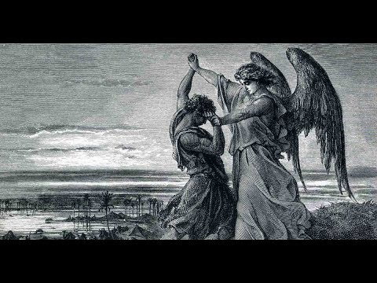

# **Série Bíblica XIV: Jacó: Lutando com Deus**

por Dr. Jordan Peterson

YouTube Video (https://www.youtube.com/watch?v=DRJKwDfDbco)

*Palavras-chave: Jacó, Luta, Israel, Peniel, Transformação*

---

## Seção I

A última vez que estive aqui — e muitos de vocês também estavam — chegamos na metade da história de Jacó. Tenho cavado por baixo da história de vez em quando, desde então, para tentar descobrir que outros temas estão sendo desenvolvidos. Tenho algumas coisas que acho realmente interessantes para falar. Então vamos direto ao assunto.

Vou fazer uma revisão rapidinha primeiro. Estávamos falando de Jacó. Vou atualizar um pouco a biografia dele, para que a gente se coloque no contexto certo antes de continuar. A mãe dele, Rebeca, deu à luz gêmeos. Os gêmeos, mesmo na barriga dela, já estavam brigando. Claro, a história é que eles lutavam pela dominância — o mais novo contra o mais velho, na verdade. Jacó significa "usurpador". Rebeca teve uma visão de Deus dizendo que Jacó suplantaria Esaú. E assim, mesmo antes dos gêmeos nascerem, eles já estavam em estado de competição.

Isso é uma recapitulação do motivo dos irmãos hostis. É um motivo mitológico extremamente comum. Já vimos isso bem desenvolvido na história de Caim e Abel. Caim e Abel eram, essencialmente, os dois primeiros seres humanos — os dois primeiros humanos nascidos naturalmente. Eles ficam imediatamente presos em um estado de inimizade, que é simbólico, primeiro, da inimizade que existe dentro da psique das pessoas — entre a parte que você poderia dizer que mira na luz e a parte que mira na escuridão. Acho que é uma maneira razoável de retratar isso. Obviamente, é uma forma cheia de simbolismo.

Minha experiência com as pessoas — especialmente quando você as conhece de verdade, ou quando elas estão lidando com questões sérias — é que há, bem claramente, uma parte delas que luta para se dar bem no mundo, ou até para fazer o bem, e outra parte que é profundamente cínica e amargurada, que diz "que se dane tudo", é autodestrutiva, parte para a briga e realmente mira em piorar as coisas. Parece ser uma parte natural da psique humana. Isso também se reflete na ideia da Queda. Essas ideias não são facilmente descartadas. Elas estão associadas ao surgimento da autoconsciência, na história do Jardim do Éden. Acho que isso está certo, porque eu realmente acho que nossa autoconsciência produz essa divisão dentro de nós. Mais do que qualquer outra criatura, somos intensamente conscientes de nossa finitude e sofrimento. Isso parece nos virar, em certa medida, contra o Ser em si.

Eu estava assistindo a um monte de manifestantes nos EUA, na semana passada, gritando para o céu contra Trump. Foi interessante. Achei um display extraordinariamente narcisista. Mas, apesar disso, há algo simbolicamente apropriado nisso. Um filme que eu gosto muito — infelizmente — chamado *FUBAR*… Não sei quantos de vocês já viram. Hah. É, vocês conhecem esse filme, imagino. É sobre as pessoas com quem cresci. É verdade, cara. Eu estou te dizendo, é verdade. O ator principal de FUBAR, que é bem inteligente mas completamente incivilizado, pega câncer testicular. Tem uma cena ótima em que ele fica bêbado demais e fica tropeçando pela rua em um estado virtualmente comatoso. Claro, ele não está nada feliz com o que aconteceu com ele. Ele sacode o punho para o céu, está chovendo torrencialmente e ele está xingando Deus. Dá para entender a posição dele. Aquilo meio que me lembrou essas pessoas que estavam gritando para o céu. Elas estavam dramatizando a ideia de estar enfurecido com — bem, você pode dizer "Deus". Claro, a maioria delas não diria isso. Mas elas estavam gritando para o maldito céu. Quero dizer, você tem que olhar o que elas estão fazendo, em vez do que dizem. Elas estavam indignadas que o Ser foi construído de tal forma que Trump pudesse surgir como Presidente.

Bem, essa ideia de que podemos facilmente nos virar contra o Ser e trabalhar pela sua destruição é um tema realmente comum. Nunca desaparece. Você vê eco disso em histórias — como na nova série da Marvel, por exemplo, você vê a inimizade entre Thor e Loki. Esse é um bom exemplo da mesma coisa — ou entre Batman e o Coringa, ou entre Superman e Lex Luthor. Existem esses pares de herói contra vilão que é algo realmente dramático e fácil — todo mundo consegue entender essa dinâmica, né? É um enredo básico. A razão de ser um enredo básico é porque é verdade sobre a batalha dentro de nossos próprios espíritos individuais. É verdade dentro das famílias, porque a rivalidade entre irmãos pode ser incrivelmente brutal. É verdade entre seres humanos que são estranhos. É verdade entre grupos de pessoas. É verdade em todo nível de análise. E então, em certo sentido, é arquetipicamente verdadeiro, pelo menos no que diz respeito ao simbolismo religioso profundo, porque você vê isso ecoado em muitas histórias também. Acho que a representação mais clara é provavelmente Cristo e Satanás. Essa é a mais próxima de um arquétipo puro — embora, nas antigas histórias egípcias, haja Osíris e Seth, ou Hórus e Seth. Seth é um precursor de Satanás, etimologicamente. Então é um motivo muito, muito comum.

É isso que acontece, de novo, na barriga de Rebeca. Essa ideia é representada logo de cara. Os gêmeos têm um destino superordenado, porque um deles está destinado a se tornar o pai de Israel. Claro, esse é um momento culminante no Antigo Testamento, obviamente — e, poderíamos dizer, um momento culminante na história humana. Agora, o grau em que as histórias do Antigo Testamento constituem o que consideraríamos história empírica é uma questão de debate. Mas não importa, em certo sentido, porque — como eu mencionei, acho, antes, nesta série de palestras — existem formas de ficção que são meta-verdadeiras, o que significa que não são necessariamente sobre um indivíduo específico. Embora, eu geralmente ache que elas são baseadas nas vidas de indivíduos específicos. É a teoria mais simples, mas quem sabe. Mas elas são mais reais que a realidade em si, porque abstraem os elementos mais relevantes da realidade e os apresentam a você. É por isso que você assiste ficção.

Você quer sua ficção destilada, né? Você quer que ela seja reduzida à essência. É isso que torna a ficção boa. Essa essência é algo que é mais verdadeiro que a verdade simples e antiga, se for bem tratado. Metade de uma vida de eventos pode passar em uma peça de Shakespeare, e ela cobre uma ampla gama de cenas, e assim por diante. E assim é cortada, editada e comprimida de uma vez, mas, por causa disso, ela te atinge com um tipo de força emocional e ética que simplesmente a gravação em vídeo da vida diária de alguém nunca chegaria perto de aproximar. Esse motivo dos irmãos hostis é uma verdade arquetípica profunda. Deus diz a Raquel: "duas nações estão em teu ventre, e dois povos se separarás das tuas entranhas; e um povo será mais forte que o outro povo; e o mais velho servirá o mais novo."

Então há uma inversão aí, porque, como discutimos, historicamente e tradicionalmente falando, é ao filho mais velho que as bênçãos desproporcionais fluem. Há alguma verdade nisso também, ainda mais empiricamente. O QI tende a diminuir à medida que o número de filhos na família aumenta. O mais velho é o mais inteligente, geralmente falando. Não está claro por quê, mas pode ser que eles recebam mais atenção. Quem sabe. Então aqueles de vocês que são mais novos podem ficar muito infelizes com esse fato.

Ok, então há outra linha de enredo também. Isaac e Rebeca estão em desacordo sobre as crianças. Há um toque edípico nisso também. Isaac está aliado com Esaú, que acaba sendo o tipo caçador. Então ele é seu personagem básico de briga e pancadaria. É meio que um cara de aparência selvagem; é peludo; gosta de viver lá fora; gosta de caçar; é um homem de homens. Essa é uma maneira de pensar sobre isso. Enquanto Jacó habita em tendas. Ele não sai muito. Talvez seja mais introvertido, mas certamente é o tipo de adolescente que fica em casa. Há alguma insinuação — bem, ele é claramente o favorito da mãe, com todas as vantagens — e, suponho, as desvantagens — que vêm junto com isso. Isaac e Rebeca não veem olho no olho sobre quem deveria ter predominância entre os filhos. Rebeca é bastante cúmplice de Jacó em inverter a ordem social.

A primeira coisa que acontece que é torta é que Esaú volta da caça, e talvez tenha ficado fora por vários dias, e está faminto. Ele é meio que um cara impulsivo. Ele realmente não parece pensar muito no longo prazo. Jacó estava cozinhando um ensopado de lentilhas, e Esaú quer um pouco. Jacó recusa, e diz que vai trocar seu ensopado pelo direito de primogenitura de Esaú. Esaú concorda, o que é um mau negócio, né? É um mau negócio. Você poderia dizer que Esaú realmente merece o que está por vir para ele, embora, no mínimo, você tenha que pensar neles dois como igualmente culpados. É uma pegadinha desagradável. Essa é a primeira pegadinha de Jacó.

A segunda pegadinha vem mais tarde. Isaac está velho, cego e perto da morte. É hora de ele conceder uma bênção aos filhos, o que é um evento muito importante, aparentemente, entre essas pessoas antigas. Esaú, de novo, está caçando. Rebeca coloca uma pele de cabra nos braços de Jacó, para que ele fique meio peludo como Esaú, e o veste com as roupas de Esaú, para que ele cheire como Esaú. Isaac diz a Esaú para sair e caçar um pouco de carne de veado, que é uma das favoritas dele. Rebeca faz Jacó cozinhar um par de cabritos e servir isso a Isaac, e interpretar o papel de Esaú. E é isso que ele faz.

É bem desagradável, realmente, tudo considerado, fazer uma pegadinha dessas, tanto no irmão quanto no pai cego, e em conluio com a mãe. Não é o tipo de coisa que é realmente projetada para promover muita harmonia familiar — especialmente porque ele já ferrara Esaú de um jeito grande. Você pensaria que isso seria suficiente. Então, de qualquer forma, ele tem sucesso. Esaú perde a bênção do pai. Jacó acaba, realmente, na posição do primogênito. É bastante interessante porque Deus diz a Rebeca que Jacó vai ser o gêmeo dominante. Você pensaria, de novo, com a bênção de Deus — ou pelo menos a profecia — que Jacó acabaria sendo um cara bom, mas ele certamente não é apresentado dessa forma, para começar, o que também é bastante interessante, dado que ele é o eventual fundador de Israel. Isso é outra indicação do realismo dessas histórias antigas. Sempre foi bastante incrível, para mim, como essas histórias permaneceram sem embelezamento. Você pensaria que, mesmo que você seja o mínimo de cínico, especialmente se você tivesse o tipo de visão marxista, "religião é o ópio do povo" — que é uma visão credível, embora esteja errada. Acho que é uma interpretação rasa. Parte da razão pela qual acho que é uma interpretação rasa é porque as histórias seriam muito mais bonitinhas, se esse fosse o caso. Os personagens não teriam essa estranha ambiguidade moral realista sobre eles. Se você vai alimentar as pessoas com uma fantasia, então você quer que seja como um romance de Harlequin, ou um cartão de saudação, ou algo assim. Você não quer que seja uma história cheia de traição e engano e assassinato e carnificina e genocídio, e tudo isso. Isso simplesmente não parece tão tranquilizador.

Então, de qualquer forma, Jacó se livra disso, mas Esaú não está feliz. Jacó está bastante convencido de que Esaú pode matá-lo. Acho que esse era um medo razoável, porque Esaú era um cara durão, e estava acostumado a ficar lá fora, e sabia caçar, e sabia matar, e ele realmente não estava nada feliz por ter sido seriamente ferrado pelo irmão mais novo que fica em casa, duas vezes. E assim Jacó foge, e vai visitar o tio. No caminho — e essa é uma parte muito interessante da história — ele para para dormir, e pega uma pedra como travesseiro, e então tem essa visão. É chamada de sonho, mas o contexto faz parecer uma visão de uma escada que chega até o céu, com anjos subindo e descendo pela escada, digamos. Há algumas representações disso. Eu mostrei algumas delas da última vez que nos encontramos. Mas vou ler para vocês primeiro. "E ele chegou a certo lugar, e ali passou a noite, porque o sol já era posto; e tomou das pedras daquele lugar, e as pôs por seu travesseiro, e deitou-se ali para dormir. E sonhou, e eis uma escada posta na terra, cujo topo chegava aos céus; e eis que os anjos de Deus subiam e desciam por ela. E eis que o Senhor estava sobre ela, e disse: Eu sou o Senhor Deus de Abraão teu pai, e o Deus de Isaque: a terra em que estás deitado, eu ta darei a ti e à tua semente; e a tua semente será como o pó da terra, e estender-se-á ao ocidente, e ao oriente, e ao norte, e ao sul…"

Então isso traça as direções canônicas, né? Agora há um centro, com as direções canônicas, como o pequeno símbolo que você vê nos mapas. É a mesma coisa, colocada simbolicamente sobre a terra. Um centro foi estabelecido, com linhas direcionais radiando dele. Isso o estabelece como um lugar.

"…e em ti e em tua semente serão benditas todas as famílias da terra." Isso é uma notícia bem boa, para Jacó. Não é autoevidente por que Deus está recompensando ele por fugir depois de ferrar o irmão. Mas parece que é isso que acontece. Aqui estão algumas representações clássicas. A da direita é de William Blake. É uma que eu gosto particularmente. Blake assimila Deus com o sol, e com a luz. Essa é uma ideia mitológica bastante comum, que Deus está associado com a luz, e com o dia. "E eis que estou contigo, e te guardarei em todos os lugares aonde fores, e te farei voltar a esta terra; porque não te deixarei, até que haja feito o que te falei. E Jacó acordou do seu sono, e disse: Certamente o Senhor está neste lugar; e eu não sabia. E teve medo" — que é exatamente a resposta certa — "e disse: Quão terrível é este lugar! Este não é outro lugar senão a casa de Deus, e esta é a porta do céu." E Jacó levantou-se de manhã cedo, e tomou a pedra que pusera por seu travesseiro, e a pôs por coluna, e derramou azeite sobre ela." Isso é uma coisa mais importante do que você pensaria, e vamos entrar nisso um pouco mais profundamente.

Até este ponto na história, não há nada que realmente tenha emergido para marcar um espaço sagrado, né? Não há catedral; não há igreja. Não há nada assim. Mas aqui está esta ideia que emerge: você pode marcar o centro de algo, e isso é importante, e você marca com uma pedra. Uma pedra é uma boa maneira de marcar coisas que são importantes, porque uma pedra é permanente. Marcamos coisas com pedras, agora — marcamos túmulos com pedras, por exemplo — porque queremos fazer uma memória. Esculpir uma pedra, e esculpir algo na pedra, é fazer uma memória. Usar pedra é fazer uma memória, porque a pedra é permanente. Colocá-la ereta é indicar um centro. É isso que acontece, e ele derrama azeite no topo dela, que é uma espécie de oferta. "E chamou o nome daquele lugar Betel; o nome daquela cidade, porém, era Luz antigamente. E Jacó fez um voto, dizendo: Se Deus for comigo, e me guardar neste caminho que eu ando, e me der pão para comer, e vestes para me vestir, então o dízimo de tudo quanto me deres, certamente lho darei."

Isso também é interessante, porque agora há uma transformação do sacrifício. Até aquele ponto, os sacrifícios tinham sido bem concretizados: era a queima de algo. Aqui, de repente, é a oferta do trabalho produtivo em si, como um dízimo. Um dízimo é uma forma de sacrifício, e assim há uma abstração da ideia de sacrifício. É realmente importante que a ideia de sacrifício seja abstrata, né? Porque ela deveria ser abstrata ao ponto de ser usada da maneira que usamos hoje, que é que fazemos sacrifícios para avançar, e todo mundo entende o que isso significa. Mas os sacrifícios são, geralmente, alguma combinação de psicológicos e práticos.

Não estamos representando os sacrifícios, precisamente: não estamos dramatizando ou ritualizando eles. Nós realmente os representamos no pacto que fazemos com o futuro. A menos que sejamos incrivelmente impulsivos e sem rumo em nossas vidas, e não tenhamos absolutamente nenhuma concepção do futuro, e provavelmente sacrifiquemos o futuro pelo presente — que é o que Esaú faz — então fazemos sacrifícios. Você tem que pensar que a ideia de fazer sacrifícios, para tornar o futuro melhor, é uma lição extraordinariamente difícil de aprender. Levou tempo que só Deus sabe para as pessoas aprenderem isso. Não temos ideia. Não é algo que os animais fazem facilmente. Chimpanzés não guardam carne sobrada, e lobos também não. Um lobo pode comer cerca de 13 quilos de carne em uma sentada. É daí que vem a ideia de "devorar como lobo". Você não está guardando para depois. Eles não conseguem fazer isso. Eles não conseguem sacrificar o presente pelo futuro. Isso é uma grande coisa, que isso aconteça.

## Seção II

[TIMESTAMP](https://youtu.be/DRJKwDfDbco?t=20m48s)

Agora eu quero contar um pouco sobre a ideia do pilar. É uma ideia incrivelmente profunda. Ainda nos orienta de maneiras que não entendemos. Na verdade, é realmente o mecanismo pelo qual estamos orientados — e, se ele faltar, então nos tornamos desorientados. Primeiro, vou mostrar algumas fotos, e vou descrevê-las. Ok, então há uma cidade murada. Você pode pensar nisso como uma habitação humana arquetípica. Talvez seja um reflexo de algo como uma fogueira no meio da planície, floresta ou selva — embora, seja meio difícil fazer uma fogueira lá. Imagine uma fogueira cercada por troncos e, talvez, cercada por moradias, então a fogueira está no centro. A fogueira define o centro, e então, à medida que você se afasta da fogueira, você sai para a escuridão. A fogueira é luz, comunhão e segurança. À medida que você se afasta da fogueira, você sai, para a escuridão, e para o que é aterrorizante, além dos perímetros.

Você pode sentir isso se for acampar em algum lugar que seja selvagem. Você fica bem feliz, especialmente se os lobos estiverem uivando, de estar sentado perto da fogueira, porque você consegue ver, lá. A fogueira mantém os animais longe, e, se você vagar pela mata e pela escuridão, você fica em alerta. Seus sistemas de detecção de predadores estão em alerta. E assim você poderia pensar na habitação humana clássica como dois lugares: um onde seu sistema de detecção de predadores não está em alerta, e outro onde sua detecção de predadores está em alerta. Você poderia pensar nisso, aproximadamente, como a distinção entre território explorado e território inexplorado. Realmente, o estabelecimento de um lugar é precisamente — muito disso eu tirei da leitura de [Mircea Eliade](https://en.wikipedia.org/wiki/Mircea_Eliade) — a definição de um centro explorado, colocado contra a periferia inexplorada.

Você pode meio que pensar nisso em relação à cidade murada: tudo dentro do muro é cosmos, e tudo fora do muro é caos. Mas também se estende ao reino conceitual. Imagine que você é o mestre de um campo de estudo. Essa é uma metáfora interessante, porque um "campo" é uma metáfora geográfica, né? No centro do campo estão aquelas coisas que todos conhecem muito bem — os axiomas pelos quais todos se guiam, no campo. E então, à medida que você se move em direção às franjas, você chega ao desconhecido — em direção à fronteira da disciplina. À medida que você se torna especialista, você se move do centro para a fronteira. Quando você é um estudioso competente, você está na fronteira entre o explorado e o inexplorado. Você está tentando avançar essa fronteira. Então, mesmo que você esteja fazendo isso de forma abstrata, é a mesma coisa. É um reflexo do fato de que todo ambiente humano — concreto ou abstrato, não faz diferença — recapitula a dicotomia ordem-caos. É por isso que o [Daoismo](https://en.wikipedia.org/wiki/Taoism), por exemplo, é a união de caos e ordem que constitui o Ser em si, e que você fica na fronteira entre caos e ordem, porque esse é o lugar certo para estar. Muito ordenado, muito dentro do explorado, e você não está aprendendo nada. Muito lá fora, onde os predadores espreitam, e você fica paralisado de terror. Nenhuma dessas posições é desejável.

Então você pensa — e isso é uma realidade concreta, obviamente, bem como uma realidade psicológica — havia razões para aqueles muros. Dentro dos muros estavam todas as pessoas como nós. Isso levanta a questão, o que significa para as pessoas serem "como nós"? E então, fora do muro, havia todas aquelas pessoas — porque as pessoas são realmente as piores formas de predadores — que não são como nós. O muro está lá para traçar a distinção entre "como nós" e "não como nós". Isso era uma questão de vida ou morte. Você pode dizer isso porque — quero dizer, olhe aqueles muros. Eles tiveram que construí-los à mão. E você vê cidades muradas que têm três anéis de muros. Então essas pessoas estavam aterrorizadas, mas não tão aterrorizadas quanto as pessoas que construíram três muros. Elas estavam realmente aterrorizadas, e tinham suas razões.

Há uma ideia que se reflete na história da Escada de Jacó: o centro, onde você coloca o pilar, é também o lugar onde o céu e a terra se tocam. Essa é uma ideia complicada. Estou tentando olhar estas histórias de uma perspectiva psicológica. Então você poderia dizer que esse é um lugar simbólico onde o mais baixo e o mais alto se juntam. É um lugar onde o Ser terreno se estende até a mais alta abstração ética possível, e esse é o centro. Uma das coisas que define "nós", digamos, em oposição a "eles", é que todos estamos unidos dentro de uma certa ética. É isso que nos torna iguais. Essa é uma linha de raciocínio complicada. Vou voltar a ela depois de mostrar mais algumas fotos. Mas a primeira ideia é que o centro é o lugar onde o mais baixo e o mais alto tocam simultaneamente. Você poderia dizer que, em certo sentido, isso especifica o objetivo de um grupo de pessoas.

Se você se junta com pessoas para fazer um grupo, você se agrupa em torno de um projeto, e isso os une. Isso os une porque todos têm o mesmo objetivo; todos estão apontando para a mesma coisa. Isso os torna iguais, de algumas maneiras. Se você está atrás da mesma coisa que eu, então as mesmas coisas vão ser importantes para você que são importantes para mim. E as mesmas coisas vão ser negativas para você que são negativas para mim, porque nossas emoções funcionam dessa forma. Isso significa que eu posso prever instantaneamente você; eu sei como você vai se comportar. E assim nosso objetivo é basicamente ético, porque estamos mirando em algo melhor, pelo menos em princípio. É nosso objetivo ético que une nossas percepções, e é isso que alinha nossas emoções. Isso levanta a questão, se você vai construir uma comunidade, em torno de que objetivo a comunidade deveria se congregar?

Ok, então a ideia, aqui, é que o centro da comunidade é o pilar que une o céu e a terra — une o mais baixo com o mais alto. Há alguma insinuação da ideia de que é o mais alto que une a comunidade. Guarde isso na mente. Essa é uma ideia muito antiga também. Essa é a ideia do [*axis mundi*](https://en.wikipedia.org/wiki/Axis_mundi), que é o poste central que une o céu e a terra. É uma ideia incrivelmente antiga — dezenas de milhares de anos. Pode até remontar a qualquer que seja nossas memórias arquetípicas arcaicas de nossa ancestralidade excessivamente antiga nas árvores — quando a própria árvore era, de fato, o centro do mundo, e era cercada por cobras e caos. Não temos ideia de quão antigas essas ideias são, mas elas são muito, muito antigas.

A evolução é um negócio conservador. Uma vez que ela constrói um dispositivo, então ela constrói coisas novas em cima desse dispositivo. É como uma cidade medieval: o centro da cidade é realmente antigo, e áreas mais novas da cidade são construídas em volta dele, mas o centro ainda é realmente antigo. É assim que somos. Nossa plataforma, nossa estrutura fisiológica básica, este corpo esquelético, tem algumas dezenas de milhões de anos — ou mais antigo que isso. Se você pensar em vertebrados, é muito mais antigo que isso. Tudo isso é conservado. Então tudo é construído em cima de tudo mais. Há uma espécie de cidade clássica. Essa é a mesma ideia que a árvore do mundo escandinava. Ela une o céu e a terra, e em volta das raízes dessa árvore há cobras que comem esta árvore, constantemente. Então essa é a ideia de que há estabilidade, mas há transformação constante em volta dessa estabilidade. E, ao mesmo tempo que as cobras estão roendo as raízes, há riachos que a estão nutrindo. É meio que um eco da ideia de que a vida depende de morte e renovação, constantemente. Suas células estão morrendo e sendo renovadas, constantemente. Se elas estão apenas proliferando, então você tem câncer. Se elas estão apenas morrendo, então você morre. Você tem que acertar o equilíbrio entre morte e vida exatamente certo, para que você possa realmente viver — o que também é uma coisa muito estranha. Essa árvore é algo que alcança das camadas inferiores do Ser — talvez o microcosmo — todo o caminho até o macrocosmo. Essa é a ideia, de qualquer forma. Há Jacó e seu pilar. Ele tem essa ideia de que você pode marcar o centro com esta pedra. Isso meio que simboliza no que ele estava deitado quando sonhou. Mas agora ele tem essa ideia — você coloca algo ereto, e isso marca o centro. Isso simboliza sua visão do Bem mais alto — algo assim — e a promessa que foi feita a ele.

Esta imagem à direita é um obelisco egípcio, com uma pirâmide no topo. Isso fica em Paris. Foi tirado de Luxor e colocado em Paris. Esse é um exemplo muito mais sofisticado da mesma ideia. Havia uma cultura da idade da pedra através da Eurásia que erguia esses obeliscos enormes, em todo lugar. [Stonehenge](https://en.wikipedia.org/wiki/Stonehenge) é um exemplo muito bom disso, embora seja muito sofisticado. Eles também eram marcadores de lugares. Não sabemos exatamente qual é a função deles, mas eles são muito parecidos com isso — algum marcador permanente de lugar. Há um bom. Isso fica em São Pedro. Eu gosto muito deste porque você pode ver os ecos da visão de Jacó para o estabelecimento de um território, lá. Você tem o obelisco no meio, e então você tem as direções radiando do centro. Claro, este é a [Basílica de São Pedro](https://en.wikipedia.org/wiki/St._Peter%27s_Basilica), em Roma, que é um lugar absolutamente inacreditável. É simplesmente de cair o queixo. Então há a catedral nos fundos, e então há este círculo de pilares que a cerca. Você consegue ver eles um pouco, no meio-esquerda, lá. Isso vai todo o caminho em volta de todo aquele recinto. Um número muito grande de pessoas pode se reunir lá. Então aquele pilar marca o centro, e esse seria o centro do catolicismo, essencialmente. É isso que aquilo representa: o centro simbólico do catolicismo. Embora, você possa argumentar que a catedral é o centro. Não importa realmente; eles estão bem próximos. É seis de um e meia dúzia do outro.

Aqui está outra representação da mesma ideia, né? É por isso que as pessoas não gostam que a bandeira seja queimada. Pessoas conservadoras veem a bandeira como a coisa sagrada que une as pessoas. Elas não ficam felizes quando essa coisa sagrada é destruída, mesmo que seja destruída em nome de protesto. Enquanto as pessoas que queimam bandeiras pensam, bem, há momentos para dramatizar a ideia de que o centro foi corrompido, e você pode demonstrar isso pondo fogo, como uma representação de que o centro corrupto agora tem que ser queimado e transformado.

O negócio é que ambos estão certos. Ambos estão certos, o tempo todo. O centro é absolutamente necessário, e é sagrado, e quase sempre também está corrompido e precisa de reparação. Essa também é uma ideia arquetípica. Essa é uma coisa útil de saber, porque é fácil para jovens, em particular, pensarem que, "bem, o mundo foi para o inferno em uma cesta de mão. É culpa da última geração. Eles nos deixaram uma bagunça terrível. Estamos nos sentindo bem traídos por isso, e agora temos que limpar isso."

É, é — as pessoas vêm pensando isso há uns 35.000 anos. Não é novo. A razão de não ser novo é porque sempre é verdade. O que você recebe é um centro sagrado com falhas — sempre. Isso é em parte porque é a criação dos mortos, e os mortos não conseguem ver, e eles não conseguem se comunicar. Eles não estão em contato com o presente. O que eles legaram a você — além do fato de que pode realmente estar corrompido, o que é uma coisa ligeiramente diferente — é pelo menos cego e morto. Então o que diabos você pode esperar de algo que é cego e morto? Você tem sorte que isso simplesmente não te esmaga para fora da existência.

Essa é uma fotografia adorável, obviamente. Esse é o estabelecimento de um novo centro. O centro pode ser uma catedral também, e frequentemente é. Claro, em cidades clássicas, e em cidades europeias, em particular — embora, não sejam apenas cidades europeias que são assim — há um centro que é feito de pedra, então essa seria a catedral, e ela tem a torre mais alta. No topo da torre, há frequentemente uma cruz, e esse é o centro simbólico. As pessoas são atraídas em torno do que quer que a cruz represente. A cruz obviamente representa um centro, porque é um X, né? X marca o lugar. Então o centro da cruz é o centro, e então a catedral frequentemente é em forma de cruz, o que também marca o centro. Em uma catedral, há frequentemente uma cúpula, e essa é o céu, e essa é uma escada que alcança da terra ao céu. Então é uma recapitulação da mesma ideia.

As pessoas são atraídas por esse centro, e o centro é o símbolo do que as une. O que as une é a fé que a catedral é a personificação. Você pensaria, "bem, o que a fé significa?" De novo, estamos abordando isso psicologicamente. O que significa é que todo mundo que é membro desse grupo aceita o ideal transcendente do grupo. Agora, o negócio é, se você é o membro de um grupo, você aceita o ideal transcendente do grupo. É isso que significa ser um membro de um grupo. Então se você está em uma equipe de trabalho, e todos estão trabalhando em um projeto, o que você essencialmente fez foi decidir que você vai tornar o objetivo inquestionável. Quero dizer, você pode discutir sobre os detalhes, mas se você foi encarregado de algo — "aqui está um trabalho para vocês dez pessoas. Organizem-se em torno do trabalho" — você pode discutir sobre como você vai fazer o trabalho, mas você não pode discutir sobre o trabalho, porque então o grupo desmorona.

Há uma fé ativa, em certo sentido. A razão pela qual a fé ativa é necessária é porque é muito, muito difícil especificar, sem erro, qual deve ser esse objetivo central, dado que há qualquer número de objetivos. É uma coisa muito, muito difícil de descobrir. Isso é algo que vamos fazer um pouco, esta noite. Qual deve ser o objetivo em torno do qual um grupo se congregaria? Especialmente se for um grupo grande, e for um grupo grande que tem que permanecer unido através de extensões muito grandes de tempo, e o grupo é incrivelmente diverso. Que tipo possível de ideal poderia unir um grupo grande de pessoas diversas através de um trecho muito grande de tempo? Essa é uma questão realmente, realmente difícil. Acho que parte da maneira como essa questão foi respondida é simbolicamente, e em imagens, porque é tão absurdamente complicado que é quase impossível de articular.

Mas, obviamente, você precisa ter um centro em torno do qual todo mundo possa se unir. Se você não tiver, então todo mundo está em desacordo uns com os outros: se eu não sei o que você está aprontando, e você não sabe o que ele está aprontando, nós somos apenas estranhos, e não sabemos que nossas éticas combinam, de jeito nenhum. A probabilidade de que consigamos existir harmoniosamente diminui, rapidamente, para zero. Isso obviamente é simplesmente ruim. Esse é um estado de caos total. Então não podemos ter isso. Não é possível existir sem uma ideia central. Não é possível.

É mais profundo que isso, em parte porque é… Vou tentar acertar isso. Esse é o tipo de coisa sobre a qual eu estava discutindo com Sam Harris. Seu sistema de categorias é um produto de seus objetivos. Essa é a coisa. Se você tem um conjunto de fatos em mãos, os fatos não te dizem como categorizar os fatos, porque há fatos demais. Há um trilhão de fatos, e não há como, sem impor alguma ordem *a priori* sobre eles, determinar como você deveria ordená-los. Então como você os ordena? Bem, isso é fácil: você decide no que você está mirando. Agora, como você faz isso? Bem, eu não estou respondendo essa questão, no momento. Eu só estou dizendo que, para organizar esses fatos, você precisa de um objetivo. Então o objetivo instantaneamente organiza os fatos naquelas coisas relevantes para o objetivo — ferramentas, digamos — aquelas coisas que atrapalham, e um número muito grande de coisas que você não precisa prestar atenção, de jeito nenhum.

Se você está trabalhando em um problema de engenharia, você não precisa se preocupar em praticar medicina no seu bairro. Focar em qualquer trabalho, qualquer conjunto de habilidades, implica que você é bom em um pequeno conjunto de coisas, e então não é bom em um número incrivelmente grande de outras habilidades. Isso simplifica as coisas. Então você pode usar seu objetivo como base de uma estrutura de categorias. Você também tem que ter isso em mente, porque o que significa é que seu próprio sistema de categorias — que é o que estrutura suas percepções — é realmente dependente da ética do seu objetivo. É uma coisa moral. É diretamente dependente do seu objetivo. Essa é uma ideia impressionante, se acontecer de ser verdade.

Não é assim que as pessoas pensam sobre o pensamento. Nós não pensamos dessa forma. Nós pensamos que pensamos deterministicamente, digamos, ou que pensamos empiricamente, ou que pensamos racionalmente. Nada disso parece ser o caso. O que fazemos é postular um objetivo válido, e então organizamos o mundo em torno do objetivo. Há bastante evidência para isso em estudos psicológicos de percepção. A maioria ignora, porque o mundo é complicado demais. Eles focam em um pequeno conjunto de fenômenos, considerados relevantes para qualquer que seja o objetivo. Claro, o objetivo é problemático. De novo, é complexo, porque o objetivo que eu tenho tem que ser um objetivo que alguns de vocês compartilhem ou pelo menos não objetem. Caso contrário, eu não vou chegar a lugar nenhum com meu maldito objetivo. Ele tem que realmente ser implementável no mundo. Tem que ser sustentável através de alguma quantidade de tempo. Não pode me matar. Está realmente limitado, esse objetivo. Não é qualquer coisa velha. Há poucas coisas que ele pode ser.

O objetivo de Jacó, por exemplo, ao minar Esaú, quase o mata. Você pode entender por quê — essa é a outra coisa. Isso foi um pedaço de trabalho desagradável; você pode entender a raiva de Esaú. Mesmo que estejamos separados das pessoas nestas histórias por algo como 4.000 anos, você sabe imediatamente por que todo mundo sente o que sente, pelo menos uma vez que você entende o contexto da história. Nada disso é misterioso, no mínimo.

Então há a igreja, e a igreja está embaixo da cruz. Essa é a Basílica de São Pedro. Há a cruz no globo, no topo da basílica, e então há a cruz no obelisco também. E então o que isso significa é que — e isso é onde as coisas ficam insanamente complicadas — o centro é definido pelo que quer que a cruz represente. Agora, a cruz representa um ponto de cruzamento, geograficamente. Certamente isso. A cruz provavelmente representa o corpo, em certa medida. Mas a cruz também representa o lugar do sofrimento — e, mais importante, representa o lugar do sofrimento voluntário transcendido. Estou falando psicologicamente, não teologicamente. É isso que representa.

Aqui está a ideia por trás de colocar o obelisco com a cruz e dizer que esse é o centro. Essa é a coisa que todo mundo está mirando, e então a ideia seria, bem, se você vai ser um membro do grupo, definido por este obelisco, então o que você faz é aceitar sua posição no centro do sofrimento, voluntariamente, e portanto transcendê-lo. Essa é a ideia. Essa é uma ideia do cacete. Realmente é, cara. Essa é uma ideia matadora. É realmente um sinal muito claro de saúde psicológica.

Se você é um psicólogo clínico e alguém está paralisado pelo medo, uma das coisas que você faz é quebrar os medos deles em pedaços relativamente gerenciáveis, e então você os faz confrontar voluntariamente seus medos. Pode ser também coisas das quais eles sentem nojo, digamos, se eles têm Transtorno Obsessivo-Compulsivo. Mas produz emoção negativa muito forte, seja o que for. Então você os faz confrontar voluntariamente seja o que for que produz aquela emoção negativa avassaladora. Isso os torna mais fortes. É isso que acontece. Não os torna menos assustados. Os torna mais corajosos e mais fortes. Não é a mesma coisa. Não diminui o medo; aumenta a coragem. Essa é uma ideia alucinante.

Uma das coisas que é realmente interessante sobre essas ideias arquetípicas é que — e talvez seja em parte por causa da natureza hiperlinkada da Bíblia, mas não é tudo — não importa quão fundo você cave nelas, você nunca chega ao fundo. Você bate em um fundo, e você pensa, "Deus, isso é tão incrivelmente profundo." E então, se você escavar um pouco embaixo disso, você encontra algo else que é ainda mais profundo. E então você pensa, "uau, isso tem que ser o fundo." E então você cava embaixo disso, e não há fundo. Você pode simplesmente continuar cavando. Até onde eu posso dizer, você pode continuar cavando para baixo, camada após camada. Vamos falar um pouco mais sobre o que a cruz significa, como o centro.

As pessoas estavam tentando descobrir sob o que elas precisam se unir. Qual é a coisa certa para se unir? Eu posso te dar outro exemplo. Nas sociedades mesopotâmicas, o imperador, que era mais ou menos um monarca absoluto, vivia dentro do que era essencialmente uma cidade murada. O Deus dos mesopotâmicos era [Marduque](https://en.wikipedia.org/wiki/Marduk), e Marduque era a figura que tinha olhos por toda a cabeça, e ele falava palavras mágicas. Ele era muito atento e muito articulado. Foi Marduque quem saiu e confrontou a Deusa do caos — o dragão do caos — cortou-a em pedaços, e fez o mundo.

Você pode meio que entender o que isso significa. Marduque vai além da fronteira, para o lugar do caos predatório, e encontra a coisa que é aterrorizante, e então faz algo produtivo com isso. Então é um mito de herói. Marduque é eleito para a posição de Deus preeminente por todos os outros deuses mesopotâmicos porque ele gerencia isso. Então a ideia de Marduque emerge pela hierarquia de dominância sagrada, e atinge o pináculo. Só Deus sabe quanto tempo isso levou. Seria a amálgama de muitas tribos, e então a destilação de todos os mitos tribais, para produzir esta história emergente do que constitui o Deus do topo. E então o trabalho do imperador era representar Marduque. Foi isso que lhe deu soberania.

A razão pela qual ele era o centro em torno do qual as pessoas se organizavam — quando ele estava sendo um imperador adequado — não era porque havia algo super especial sobre ele. O poder não residia exatamente nele, o que é uma coisa realmente útil de separar. É meio que legal ter um monarca simbólico. Você consegue o poder simbólico separado do poder da personalidade. Caso contrário, eles se confundem. Foi isso que aconteceu em Roma, e você pode ver isso tendendo a acontecer de vez em quando nos EUA, como com as dinastias Kennedy, e esse tipo de coisa.

A ideia era que o imperador tinha soberania enquanto ele estava representando a ideia de Marduque corretamente — saindo para o caos, cortando-o em pedaços, e fazendo ordem. Esse era o trabalho dele. Eles costumavam levá-lo para fora da cidade, no festival de Ano Novo, e despi-lo de todas as vestes de imperador, e humilhá-lo, e então forçá-lo a confessar todas as maneiras naquele ano em que ele não tinha sido um bom Marduque — um bom governante. Isso era para dar a ele uma pista, e acordá-lo. Então eles representavam ritualmente a batalha de Marduque contra [Tiamat](https://en.wikipedia.org/wiki/Tiamat), o monstro do caos, usando estátuas. Se tudo isso fosse bem, então o imperador voltaria, e a cidade seria renovada por outro ano.

Ainda temos ecos disso em nossa celebração de Ano Novo. É a mesma ideia que ecoou por todos aqueles milhares de anos. É uma ideia brilhante de cair o queixo. Parte da ideia é que a coisa que é soberana — então esse é o pilar no centro, em torno do qual todos se reúnem — é, pelo menos em parte, a coisa que corajosamente sai para o desconhecido e faz algo útil com isso, para a comunidade. Isso é muito, muito inteligente. Então este é outro exemplo do centro. Esta é a Union Jack. Ela é feita de um monte de cruzes. A primeira cruz — a cruz inglesa — é a bandeira de [São Jorge](https://en.wikipedia.org/wiki/Saint_George). Essa é a bandeira da Inglaterra. O que São Jorge faz? Ele mata o dragão. Exatamente. É a mesma ideia, né? Então São Jorge, padroeiro da Inglaterra, sai, mata o dragão, e liberta a virgem do aperto do dragão. Mesma ideia. Então essa é o centro.

A segunda cruz é chamada de aspa, mas é outro crucifixo. É a cruz na qual [São André](https://en.wikipedia.org/wiki/Andrew_the_Apostle) foi crucificado. É a mesma ideia — o centro é o centro do sofrimento, empreendido voluntariamente — porque São André foi um mártir.

[São Patrício](https://en.wikipedia.org/wiki/Saint_Patrick) é a terceira cruz. O que São Patrício fez na Irlanda? Ele expulsou todas as cobras. Certo. Então é a mesma coisa. Então a bandeira da Grã-Bretanha é a combinação de todas essas três cruzes. Isso define o centro. É isso que a bandeira é. Então isso simboliza tudo isso. Isso é completamente alucinante.

Há mais sobre São Patrício também. Ele bane as cobras depois de um jejum de 40 dias. Isso é uma alusão aos 40 anos que Moisés passa no deserto, e também aos 40 dias que Cristo jejua no Novo Testamento. Seu cajado de caminhada, quando ele o planta, cresce em uma árvore. Então isso ecoa todas as ideias sobre o centro que acabamos de descrever. Ele também fala com os antigos ancestrais irlandeses, o que, se você lembra, é característico dos rituais xamânicos.

No ritual xamânico típico — parece ser eliciado pelo uso de psicodélicos — o xamã se dissolve, passando pelos ossos. Então ele sobe ao céu, e fala com seus ancestrais. Então ele é introduzido no reino celestial. Então a carne é colocada de volta nos ossos, e ele volta e conta a todo mundo o que aconteceu. Essa é uma experiência repetível. A experiência xamânica é incrivelmente difundida. Por toda a Europa e Ásia antigas, e talvez tão longe quanto a América do Sul, ela é altamente conservada. É fora dessa tradição, com toda a probabilidade, que nossa ideação religiosa emergiu. Você pode ver ecos disso, aqui.

## Seção III

[TIMESTAMP](https://youtu.be/DRJKwDfDbco?t=50m3s)

Voltando à história de Jacó e sua escada. "Para que eu possa voltar em paz à casa de meu pai; então o Senhor será o meu Deus: e esta pedra, que eu pus por coluna, será a casa de Deus: e de tudo quanto me deres, certamente te darei o dízimo."

Isso também é um eco, eu diria, da obrigação daqueles que sobem a hierarquia de poder de atender aqueles que estão na base. Se você pensar no dízimo como uma forma de distribuição de riqueza, que é essencialmente o que é, parte da ética que define o esforço moral adequado, que está relacionada a esse centro, é não avançar a si mesmo às custas de toda a comunidade. Então se você tiver a sorte de subir em autoridade e poder e competência dentro dos limites de uma comunidade, você ainda tem uma obrigação de manter e avançar a estrutura da comunidade dentro da qual você subiu. Isso é óbvio, né? Se as pessoas não fizessem isso, depois de algumas gerações, tudo desmoronaria. Não é razoável destruir o jogo no qual você está ganhando; é razoável fortalecer o jogo no qual você está ganhando. Isso também descreve a ética que deveria permitir que você seja um membro ativo da comunidade que se reúne em torno desse centro.

Uma das coisas que aprendi sobre a mitologia do herói, que eu realmente, realmente gosto, é vista na figura de Cristo. Duas coisas são conjuntas nessa história. Há dois tipos de heróis: Há o herói que sai para o caos, confronta o dragão do caos, reúne o tesouro como consequência, e então o compartilha com a comunidade. Esse é um. A outra forma de herói é o herói que se levanta contra o estado corrupto, chacoalha a fundação do estado, faz com que ele desmorone, e então o reconstrói. Os dois grandes perigos para os seres humanos são a exposição desprotegida às catástrofes do mundo natural e a subjugação à tirania. Esses são os dois grandes perigos. Então o herói definitivo é a pessoa que reconstrói a estrutura do estado usando a informação que ele reuniu saindo para o desconhecido. Isso os une a ambos.

Aqui está o problema, até onde eu posso dizer. Uma estrutura, um centro, tem dois riscos associados a ele: um é que ele vai degenerar em caos, e o outro é que ele vai se rigidificar em tirania. Ele vai degenerar em caos mesmo se apenas continuar fazendo o que está fazendo. Então se ele apenas faz exatamente o que está fazendo, e não muda, ele vai degenerar, porque as coisas mudam, e se ele não mudar para acompanhar, então ele fica cada vez mais longe do ambiente, e vai colapsar precipitadamente. E então, se ele apenas muda aleatoriamente, de modo que ninguém possa estabelecer um objetivo centralizador estável, então ele degenera em caos imediatamente, e ninguém consegue se dar bem.

Há uma regra para pertencer a uma comunidade, e a regra tem que ser que você tem que agir de uma maneira que sustente a comunidade e aumente sua competência. Essa é a obrigação moral fundamental para pertencer — e obviamente assim. Por que você entraria em um clube que estivesse pegando fogo? Isso simplesmente não é inteligente, né? Se você decidiu que fazer parte do jogo valia a pena, você também decidiu — mesmo que não tenha notado — que você tem que trabalhar para apoiar esse jogo. Ao decidir jogar esse jogo, você disse que ele é valioso. E se ele é valioso, então obviamente você deveria trabalhar para sustentar e expandir, porque essa é a definição de ter um relacionamento com algo que é valioso.

Esses são os critérios para ser membro da comunidade. É em parte por isso que, se você considera a cruz, digamos, como o símbolo do sofrimento voluntário — há outro elemento disso também, que vale a pena pensar. A razão pela qual Caim fica tão fora de controle é porque ele está sofrendo, e ele não vai aceitar isso — ele certamente não vai aceitar responsabilidade por isso. Ele está com raiva e amargurado sobre isso, e não é de admirar. Temos que ser realistas sobre esse tipo de coisas. Todas vocês pessoas vão sofrer em algum ponto de suas vidas, ao ponto de ficarem com raiva e amarguradas sobre isso. Simplesmente não há dúvida sobre isso. Vocês vão até pensar, "bem, não é de admirar que eu esteja com raiva e amargurado sobre isso — qualquer um estaria — e as coisas são tão terríveis que não há desculpa para elas sequer existirem." Esse é um argumento poderoso, embora eu ache que é, em última análise, autodestrutivo. Esse é meio que o moral da história de Caim e Abel.

O que esse símbolo significa, em vez disso, é que, mesmo sob aquelas condições de sofrimento relativamente intenso, você tem que aceitá-lo voluntariamente. Caso contrário, ele te vira contra o Ser, e então você começa a agir de uma maneira terrível que piora tudo. Parece, para mim, que há uma contradição, aí: se a razão pela qual você está reclamando é que as coisas estão ruins, então não é razoável que você aja de uma maneira que as piore. Não é de admirar que as pessoas façam isso, mas é um jogo degenerativo. Parte da ideia da cruz — e do sofrimento que ela representa — é que, se você pudesse aceitar isso voluntariamente, independentemente de sua intensidade, então você não vai se tornar amargurado e ressentido e vingativo, ao ponto de representar um perigo para a estabilidade da comunidade — ou para sua própria estabilidade, aliás. Pode ser sua própria estabilidade, a estabilidade de sua família, a estabilidade da comunidade, e a estabilidade do mundo. Pode ser tudo isso. E, cada vez mais, acho que é tudo isso.

Agora pegamos a segunda parte da história de Jacó. Ele vai encontrar o tio, Labão. Ele encontra Raquel lá — de novo, junto a um poço. Ele se apaixona, e vai viver com Labão. Há duas filhas lá: Lia e Raquel. Lia não é uma pessoa particularmente atraente. Não está exatamente claro por quê, mas a história deixa bem claro: ela é definitivamente a menos desejável das duas filhas. A história faz referência aos olhos dela, e não está claro se há algo errado com ela fisiologicamente, ou se há algo errado com a atitude dela. Não é óbvio, mas não importa realmente. O ponto é que ela é a filha mais velha, mas é a menos desejável.

Jacó fica um mês, que é o limite da hospitalidade, naquela época. Se você ficasse por um mês, você era bem-vindo, mas tinha que trabalhar pelo seu sustento depois, eu acho, de três dias — algo assim — o que parece bastante razoável. Então ele fica um mês, e então tem uma conversa com Labão. Ele se apaixonou por Raquel, nesse meio tempo. Ele diz, "Eu vou ficar com você e trabalhar por sete anos, e então eu vou casar com Raquel." Labão diz, "esse é um bom negócio."

Os sete anos passam, e há uma cerimônia de casamento. É uma coisa bastante longa, e a noiva está velada, e a noiva entra na tenda, com Jacó. Se eu me lembro corretamente da história — não olhei para ela por um mês ou mais — Raquel está fora da tenda, falando, mas Lia está dentro da tenda. E assim Jacó pensa que está se casando com Raquel, mas na verdade está se casando com Lia. É uma inversão, porque ele está no escuro como Isaac estava, quando ele enganou Isaac. Agora é a vez de Jacó estar no escuro, e ele é traído pelo tio e pela noiva, Raquel, e pela irmã dela, de uma maneira que é amplamente paralela à pegadinha que ele fez em Esaú.

Há uma noção de carma, aí, que eu gosto. Você pode pensar no carma como uma ideia supersticiosa, e há maneiras de interpretar isso que podem fazer com que seja o caso, mas eu não acho que seja isso. É que nenhuma má ação fica sem punição. É algo assim. Talvez você tenha feito algo ruim para alguém, e portanto há uma parte de você que se sente bastante culpada sobre isso — esperançosamente. Essa parte está procurando por punição, para acertar as coisas. Você pode pensar, "bem, não", mas é "sim", a menos que você seja um psicopata. É assim que as coisas funcionam.

Se você está interessado nesse tipo de coisa, você deveria ler *Crime e Castigo* de Dostoiévski, porque é o estudo definitivo desse tipo de fenômeno. Nesse livro, o protagonista principal, Raskolnikov, se livra de um assassinato. Ele faz isso com sucesso, e ninguém suspeita dele. Ele se deixa louco de culpa a ponto de basicamente cair nas mãos da polícia — ele se coloca nas mãos da polícia, porque ele não consegue tolerar o que fez. É um livro incrível.

Mas, de qualquer forma, o ponto é que Jacó cai presa do mesmo tipo de tortuosidade que ele usou para subir na escada. Isso acontece com muito mais frequência na vida do que as pessoas pensam. É realmente como se ele não pudesse reclamar sobre isso, né? Não se ele tiver algum senso. Ele traz Lia para ver Labão, e ele diz, "o que há com esta irmã?" Labão basicamente diz a ele, "em nossa cultura, é o costume casar a filha mais velha primeiro", o que é exatamente certo. Ele está racionalizando, obviamente, porque ele acabou de ferrar Jacó de um jeito grande, mas é um pouco tarde para voltar atrás. O casamento foi consumado, e a cerimônia foi completa, e todo o inferno iria explodir se houvesse qualquer tentativa de romper o relacionamento. Então é assim que é. Lia está casada, e Jacó tem a esposa errada. Este é Jacó, lá, à direita. Ele tem o chapéu florido pequeno, e está apontando para Lia, e está dizendo, "o que há, aqui?" Labão é um velho bode duro, e ele não está realmente nada triste sobre isso. Na verdade, você pode imaginar que ele está meio que rindo.

Então Jacó tem que trabalhar outros sete anos, e ele ganha Raquel. Mas, porque Deus é um personagem tortuoso, há outra reviravolta nesta história: Raquel acaba não sendo muito boa em ter filhos, mas Lia é realmente boa em ter filhos. Ela fornece a Jacó Rúben, Simeão, Levi e Judá. Rúben significa "veja! Um filho!", Simeão significa "ouvindo" — como "o Senhor ouviu minha oração" — Levi significa "unido", Judá significa "louvor a YHWH", e é de Judá que a tribo da qual Cristo surge. Judá é essencialmente promovido ao status de primogênito, mais tarde na história, porque Rúben, Simeão e Levi todos fazem algo repreensível. Então Judá é promovido a primogênito. Essa é em parte a razão pela qual, na lógica desta narrativa, é da tribo de Judá que Cristo surge.

Enquanto isso está acontecendo, Raquel está como suicidamente desesperada por filhos. Ela está com ciúmes de sua irmã mais velha, que é bastante desfavorecida, como apontamos, mas parece ser muito boa em produzir filhos. Ela realmente não está feliz com Jacó, e então ela o repreende. Jacó basicamente diz, "o que você quer que eu faça sobre isso? Eu não sou Deus", o que é uma resposta razoável, eu diria. Em seu desespero, ela dá Bila, sua serva, a Jacó. Já vimos esse tipo de coisa acontecer, antes.

Bila produz dois filhos, Dã e Naftali. Os detalhes são importantes porque Jacó é o fundador de Israel, e seus filhos são os fundadores das 12 tribos. É um momento pivotal na história, porque ele é o patriarca fundamental daqueles "que lutam com Deus". Como veremos, é isso que o nome "Israel" significa. Ele recebe o nome "Israel". Você vai ver por quê, daqui a pouco. Você precisa saber essas genealogias, nesta situação, porque elas desempenham um papel importante em tudo que acontece depois. Naftali é o segundo, e seu nome significa "com grandes lutas eu lutei com minha irmã, contendi com ela, e prevaleci". Isso te dá alguma indicação da tensão no lar.

Lia agora passou da idade de ter filhos. Ela dá a Jacó sua serva, Zilpa — para acompanhar a irmã, eu acho. Zilpa dá à luz dois filhos para Jacó, então ele está empilhando as crianças para todos os lados, aqui. Um deles se chama Gade, significando "boa fortuna", e o outro se chama Aser, significando "feliz" ou "abençoado".

Há mais rivalidade acontecendo entre as irmãs. Essa é uma historinha bastante interessante. Então Rúben, que é filho de Lia, sai procurando por mandrágoras. Agora mandrágoras têm propriedades afrodisíacas, então isso é um pouco estranho, para começar. Mas não importa; é isso que acontece. Raquel quer as mandrágoras porque ela ainda está interessada em ter alguns filhos. Ela negocia com Lia para lhe dar uma noite com Jacó em troca das mandrágoras. Mais filhos emergem como consequência disso. Raquel finalmente dá à luz, a José. José desempenha um papel chave na última história de Gênesis, que espero chegar na próxima palestra. Então podemos fechar Gênesis. Esse é o plano, de qualquer forma. Jacó não está realmente muito feliz com todo o arranjo, porque ele esteve lá 14 anos. Ele tem duas esposas. Não é tão ruim, mas o acordo não era exatamente limpo. Ele realmente não confia em Labão, e não há razão para ele fazer isso. Labão era pobre, antes de Jacó chegar. Jacó acaba sendo uma pessoa muito útil para ter por perto. Ele diz a Labão que quer sair e voltar para seu país natal, e que ele vai levar o "gado mosqueado e manchado, ovelhas marrons, e cabras mosqueadas e manchadas". Eles estão em minoria, e essa é a ideia. Labão tira todos esses animais de seu rebanho.

Havia uma ideia de que as cabras mosqueadas e as ovelhas marrons se reproduziriam verdadeiras. Se você tem um bode macho e uma cabra fêmea, e ambos são mosqueados, eles vão ter cabritos mosqueados. Essa é a teoria, e o mesmo com ovelhas marrons. Então o que Labão faz é tirar todos os animais mosqueados dos rebanhos, dá para o filho, e eles vão três dias de distância com eles. Jacó fica com o rebanho, mas sem nenhum desses animais. A ideia era que todos os recém-nascidos iam ser dele, e então o que Labão basicamente fez foi armar de forma que, em princípio, Jacó vai ficar sem nada pelo seu trabalho. Esse é outro momento em que Jacó experimenta traição. É quase como se Deus não tivesse terminado de lembrá-lo da magnitude do que ele fez no passado. Esse é o moral da história, em certo sentido.

Há uma reviravolta esquisitinha na história, aqui. O que Jacó faz é uma espécie de magia simpática. Quando os animais estão no cio, ele coloca objetos mosqueados na frente deles — galhos mosqueados, e assim por diante — eu acho para lembrá-los sobre o que eles deveriam estar produzindo. Algo assim. Funciona, e todos esses animais que Labão deixou estão produzindo animais mosqueados como loucos. Acho que Deus mudou de ideia, e deixou Jacó escapar do gancho, ligeiramente, aqui. "Logo ele estava muito rico (muito gado, servas, servos, camelos e jumentos.) Os filhos de Labão ficam com ciúmes e Labão fica indignado." Bem, obviamente há alguma competição aí, entre Jacó e os filhos, o que não é de surpreender. Labão fez essa pegadinha para tirar de Jacó toda a sua propriedade, e, em vez disso, Jacó conseguiu muito mais do que ele ia conseguir, para começar. Então você pode imaginar que isso é meio que irritante. Jacó pensa que é melhor sair dali. Jacó chama Raquel e Lia: "E disse-lhes: Vejo que o semblante de vosso pai para comigo não é como antes; mas o Deus de meu pai tem estado comigo. E vós sabeis que com todo o meu poder eu servi a vosso pai. E vosso pai me enganou, e mudou o meu salário dez vezes; mas Deus não lhe permitiu que me fizesse mal. Se ele dizia assim: Os mosqueados serão o teu salário; então todos os rebanhos davam mosqueados: e se ele dizia assim: Os listrados serão a tua paga; então todos os rebanhos davam listrados. Assim Deus tirou o gado de vosso pai, e mo deu a mim." "Eles decidem fugir, mas estão infelizes com a falta de herança de Labão." Enquanto eles fogem, Raquel rouba os ídolos que o pai dela tem em sua casa. Não está exatamente claro por quê. Há muita contenda sobre por que ela está fazendo isso. Poderia ser "como punição; para levar com ela as imagens de seus ancestrais" — talvez ela esteja solitária, se mudando de casa — "só por despeito; para mostrar a ele que os ídolos eram realmente impotentes; por proteção; para impedir que o pai dela adivinhasse a rota de sua fuga" [... texto truncado no registro da palestra ...]

Essa última é a mais estranha, porque a ideia seria que Labão teria usado algum tipo de ritual, com os ídolos, que o ajudaria a inferir a rota de fuga deles, e então ele poderia perseguir. De qualquer forma, essa é a gama de especulação sobre isso. Acho que soa, para mim, principalmente como um pequeno ato de vingança — talvez com um pouco de solidão misturado.

Labão os persegue, mas Deus vem em um sonho para dizer a ele para deixar Jacó ileso. Labão alcança Jacó e o repreende, dizendo que ele teria feito uma grande festa, se soubesse que eles iam embora — que ele não queria que eles fugissem à noite. Você não consegue dizer pela história se isso é verdade ou não. Essas pessoas eram bem rústicas e impulsivas, eu diria. Talvez houvesse cinquenta por cento de chance de um massacre e cinquenta por cento de chance de uma festa. Quem sabe. Eu já fui a festas assim, na verdade.

Labão reclama que seus deuses se foram, e Jacó diz que quem os tiver, ele os matará. Raquel — que é realmente uma personagem bem manhosa, tudo considerado — basicamente alega que está menstruada, e está sentada em um tapete, com todos os ídolos embaixo. Ela não consegue se mover, então eles revistam em todo lugar, e não conseguem encontrá-los. Ela está rindo por trás da mão, sobre essa manobra manhosa. Mas ela não morre, então isso é provavelmente uma coisa boa.

Labão verifica tudo, verifica o acampamento, e não consegue encontrar nada. Eles se reconciliam, e então essa é a primeira reconciliação em que Jacó se envolve. É meio que como se a dívida cármica tivesse sido paga. Essa é uma maneira de pensar sobre isso. Ele foi punido por seu erro; ele aprendeu a lição, talvez. Isso é bom o suficiente, até onde ele está preocupado. Ele se livrou bem o suficiente, e eles fazem as pazes. A próxima coisa que acontece, enquanto eles estão viajando, é que "Jacó ficou só, e lutou com um homem" — homem, anjo ou Deus… Não está claro. Vamos com anjo — "até o romper do dia. E quando viu que não prevalecia contra ele, tocou a junta de sua coxa; e a junta da coxa de Jacó se deslocou, enquanto ele lutava com o anjo. E o anjo disse: Deixa-me ir, porque o dia amanhece. E Jacó disse: Não te deixarei ir, senão me abençoares. E o anjo disse-lhe: Qual é o teu nome? E ele disse: Jacó. E o anjo disse: Não se chamará mais o teu nome Jacó" — "o usurpador", "o derrubador", com aquele tipo de implicação de tortuosidade — "mas Israel" — que significa "aquele que luta ou se esforça com sucesso com Deus" — "pois como príncipe tiveste poder com Deus e com os homens, e prevaleceste."

Essa é uma história e tanto. Eu não sei exatamente o que fazer com ela. Há obviamente um nível simbólico de significado. Isso é o que os seres humanos fazem, em certo sentido: eles lutam com o divino — até com o conceito do divino, aliás. Mas a questão é, eles prevalecem? É uma coisa estranha que Jacó realmente pareça vencer esta batalha. Pelo menos, ele a vence o suficiente para que quem quer que ele esteja lutando — esta figura divina com a qual ele está lutando — esteja disposto a conceder uma bênção divina a ele. Talvez seja um testemunho de sua coragem. Talvez seja uma indicação de que ele pagou por seus pecados suficientemente, e está de volta a um terreno moral elevado. Mas acho que a transformação do nome, de "Jacó" para "Israel", é realmente reveladora, bem como o fato de que "Israel" significa "aquele que luta ou se esforça com Deus", talvez com sucesso.

Também é tão interessante que Jacó realmente emerge vitorioso. Você não necessariamente pensaria que isso seria uma possibilidade, especialmente dado o temperamento bastante explosivo de Deus no Antigo Testamento. Você não quer mexer com ele, demais. Mas Jacó faz isso com sucesso. Ainda mais importante é a ideia de que, seja o que for que "Israel" constitua — que seria a terra que Jacó funda — é na verdade composta por aqueles que lutam com Deus. Acho que essa é uma ideia incrível. Também parece, para mim, lançar alguma luz sobre, talvez, o que era significado por "crença", naqueles dias.

Eu frequentemente pensei no casamento como uma luta livre. Se você tiver sorte, a pessoa com quem você casa é alguém com quem você contende. Eu não acho que seja tranquilo, precisamente. Você pode ter notado isso, alguns de vocês. Mas o negócio é, se você tem algo para contender, então isso o fortalece. Isso é na verdade melhor do que não ter nada para contender. E assim Jacó também é a pessoa que é fortalecida pela necessidade deste contender.

Esse contender ou batalhar parece ser o relacionamento adequado com Deus, em vez de algum tipo de declaração solta e fraca de crença. Não estou tentando denegrir, em nenhum grau grande. Simplesmente não parece o modo certo de conceitualização. Os seres humanos não são assim. Nós somos criaturas contenciosas, e isso realmente parece ser algo que encontra o favor de Deus, nesta situação — especialmente dado que é realmente isso que ele nomeia todo o reino do povo escolhido. A ideia é que o reino é composto por aqueles que contendem com Deus. Essa é uma ideia do cacete. Isso é certo.

"E Jacó lhe perguntou, e disse: Dize-me, peço-te, o teu nome. E ele disse: Por que perguntas pelo meu nome?" — então isso não está acontecendo — "E o abençoou ali. E Jacó chamou o nome daquele lugar Peniel: pois eu vi a Deus face a face, e a minha vida foi preservada. E, indo ele, o sol se levantou sobre ele, e ele coxeava sobre a sua coxa."

Jacó realmente sai machucado disso. Ele tem uma mancha permanente, depois disso. Isso também é uma indicação de quão perigoso esse contender realmente é. Ele é abençoado, e vence, mas ele não sai ileso.

## Seção IV

[TIMESTAMP](https://youtu.be/DRJKwDfDbco?t=1h16m51s)

Então Jacó volta para Esaú, e ele está aterrorizado. Mesmo que tenham sido 14 anos, ele pensa que talvez seu irmão explosivo não tenha se acalmado. Ele tem boa razão para pensar isso, eu diria. "Jacó envia mensageiros a Esaú, que sai com quatrocentos homens." Jacó não está feliz com toda essa ideia. "Jacó dispersa seu povo em dois bandos" — para que talvez metade deles não possa ser morta — "Então ele seleciona um numeroso rebanho de animais diversos e envia seus servos para encontrar Esaú", basicamente para dizer, "olhe, eu sou um idiota, e desculpe por toda a coisa do direito de primogenitura, e aqui estão alguns animais. Talvez esse seja o começo de um pedido de desculpas." É algo assim. Mas ele não está muito convencido de que isso vai funcionar.

Mas Esaú, que talvez tenha amadurecido no intervalo — essa é uma maneira de pensar sobre isso — encontra Jacó, e diz "que vê-lo é suficiente, mas Jacó insiste que ele pegue o presente, e Esaú aceita", o que é provavelmente uma coisa sábia, porque, mesmo que Esaú esteja noventa e cinco por cento convencido de que apenas ver o irmão é suficiente, há provavelmente cinco por cento dele que realmente não está nada feliz.

Você tem que ter cuidado quando diz que perdoa alguém, porque pode haver uma parte de você que realmente não perdoa, e que realmente precisa de algo mais antes que você possa realmente dizer, "tudo bem". Você não quer se enganar sobre isso, porque aquele cinco por cento que não foi completamente convencido vai encontrar sua voz, em algum momento, e talvez minar todo o processo de reconciliação. Você não quer pensar que você é melhor do que é, ou mais legal do que é. Isso não ajuda.

Jacó é inteligente em dizer, "não, não. Muito obrigado, mas pegue as malditas cabras." Esaú é inteligente o suficiente para aceitar isso, e ele pode fazer isso, talvez, para agradar Jacó. Mas também, eu acho, para que realmente haja a possibilidade de estabelecer paz. Hipoteticamente, o presente que está sendo oferecido é de magnitude suficiente para apagar a dívida da perda do direito de primogenitura. É algo assim. É o pagamento da dívida real.

"E Esaú disse: Que queres tu com todo este bando que eu encontrei? E Jacó disse: Para achar graça aos olhos de meu senhor. E Esaú disse: Eu tenho o suficiente, meu irmão; guarda o que tens para ti." E Jacó disse: Não, peço-te, se agora achei graça aos teus olhos, recebe o meu presente da minha mão; porque eu vi o teu rosto, como se tivesse visto o rosto de Deus, e tu te agradaste de mim."

Então ele está tomando o julgamento honrado de seu irmão. É honrado, porque Esaú foi traído. Ele tem o direito de estar julgando. Ele equipara esse julgamento às mais altas das virtudes. É julgamento apropriado. Ele quer fazer emendas completas a Esaú, como se Esaú fosse um representante do elemento divino da justiça. Acho que isso é convincente para Esaú. É uma coisa e tanto de dizer, que "eu preciso me reconciliar com você, porque isso simultaneamente me reconciliaria com Deus. Isso é entre nós, mas há um princípio mais alto em jogo, que é vital." Acho que é o caso com traição. Isso é muito frequentemente o caso. Se você trair alguém, você violou profundamente o que só pode ser chamado de uma confiança sagrada. É a terminologia certa para isso. "Toma, peço-te, a minha bênção que te foi trazida; porque Deus tem lidado graciosamente comigo, e porque eu tenho o suficiente. E ele o instou, e ele a tomou."

A história começa com Jacó sendo um personagem arrogante, torto, enganoso — talvez superestimado com sua própria habilidade. Ele achou que era bem divertido fazer uma ou duas pegadinhas rápidas no irmão. Então ele fugiu, o que não é muito corajoso, e então ele levou uma surra grande, e então, talvez, ele aprendeu algo. E então, quando ele voltou, ele era uma pessoa diferente.

Essa é uma história razoável. Ele tem que se arrepender completamente do que fez, antes que ele possa retificar a situação adequadamente. Ele está disposto a fazer isso. Essa também é uma ideia interessante, porque é um reflexo inicial da ideia de que, se você faz algo errado no passado, A, você pode aprender com isso — então você é realmente capaz de aprender — e B, que você pode acertar o equilíbrio no presente. Essas são ideias muito otimistas. Você pode dizer, "bem, uma vez que você cometeu algum tipo de crime, é isso; não há esperança para você." Isso é bem duro, porque a probabilidade de que você tenha feito coisas antiéticas em algum ponto de sua vida é cem por cento. Então se não houvesse uma maneira de acertar o equilíbrio, depois disso, então todo mundo estaria condenado. Então a história fica dura de novo. "Jacó se estabelece em Salém. Diná, sua filha, sai procurando amigos. Siquém, o filho de Hamor, deita com ela, e então a quer por esposa." Ele realmente tem a ordem invertida, aí. Isso realmente acaba sendo um problema. "Jacó ouve sobre isso. Os pais conversam. Eles fazem um acordo." O acordo é que se todos os homens de Hamor — incluindo Hamor e seu filho — forem circuncidados. Então essa é a oferta adequada, e eu acho que isso os traz para o seio familiar, e indica que eles estão dispostos a fazer um sacrifício para fazer isso — especialmente depois que Siquém colocou o carro na frente dos bois, digamos.

Os homens de Hamor concordam em fazer isso, e isso acaba sendo um grande erro. Enquanto eles estão deitados no dia seguinte, sofrendo loucamente da circuncisão, Simeão e Levi entram sorrateiramente, matam todos eles, e levam sua riqueza, mulheres e crianças. Isso é duro. É duro. São sociedades de honra, né? Ainda há muitas sociedades de honra no mundo. Elas não levam a mal o que aconteceu com a irmã delas, embora, elas não a matem. "E aconteceu que ao terceiro dia, quando estavam doloridos, que dois dos filhos de Jacó, Simeão e Levi, irmãos de Diná, tomaram cada um a sua espada, e vieram sobre a cidade ousadamente, e mataram todos os homens. E mataram a Hamor e a Siquém seu filho à espada, e tiraram Diná da casa de Siquém, e saíram. Os filhos de Jacó vieram sobre os mortos, e saquearam a cidade, porque haviam violado sua irmã. Tomaram as ovelhas, e os bois, e os jumentos, e o que estava na cidade, e o que estava no campo, e toda a sua riqueza, e todos os seus pequenos, e suas mulheres levaram cativas, e saquearam tudo o que estava na casa."

Jacó realmente acaba não estando nada feliz com isso, porque ele tinha se encontrado com Hamor, e eles tinham acertado um acordo. Esse era o lugar onde eles estavam vivendo, e ele achou que estava fazendo o melhor de um mau negócio. Seus filhos foram pelas costas dele. Jacó diz a Simeão e Levi, "vos perturbastes, fazendo-me cheirar mal entre os habitantes da terra, entre os cananeus e os perizeus; e, sendo eu de pequeno número, eles se ajuntarão contra mim, e me ferirão, e eu serei destruído, eu e minha casa." E eles disseram: "Devia ele tratar a nossa irmã como a uma prostituta?" E Deus disse a Jacó" — e é aqui que voltamos à ideia do centro — "Levanta-te, sobe a Betel" — Betel era onde Jacó originalmente colocou aquele pilar. É uma verdadeira jornada do herói: ele tem um lugar estabelecido; ele sai e tem essas aventuras; ele tem uma transformação moral; ele se reconcilia, e ele volta ao mesmo lugar, como uma pessoa transformada. Esse é um ciclo completo do herói.

"Levanta-te, sobe a Betel, e habita ali: e faze ali um altar ao Deus que te apareceu quando fugias da face de Esaú teu irmão. Então Jacó disse à sua família, e a todos os que com ele estavam: Tirai os deuses estranhos que estão no meio de vós, e purificai-vos, e mudai as vossas vestes: e levantai-vos, e subamos a Betel; e eu farei ali um altar ao Deus que me respondeu no dia da minha angústia, e esteve comigo no caminho por onde andei." E deram a Jacó todos os deuses estranhos que estavam nas suas mãos, e todos os brincos que estavam nas suas orelhas; e Jacó os escondeu debaixo do carvalho que estava junto a Siquém. E viajaram: e o terror de Deus estava sobre as cidades que estavam ao redor deles, e não perseguiram os filhos de Jacó. Assim chegou Jacó a Luz, que está na terra de Canaã, isto é, Betel — então esse é o lugar onde ele ergueu o pilar, para começar — ele e todo o povo que estava com ele. E ele edificou ali um altar, e chamou o lugar Elbetel: porque ali Deus lhe apareceu, quando ele fugia da face de seu irmão. E Deus apareceu a Jacó de novo, quando ele saiu de Padã-Arã, e o abençoou. E Deus lhe disse: Teu nome é Jacó: teu nome não será mais chamado Jacó — que significa "usurpador" — "mas Israel será o teu nome" — "aquele que luta com Deus" — "e chamou-lhe o nome de Israel. E Deus lhe disse: Eu sou o Deus Todo-Poderoso: frutifica e multiplica-te; uma nação e uma companhia de nações sairão de ti, e reis sairão de teus lombos." E a terra que dei a Abraão e a Isaque, a ti a darei, e à tua semente depois de ti darei a terra. E Deus subiu dele no lugar onde falara com ele. E Jacó pôs uma coluna no lugar onde falara com ele, uma coluna de pedra; e derramou uma libação sobre ela, e derramou azeite sobre ela. E Jacó chamou o nome do lugar onde Deus falara com ele, Betel." Jacó retornou ao lugar central, o que [... texto truncado no registro da palestra ...]

Agora temos a história que basicamente termina com o estabelecimento das 12 tribos de Israel. De Lia, há Rúben, Simeão, Levi, Judá, Issacar e Zebulom. De Zilpa, há Gade e Aser. De Bila, há Dã e Naftali. De Raquel, há José — que figura extraordinariamente importante na próxima história que vamos cobrir, que, esperamos, vai fechar Gênesis — e Benjamim. Então agora Israel em si está estabelecido. Eu vou realmente terminar isso cedo, esta noite. Esse é um milagre sangrento. A história então vira para José. A história começa, essencialmente, "ora, Israel amava José mais que a todos os seus filhos, porque era filho da sua velhice: e fez-lhe uma túnica de muitas cores."

Frequentemente acontece que roupas em sonhos — calçados, em particular — simbolizam um papel. Isso parece ser particularmente verdadeiro nos sonhos das mulheres. Essa tem sido minha observação clínica. Isso faz sentido, né? Porque você se veste para o papel. Não é um mistério muito grande. Então você poderia dizer, "bem, o que uma túnica de muitas cores indica?" É algo como o domínio de múltiplos domínios, ou talvez algo como plurapotencialidade.

José é o favorito de Israel porque ele vê nele esse excesso de possibilidade. Ele basicamente diz aos outros filhos que José vai ser o filho principal, o que eles não estão felizes, porque ele é apenas um moleque jovem, fundamentalmente. Claramente, ele é o favorito do pai, e ele ganha essa túnica que é meio que indicativa desse status mais alto. E assim Israel inadvertidamente estabelece uma quantidade tremenda de rivalidade entre irmãos no lar, de novo. Essa é a subestrutura da última história em Gênesis. Na última desta série de palestras, para 2017, vamos cobrir a história de José e sua túnica de muitas cores, e o que acontece como consequência do favoritismo mostrado a ele por seu pai. Vou parar aí, porque terminei.

---

---

**Notas**

[^1]: *Axis mundi* — o eixo ou pilar central que une o céu (transcendente) e a terra (material); símbolo arcaico do centro sagrado de uma cultura ou psique. Aparece em muitas tradições (árvore do mundo, obeliscos, cruz, etc.).

[^2]: Marduque (Marduk) — deus principal da Mesopotâmia; herói que derrota o dragão do caos (Tiamat) e cria o mundo ordenado a partir dele. Representa a capacidade humana de confrontar o desconhecido e produzir ordem.

[^3]: Tiamat — a deusa-dragão primordial do caos na mitologia babilônica; símbolo do desconhecido aterrorizante que precisa ser "cortado em pedaços" (compreendido e organizado) para que a vida civilizada seja possível.

[^4]: Israel — "aquele que luta com Deus" ou "Deus luta". O nome dado a Jacó após a luta noturna. Indica que o relacionamento adequado com o divino não é submissão passiva, mas um contender corajoso e transformador. A nação de Israel carrega esse nome como identidade.

[^5]: Peniel (ou Penuel) — "o rosto de Deus". O lugar onde Jacó viu Deus "face a face" e recebeu a bênção (e a lesão permanente). Simboliza o encontro transformador e perigoso com o transcendente.

[^6]: Ritual xamânico — prática ancestral disseminada em que o praticante "morre" simbolicamente (dissolução até os ossos), viaja ao mundo espiritual, conversa com ancestrais e retorna renovado. Muitos estudiosos veem ecos disso na origem das tradições religiosas.

[^7]: "Perfeito em suas gerações" — ideia de integridade familiar e moral como "arca" protetora contra o caos (tema recorrente em Gênesis: Noé, Abraão, agora Jacó/Israel). Fim da Lecture 14
